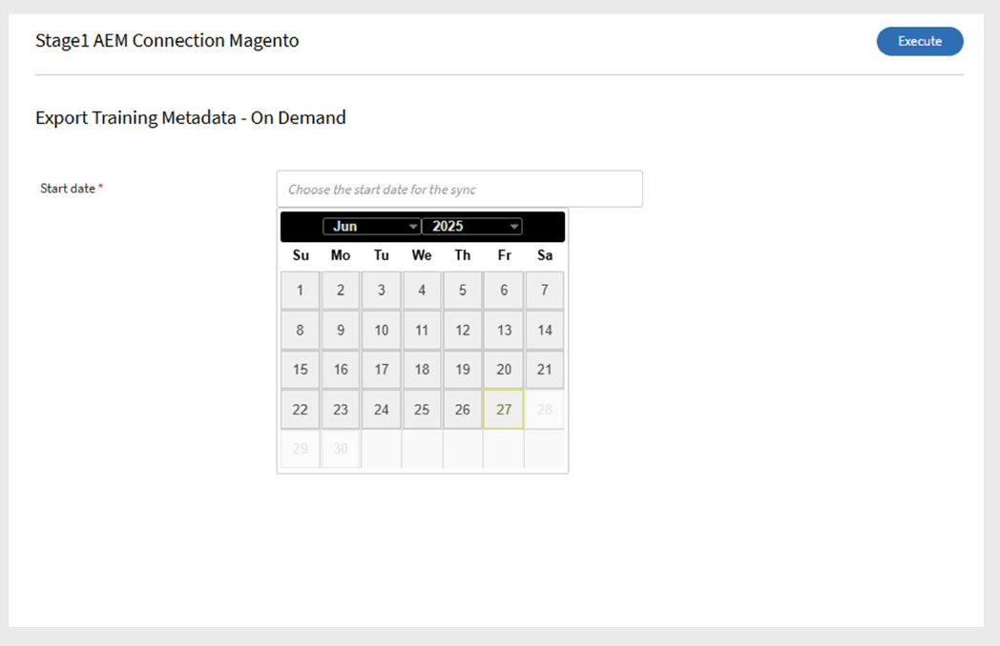

# Adobe Learning Manager의 Adobe Commerce 커넥터

## Adobe Commerce 커넥터

>[!NOTE]
>
>이 기능은 Adobe Learning Manager이 Adobe Experience Manager에 **추가 기능**(으)로 판매되는 경우에만 사용할 수 있습니다. **평가판** 계정에 대해서도 커넥터를 사용하도록 설정할 수 있습니다.

Adobe Learning Manager은 B2B 및 B2C 고객을 위해 다중 채널 상거래 경험을 제공하는 확장 가능한 전자상거래 솔루션인 Adobe Commerce과 통합됩니다. Adobe Commerce 커넥터를 사용하여 Adobe Learning Manager과 Adobe Commerce을 연결하여 학습 플랫폼 내에서 유료 교육 및 전자상거래 기능을 사용할 수 있습니다.

커넥터가 활성화되면 Learning Manager에서 Adobe Commerce으로 교육 데이터를 전송하여 학습자가 강의, 학습 경로 또는 인증을 구매할 수 있도록 합니다. 커넥터는 또한 구매 정보를 수집하여 거래를 확인하고 학습자에게 교육에 대한 액세스 권한을 부여합니다.

## 사전 요구 사항

Adobe Commerce 커넥터를 설정하기 전에 다음 사항을 확인하십시오.

- [RabbitMQ](https://experienceleague.adobe.com/ko/docs/commerce-cloud-service/start/overview) 또는 기타 메시징 브로커를 사용하도록 설정하십시오.
- [CRON](https://experienceleague.adobe.com/ko/docs/commerce-cloud-service/start/overview#cron_consumers_runner) 작업을 활성화합니다.

이 기능을 활성화하려면 다음 파일을 편집하십시오.

- .magento.app.yaml
- .magento/services.yaml
- .magento.env.yaml

기타 설정 요구 사항:

- 사용자 정의 모듈을 사용하여 옵션 제한을 재정의합니다. 이 단계는 선택 사항이지만 대규모 데이터 세트에는 권장됩니다.
- 모든 **비동기 API**&#x200B;를 사용하도록 설정합니다. 대규모 교육 데이터 세트는 비동기적으로 내보내집니다. Learning Manager에서 Adobe Commerce API를 호출하면 요청은 상거래 측에서 제품을 생성하는 소비자가 대기열에 추가되어 처리됩니다. 비동기 처리는 Adobe Commerce에서 기본적으로 사용할 수 없으므로 활성화해야 합니다.
- Adobe Commerce의 결제 성공 페이지에서 Learning Manager에 **반환 링크**&#x200B;를 추가합니다.
   - 이 [반환 URL](https://learningmanager.adobe.com/app/learner#/postPayment) 사용:
- **인덱싱**&#x200B;을 **저장 시**&#x200B;에서 **예약**(으)로 변경합니다. 자세한 내용은 [기술 자료](https://experienceleague.adobe.com/ko/support?support-tab=home#home)를 참조하세요.
- 필요한 **패치**&#x200B;를 적용합니다. 지침은 [패치 적용 설명서](https://experienceleague.adobe.com/ko/docs/commerce-cloud-service/start/overview)를 참조하십시오.
- 클라우드 인프라(스테이징 및 프로덕션)에서 Adobe Commerce에 대해 **Fastly**&#x200B;를 구성하십시오. 자세한 내용은 [Fastly 설정](https://devdocs.magento.com/cloud/cdn/configure-fastly.html)을 참조하세요.

## 커넥터 구성

Adobe Commerce Connector를 구성하려면:

1. 통합 관리자로 Adobe Learning Manager에 로그인합니다.
2. **Adobe Commerce** 커넥터 타일 위로 마우스를 가져간 후 **연결**&#x200B;을 선택합니다.

   
   _연결을 선택하여 Adobe Commerce 커넥터 구성_

3. 다음 세부 사항을 입력합니다.

   - 연결 이름
   - 액세스 토큰
   - ADOBE COMMERCE URL
   - 저장 코드
4. 다음에서 인터페이스 유형을 선택합니다.

   - 기본 Learning Manager
   - AEM Sites을 사용하여 맞춤 제작

   
   _Adobe Commerce 구성에 필요한 세부 정보 입력_

5. **연결**&#x200B;을 선택합니다.

## 교육 가격 설정

연결이 활성화되면:

- 작성자는 강의, 학습 경로 또는 인증의 가격을 설정할 수 있습니다.
- 게시 후 학습자는 Adobe Learning Manager 또는 맞춤형 AEM 사이트를 통해 교육을 구매할 수 있습니다.

## 구매 플로우

### 기본 Adobe Learning Manager

- 학습자는 Adobe Learning Manager에 로그인하여 강의, 학습 경로 또는 인증서를 구매합니다.
- 학습자가 지금 구매를 클릭하면 Adobe Commerce으로 리디렉션되어 결제가 완료됩니다.
- 결제 후 학습자는 Adobe Learning Manager으로 돌아가 교육을 시작하라는 메시지가 표시됩니다.
- 구매를 완료하려면 학습자가 Adobe Commerce에 별도로 로그인해야 합니다.
- 학습자는 Learning Manager와 Adobe Commerce 모두에서 구매 확인 전자 메일을 받습니다. Adobe Commerce 이메일은 필요에 따라 활성화하거나 비활성화할 수 있습니다.

### 사용자 정의 AEM Sites

사용자 정의 AEM 사이트를 사용하는 경우:

- 학습자는 AEM 사이트를 통해 강의를 찾아보고 구입할 수 있습니다.
- AEM 사이트에서는 검색 및 표시를 위해 Adobe Learning Manager에서 동기화된 메타데이터를 사용합니다.
- 로그인한 사용자와 게스트 사용자 모두 검색할 수 있습니다. 단, 로그인한 사용자만 구매할 수 있습니다.
- 로그인 후 학습자는 장바구니에 강의를 추가하고, 세부 정보를 미리 보고, 구매를 완료할 수 있습니다.

## Adobe Commerce로 과정 내보내기

### 내보내기 예약

내보내기를 예약하려면 다음을 수행하십시오.

1. **교육 메타데이터 내보내기**&#x200B;를 선택한 다음 **일정 구성**&#x200B;을 선택합니다.
2. **이 연결을 사용하여 교육 메타데이터 내보내기 사용**&#x200B;을 선택합니다.
3. **예약 사용**&#x200B;을 선택하고 **시작 날짜**, **시간** 및 **간격**&#x200B;을 설정합니다.

   
   _예약된 내보내기 사용_

4. **저장**&#x200B;을 선택합니다.

### 온디맨드 내보내기

작성자가 교육 가격을 설정한 후 통합 책임자는 교육 데이터를 내보내야 합니다.

1. **교육 메타데이터 내보내기**&#x200B;를 선택한 다음 **온디맨드**&#x200B;를 선택합니다.
2. 날짜 범위를 선택합니다.
3. **실행**&#x200B;을 선택하여 내보냅니다.

   
   _온디맨드 내보내기 만들기_

4. 성공 시 가격이 책정된 강의 및 학습 경로를 구매할 수 있는 Adobe Commerce으로 이동합니다.
