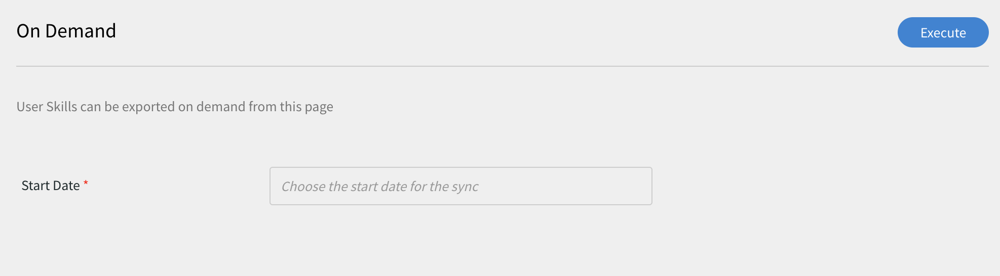
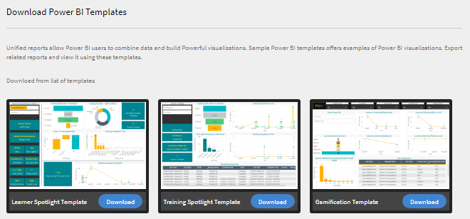

# Learning Manager 커넥터

기업에는 Learning Manager와 통합해야 하는 다른 응용 프로그램과 시스템이 있습니다. 커넥터는 외부 시스템에서 Learning Manager로 데이터를 가져오는 등 데이터 기반 통합을 수행하는 데 도움이 되는 유틸리티입니다.  또한 Learning Manager에서 외부 시스템으로 데이터를 내보냅니다.

Learning Manager에서는 Salesforce와 FTP 커넥터를 제공합니다. 조직 통합 책임자는 Salesforce 커넥터를 사용하여 Salesforce 응용 프로그램과 Learning Manager를 통합할 수 있습니다. 통합업체는 FTP 커넥터를 사용하여 사용자 설정을 기업 응용 프로그램에 자동으로 불러올 수 있습니다.

또한, Learning Manager에서는 Lynda, getAbstract, Harvard Management 시스템 커넥터도 제공합니다. 이러한 커넥터를 이용하여 학습자는 Lynda.com, getAbstract, Harvard ManageMentor 과정에 접근하고 과정을 수료할 수 있습니다.

계속해서 Learning Manager에서 각 커넥터를 구성하고 사용하는 방법에 대해 알아봅시다.

<!--
>[!NOTE]
>
>**Update:** December 2020 update of Learning Manager
>
>For **FTP**, **Box**, and **Custom FTP** connectors, while exporting Learner Transcript or xAPI, you can also export the data as a **zip** file, for:
>
>* Learner Transcripts
>* xAPI
-->

>[!NOTE]
>
>Adobe Learning Manager의 2022년 11월 릴리스를 통해 Zoom에서 서비스가 중단됩니다 [2023년 6월까지 JWT 인증](https://marketplace.zoom.us/docs/guides/auth/jwt/). 따라서 JWT가 지원되는 Zoom 커넥터는 언급한 날짜까지 작동하지만 사용자가 서버간 Oauth 앱을 생성하여 계정에서 해당 기능을 대체하는 것이 좋습니다. 모든 새로운 연결은 기본적으로 Zoom Oauth 인증을 거치게 됩니다.

## Salesforce 커넥터 {#sfconnector}

Salesforce 커넥터는 Learning Manager와 Salesforce 계정을 연결하여 자동으로 데이터를 동기화합니다. Salesforce 커넥터의 기능은 다음과 같습니다.

### 맵 속성

통합 책임자는 Salesforce 열을 선택하고 이를 해당 Learning Manager의 그룹화 가능 속성에 매핑할 수 있습니다. 매핑을 완료하면 다음 사용자가 가져와도 동일한 매핑이 사용됩니다. 책임자가 사용자를 가져오기 위해 다른 매핑을 사용하려는 경우 이 매핑을 재구성할 수 있습니다.

### 자동으로 사용자 가져오기

사용자 가져오기 프로세스를 통해 Learning Manager 책임자는 Salesforce에서 직원 세부 정보를 불러와 자동으로 Learning Manager에 가져올 수 있습니다. 이러한 자동화를 통해 CSV를 생성하고 Learning Manager로 업로드할 때 필요한 수작업을 피할 수 있습니다.

### 자동 일정

자동 예약 기능과 함께 자동 사용자 가져오기 기능을 사용하면 효과적일 수 있습니다. Learning Manager 책임자는 조직 필요에 따라 일정을 설정할 수 있습니다. Learning Manager 응용 프로그램 사용자는 일정에 따라 최신 상태를 유지할 수 있습니다. Learning Manager 응용 프로그램에서 매일 동기화를 수행할 수 있습니다.

### 사용자 필터링

Learning Manager 책임자는 사용자를 가져오기 전에 필터링을 적용할 수 있습니다. 예를 들면, Learning Manager 책임자는 하나 이상의 특정 관리자 아래에 있는 모든 등급의 사용자를 가져올 수 있습니다.

### Salesforce 커넥터 구성 {#configuresalesforceconnector}

Salesforce와 Learning Manager를 통합하려면 다음 과정을 배워봅니다

#### 필수 구성 요소 {#prerequisites}

Salesforce 조직 URL이 있는지 확인하십시오. 예를 들어, 조직 이름이 **myorg**, Salesforce URL은 `https://myorg.salesforce.com`. Salesforce 계정과 Learning Manager 계정 연결은 URL만 있으면 가능합니다.

계정에 로그인하기 위한 적절한 자격을 갖추고 있는지 확인하십시오.

#### 연결 생성 {#createaconnection}

1. Learning Manager 홈 페이지에서 Salesforce 카드/썸네일 위로 마우스를 가져갑니다. 그러면 메뉴가 나타납니다. 메뉴에 있는 **[!UICONTROL 연결]**&#x200B;항목을 클릭합니다.

   

   *연결 옵션*

1. Org-url을 입력하라는 대화 상자가 나타납니다. 다음을 수행합니다. **[!UICONTROL Connect]** 를 클릭합니다.
1. 연결이 성공하면, 개요 페이지가 나타납니다.

### 맵 속성 {#mapattributes}

연결이 성공하면, Salesforce 열을 Learning Manager 해당 속성에 매핑할 수 있습니다. 이 과정은 꼭 필요합니다.

1. 매핑 페이지의 왼쪽에는 Learning Manager의 열이 표시되고 오른쪽에는 Salesforce 열이 표시됩니다. Learning Manager의 열 이름에 매핑할 적절한 열 이름을 선택합니다.

   
   *맵 속성*

   >[!NOTE]
   >
   >왼쪽에 표시된 Learning Manager의 열 데이터를 활성 필드에서 가져옵니다. 대상 **관리자** 필드는 이메일 주소 유형의 필드에 매핑되어야 합니다. 커넥터를 사용하기 전에 모든 열을 매핑하는 것은 필수입니다.

1. 다음을 수행합니다. **[!UICONTROL 저장]** 매핑을 완료한 후
1. 커넥터를 사용할 준비가 되었습니다. 책임자 앱 내에서 데이터 소스로 구성되고 표시되는 계정입니다. 책임자는 가져오기 또는 필요에 따라 동기화를 예약할 수 있습니다.

## Salesforce 커넥터 사용 {#usingsalesforceconnector}

Salesforce 커넥터는 Salesforce.com에 연결되어 있으며, 그를 통해 구성된 대로 사용자를 불러와 Learning Manager에 추가합니다.

### Salesforce 연락처에서 사용자 가져오기 {#import-salesforce-contacts}

Learning Manager에서 Salesforce 커넥터가 연락처와 Salesforce 사용자를 가져오고 Learning Manager에 자동으로 가져오도록 개선합니다.

Salesforce 커넥터 페이지에서 Salesforce URL을 입력하고 인증을 완료합니다. 인증하고 나면 계속 진행하여 사용자 또는 연락처를 가져올 수 있습니다. 옵션 연락처를 선택하면 가져올 연락처의 하위 집합을 지정합니다.

Salesforce 열을 선택하여 해당 Learning Manager의 그룹화 가능 속성에 매핑합니다. 매핑을 완료하면 다음 사용자가 가져와도 동일한 매핑이 사용됩니다.

1. Salesforce에 로그인합니다.
1. 연결 페이지에서 **[!UICONTROL 내부 사용자 가져오기]**.

   
   *내부 사용자 가져오기*

1. 에 **사용자 가져오기** 페이지에는 연락처라는 새 옵션이 있습니다. 라디오 버튼을 클릭합니다. **연락처** 다음과 같은 옵션이 표시됩니다.

   
   *연락처 특성 매핑*

1. 클릭 시 **[!UICONTROL 예]**, 다음을 수행할 수 있습니다.

   * **연락처 선택 열:** Learning Manager에 가져오려는 필드를 선택합니다.
   * **값 지정:** 선택한 필드를 나타내는 값을 선택합니다.

   
   *값 지정*

   * Learning Manager 항목으로 Salesforce 열을 매핑합니다.
   * 가져오기를 시작하려면 **[!UICONTROL 저장]**.

1. 클릭 시 **[!UICONTROL 아니요. 모든 연락처 가져오기]**, 연락처를 필터링하지 않고 직접 필드를 매핑할 수 있습니다. 여기에서는 Salesforce에서 모든 연락처를 가져옵니다.
1. 가져오기를 시작하려면 **[!UICONTROL 저장]**.

## 학습 기록 내보내기

Learning Manager에서는 성적 증명서, 사용자 보고서, 스킬 보고서와 같이 학습 기록을 Salesforce로 내보내는 기능을 제공합니다. 내보낸 데이터를 Salesforce의 &#39;사용자&#39; 테이블과 연결할 지 또는 &#39;연락처&#39; 테이블과 연결할 지를 결정할 수 있습니다.

*학습 기록 내보내기*

### Salesforce의 사용자 정의 개체

Learning Manager에서 학습 기록을 내보내기 전에 Salesforce에서 사용자 정의 개체를 만들어야 합니다. 사용자 정의 개체는 회사 또는 산업 관련 정보를 저장하기 위해 만드는 개체입니다. 자세한 내용은 [Salesforce 사용자 정의 개체](https://trailhead.salesforce.com/en/content/learn/modules/data_modeling/objects_intro)를 참조하십시오.

다음은 개체를 만드는 방법입니다.

1. 사용자 정의 개체를 만들기 위해 패키지를 다운로드 및 설치합니다.

   * [패키지 1](https://test.salesforce.com/packaging/installPackage.apexp?p0=04t1k0000008WPJ)
   * [패키지 2](https://test.salesforce.com/packaging/installPackage.apexp?p0=04t1k0000008WPT)
   * [패키지 3](https://test.salesforce.com/packaging/installPackage.apexp?p0=04t1k0000008WPi)

1. Salesforce에서 사용자 정의 개체 이름을 바꿉니다.
1. 이벤트를 선택하고 **[!UICONTROL 저장]**&#x200B;을 클릭합니다.

**이벤트 연결 대상:** 사용자와 연락처 중 어떤 섹션을 내보낼 지 선택합니다. 연락처 개체를 선택하면 Salesforce에는 없지만 Learning Manager에는 있는 사용자가 Salesforce에서 생성됩니다.

*이벤트 연결 옵션*

>[!NOTE]
>
>하나의 계정에 대해 다중 연결을 생성할 수 있습니다. 단일 연결은 Salesforce에서 최대 3개의 사용자 정의 개체를 제공할 수 있습니다. 동일한 Salesforce 계정에 대해 다중 연결을 생성하려면 세 개의 패키지를 설치해야 합니다. Captivate Prime에서는 최대 3가지의 패키지를 지원합니다.
>
>생성을 원하는 연결 수 만큼 패키지를 설치해야 합니다.

>[!NOTE]
>
>Salesforce의 실행 상태 페이지에서 처리된 레코드 개수는 Salesforce에서만 확인할 수 있습니다. Learning Manager는 처리된 모든 레코드에서 부분적으로 내보내거나 실패했을 때에도 상태를 완료됨으로 표시합니다.

## Salesforce 패키지 설치

Learning Manager에서는 Salesforce 앱 패키지를 제공합니다. SFDC에 Salesforce 앱 패키지를 설치하고 구성한 영업 직원은 SFDC 포털에서 교육 활동을 수행할 수 있습니다. 이 앱을 설치한 SFDC 사용자는 새로운 교육 과정을 탐구하고, 권장 사항을 확인하며, SFDC 포털에서 바로 이와 같은 컨텐츠를 확인할 수 있습니다. 또한 사용자는 책임자가 SFDC 포털의 앱에서 바로 보낸 발행인란 형식의 공지를 받습니다.

### Learning Manager 앱에서 설정

1. Learning Manager 책임자 계정에 통합 책임자 권한으로 로그인합니다.
1. 다음을 수행합니다. **[!UICONTROL 응용 프로그램]** > **[!UICONTROL 추천 앱]**.
1. 다음을 수행합니다. **[!UICONTROL Salesforce]**.
1. Salesforce 앱 페이지의 설명란에 명시된 응용 프로그램 ID(클라이언트 ID라고도 함)와 클라이언트 비밀번호를 메모합니다.
1. 다음을 수행합니다. **[!UICONTROL 승인]** 승인을 마쳤어야 합니다.
1. 다음을 수행합니다. **[!UICONTROL 개발자 리소스]** > **[!UICONTROL 테스트 및 개발용 액세스 토큰]**.
1. OAuth 코드 얻기 섹션에서 클라이언트 ID 및 범위를 - admin:read,admin:write 로 설정해야 합니다. 다음을 수행합니다. **[!UICONTROL 제출]**.
1. 새로 고침 토큰 얻기 섹션에 클라이언트 ID와 클라이언트 비밀번호를 입력합니다. 다음을 수행합니다. **[!UICONTROL 제출]** 새로 고침 토큰을 확인합니다.

### Salesforce 앱에서 계정 개설

1. Salesforce 등록 페이지에서 계정을 개설할 수 있습니다. Salesforce 계정은 반드시 개발자 에디션이나 엔터프라이즈 에디션에서 개설해야 합니다.  [개발자 등록 URL](https://developer.salesforce.com/signup). Learning Manager에 사용할 Salesforce에 등록하려면 이메일 ID를 입력해야 합니다.
1. 확인 이메일을 통해 사용자의 계정을 확인합니다.
1. 비밀번호를 등록하고 Salesforce에 로그인합니다.
1. 로그인 후 Salesforce URL(예: site.lightning.force.com)을 메모합니다.

### Learning Manager 패키지 설치

Captivate Prime 패키지를 설치하려면 먼저 Salesforce의 기존 패키지를 삭제해야 합니다. 기존 패키지를 제거하기 전에 아래에 보이는 것처럼 설정을 활성화해야 합니다. 이 설정을 적용하지 않으면 Captivate Prime 패키지를 설치할 수 없습니다.

>[!NOTE]
>
>Adobe Learning Manager 앱은 Salesforce Lightning 보기에서만 지원됩니다.

1. 실행: [Learning Manager 패키지 URL](https://login.salesforce.com/packaging/installPackage.apexp?p0=04t1k0000008WOQ).
1. (으)로 **로그인** 페이지에서 **[!UICONTROL 사용자 정의 도메인 사용]**.
1. 패키지 URL을 입력하고 **[!UICONTROL 계속]**. 설치 페이지에는 관리자 전용 설치 옵션이 선택되어 있어야 합니다. 이 옵션을 변경하지 마십시오.
1. 다음을 수행합니다. **[!UICONTROL 설치]**. 패키지가 설치되면 **[!UICONTROL 완료]**. &#39;설치된 패키지&#39; 페이지로 이동하면 설치된 Adobe Learning Manager 패키지를 확인할 수 있습니다.
1. &#39;설정&#39; 옆에 있는 &#39;앱 시작 관리자&#39;로 이동하여 &#39;Adobe Learning Manager&#39;를 검색합니다.
1. 앱을 구성하려면 **[!UICONTROL 구성]**.
1. 다음을 수행합니다. **[!UICONTROL 새로운 기능]** 그리고 다음 세부 사항을 추가합니다.

   * **Config:** 원하는 구성 이름을 입력합니다.
   * **클라이언트 ID**: 첫 번째 섹션에서 확보한 값을 입력합니다.
   * **클라이언트 암호:** 첫 번째 섹션에서 확보한 값을 입력합니다.
   * **RefreshToken:** 첫 번째 섹션에서 확보한 값을 입력합니다.
   * **LearningManager 기본 URL:** Learning Manager가 호스팅되는 사이트의 URL입니다.

### 원격 사이트 설정 추가

1. 페이지의 오른쪽 상단에서 **[!UICONTROL 설정]**.
1. 위치 **[!UICONTROL 빠른 찾기]**&#x200B;원격 사이트 설정 을 검색합니다.
1. 다음을 수행합니다. **[!UICONTROL 새 원격 사이트]**.
1. 다음 세부 정보를 입력합니다.

   * **원격 사이트 이름:** 원하는 사이트 이름을 입력합니다.
   * **원격 사이트 URL:** Learning Manager가 호스팅되는 사이트의 URL입니다.

1. Learning Manager를 실행합니다.

### Learning Manager 앱에 대한 알림 활성화

1. 오른쪽 상단에서 **[!UICONTROL 설정]**.
1. &#39;사용자 정의 알림&#39;을 검색합니다.
1. 다음을 수행합니다. **[!UICONTROL 새로운 기능]**.
1. 다음 세부 사항을 입력합니다.

   1. **사용자 정의 알림 이름:** LearningManager 알림
   1. **API 이름:** LearningManager 알림

1. 둘 다 선택 **데스크톱** 및 **모바일** 를 지원되는 채널로 보냅니다.

1. **[!UICONTROL 저장]**&#x200B;을 클릭합니다.
1. 모바일 장치용 푸시 알림을 활성화하려면 다음 단계를 따르십시오.

   1. 휴대폰에 Salesforce 모바일 앱을 설치합니다.
   1. 자격 증명을 사용하여 앱에 로그인합니다.
   1. 다음으로 이동: **설정** > **알림 전달 설정**.
   1. iOS 및 Android용 Salesforce를 추가합니다.

### Salesforce에서 Learning Manager 제거

1. Salesforce 앱에서 &#39;설치된 패키지&#39;로 이동합니다.
1. 다음을 수행합니다. **[!UICONTROL 제거]**.

## Salesforce 사용자용 Learning Manager 구성

Learning Manager 앱은 Salesforce 계정에 있는 사용자도 사용할 수 있습니다. Salesforce 책임자는 프로필을 기반으로 사용자를 추가할 수 있습니다. Salesforce 프로필은 Learning Manager의 프로필과 유사합니다. 예를 들어, 책임자, 통합 책임자, 강사 등입니다. Salesforce 관리자는 또한 사용자 정의 프로필을 만들 수 있습니다.

Salesforce 관리자는 프로필을 사용자에게 할당하거나 사용자 정의 프로필을 만들 수 있습니다.

패키지를 설치할 때 Salesforce 프로필을 학습자에게 할당할 수 있습니다.

패키지를 설치한 후 반드시 프로필을 구성해야 합니다.

다음을 수행합니다. **[!UICONTROL 구성]** > **[!UICONTROL 새로운 기능]**&#x200B;을 입력한 다음, 다음을 추가합니다.

* Config 이름
* ClientID
* ClientSecret
* LearningManager 기본 URL
* 리디렉션 사용 안 함

>[!NOTE]
>
>학습자가 Learning Manager 앱을 보려면 모든 학습자의 앱을 활성화해야 합니다.

다음 단계는 Learning Manager 앱에 액세스 권한을 제공하는 것입니다.

*Learning Manager 앱에 액세스하기 위한 권한 설정*

사용자를 선택하고 그에 따라 권한을 할당합니다. 학습자는 이제 Learning Manager 앱에 액세스할 수 있습니다.

이제 사용자의 표준 프로필 같은 프로필을 선택하고 프로필을 클릭합니다. 다음을 수행합니다. **[!UICONTROL 편집]** 및 **사용자 정의 앱 설정** 섹션, 확인란을 활성화합니다 **Adobe Learning Manager**. 그러면 사용자가 앱에 액세스할 수 있습니다.

**사용자 정의 탭 설정** 섹션의 **학습자 홈** 드롭다운 목록에서 **기본값** 옵션을 선택합니다.

반드시 모든 프로필에서 앱을 볼 수 있도록 해야 합니다.

다음을 수행합니다. **[!UICONTROL 저장]** 그러면 모든 프로필에 속한 사용자가 Learning Manager 앱에 액세스합니다.

### 학습 경로 관련 변경 사항

#### 기존 연결

책임자 계정에서 학습 경로 옵션이 비활성화된 경우 보고서에 행과 열이 추가되지 않습니다.

책임자 계정에서 학습 경로 옵션이 활성화된 경우 학습자가 등록된 경우 &#39;유형&#39; 열이 학습 경로로 채워집니다.

>[!NOTE]
>
>플래그가 활성화되어 있고 기존 연결을 사용하는 경우 일부 레코드가 누락될 수 있습니다.

#### 새 연결

책임자 계정에서 학습 경로 옵션이 비활성화된 경우, 교육 보고서는 다음 열로 구성되지만 데이터는 포함되지 않습니다.

* **포함된 경로:** 학습 프로그램의 이름이 표시됩니다
* **포함된 경로 ID:** 학습 프로그램의 ID가 표시됩니다.
* **포함된 강의 ID:** 학습 경로에 포함된 강의 ID가 표시됩니다.

또한 학습 경로가 활성화된 계정의 새 연결은 세 개의 새 열이 표시되고 모든 데이터가 플로우합니다.

또한 보고서에는 학습 경로에 등록된 모든 학습자에 대한 열 유형 학습 경로(상위 레벨)가 포함됩니다.

유형 열에서 학습 프로그램은 학습 경로로 이름이 변경됩니다. 기존 연결에서는 변경되지 않습니다.

## Learning Manager FTP 커넥터 {#ftpconnector}

Learning Manager와 임시 외부 시스템을 통합하는 FTP 커넥터를 사용하여 데이터를 자동으로 동기화할 수 있습니다. 외부 시스템에서 CSV 형식으로 데이터를 내보낼 수 있으며, Learning Manager FTP 계정의 적절한 폴더에 배치할 수 있습니다. FTP 커넥터의 기능은 다음과 같습니다.

데이터 마이그레이션, 사용자 가져오기 및 데이터 내보내기에 Box 커넥터를 사용할 수도 있습니다. 자세한 내용은 Box 커넥터 를 참조하십시오.

### 데이터 가져오기 {#dataimport}

사용자 가져오기 프로세스를 통해 Learning Manager 책임자는 Learning Manager FTP 서비스에서 직원 세부 정보를 불러와 자동으로 Learning Manager에 가져올 수 있습니다. 이 기능을 사용하면 이러한 시스템에서 생성된 CSV를 FTP 계정 폴더에 적절하게 배치하여 여러 시스템을 통합할 수 있습니다. Learning Manager는 CSV 파일을 가져와 병합한 다음 일정에 따라 데이터를 가져옵니다. 자세한 내용은 스케줄링 기능을 참조하십시오.

**맵 속성**

통합 책임자는 CSV 열을 선택하고 이를 Learning Manager의 그룹화 가능 속성에 매핑할 수 있습니다. 매핑은 한 번만 작업하면 됩니다. 한번 매핑을 완료하면 다음 사용자를 가져와도 동일한 매핑을 사용할 수 있습니다. 책임자가 사용자를 가져오기 위해 다른 매핑을 사용하려는 경우 매핑을 재구성할 수 있습니다.

#### 데이터 내보내기 {#exportdata}

데이터 내보내기를 사용하면 사용자 스킬과 학습자 성적 증명서를 FTP 위치로 내보내 타사 시스템과 통합할 수 있습니다.

#### 스케줄링 {#scheduling}

책임자는 조직 요구에 따라 스케줄링 작업을 설정할 수 있으며, 일정에 따라 Learning Manager 응용 프로그램의 사용자는 최신 상태를 유지합니다. 마찬가지로, 통합 책임자는 외부 시스템과 통합되도록 적시에 스킬 내보내기를 예약할 수 있습니다. Learning Manager 응용 프로그램에서 매일 동기화를 수행할 수 있습니다.

### Learning Manager FTP 커넥터 구성 {#configurecaptivateprimeftpconnector}

FTP 커넥터와 Learning Manager를 통합하려면 다음 과정을 배워봅니다.

#### 연결 생성 {#Createaconnection-1}

1. Learning Manager 홈 페이지에서 FTP 카드/썸네일 위에 마우스를 올립니다. 그러면 메뉴가 나타납니다. 메뉴에 있는 **[!UICONTROL 연결]**&#x200B;항목을 클릭합니다.

   

   *연결 옵션*

1. 이메일 아이디를 입력하라는 대화 상자가 나타납니다. 조직의 Learning Manager FTP 계정을 관리하는 담당자의 이메일 아이디를 입력합니다. 다음을 수행합니다. **[!UICONTROL Connect]** 이메일 id를 입력한 후
1. Learning Manager에서 사용자에게 FTP 첫 액세스 전에 암호를 재설정하라는 이메일을 전송합니다. 사용자는 Learning Manager FTP 계정에 액세스하기 위해 암호를 재설정해야 합니다.

   >[!NOTE]
   >
   >지정된 Learning Manager 계정에 대해 하나의 Learning Manager FTP 계정만 생성할 수 있습니다.

   개요 페이지에서 통합에 대한 연결 이름을 지정할 수 있습니다. 다음 옵션에서 원하는 작업을 선택합니다.

   * 내부 사용자 가져오기
   * xAPI 가져오기
   * 사용자 스킬 내보내기 - 일정 구성
   * 사용자 스킬 내보내기 - 온디맨드
   * 학습자 성적 증명서 내보내기 - 일정 구성
   * 학습자 성적 증명서 내보내기 - 온디맨드

   
   *내보내기 옵션*

### 내부 사용자

+++내부 사용자

내부 사용자 가져오기 옵션을 통해 요구 시 또는 일정에 따라 사용자를 csv에서 Learning Manager로 가져올 수 있습니다.

+++

+++Map 속성

연결 설정이 성공하면 CSV 파일의 열을 매핑할 수 있습니다. Learning Manager 해당 속성이 FTP 폴더로 이동합니다. 이 과정은 꼭 필요합니다.

1. 맵 속성 페이지의 왼쪽에는 Learning Manager의 예상 열을 볼 수 있으며, 오른쪽에는 CSV 파일의 열 이름이 표시됩니다. 처음에 오른쪽에는 빈 선택 상자가 표시됩니다. 을 클릭하여 원하는 CSV 템플릿을 가져옵니다. **파일 선택**.
1. 위의 단계에서는 모든 CSV 열 이름으로 오른쪽 선택 드롭다운 목록을 채웁니다. Learning Manager의 열 이름에 매핑할 적절한 열 이름을 선택합니다.

   >[!NOTE]
   >
   >관리자 필드는 이메일 주소 유형의 필드에 매핑되어야 합니다. 커넥터를 사용하기 전에 모든 열을 매핑하는 것은 필수입니다.

1. 다음을 수행합니다. **[!UICONTROL 저장]** 매핑을 완료한 후

   커넥터를 사용할 준비가 되었습니다. 구성된 계정은 책임자의 가져오기 예약 또는 주문형 동기화를 위해 책임자 앱 내에서 데이터 소스로 나타납니다.

+++

+++Learning Manager FTP 커넥터 사용

1. 외부 시스템의 CSV 파일은 다음 경로에 배치되어야 합니다.

   `code $OPERATION$/$OBJECT_TYPE$/$SUB_OBJECT_TYPE$/data.csv`

   >[!NOTE]
   >
   >2016년 7월 릴리스에서는 사용자 가져오기만 가능합니다. 따라서 FTP 커넥터를 사용하려면 CSV 파일이 다음 폴더에 있는지 확인하십시오.

   `code Home/import/user/internal/*.csv`

1. FTP 커넥터는 CSV 파일의 모든 행을 가져옵니다. 하나의 CSV 사용자에 해당하는 행이 다른 CSV에 나타나지 않는 것이 중요합니다.
1. 모든 CSV에는 매핑에 지정된 열이 포함되어야 합니다.
1. 프로세스를 시작하기 전에 필요한 모든 CSV가 폴더에 있어야 합니다.

>[!NOTE]
>
>사용자를 Learning Manager로 가져오는 동안 책임자는 사용자가 Learning Manager에서 어떻게 관리되는지 알아야 합니다. 자세한 내용은 [사용자 관리 도움말](migration-manual.md#usermanagement) 를 참조하십시오.

+++

+++xAPI 가져오기

xAPI 가져오기 옵션을 사용하면 온디맨드로 제3자 서비스에서 Learning Manager로 xAPI 가져오기를 예약할 수 있습니다.

+++

+++xAPI를 가져오는 데 필요한 구성

1. 구성 페이지에서 구성 목록에서 사용 가능한 기존 구성을 선택하여 CSV에서 xAPI 명령문을 가져옵니다. 편집 또는 **새 구성 추가** 소스 가져오기 구성 페이지로 이동합니다.

   **구성**

   * 소스 가져오기 구성 페이지에서 2개 필드(예: 이름 및 소스 파일 이름)를 입력합니다. 소스 파일 이름은 FTP 폴더 위치에서 제공된 파일 이름과 일치해야 합니다.
   * 변경 사항을 저장하려면 **[!UICONTROL 저장]**&#x200B;을 클릭합니다.

   
   *구성*

   **필터**

   * 왼쪽 창에서 **[!UICONTROL &#39;필터&#39;]**&#x200B;를 클릭합니다.
   * 필터 가져오기 구성 페이지에서 기록을 필터링할 이름 및 조건 필드를 입력합니다. **[!UICONTROL &#39;새 필터 추가&#39;]**&#x200B;를 클릭하여 다른 필터를 추가합니다. 작업 열 아래 **&#39;저장&#39;** 또는 **&#39;삭제&#39;** 옵션을 클릭하여 필터를 저장 또는 삭제할 수 있습니다.

   
   *필터*

   **매핑**

   * 왼쪽 창에서 **[!UICONTROL &#39;매핑&#39;]**&#x200B;을 클릭합니다.
   * xAPI 명령문 구성 매핑 가져오기 페이지의 왼쪽에서 CSV 열 이름과 매핑해야 할 xAPI JSON 필드 경로 이름을 확인할 수 있습니다.
   * 기본적으로 CSV 열 이름과 매핑해야 할 3개의 xAPI JSON 경로 필드 이름은&#x200B;**actor.mbox**, **verb.id**, **object.id**&#x200B;입니다. **&#39;새 매핑 추가&#39;**&#x200B;를 클릭하여 매핑할 다른 필드를 추가할 수 있습니다.

   * Json 필드 경로 이름과 매핑할 열 유형 이름을 선택합니다(예: 문자열, 숫자, 부울, 날짜 유형).
   * 매핑을 완료한 후 저장을 클릭합니다. xAPI 가져오기를 예약 또는 온디맨드로 가져올 수 있습니다.

   
   *매핑*

1. 왼쪽 창에서 **[!UICONTROL &#39;일정 구성&#39;]**&#x200B;을 클릭합니다. xAPI 명령문 가져오기를 예약하려면 **[!UICONTROL &#39;예약 사용&#39;]**&#x200B;을 클릭합니다.

   시작 시간과 날짜를 입력한 다음 xAPI 가져오기 예약 빈도를 일 단위로 입력할 수 있습니다. 예를 들어 3일마다 xAPI 가져오기를 사용할 수 있습니다.

   
   *xAPI 명령문 가져오기 - 일정 구성*

1. 왼쪽 창에서 **[!UICONTROL 온디맨드 실행]**.

   
   *xAPI 명령문 가져오기 - 온디맨드*

1. 왼쪽 창에서 **[!UICONTROL &#39;실행 상태&#39;]**&#x200B;를 클릭하여 이 커넥터에 대한 모든 실행의 요약을 시간 순서대로 볼 수 있습니다. xAPI 가져오기 시작 날짜 및 기간, 가져오기 유형(예약 또는 온디맨드 동기화인지 여부) 및 가져오기 상태(xAPI 가져오기가 진행 중인지 완료되었는지 또는 실패했는지 여부)를 볼 수 있습니다.

   
   *xAPI 명령문 가져오기 - 실행 상태*

+++

### 내보내기

+++스킬

사용자 스킬 보고서를 내보낼 수 있는 방법은 두 가지가 있습니다.

**[!UICONTROL 사용자 스킬 - 주문형]**: 이 옵션을 사용하여 시작 날짜를 지정하고 보고서를 내보낼 수 있습니다. 보고서는 입력된 날짜로부터 현재 날짜까지 추출됩니다.

*온디맨드 내보내기 옵션*

**[!UICONTROL 사용자 스킬 - 구성]**: 이 옵션을 사용하면 보고서 추출을 예약할 수 있습니다. &#39;예약 사용&#39; 확인란을 선택하고 시작 날짜와 시간을 지정합니다. 보고서를 생성하고 전송하는 시간 간격을 지정할 수도 있습니다.

*보고서 내보내기 구성*

+++

내보낸 파일이 있는 내보내기 폴더를 열기 위해서는 아래 보이는 사용자 스킬 페이지에서 FTP 폴더에 대한 링크를 열어야 합니다.

*파일을 볼 수 있는 FTP 폴더*

자동으로 내보낸 파일은 해당 위치에 있습니다 **Home/export/&#42;FTP_location&#42;**

자동으로 내보낸 파일은 제목과 함께 사용할 수 있습니다. **skill_achievements_&#42;일자: 부터&#x200B;&#42;_받는 사람_&#42;종료 날짜&#42;.csv**

*내보낸 .csv 파일*

+++학습자 성적 증명서

**구성**: 이 옵션을 사용하면 보고서 추출을 예약할 수 있습니다. &#39;예약 사용&#39; 확인란을 선택하고 시작 날짜와 시간을 지정합니다. 보고서를 생성하고 전송하는 시간 간격을 지정할 수도 있습니다.

+++

FTP 위치에서 내보낸 파일이 있는 내보내기 폴더를 열려면 아래와 같이 학습자 성적 증명서 페이지에 제공된 FTP 폴더에 대한 링크를 엽니다

자동으로 내보낸 파일은 해당 위치에 있습니다 **Home/export/&#42;FTP_location&#42;**

자동으로 내보낸 파일은 제목과 함께 사용할 수 있습니다. **learner_transcript_&#42;일자: 부터&#x200B;&#42;_받는 사람_&#42;종료 날짜&#42;.csv**

### 수동 csv 필드 지원 {#supportformanualcsvfields}

FTP를 통해 사용자 데이터를 가져오는 동안 관리자는 시스템에 있는 모든 활성 필드를 csv의 해당하는 필드에 매핑해야 합니다.

이는 모든 csv 활성 필드에 필수입니다. 수동 활성 필드에 대해 통합 책임자는 **DontImportFromSource** 옵션을 선택할 수 있습니다.

이 옵션을 선택하여 csv 가져오기를 통해 수동 활성 필드 값이 채워집니다. 학습자가 제공한 값은 그대로 유지됩니다.

>[!NOTE]
>
>매핑 도중, 옵션이 **DontImportFromSource** csv 활성 필드에 대해 이 필드가 선택되면 시스템에서 삭제됩니다.

*활성 필드에 대한 FTP 커넥터*

## Lynda 커넥터 {#lyndaconnector}

Lynda 커넥터는 학습자가 Learning Manager 내의 Lynda 과정을 발견하고 이용하길 원하는 Lynda.com 기업용 고객이 사용합니다. API 키를 사용하면 Lynda.com에서 과정을 정기적으로 가져오도록 커넥터를 구성할 수 있습니다. Learning Manager에서 과정을 한 번 생성하고 나면 사용자는 생성한 과정을 찾거나 수료할 수 있습니다. 그런 다음 Learning Manager에서 학습자 진행 상황을 확인할 수 있습니다.

### Lynda 커넥터 구성 {#configurethelyndaconnector}

1. 통합 책임자 대시보드에서 Lynda를 클릭합니다.

   시작하기, 연결하기, 연결 관리. 이렇게 세 가지 옵션을 볼 수 있습니다.

1. Lynda 커넥터를 처음 구성한다면, &#39;연결&#39;을 클릭합니다.

   <!--Configure the Exavault FTP account before you configure this connector.-->

1. 연결 페이지에서 커넥터 이름을 입력합니다. 연결을 위해 Appkey와 Secret Key를 입력합니다.

   >[!NOTE]
   >
   >Appkey와 Secret Key를 받으려면 벤더로 연락하십시오.

1. &#39;저장&#39;을 클릭합니다.

   구성이 완료되었으며 내 계정에 Lynda가 추가되었습니다. 이제 홈 페이지에서 [연결 관리]를 클릭하고 언제든지 구성을 편집할 수 있습니다.

1. 이미 연결을 완료하였다면, &#39;연결 관리&#39;를 클릭하여 모든 연결을 확인합니다.

   >[!NOTE]
   >
   >커넥터를 구성하기 전에 계정에서 마이그레이션 기능을 사용할 수 있도록 먼저 설정하여 주십시오.

1. 수정하길 원하는 연결을 클릭하십시오.
1. 왼쪽 창에서 **[!UICONTROL 구성]**. 다음 중 하나를 실행합니다.

   * 이 창에서 계정의 세부 정보 및 동기화 예약을 보거나 편집합니다. 이 계정을 사용하려면 연결 사용 확인란을 선택합니다.
   * &#39;편집&#39;을 클릭하고 인증서를 수정합니다. 이 영역에 대한 업데이트를 취소하려면 &#39;재설정&#39;을 클릭합니다.
   * 동기화를 예약하려면 &#39;예약 사용&#39;을 클릭합니다. 시작 시간과 날짜를 입력한 다음 동기화 예약 빈도를 일 단위로 입력할 수 있습니다. 예를 들면, 3일마다 동기화가 되도록 설정할 수 있습니다.

   변경 사항을 저장하려면 **[!UICONTROL 저장]**&#x200B;을 클릭합니다.

   

   *Learning Manager용 Lynda 커넥터 구성*

1. 왼쪽 창에서 &#39;온디맨드 실행&#39;을 클릭합니다. 이 옵션을 사용하면 Lynda에서 사용자 피드 및 기타 관련 데이터를 가져올 수 있습니다. 온디맨드 실행 시작일을 입력하고 &#39;실행&#39;을 클릭하여 동기화를 시작합니다. 시작일부터 현재까지의 모든 데이터를 가져옵니다.

   * 동기화 도중 응용 프로그램에 다운타임이 발생할 경우 실행 중 Learning Manager에 대한 액세스 사용 안 함을 클릭할 수 있습니다.
   * 실행 중 Learning Manager에 대한 액세스 사용을 클릭하면 동기화 중에 서비스가 중단되지 않습니다.

   

   *Lynda 커넥터에 대한 온디맨드 실행 수행*

1. 또한 언제든지 왼쪽 창에서 실행 상태를 눌러 이 커넥터에 대한 모든 실행의 요약을 시간 순서대로 볼 수도 있습니다. 동기화 시작 날짜 및 기간, 동기화 유형(온디맨드 동기화인지 여부) 및 동기화 상태(동기화가 진행 중인지 완료되었는지 여부)를 볼 수 있습니다.

   >[!NOTE]
   >
   >연결을 삭제하고 다시 생성하면 커넥터에 대한 이전 실행이 다시 나타납니다. 연결을 삭제하기 전에는 모든 실행을 볼 수 있습니다.

   최신 동기화에 대해서만 재실행을 수행할 수 있습니다.

   

   *모든 실행의 요약을 보려면 실행 상태를 클릭합니다.*

## getAbstract 커넥터 {#getabstractconnector}

getAbstract 커넥터는 학습자가 getAbstract의 내용을 확인하고 사용하길 원하는 getAbstract.com 기업용 고객이 사용합니다. 이 커넥터는 Learning Manager 내에서 생성되는 학습자 완료 레코드를 기준으로 사용 데이터를 정기적으로 가져오도록 구성할 수 있습니다. 계속해서 Learning Manager에서 어떻게 이 커넥터를 구성하는지 알아봅니다.

### getAbstract 커넥터 구성 {#configurethegetabstractconnector}

1. 통합 책임자 대시보드에서 getAbstract를 클릭합니다.

   시작, 연결, 연결 관리. 이렇게 세 가지 옵션을 타이틀에서 볼 수 있습니다.

1. getAbstract 커넥터를 처음 구성한다면, &#39;연결&#39;을 클릭합니다.

   <!--Configure the Exavault FTP account before you configure this connector.

   Ensure that you share this FTP credentials with your content provider to access the feeds.-->

1. 커넥션 네임 필드에 연결 이름을 입력합니다.

   고객 ID와 고객 비밀번호 칸에 알맞은 키를 입력합니다. 커넥터를 위한 key를 받으려면 벤더로 연락하십시오.

   키는 클라이언트가 사용하는 과정에 대한 과정 메타데이터를 가져오는 데 필요합니다.

1. 연결이 이미 설정된 경우 홈 페이지에서 &#39;getAbstract&#39; > &#39;연결 관리&#39;를 클릭하여 기존 구성을 보고 편집합니다.

   >[!NOTE]
   >
   >커넥터를 구성하기 전에 계정에서 마이그레이션 기능을 사용할 수 있도록 먼저 설정하여 주십시오.

1. 구성을 보거나 편집할 연결을 클릭합니다.

   

   *Learning Manager용 getAbstract 커넥터 구성*

1. 왼쪽 창에서 &#39;구성&#39;을 클릭합니다. 다음 중 하나를 실행합니다.

   * 이 창에서 계정의 세부 정보 및 동기화 예약을 보거나 편집합니다. 이 계정을 사용하려면 연결 사용 확인란을 선택합니다.
   * &#39;편집&#39;을 클릭하고 인증서를 수정합니다. 이 영역에 대한 업데이트를 취소하려면 &#39;재설정&#39;을 클릭합니다.
   * 동기화를 예약하려면 &#39;예약 사용&#39;을 클릭합니다. 시작 시간과 날짜를 입력한 다음 동기화 예약 빈도를 일 단위로 입력할 수 있습니다. 예를 들면, 3일마다 동기화가 되도록 설정할 수 있습니다.

1. **[!UICONTROL 저장]**&#x200B;을 클릭합니다.

   구성이 완료되었으며 내 계정에 getAbstract 연결이 추가되었습니다.

1. 왼쪽 창에서 &#39;온디맨드 실행&#39;을 클릭합니다. 이 옵션을 사용하면 getAbstract에서 사용자 피드 및 기타 관련 데이터를 가져올 수 있습니다. 온디맨드 실행 시작일을 입력하고 &#39;실행&#39;을 클릭하여 동기화를 시작합니다. 시작일부터 현재까지의 모든 데이터를 가져옵니다.

   * 동기화 도중 응용 프로그램에 다운타임이 발생할 경우 실행 중 Learning Manager에 대한 액세스 사용 안 함을 클릭할 수 있습니다.
   * 실행 중 Learning Manager에 대한 액세스 사용을 클릭하면 동기화 중에 서비스가 중단되지 않습니다.

1. 또한 언제든지 왼쪽 창에서 실행 상태를 눌러 이 커넥터에 대한 모든 실행의 요약을 시간 순서대로 볼 수도 있습니다. 동기화 시작 날짜 및 기간, 동기화 유형(온디맨드 동기화인지 여부) 및 동기화 상태(동기화가 진행 중인지 완료되었는지 여부)를 볼 수 있습니다.

   >[!NOTE]
   >
   >연결을 삭제하고 다시 생성하면 커넥터에 대한 이전 실행이 다시 나타납니다. 연결을 삭제하기 전에는 모든 실행을 볼 수 있습니다.

   최신 동기화에 대해서만 재실행을 수행할 수 있습니다.

   모든 유형의 동기화가 작동하려면 동기화에 지정된 날짜에 대한 사용자 피드가 getAbstract FTP 폴더에 있어야 합니다.

   getAbstract의 샘플 사용자 피드 파일인 다음 엑셀 시트를 참조합니다. 파일 이름은 다음 형식을 따라야 합니다:**report_export_yyyy_MM_dd_HHmmss.xlsx** 혹은 **report_export_yyyy_MM_dd.xlsx**.
   [getAbstract 사용자 피드 샘플 Excel 시트](assets/report-export-20170401175342.xlsx)

## Harvard ManageMentor 커넥터 {#hmmconnector}

Harvard ManageMentor 커넥터는 학습자가 Harvard ManageMentor 과정을 확인하고 이용하길 원하는 Harvard ManageMentor 기업용 고객이 사용합니다. 이 커넥터는 Learning Manager에서 과정을 만드는 데 도움이 되며 학습자 진행률 데이터를 정기적으로 가져오도록 구성할 수 있습니다. 이 커넥터를 구성하기 위해서 다음 과정을 따라 주십시오.

### Harvard ManageMentor 커넥터 구성 {#configuretheharvardmanagermentorconnector}

1. 통합 책임자 대시보드에서 &#39;Harvard ManageMentor&#39;를 클릭하십시오.

   시작, 연결, 연결 관리. 이렇게 세 가지 옵션을 타이틀에서 볼 수 있습니다.

1. Harvard ManageMentor 커넥터를 처음 구성한다면, &#39;연결&#39;을 클릭합니다.

   <!--Configure the Exavault FTP account before you configure this connector.

   Ensure that you share this FTP credentials with your content provider to access the feeds.-->

1. 커넥션 네임 필드에 연결 이름을 입력합니다. 연결을 클릭하여 이 연결을 저장합니다.
1. 이미 연결이 설정된 경우 홈 페이지에서 &#39;Harvard ManageMentor&#39; > &#39;연결 관리&#39;를 클릭합니다. 기존 구성을 수정할 연결을 클릭합니다.

   >[!NOTE]
   >
   >커넥터를 구성하기 전에 계정에서 마이그레이션 기능을 사용할 수 있도록 먼저 설정하여 주십시오.

   

   *Learning Manager용 HarvardManage Mentor 커넥터 구성*

1. 왼쪽 창에서 &#39;구성&#39;을 클릭합니다. 다음 중 하나를 실행합니다.

   * 이 창에서 계정의 세부 정보 및 동기화 예약을 보거나 편집합니다. 이 계정을 사용하려면 연결 사용 확인란을 선택합니다.
   * 동기화를 예약하려면 &#39;예약 사용&#39;을 클릭합니다. 시작 시간과 날짜를 입력한 다음 동기화 예약 빈도를 일 단위로 입력할 수 있습니다. 예를 들면, 3일마다 동기화가 되도록 설정할 수 있습니다.

1. 왼쪽 창에서 &#39;온디맨드 실행&#39;을 클릭합니다. 이 옵션을 사용하면 Harvard ManageMentor에서 사용자 피드 및 기타 관련 데이터를 가져올 수 있습니다. 온디맨드 실행 시작일을 입력하고 &#39;실행&#39;을 클릭하여 동기화를 시작합니다. 시작 날짜부터 현재까지의 모든 데이터를 가져옵니다.

   * 동기화 도중 응용 프로그램에 다운타임이 발생할 경우 실행 중 Learning Manager에 대한 액세스 사용 안 함을 클릭할 수 있습니다.
   * 실행 중 Learning Manager에 대한 액세스 사용을 클릭하면 동기화 중에 서비스가 중단되지 않습니다.

   며칠마다 동기화를 자동화하려면 반복 기간 필드에 일수를 지정합니다. 동기화를 통해 계정이 Harvard ManageMentor의 최신 추상화 및 요약 버전으로 업데이트됩니다.

1. 또한 언제든지 왼쪽 창에서 실행 상태를 눌러 이 커넥터에 대한 모든 실행의 요약을 시간 순서대로 볼 수도 있습니다. 동기화 시작 날짜 및 기간, 동기화 유형(온디맨드 동기화인지 여부) 및 동기화 상태(동기화가 진행 중인지 완료되었는지 여부)를 볼 수 있습니다.

   >[!NOTE]
   >
   >연결을 삭제하고 다시 생성하면 커넥터에 대한 이전 실행이 다시 나타납니다. 연결을 삭제하기 전에는 모든 실행을 볼 수 있습니다.

   최신 동기화에 대해서만 재실행을 수행할 수 있습니다.

   동기화를 하면 계정이 Harvard ManageMentor의 최신 및 요약 버전으로 업데이트됩니다.

   hmm12_metadata.xlsx: 이 파일은 Harvard ManageMentor 커넥터의 과정 메타데이터를 제공합니다. 파일을 업로드할 때 명명 규칙을 따라야 합니다.

   client_hmm12_20150125.xlsx: Harvard ManageMentor 커넥터의 사용자 피드입니다. 파일 이름 형식은 **client_hmm12_yyyyMMdd.xlsx**&#x200B;입니다.

   이 커넥터에 대한 다음 두 가지 샘플 사용자 피드 및 과정 피드 파일을 참조합니다.

   * [Harvard ManageMentor 커넥터의 과정 메타데이터 파일입니다.](assets/hmm12-metadata.xlsx)
   * [Harvard ManageMentor 커넥터의 사용자 피드입니다.](assets/client-hmm12-20170304.xlsx)

## Workday 커넥터 {#workdayconnector}

Learning Manager와 임시 외부 시스템을 통합하는 Box 커넥터를 사용하여 데이터를 자동으로 동기화할 수 있습니다.

### 가져오기

#### 맵 속성

통합 책임자는 Workday 열을 선택하고 이를 해당 Learning Manager의 그룹화 가능 속성에 매핑할 수 있습니다. 매핑을 완료하면 다음 사용자가 가져와도 동일한 매핑이 사용됩니다. 책임자가 사용자를 가져오기 위해 다른 매핑을 사용하려는 경우 이 매핑을 재구성할 수 있습니다.

#### 자동으로 사용자 가져오기

사용자 가져오기 프로세스를 통해 Learning Manager 책임자는 Workday에서 직원 세부 정보를 불러와 자동으로 Learning Manager에 가져올 수 있습니다.

#### 사용자 필터링

Learning Manager 책임자는 사용자를 가져오기 전에 필터링을 적용할 수 있습니다. 예를 들면, Learning Manager 책임자는 하나 이상의 특정 관리자 아래에 있는 모든 등급의 사용자를 가져올 수 있습니다.

### 내보내기

사용자 스킬 내보내기를 사용하면 사용자 스킬을 Workday로 자동으로 내보낼 수 있습니다.

>[!NOTE]
>
>여러 Learning Manager 계정의 스킬은 동일한 Workday 계정을 사용하여 동시에 내보낼 수 없습니다.

### 스케줄링 {#Scheduling-1}

책임자는 조직 요구에 따라 스케줄링 작업을 설정할 수 있으며, 일정에 따라 Learning Manager 응용 프로그램의 사용자는 최신 상태를 유지합니다. 마찬가지로, 통합 책임자는 외부 시스템과 통합되도록 적시에 스킬 내보내기를 예약할 수 있습니다. Learning Manager 응용 프로그램에서 매일 동기화를 수행할 수 있습니다.

### Workday 커넥터 구성 {#configureworkdayconnector}

>[!PREREQUISITES]
>
>조직의 Workday 관리자에게 ISU_Permissions 문서에 정의된 권한을 갖는 ISU(Integration System User)를 생성해 달라고 요청하십시오. 아래 링크에서 복사본을 다운로드합니다.

[ISU(Integration System User) 보안 복사본을 다운로드합니다.](assets/isu-permissions-v1.pdf) Workday 커넥터와 Learning Manager를 통합하려면 다음 과정을 배워봅니다.

1. Learning Manager 홈 페이지에서 Workday 타일 위로 마우스를 가져갑니다. 그러면 메뉴가 나타납니다. 메뉴에 있는 **[!UICONTROL 연결]**&#x200B;항목을 클릭합니다.

   

   *Workday 타일*

1. 새 연결에 대한 자격 증명을 입력하라는 대화 상자가 나타납니다. 연결 전에 다음 필드를 입력합니다.

   * 연결 이름: 원하는 연결의 이름을 지정합니다.
   * 호스트 URL: 통합 책임자는 해당 Workday 책임자로부터 호스트 URL 세부 정보를 가져올 수 있습니다.
   * 테넌트: 테넌트는 귀사 내부입니다. Workday 책임자가 테넌트 세부 정보를 제공합니다.
   * 사용자 이름 및 암호: Workday 관리자는 필요한 보안 권한을 가진 ISU(통합 시스템 사용자)를 생성하고 통합 책임자와 공유합니다.

>[!NOTE]
>
>   Learning Manager는 Workday API 버전 28.1을 사용합니다.

*Workday 커넥터 구성*

1. 모든 관련 필드에 정보를 입력한 후 연결을 클릭합니다.

   >[!NOTE]
   >
   >또한 여러 Workday 연결을 Learning Manager 계정에 동기화할 수도 있습니다.

개요 페이지에서 통합에 대한 연결 이름을 지정할 수 있습니다. 다음 옵션에서 원하는 활동을 선택하십시오.

* 내부 사용자 가져오기
* 사용자 스킬 내보내기 - 일정 구성
* 사용자 스킬 내보내기 - 온디맨드

*Workday 개요*

### 가져오기

#### 맵 속성 {#MapAttributes-1}

Learning Manager와 Workday를 통합하는 Workday 커넥터를 사용하여 데이터를 자동으로 동기화할 수 있습니다. 모든 활성 사용자를 Workday에서 Learning Manager로 가져올 수 있습니다. FTP 및 Salesforce를 비롯한 다양한 데이터 원본에서 사용자를 가져올 수 있습니다.

사용자를 가져오기 전에 Learning Manager 및 Workday의 사용자 속성을 매핑해야 합니다. 개요 페이지의 가져오기 아래의 내부 사용자 옵션을 사용하여 지도 속성을 제공합니다.

Adobe Learning Manager 열 아래에 Adobe Learning Manager 자격 증명을 입력합니다. 드롭다운을 사용하여 Workday 아래의 열에 대한 올바른 자격 증명을 선택합니다.

>[!NOTE]
>
>현재 Learning Manager는 Workday에서 69개의 사용자 속성 가져오기를 지원합니다. Learning Manager의 Active Field(활성 필드)를 사용하여 속성을 추가합니다.

*맵 속성*

선택 **비정규직 근로자 제외** 관리자 아래에 사용 가능한 임시 작업자를 가져오지 않도록 하는 확인란.

Learning Manager에는 두 가지 레벨의 계층구조가 있는 반면, Workday에는 네 가지 레벨이 있습니다. Workday의 네 가지 수준은 스킬 프로필 범주, 스킬 프로필, 스킬 항목 범주 및 스킬 항목입니다. 스킬 이름과 레벨은 Workday에 스킬 항목으로 같이 매핑됩니다.

>[!NOTE]
>
>추가 Workday 속성을 추가할 수 있습니다. CSAM에 연락하여 속성을 추가하십시오.

+++지원되는 Workday 속성 목록

wd:User_ID wd:Worker_ID manager wd:Personal_Data.wd:Name_Data.wd:Preferred_Name_Data.wd:Name_Detail_Data.@wd:Formatted_Name wd:Personal_Data.wd:Name_Data.wd:Legal_Name_Data.wd:Name_Detail_Data.@wd:Formatted_Name wd:Personal_Data.wd:Name_Data.wd:Legal_Name_Data.wd:Name_Detail_Data.wd:Prefix_Data.wd:Title_Descriptor wd:Personal_Data.wd:Name_Data.wd:Preferred_Name_Data.wd:Name_Detail_Data.wd:Preferred_Data.wd:Title_Descriptor:Personal_Data.wd:Name_Data.wd:Name_Data.wd:Preferred_Name_Data.wd:First_Name:Personal_Data.wd:Name_Preferred_Name_Data.last:Data_Name wd:Personal_Data.wd:Name_Data.wd:Legal_Name_Data.wd:Name_Detail_Data.wd:First_Name wd:Personal_Data.wd:Name_Data.wd:Legal_Name_Data.wd:Legal_Name_Data.wd:Name_Detail_Data.wd:Last_Name wd:Personal_Data.wd:Contact_Data.wd:Address_Data.0.@wd:Formatted_Address wd:Personal_Data.wd:Contact_Data.wd:Address_Data.0.wd:Postal_Code wd:Personal_Data.wd:Contact_Data.wd:Email_Address_Data.0.wd:Email_Address wd:Personal_Data.wd:Contact_Data.wd:Address_Data.0.wd:Country_Region_Descriptor:Personal_Data.wd:Contact_Data.wd:Phone_Data.0.@wd:Formatted_Phone wd:Personal_Data.wd:Contact_Data.wd:Phone_Data.0.wd:Country_ISO_Code wd:Personal_Data.wd:Contact_Data.wd:Phone_Data.0.wd:International_Phone_Code wd:Personal_Data.wd:Contact_Data.wd:Phone_Data.0.wd:Phone_Number wd:Personal_Data.wd:Primary_Nationality_Reference.wd:ID.1.$ wd:Personal_Data.wd:Gender_Reference.wd:ID.1.$ wd:Personal_Data.wd:Identification_Data.wd:National_ID.0.wd:National_ID_Data.wd:ID wd:Personal_Data.wd:Identification_Data.wd:Custom_ID.0.wd:Custom_ID_Data.wd:ID wd:User_Account_Data.wd:Default_Display_Language_Reference.wd:ID.1.$ wd:Role_Data.wd:Organization_Role_Data.wd:Organization_Role.0.wd:Organization_Role_Reference.wd:ID.1.$ wd:Employment_Data.wd:Worker_Job_Data.0.wd:Position_Data.wd:Position_Title wd:Employment_Data.wd:Worker_Job_Data.0.wd:Position_Data.wd:Business_Title wd:Employment_Data.wd:Worker_Job_Data.0.wd:Position_Data.wd:Business_Site_Summary_Data.wd:Name wd:Employment_Data.wd:Worker_Job_Data.0.wd:Position_Data.wd:Business_Site_Summary_Data.wd:Address_Data.@wd:Formatted_Address wd:Employment_Data.wd:Worker_Job_Data.0.wd:Position_Data.wd:Job_Classification_Summary_Data.0.wd:Job_Classification_Reference.wd:ID.1.$ wd:Job_Data.wd:Worker_Job_Data.0.wd:Position_Data.wd:Job_Classification_Summary_Data.0.wd:Job_Group_Reference.wd:ID.1.$ wd:Employment_Data.wd:Worker_Job_Data.0.wd:Position_Data.wd:Work_Space__Reference.wd:ID.1.$ wd:Job_Data.wd:Worker_Job_Data.0.wd:Position_Data.wd:Job_Profile_Summary_Data.wd:Job_Family_Reference.0.wd:ID.1.$ wd:Employment_Data.wd:Worker_Job_Data.0.wd:Position_Data.wd:Job_Profile_Summary_Data.wd:Job_Profile_Name wd:Employment_Data.wd:Worker_Job_Data.0.wd:Position_Data.wd:Job_Profile_Summary_Data.wd:Job_Profile_Reference.wd:ID.1.$ wd:Employment_Data.wd:Worker_Job_Data.0.wd:Position_Data.wd:Business_Site_Summary_Data.wd:Address_Data.0.wd:Country_Reference.wd:ID.2.$ wd:Employment_Data.wd:Worker_Job_Data.0.wd:Position_Data.wd:Worker_Type_Reference.wd:ID.1.$ wd:Employment_Data.wd:Worker_Job_Data.0.wd:Position_Data.wd:Business_Site_Summary_Data.wd:Address_Data.0.@wd:Formatted_Address wd:Employment_Data.wd:Worker_Job_Data.0.wd:Position_Data.wd:Job_Profile_Summary_Data.wd:Management_Level_Reference.wd:ID.1.$ wd:Employment_Data.wd:Worker_Status_Data.wd:Active wd:Employment_Data.wd:Worker_Status_Data.wd:Active_Status_Date wd:Employment_Data.wd:Worker_Status_Data.wd:Hire_Date wd:Employment_Data.wd:Worker_Status_Data.wd:Original_Hire_Date wd:Employment_Data.wd:Worker_Status_Data.wd:Retired:Wd:Employment_Data.wd:Worker_Status_Data.wd:Terminated:Employment_Data.wd:Worker_Status_Data Termination_Date wd:Employment_Data.wd:Worker_Status_Data.wd:Termination_Last_Day_of_Work wd:Organization_Data.wd:Worker_Organization_Data.0.wd:Organization_Data.wd:Organization_Code wd:Organization_Data.wd:Worker_Organization_Data.0.wd:Organization_Data.wd:Organization_Name wd:Organization_Data.wd:Worker_Organization_Data.0.wd:Organization_Data.wd:Organization_Type_Reference.wd:ID.1.$ wd:Organization_Data.wd:Worker_Organization_Data.0.wd:Organization_Data.wd:Organization_Subtype_Reference.wd:ID.1.$ wd:Qualification_Data.wd:Education.0.wd:School_Name wd:Qualification_Data.wd:External_Job_History.0.wd:Job_History_Data.wd:Job_Title wd:Qualification_Data.wd:External_Job_History.0.wd:Job_History_Data.wd:Company wd:Management_Chain_Data.wd:Worker_Supervisory_Management_Chain_Data.wd:Management_Chain_Data.0.wd:Manager.Employee_ID 기본 작업 전자 메일 Organization_Type_Reference_Cost_Center_Name:Wd Type_Reference_Company wd:Organization_Subtype_Reference_Department wd:Organization_Subtype_Reference_Department wd:Universal_ID wd:Integration_Field_Override_Data.3.wd:Value wd:Employment_Data.wd:Worker_Job_Data.0.wd:Position_Data.wd:Business_Site_Summary_Data.wd:Address_Data.0.wd:Country_Region_Descriptor:Employment_Data.wd:Worker_Job_Data.0.wd:Position_Data.wd:Business_Site_Summary_Data.wd:Address_Data.0.wd:Country_Region_Reference.2.$ wd:Personal_Data.wd:Contact_Data.wd:Address_Data.0.wd:Community

+++

### 내보내기

사용자가 달성한 모든 스킬을 Learning Manager에서 Workday로 내보낼 수 있습니다. 모든 활성 사용자 스킬만 내보내고 Learning Manager는 비활성화된 스킬을 내보내지 않습니다. 여러 Learning Manager를 연결할 수도 있습니다\
계정을 동일한 Workday 커넥터에 연결합니다. 두 Learning Manager 계정에서 스킬 이름이 동일한 경우, Workday에서 동일한 스킬에 매핑됩니다. Workday에서 스킬을 업데이트하기 전에 두 Learning Manager 계정이 동일한 Workday 계정을 사용하는 경우 모든 Learning Manager 계정의 스킬 이름을 업데이트하는 것이 좋습니다.

+++사용자 스킬 - 구성

이 옵션을 사용하면 보고서 추출 스케줄을 지정할 수 있습니다. 이 연결을 사용하여 사용자 스킬 내보내기 사용 확인란이 활성화되어 있는지 확인합니다. &#39;예약 사용&#39; 확인란을 선택하고 시작 날짜와 시간을 지정합니다. 보고서를 생성하고 전송하는 시간 간격을 지정할 수도 있습니다. 예약 사용 확인란을 선택하고 시작 날짜와 시간을 지정하십시오. &#39;저장&#39;을 클릭합니다.

*사용자 스킬 보고서 구성*

+++

+++사용자 스킬 - 주문형

온디맨드: 이 옵션을 사용하면 시작 날짜를 지정하고 보고서를 내보낼 수 있습니다. 보고서는 입력된 날짜로부터 현재 날짜까지 추출됩니다. 보고서 생성을 시작할 날짜를 입력하고 실행을 클릭합니다.

*온디맨드 사용자 스킬 보고서*

+++

+++사용자 스킬 - 실행 상태

여기서 모든 태스크의 요약을 보고 해당 상태 보고서를 가져올 수 있습니다. 오류 보고서 링크를 클릭하여 오류 보고서를 다운로드할 수 있습니다.

*사용자 스킬 실행 보고서*

+++

## miniOrange 커넥터 {#miniorangeconnector}

Learning Manager와 miniOrange 테넌트를 통합하는 miniOrange 커넥터를 사용하여 데이터를 자동으로 동기화할 수 있습니다.

### 가져오기

#### 맵 속성

통합 책임자는 miniOrange 속성을 선택하고, 이를 해당 Learning Manager 그룹화 가능 속성에 매핑할 수 있습니다. 매핑을 완료하면 다음 사용자가 가져와도 동일한 매핑이 사용됩니다. 책임자가 사용자를 가져오기 위해 다른 매핑을 사용하려는 경우 이 매핑을 재구성할 수 있습니다.

#### 자동으로 사용자 가져오기

사용자 가져오기 프로세스를 통해 Learning Manager 책임자는 miniOrange에서 직원 세부 정보를 불러와 자동으로 Learning Manager에 가져올 수 있습니다.

#### 사용자 필터링

Learning Manager 책임자는 사용자를 가져오기 전에 필터링을 적용할 수 있습니다. 예를 들면, Learning Manager 책임자는 하나 이상의 특정 관리자 아래에 있는 모든 등급의 사용자를 가져올 수 있습니다.

miniOrange 커넥터를 설정하려면 Learning Manager CSM 팀에 문의하십시오.

### miniOrange 커넥터 구성 {#configureminiorangeconnector}

1. Learning Manager 홈 페이지에서 miniOrange 카드/썸네일 위로 마우스를 가져갑니다. 그러면 메뉴가 나타납니다. 다음을 수행합니다.  **[!UICONTROL Connect]** 메뉴에 있습니다.

   

   *miniOrange 커넥터 타일*

1. 다음을 수행합니다. **[!UICONTROL Connect]** 새 연결을 설정합니다. miniOrange 커넥터 페이지가 나타납니다. 매핑할 계정의 세부 정보를 입력합니다.

   

   *연결 만들기*

1. MiniOrange 사용자를 Learning Manager 내부 사용자로 직접 가져오려면 **[!UICONTROL 내부 사용자 가져오기]** 선택 사항입니다.

   

   *내부 사용자 가져오기*

1. 매핑 페이지의 왼쪽에는 Learning Manager의 열이 표시되고 오른쪽에는 미니 조직 열이 표시됩니다. Learning Manager의 열 이름에 매핑할 적절한 열 이름을 선택합니다.

   

   *맵 속성*

1. 데이터 소스를 보고 편집하려면 책임자 권한으로 **[!UICONTROL &#39;설정&#39; > &#39;데이터 소스&#39;]**&#x200B;를 클릭합니다.

   설정된 miniOrange 소스가 나열됩니다. 필터 편집이 필요하다면 **[!UICONTROL 편집]**.

   

   *데이터 소스 보기 및 편집*

1. 가져오기가 완료되면 알림이 옵니다. 가져오기 로그를 보거나 편집하려면 **[!UICONTROL &#39;사용자&#39; > &#39;로그 가져오기&#39;]**&#x200B;를 클릭합니다.

#### 연결 삭제 {#deleteaconnection}

설정된 miniOrange 연결을 삭제하려면 다음 단계를 따르십시오.

<!---## Video conferencing connectors (Bluejeans Meetings and Zoom) {#bluejeansconnector}

You can now integrate Learning Manager with BlueJeans and Zoom connectors and use them to host classes.  The connector enables you to set up video conferencing meetings/classes with the learners.

To set up and use the connector, follow these steps.

1. In Learning Manager  home page , hover the mouse over the BlueJeans/Zoom thumbnail. A menu appears. Click  **[!UICONTROL Connect]** option from the menu.

   

   *Zoom connector tile*

1. The BlueJeans/ Zoom connector page opens. Enter the details of your account into respective fields to integrate and synchronize the user feed. You can get the details from the administrator of your connector account.

   
   *Connect to BlueJeans/ Zoom*

   >[!NOTE]
   >
   >As a learner, while enabling the connector, use the same email id used for your Learning Manager account to enable user feeds back into Learning Manager.

1. Once the connection is established, as an Author, create a VC course with BlueJeans/ Zoom as the conferencing system.

   
   
   *Create a VC course*

1. Administrators, managers, and learners can enroll learners  to  the created course. Upon enrollment, the learner receives an email. The learner can sign in to their Learning Manager account to view the program details and take the course.
1. When the course is complete, the completion report is sent to Learning Manager. The administrator can see the completion report to check the attendance and score of the learners.

   
   *Attendance and scoring report*

### Create a zoom server-to-server OAuth app

When you create a Zoom Server-to-Server OAuth app to be used in Adobe Learning Manager, you must add scopes required by Adobe Learning Manager while creating the connection.

Adobe Learning Manager requires the scopes below and the scopes must be selected in the OAuth app.

* View all user meetings /meeting:read:admin
* View and manage all user meetings /meeting:write:admin
* View report data /report:read:admin
* View all user information /user:read:admin
* View users' information and manage users /user:write:admin-->

## Box 커넥터 {#boxconnector}

Learning Manager와 임시 외부 시스템을 통합하는 Box 커넥터를 사용하여 데이터를 자동으로 동기화할 수 있습니다. 외부 시스템에서 CSV 형식으로 데이터를 내보낼 수 있고, Learning Manager Box 계정의 적절한 폴더에 배치할 수 있어야 합니다. Box 커넥터의 기능은 다음과 같습니다.

데이터 마이그레이션, 사용자 가져오기 및 데이터 내보내기에 FTP 커넥터를 사용할 수도 있습니다. 자세한 내용은 [Learning Manager FTP 커넥터](connectors.md#main-pars_header_1427405935)를 참조하십시오.

### 데이터 가져오기 {#DataImport-1}

사용자 가져오기 프로세스를 통해 Learning Manager 책임자는 Learning Manager Box 서비스에서 직원 세부 정보를 불러와 자동으로 Learning Manager에 가져올 수 있습니다. 이 기능을 사용하면 이러한 시스템에서 생성된 CSV를 Box 계정 폴더에 적절하게 배치하여 여러 시스템을 통합할 수 있습니다. Learning Manager는 CSV 파일을 가져와 병합한 다음 일정에 따라 데이터를 가져옵니다. 자세한 내용은 스케줄링 기능을 참조하십시오.

**맵 속성**

통합 책임자는 CSV 열을 선택하고 이를 Learning Manager의 그룹화 가능 속성에 매핑할 수 있습니다. 매핑은 한 번만 작업하면 됩니다. 한번 매핑을 완료하면 다음 사용자를 가져와도 동일한 매핑을 사용할 수 있습니다. 책임자가 사용자를 가져오기 위해 다른 매핑을 사용하려는 경우 매핑을 재구성할 수 있습니다.

## 데이터 내보내기 {#dataexport}

데이터 내보내기를 사용하면 사용자 스킬과 학습자 성적 증명서를 Box 위치로 내보내 타사 시스템과 통합할 수 있습니다.

## 일정 보고 {#schedulereports}

책임자는 조직 요구에 따라 스케줄링 작업을 설정할 수 있으며, 일정에 따라 Learning Manager 응용 프로그램의 사용자는 최신 상태를 유지합니다. 마찬가지로, 통합 책임자는 외부 시스템과 통합되도록 적시에 스킬 내보내기를 예약할 수 있습니다. Learning Manager 응용 프로그램에서 매일 동기화를 수행할 수 있습니다.

## Box 커넥터 구성 {#configureboxconnector}

Box 커넥터와 Learning Manager를 통합하려면 다음 과정을 배워봅니다.

1. Learning Manager 홈 페이지에서 상자 카드/썸네일 위로 마우스를 가져갑니다. 그러면 메뉴가 나타납니다. 메뉴에 있는 &#39;연결&#39; 항목을 클릭합니다.

   

   *Box에 연결*

1. 이메일 아이디를 입력하라는 대화 상자가 나타납니다. 조직의 Learning Manager Box 계정 관리 담당자의 이메일 아이디를 제공합니다. 이메일 아이디를 입력하고 &#39;연결&#39; 을 클릭합니다.
1. Learning Manager에서 사용자에게 Box 첫 액세스 전, 암호를 재설정하라는 메시지가 있는 이메일을 전송합니다. 사용자는 Learning Manager Box 계정에 액세스하기 위해 암호를 재설정해야 합니다.

   >[!NOTE]
   >
   >지정된 Learning Manager 계정에 대해 하나의 Learning Manager Box 계정만 생성할 수 있습니다.

   개요 페이지에서 통합에 대한 연결 이름을 지정할 수 있습니다. 다음 옵션에서 원하는 작업을 선택합니다.

   * 내부 사용자 가져오기
   * xAPI 활동 보고서 가져오기
   * 사용자 스킬 내보내기 - 일정 구성
   * 사용자 스킬 내보내기 - 온디맨드
   * 학습자 성적 증명서 내보내기 - 일정 구성
   * 학습자 성적 증명서 내보내기 - 온디맨드

## 내부 사용자

+++내부 사용자

내부 사용자 가져오기 옵션을 사용하면 사용자 가져오기 보고서 생성을 자동으로 예약할 수 있습니다. 생성된 보고서는 CSV 파일 형식으로 전송됩니다.

+++

+++Map 특성

한 번 연결이 되면 Box 폴더에 위치한 CSV 파일의 열을 Learning Manager의 해당 속성에 매핑할 수 있습니다. 이 과정은 꼭 필요합니다.

1. 맵 속성 페이지의 왼쪽에는 Learning Manager의 예상 열을 볼 수 있으며, 오른쪽에는 CSV 파일의 열 이름이 표시됩니다. 처음에 오른쪽에는 빈 선택 상자가 표시됩니다. &#39;파일 선택&#39;을 클릭하여 CSV 템플릿을 가져옵니다.
1. 위의 단계에서는 모든 CSV 열 이름으로 오른쪽 선택 드롭다운 목록을 채웁니다. Learning Manager의 열 이름에 매핑할 적절한 열 이름을 선택합니다.

   *관리자 필드는 이메일 주소 유형의 필드에 매핑되어야 합니다. 커넥터를 사용하기 전에 모든 열을 매핑하는 것은 필수입니다.*

1. 매핑을 완료한 후 저장 을 클릭합니다.

   커넥터를 사용할 준비가 되었습니다. 구성된 계정은 책임자의 가져오기 예약 또는 주문형 동기화를 위해 책임자 앱 내에서 데이터 소스로 나타납니다.

+++

+++xAPI 활동 보고서

xAPI 보고서 활동 옵션을 사용하면 제3자 서비스에서 xAPI 명령문 가져오기를 생성할 수 있습니다. 파일은 .CSV 파일로 저장된 후 Learning Manager로 가져오는 동안 xAPI 명령문으로 변환됩니다.

+++

+++xAPI를 가져오는 데 필요한 구성

1. 구성 페이지에서 구성 목록에서 사용 가능한 기존 구성을 선택하여 CSV에서 xAPI 명령문을 가져옵니다. 편집 또는 A 클릭&#x200B;**새 구성 추가** xAPI 명령문 구성 소스 파일 가져오기 페이지로 이동하는 링크입니다.

   

   *새 구성 편집 또는 추가*

   **구성**

   * 소스 가져오기 구성 페이지에서 2개 필드(예: 이름 및 소스 파일 이름)를 입력합니다. 소스 파일 이름은 FTP 폴더 위치에서 제공된 파일 이름과 일치해야 합니다.
   * 변경 사항을 저장하려면 **[!UICONTROL 저장]**&#x200B;을 클릭합니다.

   

   *구성*

   **필터**

   * 왼쪽 창에서 &#39;필터&#39;를 클릭합니다.
   * 필터 가져오기 구성 페이지에서 기록을 필터링할 이름 및 조건 필드를 입력합니다. &#39;새 필터 추가&#39;를 클릭하여 다른 필터를 추가합니다. 작업 열 아래 &#39;저장&#39; 또는 &#39;삭제&#39; 옵션을 클릭하여 필터를 저장 또는 삭제할 수 있습니다.

   

   *필터*

   **매핑**

   * 왼쪽 창에서 &#39;매핑&#39;을 클릭합니다.
   * 매핑 가져오기 구성 페이지의 왼쪽에서 CSV 열 이름과 매핑해야 할 xAPI JSON 필드 경로 이름을 확인할 수 있습니다.
   * 기본적으로 CSV 열 이름과 매핑해야 할 3개의 xAPI JSON 경로 필드 이름은&#x200B;**actor.mbox**, **verb.id**, **object.id**&#x200B;입니다. &#39;새 매핑 추가&#39;를 클릭하여 매핑할 다른 필드를 추가할 수 있습니다.
   * Json 필드 경로 이름과 매핑할 열 유형 이름을 선택합니다(예: 문자열, 숫자, 부울, 날짜 유형).
   * 매핑을 완료한 후 저장을 클릭합니다. xAPI 가져오기를 예약 또는 온디맨드로 가져올 수 있습니다.

   
   *매핑*

1. 왼쪽 창에서 **[!UICONTROL &#39;일정 구성&#39;]**&#x200B;을 클릭합니다. xAPI 명령문 가져오기를 예약하려면 &#39;예약 사용&#39;을 클릭합니다. 시작 시간과 날짜를 입력한 다음 xAPI 가져오기 예약 빈도를 일 단위로 입력할 수 있습니다. 예를 들어 3일마다 xAPI 가져오기를 사용할 수 있습니다.

   
   *xAPI 명령문 가져오기 - 일정 구성*

1. 왼쪽 창에서 **[!UICONTROL 온디맨드 실행]**.

   
   *xAPI 명령문 가져오기 - 온디맨드*

1. 왼쪽 창에서 **[!UICONTROL &#39;실행 상태&#39;]**&#x200B;를 클릭하여 이 커넥터에 대한 모든 실행의 요약을 시간 순서대로 볼 수 있습니다. xAPI 가져오기 시작 날짜 및 기간, 가져오기 유형(예약 또는 온디맨드 동기화인지 여부) 및 가져오기 상태(xAPI 가져오기가 진행 중인지 완료되었는지 또는 실패했는지 여부)를 볼 수 있습니다.

   
   *xAPI 명령문 가져오기 - 실행 상태*

+++

+++Learning Manager Box 커넥터 사용

1. 외부 시스템의 CSV 파일은 다음 경로에 배치되어야 합니다.

   `code $OPERATION$/$OBJECT_TYPE$/$SUB_OBJECT_TYPE$/data.csv`

   >[!NOTE]
   >
   >2016년 7월 릴리스에서는 사용자 가져오기만 가능합니다. 따라서 Box 커넥터를 사용하려면 CSV 파일이 다음 폴더에 있는지 확인하십시오.

   `code Home/import/user/internal/*.csv`

1. Box 커넥터는 CSV 파일의 모든 행을 가져옵니다. 하나의 CSV 사용자에 해당하는 행이 다른 CSV에 나타나지 않는 것이 중요합니다.
1. 모든 CSV에는 매핑에 지정된 열이 포함되어야 합니다.
1. 프로세스를 시작하기 전에 필요한 모든 CSV가 폴더에 있어야 합니다.

사용자를 Learning Manager로 가져오는 동안 책임자는 사용자가 Learning Manager에서 어떻게 관리되는지 알아야 합니다. 자세한 내용은 [사용자 관리 도움말](migration-manual.md#usermanagement) 를 참조하십시오.

+++

## 내보내기

+++스킬

사용자 스킬 보고서를 내보낼 수 있는 방법은 두 가지가 있습니다.

사용자 스킬 - 온디맨드: 이 옵션을 사용하여 시작 날짜를 지정하고 보고서를 내보낼 수 있습니다. 보고서는 입력된 날짜로부터 현재 날짜까지 추출됩니다.

**[!UICONTROL 사용자 스킬 - 구성]**: 이 옵션을 사용하면 보고서 추출을 예약할 수 있습니다. &#39;예약 사용&#39; 확인란을 선택하고 시작 날짜와 시간을 지정합니다. 보고서를 생성하고 전송하는 시간 간격을 지정할 수도 있습니다.

+++

Box 위치에서 내보낸 파일이 있는 내보내기 폴더를 열기 위해서는 아래 보이는 사용자 스킬 페이지에 제공된 Box 폴더에 대한 링크를 열어야 합니다.

자동으로 내보낸 파일은 해당 위치에 있습니다 **Home/export/&#42;Box_location&#42;**

자동으로 내보낸 파일은 제목과 함께 사용할 수 있습니다. **skill_achievements_&#42;일자: 부터&#x200B;&#42;_받는 사람_&#42;종료 날짜&#42;.csv**

>[!NOTE]
>
>고객은 Learning Manager 팀이 공유하는 Box 폴더의 액세스 권한과 콘텐츠를 관리합니다.  또한 폴더의 콘텐츠는 프랑크푸르트 지역에 물리적으로 저장됩니다.

### 수동 csv 필드 지원 {#Supportformanualcsvfields-1}

Box를 통해 사용자 데이터를 가져오는 동안 관리자는 시스템에 있는 모든 활성 필드를 csv의 해당하는 필드에 매핑해야 합니다.

이는 모든 csv 활성 필드에 필수입니다. 수동 활성 필드에 대해 통합 책임자는 **DontImportFromSource** 옵션을 선택할 수 있습니다.

이 옵션을 선택하여 csv 가져오기를 통해 수동 활성 필드 값이 채워집니다. 학습자가 제공한 값은 그대로 유지됩니다.

>[!NOTE]
>
>매핑 도중, 옵션이 **DontImportFromSource** csv 활성 필드에 대해 이 필드가 선택되면 시스템에서 삭제됩니다.

*활성 필드에 대한 Box 커넥터*

>[!NOTE]
>
>데이터 소스로 FTP/Box를 사용하는 모든 커넥터 또는 마이그레이션, 처리된 모든 csv 파일이 삭제됩니다.
>
>콘텐츠 커넥터(예: LinkedIn)의 csv는 7일 후에 삭제되며 사용자 가져오기를 위한 csv는 즉시 삭제됩니다.

## LinkedIn Learning 커넥터 {#linkedinlearningconnector}

LinkedIn Learning 커넥터는 학습자가 Learning Manager에서 과정을 확인하고 이용하길 원하는 LinkedIn 기업용 고객이 사용합니다. API 키를 사용하면 과정을 정기적으로 가져오도록 커넥터를 구성할 수 있습니다. Learning Manager에서 강의를 한 번 생성하고 나면 사용자는 생성한 강의를 찾거나 수료할 수 있습니다. 그런 다음 Learning Manager에서 학습자 진행 상황을 확인할 수 있습니다.

>[!NOTE]
>
>LinkedIn 학습 과정에서 소요된 학습 시간은 LinkedIn 콘텐츠/LinkedIn 플랫폼에서 Learning Manager 학습 플랫폼으로 전달합니다. LinkedIn 학습에서 학습 시간을 전송하지 않는 경우 학습 플랫폼에서 기록할 수 없습니다. 이러한 경우 Learning Manager에서 표시한 소요 학습 시간은 0입니다.

### LinkedIn Learning 포털 설정 구성 {#configuresettingsinlinkedlnlearningportal}

1. Linkedln Learning LMS에 책임자로 로그인합니다.
1. 다음을 수행합니다. **[!UICONTROL admin]** 를 클릭합니다.
1. 다음 창에서 **[!UICONTROL 설정]**&#x200B;을 클릭합니다.
1. 선택 **[!UICONTROL 재생 통합]** 왼쪽 탐색 패널에서 을 클릭하고 **통합** 탭.
1. 다음을 수행합니다. **[!UICONTROL LMS 콘텐츠 시작 설정]** 을 눌러 설정을 확장합니다.
1. 다음 세 가지 호스트를 추가합니다. **learningmanager.adobe.com**, **learningmanagerlrs.adobe.com**, **cpcontents.adobe.com**
1. **[!UICONTROL AICC 통합 활성화]**&#x200B;를 선택합니다.

   

   *LinkedIn Learning 구성*

### LinkedIn Learning 커넥터 구성 {#configurelinkedinlearningconnector}

1. 통합 책임자 대시보드에서 [!UICONTROL LinkedIn Learning]. 시작, 연결, 연결 관리. 이렇게 세 가지 옵션을 볼 수 있습니다.
1. linkedIn Learning 커넥터를 처음 구성한다면, [!UICONTROL Connect].

   <!--Configure the Exavault FTP account before you configure this connector.

   
   *Configure connection*-->

1. 연결 페이지에서 커넥터 이름을 입력합니다. 연결을 위해 Appkey와 Secret Key를 입력합니다.

   >[!NOTE]
   >
   >기업 책임자는 LinkedIn Learning Admin 포털에서 새 응용 프로그램을 생성하여 Appkey와 Secret Key를 가져올 수 있습니다.

1. **[!UICONTROL 저장]**&#x200B;을 클릭합니다.

   구성이 완료되었으며 내 계정에 LinkedIn Learing 연결이 추가되었습니다. 이제 다음을 클릭할 수 있습니다. **[!UICONTROL 연결 관리]** 홈 페이지에서 언제든지 구성을 편집할 수 있습니다.

1. 이미 연결이 설정되어 있는 경우 **[!UICONTROL 연결 관리]** 모든 연결을 확인합니다.

   >[!NOTE]
   >
   >커넥터를 구성하기 전에 계정에서 마이그레이션 기능을 사용할 수 있도록 먼저 설정하여 주십시오.

1. 수정하길 원하는 연결을 클릭하십시오.
1. 왼쪽 창에서 &#39;구성&#39;을 클릭합니다. 다음 중 하나를 실행합니다.

   * 이 창에서 계정의 세부 정보 및 동기화 예약을 보거나 편집합니다. 선택 **[!UICONTROL 연결 사용]** 이 계정을 사용하려면 확인란
   * 다음을 수행합니다. **[!UICONTROL 편집]** 을 클릭하고 자격 증명을 편집합니다. 이 영역에 대한 업데이트를 취소하려면 &#39;재설정&#39;을 클릭합니다.
   * 다음을 수행합니다. **[!UICONTROL 예약 사용]** 을 클릭하여 동기화를 예약합니다. 시작 시간과 날짜를 입력한 다음 동기화 예약 빈도를 일 단위로 입력할 수 있습니다. 예를 들면, 3일마다 동기화가 되도록 설정할 수 있습니다.

   변경 사항을 저장하려면 **[!UICONTROL 저장]**&#x200B;을 클릭합니다.

1. 왼쪽 창에서 **[!UICONTROL 온디맨드 실행]**. 이 옵션을 사용하면 LinkedIn Learning에서 사용자 피드 및 기타 관련 데이터를 가져올 수 있습니다. 온디맨드 실행 시작일을 입력하고 실행을 눌러 동기화를 실행합니다. 시작일부터 현재까지의 모든 데이터를 가져옵니다.

   * 다음을 수행할 수 있습니다. **[!UICONTROL 액세스 사용 안 함]** 동기화 도중 응용 프로그램에 다운타임이 발생할 경우 실행 중 Learning Manager로 전송합니다.
   * 클릭 시 **[!UICONTROL 액세스 활성화]** 실행 중 Learning Manager의 작동이 중단되지 않고 동기화하는 중입니다.

   

   *온디맨드 보고서 실행*

1. 또한 언제든지 왼쪽 창에서 실행 상태를 눌러 이 커넥터에 대한 모든 실행의 요약을 시간 순서대로 볼 수도 있습니다. 동기화 시작 날짜 및 기간, 동기화 유형(온디맨드 동기화인지 여부) 및 동기화 상태(동기화가 진행 중인지 완료되었는지 여부)를 볼 수 있습니다.

   

   *실행 상태 보고*

   >[!NOTE]
   >
   >연결을 삭제하고 다시 생성하면 커넥터에 대한 이전 실행이 다시 나타납니다. 연결을 삭제하기 전에는 모든 실행을 볼 수 있습니다.

   최신 동기화에 대해서만 재실행을 수행할 수 있습니다.

### LinkedIn 학습 콘텐츠 필터링 {#filter-linkedin}

LinkedIn 커넥터가 LinkedIn 학습 라이브러리를 기반으로 콘텐츠를 분리하는 필터가 있습니다. 또한 언어 및 라이브러리를 기반으로 콘텐츠를 필터링하고 필수 언어 과정만 가져올 수 있습니다. 가져오고 나면 콘텐츠는 가져오기 구성을 기반으로 여러 카탈로그로 분리됩니다.

필터는 다음과 같습니다.

**다음을 사용하여 교육 필터링:** LinkedIn에서 Learning Manager로 과정의 하위 집합을 필터링합니다.

* **언어 기반**

*언어로 필터링*

* **linkedIn Learning의 라이브러리 기반**

*카탈로그별 필터링*

**교육을 다음으로 가져오기**

*교육을 카탈로그로 가져오기*

**태그 가져오기**

LinkedIn 학습 강의에 사용자 정의 태그를 추가하는 데 사용할 수 있는 태그 유형인 **사용자 정의 태그**&#x200B;가 있습니다. 원하는 만큼 많은 태그를 쉼표로 구분하여 추가할 수 있습니다.

*사용자 정의 태그 추가*

콘텐츠는 마이그레이션 후에만 저장됩니다. 콘텐츠는 각 카탈로그에 저장됩니다.

## Power BI 커넥터 {#powerbiconnector}

>[!NOTE]
>
>Learning Manager는 Microsoft Power BI의 상업용 라이선스와의 통합만 지원합니다. 정부 클라우드에서 Microsoft Power BI와 통합되지 않습니다.

이 커넥터와의 통합을 사용하여 기존 Power BI 계정을 활용하여 Power BI 내에서 Learning Manager의 학습 데이터를 분석하고 시각화할 수 있습니다. 통합 책임자는 구성 중에 Power BI 작업 공간을 두 개의 실시간 데이터 세트(학습자 성적 증명서 및 사용자 스킬 보고서)로 증분적으로 채우도록 설정할 수 있습니다. 그런 다음 Power BI의 모든 기능과 능력을 사용하여 조직에서 원하는 대로 사용자 지정 대시보드를 개발, 배치 및 배포할 수 있습니다.

### 커넥터 구성 {#configuringtheconnector}

커넥터를 구성하려면 **[!UICONTROL 커넥터]** 페이지, 마우스 가져다 대기 **[!UICONTROL Power BI]** 바둑판식 배열 및 클릭 **[!UICONTROL Connect]**. Power BI 페이지가 열립니다. 연결을 설정하려면 App Client ID, App Client 비밀, 테넌트 이름 및 Workspace ID(선택 사항)를 제공합니다. 이와 같은 자격을 습득하려면 다음 단계를 수행합니다.

*Power BI 커넥터 구성*

1. 실행 <https://app.powerbi.com/embedsetup>.
1. 다음을 수행합니다. **[!UICONTROL 귀사를 위한 임베드]** Microsoft 계정에 로그인합니다.
1. 앱 이름을 입력합니다.
1. 앱 유형 섹션에서 서버측 웹 앱 옵션을 선택합니다.
1. (으)로 **[!UICONTROL 리디렉션 URL]** 섹션, 옵션 선택 **사용자 정의 URL 사용** (대상 응용 프로그램의 URL을 알고 있는 경우 이 옵션을 선택하십시오.) 다음 URL을 입력하십시오.

   `https://learningmanager.adobe.com/ctr/app/azure/_callback` (환경에 따라 도메인 업데이트)

1. 홈 URL 필드에서 다음 URL을 입력합니다. `https://learningmanager.adobe.com/`
1. 권한 섹션에서 다음을 선택합니다 **모든 데이터 집합 읽기** 및 **모든 데이터 세트 읽기 및 쓰기**.

   테넌트 습득: 테넌트 이름을 지정하려면 Power BI 책임자에게 문의하십시오.

   Workplace ID 획득: Workplace 생성은 Power BI Pro 사용자만 가능합니다. Power BI에서 작업영역을 생성하고 URL에서 ID를 가져올 수 있습니다.

1. 다음을 수행합니다. **[!UICONTROL 앱 등록]** 을 입력한 다음 클라이언트 ID와 클라이언트 암호를 저장합니다.

>[!NOTE]
>
>연결을 다시 승인하려면 다른 Power App을 생성하고 리브랜딩된 리디렉션 URL을 지정해야 합니다.

동일한 방법을 사용하여 학습자 성적 증명서, 사용자 스킬 및 xAPI 활동 보고서를 내보낼 수 있습니다. 왼쪽 창에서 &#39;학습자 성적 증명서&#39;/&#39;사용자 스킬&#39;을 선택합니다. &#39;내보내기&#39; 페이지를 열어 주십시오.

**[!UICONTROL 이 연결을 사용하여 사용자 스킬/학습자 성적 증명서 내보내기 활성화 확인란]**&#x200B;을 활성화합니다. 변경 사항을 저장합니다.

**내보내기 구성**: 보고서 추출 예약을 원한다면 선택 **[!UICONTROL 예약 사용]** 확인란을 선택하고 시작 날짜와 시간을 지정합니다. 보고서를 생성하고 전송하는 시간 간격을 지정할 수도 있습니다.

*보고서 일정을 잡기 위한 내보내기 구성*

**온디맨드 내보내기:** 옵션 을 사용하여 시작 날짜를 지정하고 보고서를 내보낼 수 있습니다. 보고서는 입력된 날짜로부터 현재 날짜까지 추출됩니다.

*온디맨드 내보내기*

내보낸 데이터는 Power BI 계정에 로그인하여 볼 수 있습니다. 내보낸 데이터는 데이터 세트 옵션 아래에 정렬됩니다.

### Learning Manager에서 xAPI 활동 보고서 내보내기 {#exportxapiactivityreportsincaptivateprime}

PowerBI-xAPI 기능 페이지에서 **[!UICONTROL xAPI 활동 보고서 내보내기]**.

*PowerBI - xAPI 활동 보고서 내보내기*

왼쪽 창에서 **&#39;구성&#39;**&#x200B;을 선택하고 다음 단계에 따릅니다.

* 열 이름과 일치하는 JSON 경로 필드 및 문자열 유형을 입력합니다.
* JSON 경로를 추가하려면 **[!UICONTROL &#39;추가&#39;]**&#x200B;를 클릭합니다.
* **[!UICONTROL &#39;편집&#39;]**&#x200B;을 클릭하여 JSON 경로 필드에서 항목을 편집할 수 있습니다.
* 변경 사항을 저장하려면 **[!UICONTROL 저장]**&#x200B;을 클릭합니다.

**일정 구성**

왼쪽 창에서 **[!UICONTROL &#39;일정 구성&#39;]**&#x200B;을 클릭하고 다음을 수행합니다.

* 이 연결을 사용하여 xAPI 명령문 내보내기 사용을 클릭합니다.
* **[!UICONTROL &#39;예약 사용&#39;]** 확인란을 클릭하고 시작 날짜와 시간을 지정합니다. 내보내기를 반복 및 전송하려는 간격(일)을 지정할 수도 있습니다.
*  **[!UICONTROL &#39;저장&#39;]** 버튼을 클릭하여 예약 구성 설정을 저장합니다.

*xAPI 내보내기 구성 일정*

**온디맨드**

왼쪽 창에서 **[!UICONTROL &#39;온디맨드&#39;]**&#x200B;를 클릭하고 온디맨드 xAPi 명령문 내보내기 페이지에서 시작 날짜를 지정합니다.

*xAPI 온디맨드 내보내기*

내보낸 모든 데이터는 Power BI 계정으로 Adobe에서 생성한 데이터 세트로 이동됩니다.

LRS에서 xAPI 명령문에 내보내기를 위해 구성된 json 경로가 없는 경우 Power BI로 xAPI 내보내기가 실패합니다. json 경로에서 N/A 상수 값을 사용할 수 없는 xAPI 명령문은 추가되어 Power BI에 표시되어야 합니다.

**실행 상태**

**&#39;실행 상태&#39;**&#x200B;를 클릭하여 모든 작업의 요약을 시간 순서대로 볼 수 있습니다. 실행되는 동안 경고 신호에 실패가 표시됩니다. 다음과 같이 오류 보고서를 다운로드할 수 있습니다. **CSV** 오류 보고서 링크를 클릭합니다.

*xAPI 내보내기 실행 상태*

### 통합 보고서 {#unified-reports}

Learning Manager는 Power BI에 사용할 하나의 데이터 세트로서 사용자 데이터, 학습자 성적 증명서, 게임화, 피드백 보고서 등과 같은 보고서 조합을 내보내는 방법을 제공합니다.

이를 통해 Power BI 사용자는 여러 보고서의 데이터를 병합하여 Power BI에서 더욱 강력한 분석 및 시각화를 제공할 수 있습니다.

*통합 Power BI 보고서*

**온디맨드 내보내기**

시작 날짜 및 종료 날짜를 지정하고 옵션을 사용하여 보고서를 내보냅니다. 보고서는 지정된 날짜 범위에 대해 추출됩니다.

*온디맨드 내보내기*

**예약된 내보내기**

보고서 추출을 예약하려면 **예약 사용** 확인란을 선택하고 시작 날짜와 시간을 지정합니다. 보고서를 생성하고 전송하는 시간 간격을 지정할 수도 있습니다.

*일정 구성*

교육 보고서를 Power BI로 내보낼 수도 있습니다.

통합 보고서 기능의 일부로 교육 보고서를 Power BI로 내보낼 수 있습니다.

교육 보고서에는 다음과 같은 두 개의 추가 필드가 있습니다.

* 강의 피드백을 공유한 사용자 수
* 과정의 평균 평가 등급

### 학습자 성적 증명서의 상태 필터링 {#lt-status}

Power BI 연결의 통합 보고서 섹션에는 학습 개체의 상태를 기반으로 학습자 성적 증명서를 내보내는 옵션이 있습니다.

* **모두 선택:**&#x200B;지정된 날짜 범위에서 모든 레코드 또는 모듈 레벨 활동을 내보냅니다.
* **완료됨:** 날짜 범위에서 완료된 모든 레코드를 내보냅니다.
* **진행 중:** 진행 중 상태인 모든 레코드를 내보냅니다.
* **시작되지 않음:** 주어진 날짜 범위에 등록되었지만 보고서를 생성할 때 시작되지 않은 레코드를 제외합니다.

* **등록 취소됨:** 날짜 범위에서 등록 취소된 모든 레코드를 포함합니다.

*학습 성적 증명서의 상태 필터링*

필수 목록을 내보낸 다음 Power BI를 사용하여 나중에 보고서를 분석할 수 있습니다.

### Power BI 템플릿 다운로드 {#template}

Learning Manager는 준비된 Power BI 템플릿도 제공합니다. 이러한 템플릿은 Learning Manager 계정 관리자를 Adobe 하는 데 더 나은 분석 기능을 제공합니다.

이러한 사용 가능한 템플릿을 사용하여 쉽게 템플릿을 다운로드하고 관련 보고서를 내보내고 보고서를 구성 할 수 있습니다.

*Power BI 템플릿 다운로드*

이를 통해 사용자는 Power BI 애플리케이션에서 이러한 템플릿을 다운로드하고 사용하며 추가적으로 사용자 정의하고 뛰어난 스토리를 전달하는 보고서를 만들 수 있습니다.

[**템플릿 다운로드**](https://documentcloud.adobe.com/link/track?uri=urn:aaid:scds:US:842bb6a2-cd7d-4c3d-b968-da38bc1cc18a)

<!--<table> 
 <tbody>
  <tr> 
   <td></td> 
   <td>
 
 
<a disablelinktracking="false" href="https://documentcloud.adobe.com/link/track?uri=urn:aaid:scds:US:842bb6a2-cd7d-4c3d-b968-da38bc1cc18a"><strong><em>Download the templates</em></strong></a>
</td> 
  </tr> 
 </tbody>
</table>-->

위 링크를 통해 수동으로 템플릿을 다운로드할 수도 있습니다. 템플릿을 사용하고 그에 따라 보고서를 사용자 정의하십시오.

### 교육 보고서 내보내기

통합 보고서 기능의 일부로 교육 보고서를 Power BI로 내보낼 수 있습니다.

교육 보고서에는 다음과 같은 추가 필드가 표시됩니다.

* 강의 피드백을 공유한 사용자 수
* 과정의 평균 평가 등급

*교육 보고서 내보내기*

### 학습 경로 관련 변경 사항

#### 책임자: 학습 성적 증명서 및 통합 보고서

**기존 연결**

책임자 계정에서 학습 경로 옵션이 비활성화된 경우 보고서에 행과 열이 추가되지 않습니다.

책임자 계정에서 학습 경로 옵션이 활성화된 경우 보고서에는 학습 경로에 등록된 모든 학습자에 대한 열 유형 학습 경로(상위 레벨)가 포함됩니다.

**새 연결**

책임자 계정에서 학습 경로 옵션이 비활성화된 경우, 교육 보고서는 다음 열로 구성됩니다.

* 포함된 경로: 학습 프로그램의 이름이 표시됩니다
* 포함된 경로 ID: 학습 프로그램의 ID가 표시됩니다.
* 포함된 과정 ID: 학습 경로에 포함된 과정 ID가 표시됩니다.

또한 보고서에는 학습 경로에 등록된 모든 학습자에 대한 열 유형 학습 경로(상위 레벨)가 포함됩니다.

유형 열에서 학습 프로그램은 학습 경로로 이름이 변경됩니다. 기존 연결에서는 변경되지 않습니다. 그러나 새 연결의 경우, 변경 사항은 30일 후에 반영됩니다.

#### 교육 보고서: 통합 보고서

**기존 연결**

책임자 계정에서 학습 경로 옵션이 비활성화된 경우 보고서에 행과 열이 추가되지 않습니다.

책임자 계정에서 학습 경로 옵션이 활성화된 경우 보고서에는 &#39;유형&#39; 열이 포함됩니다. 열에는 새 값 &quot;학습 경로(상위 레벨), 적용 가능&quot;이 포함됩니다.

**새 연결**

책임자 계정에서 학습 경로 옵션이 비활성화된 경우, 교육 보고서는 다음 열로 구성됩니다.

* **포함된 경로:** 학습 프로그램의 이름이 표시됩니다
* **포함된 경로 ID:** 학습 프로그램의 ID가 표시됩니다.
* **포함된 강의 ID:** 학습 경로에 포함된 강의 ID가 표시됩니다.

또한 보고서에는 학습 경로에 등록된 모든 학습자에 대한 열 유형 학습 경로(상위 레벨)가 포함됩니다.

유형 열에서 학습 프로그램은 학습 경로로 이름이 변경됩니다. 기존 연결에서는 변경되지 않습니다. 그러나 새 연결의 경우, 변경 사항은 30일 후에 반영됩니다.

## 사용자 정의 FTP {#custom-ftp}

**필수 구성 요소**

>[!NOTE]
>
>사용자 정의 FTP를 설정하려면 CSM에 문의하십시오. CSM에서는 FTP 설정에 필요한 세부 사항을 제공합니다.
>
>FTP 설정에는 리드 시간이 포함되며 IT 지원에서 IP 및 포트 목록을 허용하고 FTP 서버에서 특정 권한으로 특정 폴더를 만들어야 합니다.

Learning Manager는 사용자 정의 FTP 위치에 연결하는 기능을 제공합니다.

FTP는 다음을 지원합니다.

### 데이터 가져오기

사용자 가져오기 프로세스를 통해 Learning Manager 책임자는 Learning Manager FTP 서비스에서 직원 세부 정보를 불러와 자동으로 Learning Manager에 가져올 수 있습니다. 이 기능을 사용하면 이러한 시스템에서 생성된 CSV를 FTP 계정 폴더에 적절하게 배치하여 여러 시스템을 통합할 수 있습니다. Learning Manager는 CSV 파일을 가져와 병합한 다음 일정에 따라 데이터를 가져옵니다. 자세한 내용은 스케줄링 기능을 참조하십시오.

**맵 속성**

통합 책임자는 CSV 열을 선택하고 이를 Learning Manager의 그룹화 가능 속성에 매핑할 수 있습니다. 매핑은 한 번만 작업하면 됩니다. 한번 매핑을 완료하면 다음 사용자를 가져와도 동일한 매핑을 사용할 수 있습니다. 책임자가 사용자를 가져오기 위해 다른 매핑을 사용하려는 경우 매핑을 재구성할 수 있습니다.

### 데이터 내보내기

데이터 내보내기를 사용하면 사용자 스킬과 학습자 성적 증명서를 FTP 위치로 내보내 타사 시스템과 통합할 수 있습니다.

### 일정 보고

책임자는 조직 요구에 따라 스케줄링 작업을 설정할 수 있으며, 일정에 따라 Learning Manager 응용 프로그램의 사용자는 최신 상태를 유지합니다. 마찬가지로, 통합 책임자는 외부 시스템과 통합되도록 적시에 스킬 내보내기를 예약할 수 있습니다. Learning Manager 응용 프로그램에서 매일 동기화를 수행할 수 있습니다.

자체 FTP를 구성하려면 통합 책임자로 로그인하고 **[!UICONTROL 사용자 정의 FTP]** > **[!UICONTROL Connect]**.

인증의 유형은 두 가지입니다.

*사용자 정의 FTP 인증 옵션*

* **기본:** 기본 인증에서는 FTP 도메인 URL, 사용자 이름 및 암호만 제공하면 됩니다. 세부 정보를 제공한 후 &#39;연결&#39;을 클릭합니다.
* **인증:** 고객 FTP가 인증서 인증을 지원하면 이 옵션을 선택할 수 있습니다. &#39;SSH 키 생성&#39;을 클릭하면 SSH 키가 로컬 시스템에 다운로드됩니다. 파일을 열면 키는 다음과 같습니다.

*SSH 공개 키*

아래 세부 사항을 추가하기 전에 FTP 서버에 이 공개 키를 배치해야 합니다. 제공된 키를 FTP의 공개 키로 설정하고 FTP 도메인 URL 및 사용자 이름을 입력한 다음 을 클릭합니다. **Connect** 버튼을 클릭하여 연결을 설정합니다.

연결이 완료되면 가져오기 및 내보내기를 위한 폴더가 자동으로 ftp 위치에 생성됩니다. 이후 가져오기/내보내기 기능은 사용자 정의 FTP에서 제공합니다.

>[!NOTE]
>
>사용자 정의 FTP 커넥터는 SFTP 서버와만 구성할 수 있습니다.

## ADFS 커넥터 {#adfsconnector}

ADFS 연결 설정을 위한 필수 구성 요소:

* 다음 URL을 사용하여 Azure Portal에 로그인합니다.  [https://portal.azure.com/](https://portal.azure.com/) 을 클릭합니다.
* Azure Active Directory를 엽니다.

## 응용 프로그램을 등록하는 단계입니다. {#stepstoregisteryourapplication}

1. Azure Active Directory를 클릭합니다. 다음을 수행합니다. **[!UICONTROL 추가]** > **[!UICONTROL 앱 등록]**.

   
   *앱 등록 추가*

1. 응용 프로그램의 이름을 입력합니다.

   
   *응용 프로그램 이름 입력*

   **[!UICONTROL 등록]**&#x200B;을 클릭합니다.

1. 오른쪽 창에서 **[!UICONTROL 인증서 및 시크릿]**&#x200B;을 선택합니다.

   

   *인증서 및 시크릿 선택*

1. 클라이언트 시크릿을 추가합니다.

   

   *클라이언트 암호 추가*

1. 시크릿에 설명을 추가하고 기한을 24개월로 설정합니다.

   

   *설명 추가*

1. 메모장 등에 값과 시크릿을 복사합니다.

   

   *값 및 보안 키 복사*

1. **API 권한**&#x200B;을 선택합니다.

   

   *API 권한이 포함된 왼쪽 창*

1. **권한 추가**&#x200B;를 선택합니다. 또한 **책임자 동의 권한 부여** 옵션을 활성화합니다.

   

   *권한 추가*

1. **Microsoft Graph**&#x200B;를 선택합니다.

   

   *Microsoft 그래프 선택*

1. **응용 프로그램 권한**&#x200B;을 선택합니다.

   

   *응용 프로그램 권한 선택*

1. *디렉토리*&#x200B;를 검색하고 **디렉토리 데이터 읽기**&#x200B;를 선택합니다.

   

   *디렉토리 데이터 읽기 선택*

1. 검색어로 *사용자*&#x200B;를 입력합니다.

   

   *검색어 입력*

1. **모든 사용자의 전체 프로필 읽기**&#x200B;를 선택합니다.

   

   *모든 사용자의 전체 프로필 읽기 를 선택합니다*

1. **권한 추가**&#x200B;를 선택합니다.

   

   *권한 추가 선택*

1. Adobe Learning Manager의 ADFS 구성 페이지에서 이전에 확보한 클라이언트 ID와 클라이언트 시크릿을 입력합니다.

   **[!UICONTROL 연결]**&#x200B;을 클릭합니다.

1. (으)로 로그인 **portal.azure.com**. 테넌트 ID 및 기본 도메인 필드 값이 채워집니다.

### 가져오기

#### 맵 속성

통합 책임자는 ADFS 속성을 선택하고, 이를 해당 Learning Manager 그룹화 가능 속성에 매핑할 수 있습니다. 매핑을 완료하면 다음 사용자가 가져와도 동일한 매핑이 사용됩니다. 책임자가 사용자를 가져오기 위해 다른 매핑을 사용하려는 경우 이 매핑을 재구성할 수 있습니다.

#### 자동으로 사용자 가져오기

사용자 가져오기 프로세스를 통해 Learning Manager 책임자는 ADFS에서 직원 세부 정보를 불러와 자동으로 Learning Manager에 가져올 수 있습니다.

#### 사용자 필터링

Learning Manager 책임자는 사용자를 가져오기 전에 필터링을 적용할 수 있습니다. 예를 들면, Learning Manager 책임자는 하나 이상의 특정 관리자 아래에 있는 모든 등급의 사용자를 가져올 수 있습니다.

ADFS 커넥터 를 설정하려면 Learning Manager CSM 팀에 문의하십시오.

## ADFS 커넥터 구성 {#configureadfsconnector}

1. Learning Manager 홈 페이지에서 ADFS 카드/썸네일 위로 마우스를 가져갑니다. 그러면 메뉴가 나타납니다. 메뉴에 있는 &#39;연결&#39; 을 클릭합니다.

   

   *ADFS 썸네일*

1. &#39;연결&#39;을 클릭하여 새 연결을 설정합니다. ADFS 커넥터 페이지가 나타납니다. 매핑할 계정의 세부 정보를 입력합니다.

   

   *연결 설정*

1. ADFS 사용자를 Learning Manager 내부 사용자로 직접 가져오려면 내부 사용자 가져오기 옵션을 사용합니다.

   

   *Learning Manager로 사용자 가져오기*

1. 매핑 페이지의 왼쪽에는 Learning Manager의 열이 표시되고 오른쪽에는 ADFS 열이 표시됩니다. Learning Manager의 열 이름에 매핑할 적절한 열 이름을 선택합니다.

   

   *맵 속성*

1. 데이터 소스를 보고 편집하려면 책임자 권한으로 **[!UICONTROL 설정]** > **[!UICONTROL 데이터 소스]**.

   설정된 ADFS 소스가 나타납니다. 필터 편집이 필요하다면 **[!UICONTROL 편집]**.

   
   *데이터 원본 설정*

1. 가져오기가 완료되면 알림이 옵니다. 가져오기 로그를 보거나 편집하려면 **[!UICONTROL 사용자]** > **[!UICONTROL 로그 가져오기]**.

### 연결 삭제 {#Deleteaconnection-1}

설정된 miniOrange 연결을 삭제하려면 다음 단계를 따르십시오.

## Adobe Connect {#connect}

1. Adobe Connect에서 카드의 세 점을 클릭하고 **&#39;연결&#39;**&#x200B;을 선택합니다.
1. 다음을 클릭합니다. **지금 구성** Adobe Connect 구성 섹션의 링크
1. 회사의 Adobe Connect 도메인 이름과 로그인 자격 증명을 제공합니다.

   Adobe Connect URL 샘플: ***mycompany.adobeconnect.com***

   Adobe Connect 계정 책임자의 전자 메일 ID를 제공해야 합니다.

   >[!NOTE]
   >
   >Learning Manager에서는 Adobe에서 호스팅된 연결 계정만 지원됩니다. 예: &#39;.adobeconnect.com&#39;.

1. 다음을 수행합니다. **[!UICONTROL 통합]**.

   전자 메일 ID를 인증한 후 Connect가 성공적으로 통합되면 Learning Manager에 메시지가 표시됩니다. Adobe Connect를 사용하여 가상 강의실 강의를 자동으로 볼 수 있습니다.

   **Connect 계정 책임자가 전자 메일 ID를 인증하면, 승인을 위한 요청이 Adobe Connect 백엔드 팀에게 전달됩니다. 통합을 위한 승인과 설정에는 보통 1~2일이 소요됩니다.**

   >[!NOTE]
   >
   >Adobe Connect 계정 책임자는 Adobe Connect 사용 약관에 동의해야 합니다. 이 권한이 수락되지 않으면 로그인 인증이 실패할 수 있습니다. Adobe Connect 계정을 생성한 후 계정에 한 번 로그인합니다. 처음 로그인하면 약관 페이지가 나타납니다.

### 가상 강의실 세션 정보 추가 {#addvirtualclassroomsessioninformation}

가상 강의실 강의 작성자가 세션 정보를 제공하지 않으면 책임자가 세션 세부 정보를 넣을 수 있습니다.

책임자 로그인 상태에서 VC 강의 이름을 클릭합니다. 왼쪽 창에서 &#39;인스턴스&#39;를 클릭하고 &#39;세션 세부 정보&#39;를 클릭합니다.  세션 정보를 추가하려면 세션 세부 정보 페이지의 오른쪽 모서리에 있는 편집 아이콘을 클릭합니다.

가상 강의실 모듈 또는 세션을 생성하기 위한 Adobe Learning Manager와 Adobe Connect의 통합으로, Connect 계정은 사용 사례에 적합한 수의 회의실과 동시 사용자를 지원해야 합니다. 이러한 회의실은 Learning Manager 가상 강의실 모듈을 호스팅하는 데 사용됩니다. Learning Manager의 각 가상 강의실 모듈이나 세션은 새로운 연결 미팅룸을 동적으로 만듭니다.

>[!NOTE]
>
>Adobe Connect는 Adobe Learning Manager와 별도로 구입해야 합니다.

### Adobe Connect 지속 회의실 {#persistent}

Adobe Connect에서 고객은 Connect에서 이미 만든 기존 회의실을 사용합니다. Connect의 모든 회의실은 지속적이며 회의실 템플릿은 각 지속 회의실에서 통합된 환경을 제공하도록 신중하게 설정됩니다.

Adobe Connect에서 이미 만든 회의실 중 하나를 사용하여 가상 강의실 세션을 만들 수 있습니다.

또한 Learning Manager를 통해 학습자는 인증 수단을 사용하여 가상 세션을 위한 Connect 회의실에 입장할 수 있습니다.

*Adobe Connect 인증*

Adobe Connect를 사용하여 VC 모듈을 만드는 경우 지속 회의실을 선택할 수 있습니다. **&#39;아니오&#39;**&#x200B;을 선택하면 이전과 같이 동적 회의실이 생성됩니다.

*지속 회의실 선택*

학습자가 Adobe Connect를 통해 과정을 수강하고 완료하면 잠시 후에 패스코드와 함께 세션 기록이 학습자 앱에 표시됩니다.

*기록 연결*

### Adobe Connect에서 퀴즈 점수 가져오기 {#quiz-adobe-connect}

Connect 퀴즈 데이터를 Learning Manager로 가져와 기존 보고 워크플로우와 통합하여 퀴즈가 있는 자가 진행식 모듈에 사용할 수 있는 방식과 같이 Learning Manager 사용자가 보고서 내의 Adobe Connect 세션에서 퀴즈 데이터, 사용자 응답 및 점수를 가져올 수 있도록 합니다.

Connect 섹션에서 학습자가 퀴즈 과정 또는 퀴즈 보고를 지원하는 상호 작용을 수행하는 경우 완료 외에도 학습자의 모든 상호 작용이 추적됩니다. 과정은 Connect VC 교육이어야 합니다.

다음은 프로세스의 간략한 워크플로우입니다.

**Adobe Connect - 호스트**

* Connect의 호스트는 강의를 생성하고 퀴즈를 포함하며 상호 작용하는 콘텐트를 업로드합니다.
* 호스트는 **가상 교실** 교육을 생성하고 VC 교육을 저장합니다. 호스트에게는 위에서 생성된 과정을 VC에 연결하는 옵션이 있거나 과정을 공유하기 위해 세션 동안 Connect 앱 내에서 **과정 공유** 옵션을 사용할 수 있습니다.

**Learning Manager - 작성자**

* 작성자는 Learning Manager에서 모듈 유형을 다음과 같이 사용하여 강의를 생성합니다 **가상 강의실.**
* **컨퍼런스 시스템** 드롭다운 목록에서 Connect를 VC 공급업체로 선택합니다.
* 지속 회의 과정을 선택하고 Connect에서 호스트가 생성한 VC 교실을 선택합니다. 강사를 선택합니다. 과정을 저장하고 게시합니다.

**Learning Manager - 학습자**

* 과정이 게시된 후 학습자는 과정에 등록합니다.
* 학습자는 Connect 호스트에 의해 VC 세션에 액세스가 허용되는 Connect VC 세션으로 리디렉션됩니다.

**Adobe Connect - 호스트**

* VC 세션 내에서 Connect 호스트는 이전에 공유된 퀴즈를 공유합니다.

**Adobe Connect - 학습자**

* 학습자는 퀴즈를 수행하고 퀴즈가 완료되면 세션을 종료합니다.

**Learning Manager - 학습자**

* 학습자는 세션을 종료하고 세션은 자동으로 동기화됩니다.

**Learning Manager - 책임자**

* 세션이 만료되면 예약된 기간 후에 퀴즈 가져오기 워크플로우가 트리거됩니다.
* 스케줄이 트리거되고 처리가 완료될 때까지 기다리십시오. 통합 책임자 측면에서 처리 상태를 확인하려면 Adobe Connect 커넥터 내의 **실행 상태**&#x200B;를 통해 진행 상황을 볼 수 있습니다. 실행이 성공하면 상태가 다음으로 변경됩니다. **완료됨**.

* 그러면 책임자가 이전에 생성된 Learning Manager 강의를 선택합니다. 관리자는 다음 사항을 확인합니다.

   * **출석 및 점수** - 최종 퀴즈 점수 및 출석 상태를 표시합니다.
   * **L2 퀴즈 점수**

      * **사용자별** - 표시되는 최종 퀴즈 점수를 표시합니다. **포인트** 및 **백분율**.
      * **질문별** - 보고서 차트로 퀴즈 정보를 표시합니다.

## Marketo Engage 커넥터 {#marketo}

Learning Manager는 마케팅 캠페인 실행을 돕는 마케팅 자동화 소프트웨어인 Marketo Engage과 통합됩니다.

Marketo Engage 커넥터는 새 사용자가 Learning Manager 계정에 추가될 때 Marketo Engage 데이터베이스에 잠재 고객을 추가(또는 업데이트)하도록 설계되었습니다. 또한 Learning Manager 사용자의 학습 동작(강의 등록, 강의 완료, 스킬 할당 및 스킬 성과)도 사용자 정의 개체로써 Marketo Engage의 해당 잠재 고객과 연결합니다. 이를 통해 마케터는 이 정보를 사용하여 Learning Manager에서 포착한 학습 동작을 기반으로 하여 대상을 타켓팅하고 &quot;스마트 목록&quot;과 같은 Marketo Engage 기능을 사용할 수 있습니다.

통합 책임자는 Learning Manager를 Marketo Engage 인스턴스와 통합하여 데이터 동기화를 자동화할 수 있습니다. 내부 사용자를 내보내고 교육 등록 및 스킬 완료 이벤트를 내보낼 수 있습니다. 작업은 일정대로 수행될 수 있으며 요구 시 구성될 수 있습니다.

Learning Manager를 Marketo 계정에 통합하려면 Marketo 계정이 API를 사용해 스키마를 생성할 수 있어야 합니다.

Marketo 앱에서 다음 세 가지 보고서를 다운로드할 수 있습니다.

* 사용자 보고서
* 학습 성적 증명서
* 사용자 스킬 보고서

Marketo Engage 연결을 생성할 때 다음 세부 정보를 제공해야 합니다.

* 연결 이름
* 클라이언트 ID
* 클라이언트 시크릿
* Marketo Engage 도메인

*Marketo 자격 증명 입력*

>[!NOTE]
>
>Marketo Engage 앱에서 클라이언트 ID 및 시크릿을 가져올 수 있습니다. Marketo 앱에서 클라이언트 ID와 시크릿을 **Launchpoint** 섹션과 Marketo 도메인이 **WebServices** 섹션으로 이동하십시오.

에 **통합 보고서** learning Manager 앱의 Markeo Engage 연결 섹션에서 다음을 기반으로 캠페인을 만들 수 있습니다.

* 새 사용자가 Learning Manager에 추가되었을 때
* 새 사용자가 과정에 등록되었을 때
* 새 사용자가 과정을 완료했을 때
* 학습자가 스킬에 등록되었을 때
* 학습자가 스킬을 달성했을 때

다른 커넥터와 같이 요구 시 데이터를 예약하고 내보낼 수 있습니다.

### Marketo Engage의 열 매핑 {#columnmappinginmarketoengage}

Marketo에는 두 가지 유형의 데이터베이스가 있습니다.

* 잠재 고객 데이터베이스
* 사용자 정의 개체 데이터베이스

열 매핑은 잠재 고객 데이터베이스를 생성하는 데 사용됩니다. 잠재 고객은 사용자 보고서에서 내보낸 사용자입니다.

사용자 보고서에서 필드는 열 Adobe Learning Manager 아래에 나열됩니다. Marketo 열 아래의 필드는 Marketo에서 제공하는 항목입니다. 두 열을 모두 사용하여 Learning Manager의 모든 필드를 Marketo의 필드에 매핑할 수 있습니다. Learning Manager 열의 Marketo에서 관련된 열에 참여합니다. 열에 참여한 후 잠재 고객 데이터베이스가 생성됩니다.

Marketo에서 내보낸 모든 사용자를 볼 수 있습니다.

Marketo 앱의 **Marketo 사용자 정의 개체** 섹션에서 세 개의 모든 보고서, 학습자 성적 증명서, 사용자 스킬 및 사용자 보고서를 볼 수 있습니다. 이러한 보고서에는 문자열이 있습니다. **&quot;cp_&quot;** 각 항목 앞에 추가합니다. Marketo로 내보내진 각각의 새 사용자는 잠재 고객으로 간주됩니다.

### 이벤트

Learning Manager 이벤트에서 Marketo Engage 인스턴스로 데이터를 내보냅니다. 온디맨드 또는 일정대로 Marketo Engage 데이터베이스에 내보낼 이벤트를 선택하십시오.

* 새로운 사용자 추가
* 사용자 메타데이터 업데이트
* 사용자 활동 업데이트
* 교육 등록
* 자가 등록
* 스킬 완료

<!--## BlueJeans Events {#bj-events}

BlueJeans Events connector connects Learning Manager and BlueJeans systems to automate data synchronization. Using this connector, you can:

* **Set up virtual sessions using BlueJeans Events:** Configure a new event in BlueJeans and setup a VC session in Learning Manager by selecting the appropriate BlueJeans event. Date and time details are picked automatically from the BlueJeans events.
* **Automated User Completion Syncing:** An Automated user completion syncing process allows the Learning Manager Administrator to fetch completion records for BlueJeans events automatically.

This new connector requires a separate set of credentials to configure the connector. The credentials of the existing BlueJeans Meetings connector will not work for BlueJeans Events connector.

 
*Credentials for BlueJeans Event Connector*

### Workflow {#workflow}

1. The BlueJeans Event moderator creates an event from within BlueJeans.
1. The author creates BlueJeans event course using the BlueJeans event url, which is created in future dates.
1. Since BlueJeans events have a similar title for multiple events, the author must append the event attendee url to the room name, so that he/she can choose the appropriate event.

   The format to enter event url: ***event name--event attendee url***

   For Dynamic rooms, the behavior is similar to that of Adobe Connect.

   
   *BlueJeans Events configuration*

1. Once the author enters the BlueJeans event url, the date and time will be auto populated.
1. Add an instructor to the event. The instructor will now have elevated privileges as a Presenter in a BlueJeans event.

Administrators, managers, and learners can enroll learners to the created course. Upon enrollment, the learner receives an email. The learner can sign in to their Learning Manager account to view the program details and take the course.

When the course is complete, the completion report gets triggered after a scheduled duration. The administrator can see the completion report to check the attendance and score of the learners.

If the BlueJeans Event moderator enables the recording during the session, after session ends, the recording is available in the learner app.

*BlueJeans Events configuration*

When you enable the check-box **Fetch Events created by the other users**, you can then add the list of BlueJeans event creators in the **Additional Event Creators** field. In the Author app, only events created by these users are searchable via the type-ahead field.

If the **Additional Event Creators** field is left blank, all events created in BlueJeans will be available for searching in the Author App.

The Author, in the Author app, then selects an event from the list of available events. In addition, the Author can add instructors to the event. These instructors in Learning Manager would become the presenters within BlueJeans events.

>[!NOTE]
>
>All users must belong to the same enterprise in BlueJeans Events App.

>[!NOTE]
>
>We've added a caching mechanism that improves the overall user experience. It is applicable when you select additional event creators. In this mode, the events are fetched the first time when an author searches for an event. The cache persists for 30 mins so that authors know how long they must wait to fetch the new events.-->

## Microsoft Teams 커넥터

Microsoft® Teams®는 문서 공유, 온라인 회의 및 비즈니스 통신을 위한 기타 기능을 지원하는 지속적인 채팅 방식의 협업 플랫폼입니다.

Adobe Learning Manager는 Microsoft Teams 회의를 Adobe Learning Manager에 통합하는 데 사용할 수 있는 가상 강의실 커넥터를 사용합니다.

Microsoft Teams 커넥터는 Learning Manager와 Microsoft Teams 시스템을 연결하여 자동 데이터 동기화를 활성화합니다. 다음 목록에서 Microsoft Teams 커넥터 기능을 설명합니다.

**Microsoft Teams을 사용하여 가상 세션 설정**

이 커넥터는 Adobe Learning Manager 계정을 Microsoft Teams 계정과 통합하는 데 도움을 줍니다. 통합되었으면 커넥터를 사용하여 Learning Manager의 작성자는 Microsoft Teams를 Learning Manager에서 작성된 가상 강의실 모듈의 기술 서비스 제공자로 사용할 수 있습니다.

**학습자가 가상 수업에 입장할 때 Microsoft Teams이 인증할 수 있도록 허용**

회의 주최자는 로비를 활성화하여 회의 입장을 제한할 뿐만 아니라, Microsoft Teams에서 제공하는 다른 회의 옵션도 제어할 수 있습니다.

**자동화된 사용자 완료 동기화 사용**

자동화된 사용자 완료 동기화 프로세스를 통해 Learning Manager 책임자는 완료 기록과 Teams 회의 녹화 URL을 자동으로 가져올 수 있습니다.

자세한 내용은 다음을 참조하세요.  [**Adobe Learning Manager에서 Microsoft Teams 커넥터 설치**](install-microsoft-teams-connector.md).

## 교육 데이터 액세스

>[!NOTE]
>
>**이 특정 기능은 Adobe Learning Manager가 Adobe Experience Manager의 추가 기능으로 판매되는 경우에만 사용할 수 있습니다.**

교육 데이터 액세스 커넥터를 사용하여 AEM 사이트 기반으로 맞춤 제작된 사용자 인터페이스에서 교육 정보를 검색하고 학습자에게 렌더링할 수 있으며 쉽고 빠르게 검색할 수 있습니다.

커넥터는 교육 메타데이터를 데이터 저장소 및 검색 솔루션으로 내보냅니다. 따라서 AEM 사이트 기반 인터페이스를 구성하고 이러한 두 서비스를 사용하여 교육 데이터를 검색하고, 웹 페이지를 렌더링하고, 학습자에게 최적화된 교육 검색 시스템을 제공할 수 있습니다.

예를 들어, 로그인하지 않은 AEM Sites 기반 인터페이스는 내보낸 메타데이터를 사용하여 학습자가 교육 정보를 보여주는 교육 페이지를 검색, 탐색 및 액세스하는 데 유용할 수 있습니다

이 커넥터를 활성화하여 AEM 사이트 기반 웹 페이지를 구축 및 렌더링하고 공개 API(헤드리스 LMS)를 사용해서 과정 정보를 가져오는 AEM에서 학습자에게 사용자 정의된 경험을 제공할 수 있습니다.

### 커넥터 구성

교육 데이터 액세스 커넥터를 사용하여 Adobe Learning Manager 계정을 데이터 저장소 및 검색 서비스뿐만 아니라 검색 활성화 시스템과 통합하고 AEM 사이트 기반 인터페이스를 활성화하여 교육 데이터를 검색하고, 웹 페이지를 렌더링하고, 학습자에게 최적화된 교육 검색 시스템을 제공할 수 있습니다.

Adobe Learning Manager에서 교육 메타데이터를 데이터 검색 및 검색 활성화 서비스로 내보냅니다. 또한 이러한 내보내기를 자동화하는 일정을 생성할 수도 있습니다.

1. 연결 이름 및 유효한 도메인 이름을 입력합니다.

   

   *연결 및 도메인 이름 입력*

1. **[!UICONTROL 연결]**&#x200B;을 클릭합니다. 기본 URL과 검색 URL이 생성됩니다.

   

   *URL 생성*

1. 연결을 활성화합니다.

   

   *연결 활성화*

1. 연결을 활성화하면 모든 과정, 학습 경로 및 인증서의 이미지가 CDN으로 마이그레이션됩니다.
1. 과정, 학습 경로 및 인증서의 메타데이터를 검색 및 검색 서비스로 내보냅니다.

### AEM에서 웹 사이트 생성

**필수 구성 요소:** 다음에서 AEM 패키지 설치:  [**GitHub 저장소**](https://github.com/adobe/adobe-learning-manager-reference-site/releases/tag/1.0.0).

1. 기본 및 검색 URL, 클라이언트 ID, 클라이언트 시크릿 및 책임자 새로 고침 토큰을 사용하고 AEM에서 구성을 생성합니다.
1. AEM 구성 요소를 사용하여 웹 사이트를 생성합니다.
1. 웹 사이트를 게시합니다.

자세한 내용은 다음을 참조하십시오.  [**document**](../../adobe-learning-manager-integration-aem.md).

### 학습자

게시된 웹 사이트에는 로그인하지 않은 학습자를 위하여 검색 서비스에서 검색된 마이그레이션된 모든 과정, 인증서 및 학습 경로의 목록이 표시됩니다.

학습자가 과정이나 인증서 또는 학습 경로를 클릭하면 개요 페이지가 실행됩니다. 페이지에서 등록할 때 학습자는 반드시 로그인을 한 다음 과정을 수강해야 합니다.

## Adobe Commerce 커넥터

>[!NOTE]
>
>이 특정 기능은 Adobe Learning Manager가 Adobe Experience Manager의 추가 기능으로 판매되는 경우에만 사용할 수 있습니다.

>[!NOTE]
>
>이 커넥터는 평가판 계정에서도 활성화할 수 있습니다.

이제 Adobe Learning Manager는 B2B 및 B2C 고객을 대상으로 전자 상거래 경험을 구축하는 플랫폼인 Adobe Commerce와의 통합을 제공합니다.

Adobe Commerce는 단일 플랫폼에서 B2B 및 B2C 고객을 대상으로 다중 채널 상거래 경험을 구축할 수 있는 확장 가능한 상거래 지원 솔루션입니다. Adobe Commerce 커넥터를 사용하여 Adobe Learning Manager 계정을 Adobe Commerce와 연결하고 학습 플랫폼에서 전자상거래 기능을 실현하십시오.

이 커넥터를 활성화하고 Adobe Commerce 기능을 활용하여 학습을 유료 교육으로 제공하십시오. 참고: 이 커넥터를 사용하여 Adobe Learning Manager와 통합하기 전에 Adobe Commerce를 별도로 구매해야 합니다.

커넥터는 교육 데이터를 상거래 플랫폼으로 전송하여 Adobe Commerce와 통합되며, 학습자는 이를 통해 교육을 결제하고 구매할 수 있습니다.

구매를 시작하는 것 외에도 커넥터는 Adobe Commerce의 구매 세부 정보를 수집하여 Adobe Learning Manager에서 구매를 확인하고 교육에 대한 액세스를 잠금 해제하는 데 사용합니다.

**필수 구성 요소**

1. 활성화  [RabbitMq](https://devdocs.magento.com/cloud/project/services-rabbit.html) 또는 기타 메시징 브로커입니다.
1. 활성화  [크론](https://devdocs.magento.com/cloud/env/variables-deploy.html#cron_consumers_runner).
1. 1단계와 2단계에서 다음 파일을 편집합니다.

   1. .magento.app.yaml
   1. .magento/services.yaml
   1. .magento.env.yaml

1. 사용자 정의 모듈을 통해 옵션 제한을 덮어씁니다. 이 단계는 선택 사항이지만 대규모 데이터 세트에는 적극적으로 권장됩니다.
1. 페이지에서 모든 비동기 API를 활성화합니다. 데이터 양이 많을 수 있으므로 내보내기가 비동기적으로 진행됩니다. 요청 페이로드라고 하는 Adobe Commerce의 API가 전송됩니다. 요청은 메시지를 대기열에 푸시하고 이 대기열에 소비자가 있으며, 이 대기열은 이러한 메시지를 처리하고 상거래 측에서 제품을 생성합니다. Adobe Commerce에서는 이러한 비동기 처리를 기본적으로 제공하지 않습니다. 이 옵션을 반드시 활성화해야 하는 이유가 여기에 있습니다.
1. 결제 성공 페이지에서 ALM으로 돌아갈 수 있는 링크를 추가합니다. 반환 URL은 반드시 Adobe Commerce에서 구성해야 합니다. 링크에 사용되는 URL입니다. -  `https://learningmanager.adobe.com/app/learner#/postPayment`
1. 인덱스를 &#39;저장&#39;에서 &#39;예약됨&#39;으로 변경합니다.  자세한 내용은 다음을 참조하십시오.  [KB](https://support.magento.com/hc/en-us/articles/360040227191).
1. 다음 패치를 적용합니다. 자세한 내용은 다음을 참조하세요.  [패치 적용](https://devdocs.magento.com/cloud/project/project-patch.html).
1. Fastly를 구성합니다.  Fastly는 클라우드 인프라의 Adobe Commerce에 필요하며, 스테이징 및 프로덕션 환경에서 사용됩니다. 자세한 내용은 [Fastly 설정](https://devdocs.magento.com/cloud/cdn/configure-fastly.html)을 참조하십시오.

### 커넥터 구성

통합 책임자는 Adobe Commerce 커넥터에서 **[!UICONTROL 연결]**&#x200B;을 클릭합니다.

구성 페이지에서 다음 세부 정보를 입력합니다. 인증 키와 같은 이러한 세부 정보는 Adobe Commerce에서 확인할 수 있습니다. Adobe Commerce에서 통합 환경을 구현하면 자격 증명을 사용할 수 있습니다.

*Adobe Commerce 커넥터 구성*

Adobe Commerce 커넥터 연결이 활성화되면 작성자는 과정, 학습 경로 또는 인증 가격을 설정할 수 있습니다.

과정, 학습 경로 또는 인증이 게시된 후 학습자는 학습자 앱을 구매할 수 있습니다.

* **기본 Learning Manager:** 학습자는 Learning Manager에서 과정, 학습 경로 또는 인증을 구매할 수 있습니다. 작성자가 가격을 추가한 경우에만 적용됩니다.
* **AEM 사이트를 이용하여 맞춤 제작:** 학습자는 AEM 사이트에서 과정을 구매할 수 있습니다.

### 워크플로

Adobe Commerce 책임자는 Learning Manager를 통합으로 구성합니다.

작성자는 과정, 학습 경로 또는 인증을 프리미엄으로 표시하고 가격을 지정합니다. 이 옵션은 계정에 전자 상거래가 활성화된 경우에만 제공됩니다. 자세한 내용은 [강의 생성](../../authors/feature-summary/courses.md)을 참조하십시오.

Adobe Commerce에서 데이터가 동기화될 때까지 과정 또는 학습 경로를 구매할 수 없습니다.

### Adobe Commerce로 과정 내보내기

작성자가 다양한 과정, 학습 경로 또는 인증의 가격을 설정한 후 통합 책임자는 과정, 학습 경로 또는 인증을 Adobe Commerce로 내보냅니다.

>[!NOTE]
>
>Adobe Learning Manager 2024년 3월 릴리스에서 [Adobe Commerce 2.4.6](https://experienceleague.adobe.com/docs/commerce-operations/release/notes/adobe-commerce/2-4-6.html?lang=en).

1. 다음을 수행합니다. **[!UICONTROL 교육 메타데이터 내보내기]** > **[!UICONTROL 온디맨드]**.

1. 날짜를 선택합니다.

1. **[!UICONTROL 실행]**&#x200B;을 클릭합니다. 성공적으로 실행되면 가격이 설정된 모든 과정 또는 학습 경로가 Adobe Commerce로 이동합니다. 그러면 학습자는 Learning Manager에서 과정을 구매할 수 있습니다.

### Adobe Commerce이 포함된 기본 Learning Manager

#### 학습자

학습자가 과정, 인증 또는 학습 경로를 구매하려면 로그인해야 합니다.

과정을 구매하려면, 지금 구매를 클릭합니다. 구매를 완료하기 위하여 Adobe Commerce로 리디렉션됩니다. 결제가 완료되면 Learning Manager로 돌아가서 과정을 시작하라는 메시지가 표시됩니다. 구매를 완료하려면 Adobe Commerce에 별도로 로그인해야 합니다.

ALM Native 또는 AEM에서 강의, 수료증 또는 학습 경로를 구매하면 ALM과 Adobe Commerce에서 이메일을 발송합니다.

또한 Adobe Commerce에서 보낸 이메일도 활성화/비활성화할 수 있습니다.

### Adobe Commerce이 포함된 AEM 사이트

AEM 사이트로 맞춤 제작된 옵션이 활성화되면 학습자는 맞춤 구축된 AEM 사이트에서 과정을 구입할 수 있습니다.

AEM 사이트에는 Adobe Commerce 검색을 활성화하는 Learning Manager의 전체 메타데이터가 있습니다. 로그인하지 않은 경우 과정은 Adode Commerce에서 가져옵니다.

로그인 여부와 관계없이 경험할 수 있습니다. 로그인 하지 않은 사용자는 과정 카탈로그, 학습 계획 및 인증서를 검색하고 찾아볼 수 있습니다. 그러나 과정을 구매하기 원하는 경우 반드시 AEM 사이트에 로그인해야 합니다.

기본 Learning Manager와 마찬가지로 로그인 후 장바구니에 과정을 추가한 다음 과정을 미리 보기하거나 구매할 수 있습니다.

### Adobe Commerce 커넥터 설정하기

#### 필수 구성 요소

책임자는 확인란을 활성화합니다. **교육 가격 활성화**, 인 **설정 > 일반** 있습니다. 옵션이 활성화되면 작성자는 교육에 대한 가격을 지정할 수 있습니다. Adobe Commerce 연결을 추가하면 이 확인란이 자동으로 선택되고 적용됩니다

Adobe Learning Manager는 전자 상거래를 통해 교육 구매와 판매를 지원합니다. 여기에서 사용자는 교육을 판매하여 제품의 연쇄 판매와 교차 판매를 홍보할 수 있습니다.

Adobe Learning Manager는 Adobe Commerce와 통합하여 교육 구매 및 판매를 지원하고 고객 파트너 교육 시나리오에서 보다 완벽한 고객 경험을 제공합니다.

이러한 통합의 주요 목표는 다음과 같습니다.

* 사용자는 Adobe Learning Manager 또는 헤드리스 학습 인터페이스에서 과정을 판매하여 수익을 창출할 수 있습니다.
* 플랫폼에 Adobe Commerce 통합을 활성화하여 Learning Manager 기본 앱과 AEM을 사용해서 강의를 판매합니다.
* Learning Manager의 고객이 유료 과정 형태로 정식 학습을 제공하도록 허용합니다.
* 학습자가 교육 구매를 결정하기 전에 과정을 미리 볼 수 있도록 허용합니다.

#### 기본 Adobe Learning Manager

**통합 관리자**

1. 통합 책임자 페이지에서 Adobe Commerce 커넥터를 추가합니다. Adobe Commerce에서 생성된 응용 프로그램에서 인증을 진행합니다.
1. Adobe Commerce가 활성화되면 Adobe Learning Manager에서 전자 상거래가 활성화됩니다. Learning Manager의 데이터가 일정대로 Adobe Commerce에 동기화됩니다. 데이터에는 메타데이터(사용자, 스킬, 작성자 이름, 가격 등)와 함께 모든 교육(유료)이 포함됩니다.

>[!NOTE]
>
>Adobe Learning Manager 및 Adobe Commerce은 각각 로그인이 필요합니다.

### AEM

이 모드에서 학습자는 AEM 기반 템플릿 및 구성 요소를 사용하여 구축된 AEM 기반 사이트에서 과정을 이수합니다.

AEM 사이트에서는 학습자의 장바구니, 장바구니에 추가 버튼, 장바구니에서 과정 삭제 등을 지원합니다.

사용자가 로그인하지 않아도 과정 카탈로그를 검색하고 과정 세부 정보를 볼 수 있지만 과정을 구매할 수는 없습니다. 과정을 구매하려면 학습자가 로그인해야 합니다.

학습자가 과정을 구매하면 등록된 상태의 과정 개요 페이지로 리디렉션되어 구매한 교육을 들을 수 있습니다.

#### Headless- Non-logged in

학습자는 다음 기능을 사용할 수 있습니다.

* 검색 막대에서 교육 검색.
* 가격 범위로 교육 필터링.

학습자는 다음 기능은 사용할 수 없습니다.

* 개요 페이지에서 과정 구매.
* 유료 콘텐츠 미리 보기.

#### 헤드리스- 로그인 상태

학습자는 다음 기능을 사용할 수 있습니다.

* 유료 및 무료 교육 과정 탐색, 보기, 검색 및 필터링.

* 장바구니에 과정 추가 및 구매.
* 장바구니에서 교육 과정 추가, 업데이트 또는 삭제.
* 여러 교육 과정을 동시에 결제.
* Player에서 유료 과정 미리 보기.
* 결제 오류가 발생한 경우, 메시지를 확인하십시오.

* 과정을 구매한 후 이메일 첨부파일에서 송장을 확인하십시오.

#### 온디맨드 동기화

Learning Manager와 Adobe Commerce 간의 동기화는 매일 두 번씩 이뤄집니다. 책임자가 전자상거래용 계정을 활성화하면 **이 연결을 사용하여 교육 메타데이터 내보내기 사용** 옵션을 활성화하면 강의, 학습 경로 및 수료증의 이미지가 공개 CDN에 저장됩니다.

데이터를 동기화하지 않으면 학습자에게 가격 정보가 표시되지 않습니다.

기본 Learning Manager에서 전자상거래를 활성화하고 Learning Manager와 Adobe Commerce 간의 동기화를 완료하면 학습자가 무료 또는 유료 교육을 보거나 검색할 수 있습니다.

AEM의 경우 [지금 구매]는 없으며 **장바구니에 추가** 버튼을 클릭합니다. 이 버튼은 동기화가 이뤄지지 않은 경우에도 비활성화된 상태로 유지됩니다.

#### 자주 묻는 질문

+++구매할 수 없는 과정에는 어떤 것이 있습니까?

반복 인증, 콘텐츠 마켓플레이스 교육, 획득한 교육, 커넥터 교육, 작업 지원 및 관리자 승인/추천 과정은 학습자가 구매할 수 없습니다.
+++

+++학습자 성적 증명서 및 교육 보고서에 변경 사항이 있습니까?

해당 보고서에는 계정에서 구매한 모든 교육의 가격과 구매일이 표시됩니다.
+++

+++학습자가 무료 교육에 등록할 수 있습니까?

네, 학습자는 무료 교육에 등록할 수 있습니다. 무료 교육은 교육 개요 페이지에 미리 보기 및 등록 버튼이 표시됩니다.
+++
