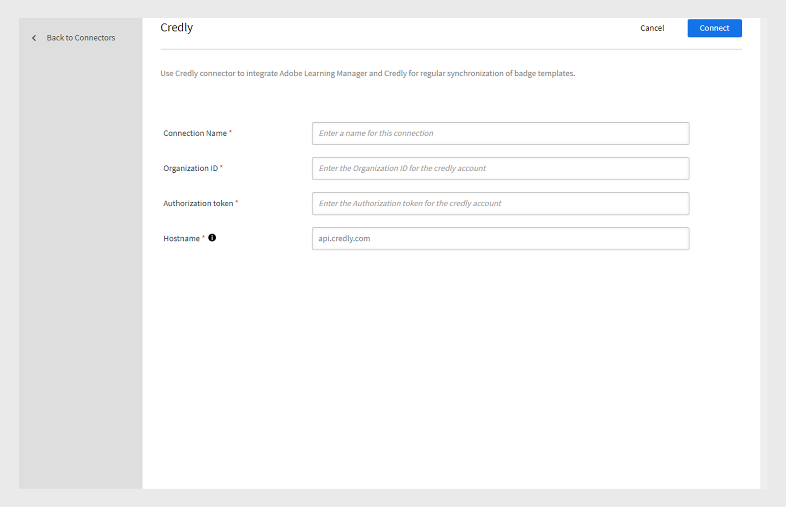

# 신빙하

[신뢰할 수 있는](https://info.credly.com/)은 학습자와 조직이 배지나 인증과 같은 전문적인 성과를 얻고, 공유하고, 확인할 수 있는 디지털 인증 플랫폼입니다. 학습자는 소셜 미디어 및 기타 장소에서 크레딧 프로필을 통해 배지를 관리하고 공유할 수 있습니다.

## 필수 구성 요소

조직의 신뢰할 수 있는 계정을 설정합니다. Adobe Learning Manager에서 학습자의 전자 메일 ID를 신용에 맞게 추가할 수 있습니다. 이를 통해 학습자는 Credly 및 Adobe Learning Manager에서 배지를 볼 수 있습니다.

## Adobe Learning Manager에 Credly 커넥터 추가

Adobe Learning Manager에 Credly 커넥터를 추가하려면 다음 단계를 따르십시오.

1. **[!UICONTROL 통합 관리자]**(으)로 로그인합니다.
2. **[!UICONTROL 신뢰할 수 있는]** > **연결**&#x200B;을 선택하여 **[!UICONTROL 신뢰할 수 있는]** 커넥터를 Adobe Learning Manager에 추가합니다.

   
   _신뢰할 수 있는 커넥터 추가_

3. **[!UICONTROL 연결 이름]**&#x200B;을 입력하십시오.
4. **[!UICONTROL 조직 ID]** 및 **[!UICONTROL 인증 토큰]**&#x200B;을 입력하십시오.

   >[!NOTE]
   >
   >신용할 수 있는 각 배지에는 조직 ID 및 인증 토큰이 제공됩니다. Credly에서 이 값을 복사합니다.

5. **[!UICONTROL 호스트 이름]**&#x200B;을 입력하고 **[!UICONTROL 연결]**&#x200B;을 선택합니다.

## Credly에서 배지 마이그레이션

Adobe Learning Manager의 badge.csv를 사용하면 기존 LMS 또는 외부 시스템에서 배지를 마이그레이션할 수 있습니다. badge.csv가 두 개의 새 열로 업데이트되었습니다.

* 외부 배지 ID
* 외부 배지 공급자.

외부 배지 ID는 Credly 플랫폼의 배지 템플릿 ID를 의미하며 외부 배지 공급자는 Credly입니다. 이러한 값을 badge.csv에 추가하고 [마이그레이션 설명서](https://experienceleague.adobe.com/en/docs/learning-manager/using/integration/migration-manual#migrationprocedure)에 언급된 단계에 따라 csv를 마이그레이션합니다.

## 스킬 생성 - 관리자

배지를 Adobe Learning Manager으로 가져오면 관리자는 스킬로 이 배지를 만들 수 있습니다. 스킬을 만드는 방법을 알아보려면 [스킬 만들기 및 수정](https://experienceleague.adobe.com/en/docs/learning-manager/using/admin/skills-levels)을 참조하세요.

### 학습 개체에 스킬/배지 할당 - 작성자

작성자/책임자는 이렇게 공신력 있게 가져온 ALM 배지를 강의, 학습 경로 또는 인증(스킬뿐만 아니라)에 할당할 수 있으며, 이러한 학습 객체를 소비할 때 배지를 획득할 수 있고, Credly 및 ALM 앱에서 볼 수 있습니다.

학습자는 Credly에 로그인하여 Credly 플랫폼에서 배지를 볼 수 있습니다. 크리틀리에서, 그들은 LinkedIn과 다른 소셜 미디어와 같은 외부 플랫폼에서 배지를 공유할 수 있습니다.

