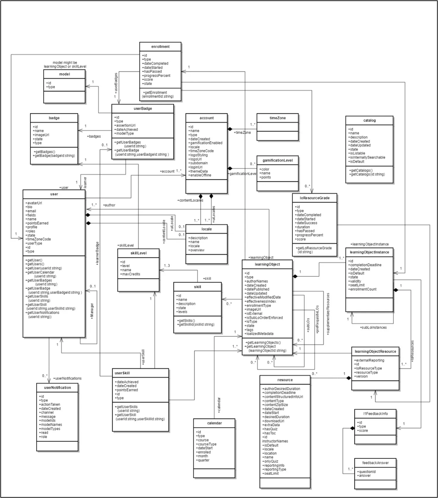

# Adobe Learning Manager 개발자 설명서

## 개요

Adobe Learning Manager은 개발자가 애플리케이션이나 워크플로우를 효과적으로 통합하고 사용자 정의할 수 있는 RESTful API를 제공합니다. Developer Manual에서는 인증, 데이터 모델 및 다른 애플리케이션과의 통합과 같은 주제를 포함하여 이러한 API의 사용 방법에 대한 지침을 제공합니다. 또한 이 안내서 [API 참조 설명서](https://learningmanager.adobe.com/docs/primeapi/v2/)는 개발자가 강의 생성, 학습자 진행 추적, 스킬 매핑, 인증, 게임화 및 성적 증명서를 포함하여 Adobe Learning Manager의 다양한 기능과 상호 작용하는 외부 응용 프로그램 또는 백엔드 작업 과정을 만드는 데 도움이 됩니다.

이 설명서는 다음과 같은 내용을 다룹니다.

* OAuth2.0 인증
* API 객체 모델
* 포함, 필드 및 기타 매개 변수
* 실제 사용 사례

>[!IMPORTANT]
>
>이 개발자 설명서는 Adobe Learning Manager의 V2 API만 다룹니다. 이 안내서에 설명된 모든 예, 요청 구조 및 인증 워크플로우는 /primeapi/v2/ 끝점에 따라 다릅니다. 이전 버전 또는 사용되지 않는 API에 대한 자세한 내용은 [API 참조 설명서](https://learningmanager.adobe.com/docs/primeapi/v2/)를 참조하십시오.

## API 사용 시나리오

개발자는 Learning Manager API를 사용하여 Learning Manager를 개선하거나 다른 기업 응용 프로그램과 통합할 수 있습니다. 모든 기술을 사용하여 웹, 데스크탑 또는 모바일 앱을 만들 수 있습니다. 개발자는 Learning Manager 데이터에 액세스할 수 있지만 사용자가 앱을 사용하는 위치와 방법을 제어합니다.

## OAuth 2.0을 사용한 인증

Adobe Learning Manager API에 안전하게 액세스하려면 ALM의 OAuth 2.0 메커니즘을 사용하여 인증해야 합니다. 이 프로세스에는 응용 프로그램 등록, 인증 코드 생성, 새로 고침 토큰으로 교환, 마지막으로 새로 고침 토큰을 사용하여 액세스 토큰을 가져오는 과정이 포함됩니다.

### 응용 프로그램 등록

Adobe Learning Manager을 외부 애플리케이션과 통합하여 다용성을 개선합니다. 단계는 통합 책임자 인터페이스에 액세스하고, 응용 프로그램을 등록하고, 클라이언트 ID 및 시크릿을 얻는 것입니다. Adobe Learning Manager에서 인증, 새로 고침 및 액세스 토큰을 포함한 OAuth 2.0 인증 토큰을 생성합니다. OAuth 2.0 플로우를 사용하여 앱을 안전하게 인증하고 인증합니다. 액세스 토큰의 유효 기간은 7일입니다.

1. 통합 관리자로 Adobe Learning Manager에 로그인합니다.
2. 왼쪽 창에서 **[!UICONTROL 응용 프로그램]**&#x200B;을 선택합니다.

   

3. **[!UICONTROL 등록]**&#x200B;을 선택하고 다음 정보를 추가합니다.

   * **[!UICONTROL 응용 프로그램 이름]**: 응용 프로그램 이름(최대 50자)을 입력하십시오.
   * **[!UICONTROL URL]**: 회사 또는 응용 프로그램의 공식 URL입니다. 식별 및 참조에 사용됩니다.
   * **[!UICONTROL 도메인 리디렉션]**: ALM이 인증 후 리디렉션할 수 있는 도메인(예: [http://learningmanager.adobe.com](http://learningmanager.adobe.com))을 지정하십시오.  여러 URL을 입력할 수 있지만 URL이 유효해야 합니다.
   * **[!UICONTROL 설명]**: 응용 프로그램의 기능에 대한 간략한 설명입니다.
   * **[!UICONTROL 범위]**: 사용 가능한 6가지 옵션 중 하나를 선택하여 응용 프로그램의 범위를 정의합니다. 여기에 언급된 귀하의 선택에 따라 귀하의 애플리케이션에 대해 Learning Manager API 엔드포인트에 액세스할 수 있습니다. 예를 들어 학습자 역할 및 읽기 액세스 를 선택한 경우 귀하의 응용 프로그램에서는 모든 Learning Manager 학습자 API 엔드 포인트에 읽기 전용으로만 액세스할 수 있습니다.

      * 관리자 역할 읽기/쓰기 액세스: 응용 프로그램이 관리자로 데이터에 액세스하거나 수정할 수 있습니다.
      * 학습자 역할 읽기/쓰기 액세스: 응용 프로그램이 학습자의 데이터에 액세스하거나 수정할 수 있습니다.
      * xAPI 읽기/쓰기 액세스: 응용 프로그램이 xAPI(Experience API) 문에 액세스하고 보낼 수 있도록 합니다.

   * **[!UICONTROL 이 계정에만 해당합니까?]**

      * **[!UICONTROL 예]** - [예]를 선택하면 응용 프로그램이 다른 계정 관리자에게 표시되지 않습니다.
      * **[!UICONTROL 아니요]** - [아니요]를 선택하면 다른 계정 관리자도 이 응용 프로그램에 액세스할 수 있지만 이 응용 프로그램에 액세스하려면 응용 프로그램 ID를 사용해야 합니다. 응용 프로그램 ID는 Learning Manager 응용 프로그램 편집 모드에서 생성 및 표시됩니다.

     

4. **[!UICONTROL 저장]**&#x200B;을 선택하여 응용 프로그램을 등록합니다.

   * 응용 프로그램을 등록하면 계정에서 생성된 응용 프로그램 목록에서 해당 응용 프로그램을 사용할 수 있습니다. 응용 프로그램을 선택하면 이전에 입력한 필드 외에 다음이 표시됩니다.
   * 응용 프로그램 ID: 클라이언트 ID입니다. 이 ID는 액세스를 요청하는 응용 프로그램을 ALM에 알려 줍니다. 앱을 식별하기 위한 API 요청에 포함됩니다.
   * 응용 프로그램 암호: 이는 토큰 교환 단계(예: 새로 고침 토큰 또는 액세스 토큰 요청) 중에 앱을 인증하고 ID를 확인하는 데 사용됩니다.

   

## 액세스 토큰 획득

### 리디렉션에서 인증 코드 가져오기

클라이언트 ID 및 클라이언트 암호를 받은 후 이를 사용하여 API 호출을 인증하는 데 사용되는 액세스 토큰을 요청합니다.

인증 코드 흐름을 시작하려면 브라우저에 다음 URL을 추가하십시오.

```
GET https://learningmanager.adobe.com/oauth/o/authorize?client_id=<Enter your clientId>&redirect_uri=<Enter a url to redirect to>&state=<Any String data>&scope=<one or more comma separated scopes>&response_type=CODE 
```

사용자가 응용 프로그램을 승인하면 Adobe Learning Manager은 추가된 쿼리 매개 변수를 사용하여 지정된 redirect_uri로 리디렉션됩니다.

[https://yourapp.com/callback?code=abc123xyz](https://yourapp.com/callback?code=abc123xyz)

매개 변수 코드가 redirect uri와 함께 추가됩니다.

### 코드에서 새로 고침 토큰 가져오기

코드를 받은 후 API 도구를 사용하여 다음 POST 요청을 추가합니다.

```https://learningmanager.adobe.com/oauth/token ```

**요청 본문(x-www-form-urlencoded)**:

```
grant_type=authorization_code  
&code=abc123xyz  
&client_id=<your_client_id>  
&client_secret=<your_client_secret>  
&redirect_uri=<your_redirect_url> 
```

**응답**

```
{ 

  "access_token": "eyJhbGciOiJIUzI1...", 
  "refresh_token": "xTjlfz0jCk6gF1...", 
  "expires_in": 604800, 
  "token_type": "Bearer" 

} 
```

Authorization 헤더의 access_token을 사용하여 인증된 API 요청을 만듭니다.

### API 호출에서 액세스 토큰 사용

다음을 사용하여 액세스 토큰을 확인합니다.

```
GET https://learningmanager.adobe.com/oauth/token/check?access_token=<access_token> 
```

액세스 토큰은 7일간 유효합니다. 7일 후에는 새로 고침 토큰을 사용하여 새 액세스 토큰을 생성해야 합니다. 기존 액세스 토큰이 아직 유효한 상태에서 새로 고침 토큰을 이용하여 새로운 액세스 토큰을 생성하면, 기존 토큰은 반환됩니다.

### 테스트 및 개발용 액세스 토큰 얻기

Adobe Learning Manager(ALM) API로 작업할 때 개발자는 API 요청을 인증하려면 유효한 OAuth 2.0 액세스 토큰이 필요합니다. 표준 OAuth 흐름을 통해 이 토큰을 생성하는 것은 특히 빠른 테스트, 학습 또는 개발을 위해 복잡하고 시간이 많이 걸릴 수 있습니다. Adobe Learning Manager은 이 프로세스를 단순화하기 위한 토큰 생성 도구를 제공합니다.

이 도구는 다음 경우에 이상적입니다.

* POC(개념 증명) 빌드

* 초기 단계 개발

* API 통합 문제 해결

이러한 토큰은 개발 및 디버깅 단계 중에 개인적인 용도로 사용됩니다. 테스트 토큰은 ALM 데이터에 대한 액세스 권한을 부여하므로 안전하게 처리하는 것이 중요합니다. 테스트 토큰을 다른 사람과 공유하거나, 프로덕션 애플리케이션에서 사용하거나, 공용 코드 리포지토리에 포함하지 마십시오. 이를 암호처럼 취급하여 계정과 데이터의 보안을 보장합니다.

1. 통합 책임자로 Adobe Learning Manager에 로그인합니다.
2. **[!UICONTROL 개발자 리소스]**&#x200B;를 선택한 다음 **[!UICONTROL 테스트 및 개발용 액세스 토큰 선택]**&#x200B;을 선택합니다.

   

3. 응용 프로그램을 만든 후 받은 **[!UICONTROL 클라이언트 ID]**&#x200B;을 입력하여 OAuth 코드를 받습니다. 그런 다음 **[!UICONTROL 제출]**&#x200B;을 선택합니다.

   

4. **[!UICONTROL 클라이언트 ID]** 및 **[!UICONTROL 클라이언트 암호]**&#x200B;을(를) 추가하여 새로 고침 토큰을 가져옵니다. 그런 다음 **[!UICONTROL 제출]**&#x200B;을 선택합니다. OAuth는 이전 단계에서 미리 채워집니다.

   

5. 클라이언트 ID와 클라이언트 암호를 추가하여 액세스 토큰을 가져옵니다. 그런 다음 **[!UICONTROL 제출]**&#x200B;을 선택합니다.

   

6. 액세스 토큰을 추가하고 제출 을 선택하여 액세스 토큰 세부 정보를 가져옵니다.

   

**[!UICONTROL 제출]**&#x200B;을 선택하면 액세스 토큰이 확인되고 다음 응답이 표시됩니다.

```
{ 
  "access_token": "access token", 
  "refresh_token": "refresh token", 
  "user_role": "admin", 
  "account_id": "1234", 
  "user_id": "123456", 
  "expires_in": 604800 
} 
```

이전과 마찬가지로 테스트용 액세스 토큰은 7일 후에 만료됩니다.

### 끝점 테스트에 API 도구 사용

서드파티 API 테스트 도구를 사용할 수 있지만 Postman을 사용하여 끝점을 테스트합니다. 이 문서의 예시는 끝점을 테스트하기 위해 Postman을 사용합니다.

1. Postman을 열고 새 요청을 만듭니다.
2. 인증 탭을 선택합니다.
3. 인증 유형을 전달자 토큰으로 설정합니다.

   
4. 이전 섹션에서 확보한 액세스 토큰을 토큰 필드에 붙여 넣습니다.

   

5. 헤더 탭에서 다음을 추가합니다.

   * 키: 수락
   * 값: application/json
6. URL 필드에 API 엔드포인트를 입력합니다. 예: [https://learningmanager.adobe.com/learningManager/api/v2/users](https://learningmanager.adobe.com/learningManager/api/v2/users)
자세한 내용은 [Adobe Learning Manager API 참조](https://learningmanager.adobe.com/docs/primeapi/v2/)를 참조하세요.
7. 전송 을 선택하여 API를 요청합니다.

## API 유형

### 관리자 API

Adobe Learning Manager의 관리자 API를 사용하면 책임자가 규모에 관계없이 학습 작업을 자동화하고 관리할 수 있습니다.

개발자는 관리 API를 사용하여 다음을 수행할 수 있습니다.

>[!NOTE]
>
>그 목록은 완전하지 않다.

* **사용자 및 그룹 관리**: 사용자를 만들고, 업데이트하고, 삭제하거나 그룹에 할당합니다.
* **학습자 등록**: 강의, 학습 경로 또는 인증에 대한 등록을 자동화합니다.
* **학습자 진행률 추적**: 강의/모듈 진행률, 퀴즈 점수 및 완료 상태를 검색합니다.
* **보고서 생성**: 학습자 활동, 참여 및 성능에 대한 데이터에 액세스합니다.
* **콘텐츠 관리**: 강의 및 학습 개체를 만들고 구성합니다.

자세한 내용은 [Adobe Learning Manager API 참조](https://learningmanager.adobe.com/docs/primeapi/v2/)를 참조하세요.

### 학습자 API

학습자 API는 인증된 사용자(학습자)를 위해 설계되었으며 사용자가 학습자별 정보에 액세스할 수 있도록 합니다. 이러한 API는 다음과 같은 작업을 허용합니다.

* 학습자의 강의 및 진행률 액세스
* 획득한 배지 또는 인증 가져오기
* 학습자 프로필 정보 업데이트
* 완료된 강의와 연관된 스킬 보기

**주요 사항:**

* 이러한 API에는 데이터 보안과 개인 정보 보호를 위해 인증된 사용자 토큰이 필요합니다.
* API는 익명 또는 공유 사용자보다는 사용자가 완전히 등록 및 로그인하는 시나리오용으로 고안되었습니다.

자세한 내용은 [Adobe Learning Manager API 참조](https://learningmanager.adobe.com/docs/primeapi/v2/)를 참조하세요.

## API 디자인 및 공통 매개 변수

API를 통해 개발자는 사용자, 강의, 스킬, 인증, 학습 프로그램 등 Learning Manager 핵심 리소스에 액세스할 수 있습니다. 데이터 작업에 HTTP 메서드(GET, POST, PUT, DELETE)를 사용하여 REST 원칙을 따릅니다.

| | |
|--|--|
| 메서드 | GET, PUT, POST, DELETE |
| 형식 | application/vnd.api+json, application/json. 일반적인 MIME 형식에 대해 [자세히 알아보십시오](https://developer.mozilla.org/en-US/docs/Web/HTTP/Guides/MIME_types/Common_types). |
| 기본 URL | [https://learningmanager.adobe.com/primeapi/v2/](https://learningmanager.adobe.com/primeapi/v2/) |

### 공통 매개 변수

| 매개변수 | 용도 |
|--|--|
| 포함 | 한 번에 관련 리소스를 가져옵니다. |
| 필드 | 페이로드를 줄일 특정 특성을 선택합니다. |
| 필터 | 검색 결과 좁히기(예: ID, 이름별) |
| 정렬 | 주문 결과. |
| 페이지[제한], 페이지[오프셋] | 번호 매기기 지원. |

다음은 각각에 대한 간략한 설명입니다.

### 포함

ALM API를 사용하면 사용자 정의 응용 프로그램이나 헤드리스 LMS를 빌드하는 동안 유용한 정보를 검색할 수 있습니다. API 엔드포인트는 기본적으로 수신되는 데이터와 관련된 추가 정보를 검색하기 위한 추가 &#39;포함&#39; 매개 변수에 더 포함될 수 있습니다. 이러한 관계는 데이터 모델 관계입니다. 예를 들어 사용자 세부 정보를 얻기 위해 전화를 거는 동안 관리자 ID와 ALM 계정 ID의 사용자 정보 및 관계를 수신하게 됩니다. 포함 매개 변수를 사용하면 세부 방식으로 관리자 세부 정보 및 ALM 계정 세부 정보와 같은 사용자 세부 정보와 함께 추가 세부 정보를 추출할 수 있습니다.
즉, **include** 매개 변수는 API 호출에서 단일 응답에서 기본 리소스와 함께 관련(연결된) 리소스를 가져오는 데 사용됩니다. 별도의 API 호출 없이 중첩된 데이터나 종속 데이터(예: 강의 모듈 또는 학습자에게 매핑된 스킬)에 액세스하려는 경우 유용합니다.

주요 이점:

* 여러 API 호출 감소: 관련된 각 리소스를 수동으로 요청할 필요가 없습니다.
* 효율성 향상: 개발 속도 향상, 서버 로드 감소, 데이터 렌더링 속도 향상
* 데이터 일관성 보장: 일관된 스냅샷에서 모든 관련 데이터를 검색합니다.

**포함 매개 변수를 사용하는 방법**

API URL에 include 매개 변수를 추가하고 포함할 관련 엔터티를 지정합니다.

**일반적인 포함 경로**

| 값 포함 | 설명 |
|---|---|
| 인스턴스 | 학습 개체의 모든 인스턴스를 반환합니다. |
| 등록 | 사용자의 등록 세부 정보를 반환합니다. |
| instances.loResources.resources | 인스턴스 내에 모듈 및 리소스 가져오기 |
| supplementaryResources | 관련 보충 리소스를 반환합니다. |
| skills.skillLevel.badge | 스킬 레벨 및 관련 배지 가져오기 |
| prerequisiteLO | 필수 구성 요소 학습 개체 포함 |
| subLO | 하위 학습 객체 가져오기(LP 또는 인증에 사용) |
| subLOs.enrollment | 하위 학습 개체 등록 |
| instances.badge | 강의 인스턴스 완료를 위해 할당된 배지 |
| subLOs.subLOs.instances.loResources.resources | sub-sub-LO 인스턴스 내에 깊게 중첩된 리소스 |

**예 1**

끝점에서 userID 매개 변수를 사용하여 사용자의 세부 정보를 검색합니다.

```
https://learningmanager.adobe.com/primeapi/v2/users/<userID>
```

```
GET https://learningmanager.adobe.com/primeapi/v2/users/<userID>
```

응답에서 데이터 개체가 계정 및 사용자의 관리자와 관계가 있음을 확인할 수 있습니다.

```
"relationships": {
            "account": {
                "data": {
                    "id": "1010",
                    "type": "account"
                }
            },
            "manager": {
                "data": {
                    "id": "3400476",
                    "type": "user"
                }
            }
        }
```

요청에 포함 매개 변수를 사용하면 아래와 같이 관리자에 대한 세부 정보를 검색할 수 있습니다.

```
GET https://learningmanager.adobe.com/primeapi/v2/users/<userid>?include=manager
```

**예 2**

강의 세부 정보를 검색하려면 끝점 호출에 include 매개 변수를 사용합니다. 다음 끝점은 관계와 함께 강의 정보를 가져옵니다.

```
GET https://learningmanager.adobe.com/primeapi/v2/learningObjects/<courseID>
```

다음과 같이 응답 내용에 관계가 표시됩니다.

* 인스턴스
* 스킬
* 작성자

```
"relationships": {
            "authors": {
                "data": [
                    {
                        "id": "3400468",
                        "type": "user"
                    }
                ]
            },
            "instances": {
                "data": [
                    {
                        "id": "course:16444_31598",
                        "type": "learningObjectInstance"
                    }
                ]
            },
            "skills": {
                "data": [
                    {
                        "id": "course:16444_1796",
                        "type": "learningObjectSkill"
                    },
                    {
                        "id": "course:16444_3103",
                        "type": "learningObjectSkill"
                    }
                ]
            }
        }
```

다른 관계에는 다음이 포함될 수 있습니다(위 응답에 없음).

* prerequisiteLO
* supplementalLOs
* supplementaryResources

인스턴스 및 스킬의 세부 데이터를 가져오려면 include 매개 변수에 &quot;instances,skills&quot;를 포함하십시오.

```
GET https://learningmanager.adobe.com/primeapi/v2/learningObjects/<courseID>?include=instances,skills
```

예를 들어 강의 인스턴스(예: 강의 모듈 정보)와 연관된 데이터를 추가로 검색하려면 loResources를 중첩된 포함으로 적용합니다.

```
GET https://learningmanager.adobe.com/primeapi/v2/learningObjects/<courseID>?include=instances.loResources
```

또한 스킬과 인스턴스를 중첩된 포함과 결합할 수 있습니다.

```
GET https://learningmanager.adobe.com/primeapi/v2/learningObjects/<courseID>?include=instances,instances.loResources,skills
```

**기타 포함 필터**

<table>
  <tbody>
  <tr>
   <td>
    <p style="text-align: left;"><b>학습 프로그램</b></p></td>
   <td>
    <p style="text-align: left;"><b>강의</b></p></td>
  </tr>
  <tr>
  <td><br>subLOs.prerequisiteLOs.enrollment</br><br>subLOs.subLOs.prerequisiteLOs.enrollment</br><br>subLOs.enrollment.loResourceGrades</br><br>subLOs.subLOs.enrollment.loResourceGrades</br><br>subLOs.subLOs.instances.loResources.resources.room</br><br>subLOs.instances.loResources.resources.room</br><br>subLOs.supplementaryResources</br><br>subLOs.enrollment</br><br>SubLOs.enrollment.loInstance.loResources.resources</br><br>subLOs.supplementaryLOs.instances.loResources.resources</br>
  </td>
  <td>
  <br>instances.enrollment.loResourceGrades</br><br>enrollment.loInstance.loResources.resources</br>prerequisiteLOs</br><br>authors</br><br>instances.loResources.resources</br><br>supplementaryLOs.instances.loResources.resources</br><br>supplementaryResources</br><br>instances.badge</br><br>skill.skillLevel.badge</br><br>skill.skill</br><br>instances.loResources.room</br><br>prerequisiteLOs.enrollment</br><br>enrollment.loResourceGrades</br>
  </td>
  </tr>
  </table>

#### 필드

API 객체의 속성 및 관계를 필드라고 합니다. 모델에서 특정 속성을 검색하려면 필드를 API 호출의 매개 변수로 사용합니다. Fields 매개 변수가 없는 경우 API 호출은 사용 가능한 모든 특성을 검색합니다.

예를 들어 다음 API 호출에서 fields[skill]=name은 스킬 모델의 이름 특성만 가져옵니다.

```
GET https://learningmanager.adobe.com/primeapi/v2/users/3400490/userSkills/3400490_1796_1?include=skillLevel.skill&fields[skill]=name
```

#### 번호 매기기

API 페이지 매김 은 전체 데이터를 한 번에 반환하지 않고, 대용량 데이터 세트를 페이지라고 하는 더 작고 관리하기 쉬운 청크로 나누는 데 API에서 사용되는 기술입니다.

페이지네이션은 클라이언트 및 서버 로드를 줄이거나, 서버 병목 현상을 방지하기 위해 응답 크기를 제한하거나, 한 번에 한 페이지씩 테이블이나 목록에 데이터를 표시하는 데 유용합니다.

**ALM API에서 페이지 매김 작동 방식**

ALM API는 다음과 같은 매개 변수를 통해 페이지 매기기를 지원합니다.

* 페이지[제한]: 페이지당 레코드 수.
* 페이지[오프셋]: 건너뛸 레코드 수입니다.
* 페이지[커서]: 다음 결과 집합에 대한 포인터입니다. 오프셋 기반 페이지 매김 (많은 레코드를 건너뜀)을 사용하는 대신 커서 기반 페이지 매김에서 API에서 반환된 고유 마커를 사용하여 다음 결과 페이지를 가져옵니다.

API에서 번호 매기기를 사용하는 방법은 다음과 같습니다.

**페이지[제한]**

[https://learningmanager.adobe.com/primeapi/v2/users](https://learningmanager.adobe.com/primeapi/v2/users)이(가) 단일 호출에서 모든 사용자 및 관련 정보를 반환하는 동안 [limit] 페이지를 사용하면 결과 수가 지정된 값으로 제한됩니다.

단일 호출에서 5개의 사용자 레코드만 반환하려면 다음 API를 사용합니다.

```
GET https://learningmanager.adobe.com/primeapi/v2/users?page[limit]=5
```

**페이지[오프셋]**

이 API 호출을 사용하여 세 개의 사용자 레코드를 반환하고 처음 다섯 명의 사용자를 건너뛰고 여섯 번째 사용자부터 시작합니다.

```
GET https://learningmanager.adobe.com/primeapi/v2/users?page[limit]=3&page[offset]=5 
```

**페이지[커서]**

1. 첫 페이지를 5개로 제한하여 요청하여 시작합니다.

   ```
   GET https://learningmanager.adobe.com/primeapi/v2/users?page[limit]=5
   ```

2. links.next에서 커서 값을 복사하여 다음 요청에 사용합니다.

   ```
   "links": {
       "self": "https://learningmanager.adobe.com/primeapi/v2/users?page[limit]=5",
       "next": "https://learningmanager.adobe.com/primeapi/v2/users?page[limit]=5&page[cursor]=3400482"
    }
   ```

3. 다음 요청을 보냅니다.

   ```
   GET https://learningmanager.adobe.com/primeapi/v2/users?page[limit]=5&page[cursor]=3400482
   ```

이렇게 하면 이전 페이지의 마지막 항목 다음부터 시작하여 10개의 다음 레코드 집합이 반환됩니다.

#### 필터

필터 매개 변수를 사용하면 하나 이상의 필드 값을 기준으로 API 결과 범위를 좁힐 수 있습니다.

Adobe Learning Manager API는 다양한 필터 매개 변수 변형을 제공하여 응답 범위를 좁힙니다.

자세한 내용은 [Adobe Learning Manager API 참조](https://learningmanager.adobe.com/docs/primeapi/v2/)를 참조하세요.

다음 예에서는 필터 매개 변수와 함께 끝점을 사용하여 학습자가 등록한 작업 지원을 필터링하는 방법을 보여 줍니다.

```
GET https://learningmanager.adobe.com/primeapi/v2/users/3400480/enrollments?filter.loTypes=jobAid
```

#### 정렬

정렬 매개변수는 하나 이상의 필드를 기준으로 API 결과를 오름차순 또는 내림차순으로 정렬하는 데 사용됩니다.

Adobe Learning Manager에서는 API 응답을 정렬하기 위한 다양한 정렬 옵션을 제공합니다. 자세한 내용은 [Adobe Learning Manager API 참조](https://learningmanager.adobe.com/docs/primeapi/v2/)를 참조하세요.

이전 예를 확장하면 이제 사용자의 학습 프로그램 등록을 오름차순으로 등록한 날짜별로 정렬합니다.

```
GET https://learningmanager.adobe.com/primeapi/v2/users/3400480/enrollments?filter.lotypes=learningProgram&sort=dateEnrolled
```

## API 모델 개요

Adobe Learning Manager API를 사용하면 개발자가 RESTful 리소스로 Learning Manager 객체에 액세스할 수 있습니다. 각 API 엔드 포인트는 리소스를 나타냅니다. 이는 일반적으로 배지와 같은 인스턴스 또는 해당 객체의 집합입니다. 개발자는 PUT, GET, POST 및 DELETE 등의 HTTP 동사를 사용하여 해당 객체(콜렉션)에서 CRUD 작업을 수행합니다.



| Learning Manager 객체 | 설명 |
|----|----|
| 계정 | Learning Manager 고객의 세부 정보를 압축합니다. |
| 배지 | 배지는 성과를 표시합니다. 학습자가 강의를 진행하여 특정 단계에 도달했을 때 획득합니다. |
| 카탈로그 | 카탈로그는 학습 객체의 집합입니다. |
| 사용자 | 사용자는 Learning Manager의 주요 모델입니다. 사용자는 일반적으로 학습 객체를 수료하는 조직 내부 및 외부의 학습자입니다. 그러나, 사용자는 학습자 역할과 함께 작성자 또는 관리자의 역할도 수행할 수 있습니다. 사용자 ID, 유형, 전자 메일 등의 인라인 속성을 갖고 있습니다. |
| 리소스 | 모듈이 압축하려는 각 콘텐츠 리소스를 모델링하는 데 사용됩니다. &quot;loResource&quot; 내에 캡슐화된 모든 리소스는 학습 목적에는 같지만, 콘텐츠 로케일의 전송 유형에서는 서로 다릅니다. |
| 사용자 알림 | 이 모델은 학습자에 속한 알림 정보를 포함하고 있습니다. |
| 사용자 스킬 | 사용자 스킬은 단일 사용자가 단일 스킬을 얼마나 많이 달성했는지 나타냅니다. |
| 사용자 배지 | 사용자 배지는 단일 배지를 단일 사용자와 연결합니다. 달성 시기, 검증 URL 등의 세부 정보가 포함됩니다. |
| 스킬 | 스킬 모델은 레벨과 점수로 구성됩니다. 학습자는 관련 강의를 완료하면 스킬을 획득합니다. |
| 스킬 레벨 | 스킬 레벨은 레벨 관련 점수 및 레벨을 획득하기 위해 수료하는 하나 이상의 강의로 구성됩니다. |
| 학습 객체 | 학습 객체는 사용자가 등록하고 학습할 수 있는 다양한 종류의 객체에 대한 추상적 개념입니다. 현재 Learning Manager에는 네 가지 유형의 학습 객체인 과정, 인증, 학습 프로그램 및 작업 지원이 있습니다. |
| 학습 객체 인스턴스 | 학습 객체의 특성 인스턴스입니다. |
| 학습 객체 리소스 | 이는 모듈 의 개념과 동일합니다. 강의는 하나 이상의 모듈로 구성됩니다. Learning Manager에서는 여러 동등한 방법으로 모듈을 전송할 수 있습니다. 따라서 loResource 는 기본적으로 동등한 모든 리소스를 압축합니다. |
| 학습 객체 리소스 등급 | 사용자가 등록한 학습 객체의 컨텍스트에 있는 특정 리소스를 수료한 결과를 압축합니다. 사용자가 리소스에서 사용한 기간, 사용자가 수행한 진행률, 합격/불합격 상태 및 사용자가 모든 관련 퀴즈에서 획득한 점수와 같은 정보가 있습니다. |
| 달력 | 달력 객체는 사용자가 등록할 수 있는 예정 강의실 또는 가상 강의실 강의의 목록입니다. |
| L1 피드백 정보 | L1 피드백은 학습 객체와 관련된 피드백 질문에 대한 학습자의 대답을 압축합니다. 학습자에게 해당 피드백을 수집하도록 구성된 경우 일반적으로 사용자가 학습 객체를 완료한 뒤 수집됩니다. |
| 등록 | 이 추상적 개념은 특정 사용자를 특정 학습 객체 인스턴스에 할당한 내용에 속한 세부 정보를 압축합니다. |


## 학습자 API 및 끝점

학습자 데이터 작업을 위한 주요 API 엔드포인트는 다음과 같습니다. 이러한 API는 개발자가 학습자 정보와 상호 작용하고, 진행 상황을 추적하고, 등록을 관리하고, 강의 콘텐츠를 검색할 수 있도록 안내합니다.

### 모든 학습자의 세부 정보 검색

학습자 세부 정보(이름, 이메일, UUID, 사용자 프로필 등)를 가져옵니다. API를 사용하여 계정의 모든 학습자를 나열합니다.

```
GET https://learningmanager.adobe.com/primeapi/v2/users
```

### 특정 학습자의 세부 정보 검색

ID로 학습자 프로필을 보려면 다음 API를 사용하여 호출합니다.

```
GET https://learningmanager.adobe.com/primeapi/v2/users/<userID>
```

### 모든 강의, 학습 프로그램, 작업 지원 및 인증 나열

학습자가 등록, 완료 또는 관리자에 의해 활성화된 모든 학습 객체의 세부 정보를 검색합니다.

```
GET https://learningmanager.adobe.com/primeapi/v2/learningObjects
```

### 특정 학습 개체에 대한 세부 정보 가져오기

학습 개체에 대한 자세한 정보를 가져옵니다. 여기에는 작성 날짜, 게시 날짜, 업데이트 날짜 및 기타 정보가 포함됩니다.

```
GET https://learningmanager.adobe.com/primeapi/v2/learningObjects/<LearningObjectID>
```

### 강의에 연결된 스킬 목록 검색

계정의 모든 학습자에게 할당된 스킬을 표시합니다.

```
GET https://learningmanager.adobe.com/primeapi/v2/skills
```

### 스킬 레벨 및 배지 정보 가져오기

스킬 기반 학습 여정에서 학습자의 진행 상황을 확인합니다.

```
GET https://learningmanager.adobe.com/primeapi/v2/skills/<skillID>?include=levels
```

### 계정에 대해 생성된 모든 배지 목록

다음 끝점을 호출하여 조직의 계정에 대해 생성된 모든 배지 목록을 검색합니다.

```
GET https://learningmanager.adobe.com/primeapi/v2/badges
```

### 배지 정보 검색

배지 이름, 배지 이미지 URL, 배지 상태 등 배지에 대한 자세한 정보를 얻습니다.

```
GET https://learningmanager.adobe.com/primeapi/v2/badges/<skillID>
```

이렇게 하면 다음과 같은 응답이 생성됩니다.

```
{
    "links": {
        "self": "https://learningmanager.adobe.com/primeapi/v2/badges/499"
    },
    "data": {
        "id": "499",
        "type": "badge",
        "attributes": {
            "imageUrl": "https://cpcontentsdev.adobe.com/public/account/1010/accountassets/1010/badges/test_57a5ab00555a475a8fc6671562184dc9.png",
            "name": "penguins",
            "state": "Retired"
        }
    }
}
```

## 기타 API 사용 예

### 사용자 만들기

1. 끝점 사용:

   ```
   POST https://learningmanager.adobe.com/primeapi/v2/users
   ```

   API 본문 또는 JSON 페이로드의 속성을 처리하여 사용자를 생성한 후 해당 사용자 ID가 채워진 상태로 사용자에게 제공됩니다.

2. 다음 페이로드를 본문으로 사용합니다.

   ```
   { 
      "data": { 
        "type": "user", 
        "attributes": { 
         "email": "bob@example.com", 
          "name": "Bob", 
          "userType": "INTERNAL" 
        } 
      } 
    }
   ```

세 가지 필수 속성이 있습니다.

* 이메일: 사용자의 이메일 ID. 이 값은 모든 사용자에 대해 고유해야 합니다.
* 이름: 사용자의 이름입니다.
* userType: 현재는 이 엔드포인트를 사용하여 내부 사용자만 추가할 수 있습니다. userType은 &quot;INTERNAL&quot;이어야 합니다.

다음과 같은 응답이 나타납니다.

```
{
  "links": {
      "self": "https://learningmanager.adobe.com/primeapi/v2/users"
  },
  "data": {
      "id": "13386404",
      "type": "user",
      "attributes": {
          "avatarUrl": "https://cpcontents.adobe.com/public/images/default_user_avatar.svg",
          "email": "bob@example.com",
          "name": "Bob",
          "pointsEarned": 0,
          "pointsRedeemed": 0,
          "preferredResolution": "AUTO",
          "profile": "Employee",
          "roles": [
              "Learner"
          ],
          "state": "ACTIVE",
          "userType": "Internal",
          "userUniqueId": "bob@example.com"
      },
      "relationships": {
          "account": {
              "data": {
                  "id": "1010",
                  "type": "account"
              }
          },
          "manager": {
              "data": {
                  "id": "3400468",
                  "type": "user"
              }
          }
      }
  }
}
```

### 사용자 삭제

1. 삭제하려는 사용자의 사용자 ID를 가져옵니다.

   ```
   GET https://learningmanager.adobe.com/primeapi/v2/users/<userID>
   ```

2. 그런 다음 DELETE을 사용하여 다음과 같이 호출합니다.

   ```
   DELETE https://learningmanager.adobe.com/primeapi/v2/users/<userID>
   ```

204 응답이 나타납니다. 204 응답 코드는 반환할 콘텐츠 없이 성공했음을 나타냅니다. 서버에서 요청을 처리했지만 클라이언트에 제공할 데이터가 없습니다.

사용자의 세부 정보를 검색한 후 사용자의 상태는 이제 **[!UICONTROL 삭제됨]**&#x200B;입니다.

### 사용자 세부 정보 업데이트

1. v2 API를 사용하는 사용자의 사용자 세부 정보를 업데이트합니다. 학습자는 bio, uiLocale, contentLocale, 시간대를 수정할 수 있습니다. 큰 계정의 경우 비동기 호출입니다. 이 API 엔드포인트를 사용하여 업데이트할 수 있는 다른 많은 사용자 특성이 있습니다. /users/{id} 엔드포인트를 사용합니다. 여기서 id는 세부 정보를 업데이트할 사용자의 사용자 id입니다.

```
PATCH https://learningmanager.adobe.com/primeapi/v2/users/<userID>
```

이전 섹션에서 ID가 `<userID>`인 사용자를 업데이트하는 요청의 페이로드에 다음을 추가합니다.

페이로드의 모든 필드를 변경합니다.

```
{
    "data": {
        "id": "3400468",
        "type": "user",
        "attributes": {
            "avatarUrl": "https://cpcontents.adobe.com/public/images/default_user_avatar.svg",
            "binUserId": "3e6d571f-3956-44db-be69-8e458bde649f",
            "bio": "Manager",
            "contentLocale": "de-DE",
            "email": "user@example.com",
            "enrollOnClick": true,
            "fields": {
                "Web": "Web",
                "newfororder": "newvalue",
                "location": "New",
                "test1": "b"
            },
            "gamificationEnabled": true,
            "lastLoginDate": "2025-04-30T09:30:51.000Z",
            "metadata": {
                "level": "5",
                "expertise": "java",
                "sport": "tennis"
            },
            "name": "John Adams",
            "pointsEarned": 8600,
            "pointsRedeemed": 0,
            "preferredResolution": "AUTO",
            "profile": "Employee",
            "roles": [
                "Learner",
                "Admin",
                "Author",
                "Instructor",
                "Integration Admin",
                "Manager"
            ],
            "state": "ACTIVE",
            "timeZoneCode": "213",
            "uiLocale": "en-US",
            "userType": "Internal",
            "userUniqueId": "user@example.com"
        },
        "relationships": {
            "account": {
                "data": {
                    "id": "1010",
                    "type": "account"
                }
            }
        }
    }
}
```

전화를 걸면 사용자의 세부 정보가 업데이트됩니다.

### 외부 프로필 만들기

외부 프로필은 외부 학습자(일반적으로 조직의 내부 사용자 베이스에 속하지 않는 개인)를 위해 생성된 사용자 프로필을 의미합니다. 이들 학습자에는 조직에서 제공하는 교육 또는 인증 프로그램에 액세스해야 하는 고객, 파트너, 공급업체, 프랜차이즈 또는 임시 계약업체가 포함될 수 있습니다.

1. 다음 엔드포인트를 사용합니다.

   ```
   POST https://learningmanager.adobe.com/primeapi/v2/externalProfiles
   ```

2. 다음 페이로드를 본문으로 사용합니다.

```
{
    "data": {
      "type": "externalProfile",
      "attributes": {
        "name": "Jonas Albertson",
        "expiry": "2027-12-31T18:29:59.000Z",
        "managerEmail": "jonas@acme.com",
        "seatLimit": 10
      }
    }
}
```

페이로드에는 다음과 같은 속성이 있습니다.

* 이름: 외부 사용자의 이름입니다.
* 만료: Adobe Learning Manager에 사용자 등록한 만료 날짜(ISO-8601 형식)입니다.
* managerEmail: 파트너 조직의 사용자 관리자 이메일 주소입니다.
* seatLimit: 파트너 조직에 허용되는 시트 수입니다.

전화를 걸면 다음과 같은 응답을 받게 됩니다.

```
{
    "links": {
        "self": "https://learningmanager.adobe.com/primeapi/v2/externalProfiles"
    },
    "data": {
        "id": "18805",
        "type": "externalProfile",
        "attributes": {
            "accessKey": "8gte2ne7f4r14",
            "enabled": true,
            "expiry": "2027-12-31T18:29:59.000Z",
            "managerEmail": "jonas@acme.com",
            "name": "Jonas Albertson",
            "seatLimit": 10,
            "url": "https://learningmanager.adobe.com/eplogin?groupid=18805&accesskey=8gte2ne7f4r14"
        }
    }
}
```

이는 외부 사용자가 Adobe Learning Manager에 성공적으로 추가되었음을 의미합니다. 사용자에게 응답하는 URL을 보냅니다. URL을 사용하면 플랫폼에 등록할 수 있습니다.

### 사용자 ID 및 관리자 세부 정보가 포함된 사용자 보고서 추출

사용자 보고서는 관리자 사용자 인터페이스(**[!UICONTROL 관리자]** > **[!UICONTROL 사용자]** > **[!UICONTROL 내부]**)에서 직접 다운로드할 수 있습니다. 그러나 이 보고서는 사용자 ID와 관련 관리자의 세부 정보를 반환하지 않습니다.

작업 API를 사용하여 보고서를 다운로드합니다. 작업 API를 사용하면 보고서, 일괄 작업(등록 또는 배지 할당), 인증 완료 또는 배지 생성을 수행할 수 있습니다.

보고서를 다운로드하는 방법은 다음과 같습니다.

1. 작업 API에 다음 페이로드를 추가합니다.

   ```
   {
       "data": {
           "type": "job",
           "attributes": {
               "description": "description of your choice",
               "jobType": "generateUsers",
               "payload":{
                   "expandMetadata":true
               }
           }
      }
   }
   ```

2. 다음 끝점을 사용하십시오.

   ```
   POST https://learningmanager.adobe.com/primeapi/v2/jobs
   ```

3. 응답에서 작업 ID를 복사합니다.

   ```
   {
       "links": {
           "self": "https://learningmanager.adobe.com/primeapi/v2/jobs"
       },
       "data": {
           "id": "43118",
           "type": "job",
           "attributes": {
               "dateCreated": "2025-05-26T06:35:35.000Z",
               "description": "description of your choice",
               "jobType": "generateUsers",
               "payload": {
                   "expandMetadata": true
               },
             "status": {
                   "code": "Submitted"
               }
           }
       }
   }
   ```

   응답에서 작업 ID가 43118.
4. ID를 복사한 후 작업 API에서 ID를 사용하여 보고서를 다운로드합니다.

   ```
   GET https://learningmanager.adobe.com/primeapi/v2/jobs/43118
   ```

5. 응답에서 S3 URL을 복사합니다.
6. 브라우저에 URL을 붙여넣습니다. 브라우저에서 CSV 파일을 저장하거나 열라는 메시지가 표시됩니다. 파일을 컴퓨터에 저장합니다.
다운로드한 파일에는 다음 열이 포함됩니다.

internalUserID, userEmail, customerDefinedUniqueUserId, name, managerEmail, userType, state, excludedFromGamification, pointsEarned, profile, roles, dateCreated, lastLoginDate, dateDeleted, uiLocale, contentLocale, timeZoneCode, userSource, group, 활성 필드, 메타데이터 및 lastSocialActivityDate.

### 작업 API를 사용하여 배지 생성

1. 조직의 사용자에 대한 배지 목록을 가져옵니다. 다음 엔드포인트를 사용합니다.

   ```
   GET https://learningmanager.adobe.com/primeapi/v2/users/3400476/userBadges
   ```

   여기서 3400476은 사용자 ID입니다.
2. 응답에서 배지 ID를 복사합니다. 예를 들어, 3400476_759_COMPETENCY_1796_1은 배지 ID입니다.

   ```
   {
    "id": "3400476_759_COMPETENCY_1796_1",
    "type": "userBadge",
    "attributes": {
        "assertionUrl": "https://cpcontentsdev.adobe.com/public/accountassets/1010/badges/assertions/a99566b5aa8f4cfa92380581733c63a9_1626278856926.json",
        "dateAchieved": "2016-02-25T08:45:25.000Z",
        "modelType": "skillLevel"
    },
    "relationships": {
        "badge": {
            "data": {
                "id": "759",
                "type": "badge"
            }
        },
        "learner": {
            "data": {
                "id": "3400476",
                "type": "user"
            }
        },
        "model": {
            "data": {
                "id": "1796_1",
                "type": "skillLevel"
            }
        }
    }
   }
   ```

3. 페이로드를 만들고 페이로드에 배지 ID를 지정합니다. 페이로드의 예는 다음과 같습니다.

   ```
   {
    "data": {
        "type": "job",
        "attributes": {
            "description": "Acme Corp Badge",
            "jobType": "generateUserBadge",
            "payload": {
                "userBadgeId": "3400476_759_COMPETENCY_1796_1"
            }
        }
    }
   }  
   ```

   전화를 걸면 응답에 작업 ID가 표시됩니다.
4. 응답에서 작업 ID를 가져와 다음 끝점의 작업 ID를 사용하여 호출합니다.

   ```
   GET https://learningmanager.adobe.com/primeapi/v2/jobs/<jobsID>
   ```

5. 응답에서 배지 URL을 복사하고 브라우저에서 URL을 엽니다. 인증서가 PDF으로 다운로드됩니다.

### Adobe Learning Manager에서 사용자 만들기

POST /사용자 끝점을 사용하면 헤드리스 모드를 사용하여 사용자를 만들 수 있습니다. Adobe Learning Manager의 기본 사용자 인터페이스에서 등록 프로세스와 같은 세부 정보가 포함된 사용자를 생성합니다.

For example,

```
POST https://learningmanager.adobe.com/primeapi/v2/users
```

요청에 다음 본문을 추가합니다.

```
{   
   "data":  
     {  
       "type": "user",  
       "attributes": {  
         "bio": "",  
         "contentLocale": "fr-FR",  
         "email": "user@work.com",  
         "enrollOnClick": true,  
         "fields": {  
           "Learning Categories": [  
             "Business"  
           ],  
           "Categories": "IT"  
         },  
         "gamificationEnabled": true,  
         "name": "Test User",  
         "profile": "Engineer",  
         "userType": "INTERNAL",  
         "userUniqueId": "user@work.com"  
       },  
       "relationships": {  
         "account": {  
           "data": {  
             "id": "108079",  
             "type": "account"  
           }  
         }
         }  
       }  
    } 
```

전화를 걸면 다음과 같은 응답이 표시됩니다.

```
{
    "links": {
        "self": "https://learningmanager.adobe.com/primeapi/v2/users"
    },
    "data": {
        "id": "13385627",
        "type": "user",
        "attributes": {
            "avatarUrl": "https://cpcontents.adobe.com/public/images/default_user_avatar.svg",
            "email": "user@work.com",
            "name": "Test User",
            "pointsEarned": 0,
            "pointsRedeemed": 0,
            "preferredResolution": "AUTO",
            "profile": "Engineer",
            "roles": [
                "Learner"
            ],
            "state": "ACTIVE",
            "userType": "Internal",
            "userUniqueId": "user@work.com"
        },
        "relationships": {
            "account": {
                "data": {
                    "id": "1010",
                    "type": "account"
                }
            },
            "manager": {
                "data": {
                    "id": "3400468",
                    "type": "user"
                }
            }
        }
    }
}
```

새 사용자가 Adobe Learning Manager에 추가됩니다.

### L1 피드백 게시

1. 학습자의 강의, 인스턴스 및 등록 데이터를 검색합니다. 다음 색인을 사용합니다.

   ```
   GET /enrollments
   ```

2. 강의 인스턴스에 L1 피드백이 활성화되어 있는지 확인합니다.

   ```
   GET https://learningmanager.adobe.com/primeapi/v2/learningObjects/<loID>/instances/<loInstanceID>/l1Feedback
   ```

3. L1 피드백을 제출합니다.

   ```
   POST /enrollments/{id}/l1Feedback
   ```

필수 페이로드 예:

```
{
    "data": {
      "id": "course:7454218_10333537_11257863",
      "type": "feedback",
      "attributes": {
        "questions": [
          {
            "answer": "8",
            "questionId": "1",
            "mandatory": true,
            "questionType": "scaleTen"
          }
        ],
        "score": 80
      }
    }
  }
```

### 강의의 모듈 레벨 정보 가져오기

1. ID로 학습 객체의 세부 정보를 검색합니다.

   ```
   GET https://learningmanager.adobe.com/primeapi/v2/learningObjects/<loID>
   ```

   ```
   {
    "links": {
        "self": "https://learningmanager.adobe.com/primeapi/v2/learningObjects/course:1171899"
    },
    "data": {
        "id": "course:1171899",
        "type": "learningObject",
        "attributes": {
            "authorNames": [
                "James Adams"
            ],
            "dateCreated": "2017-11-01T15:28:09.000Z",
            "datePublished": "2017-11-01T15:28:20.000Z",
            "dateUpdated": "2017-11-01T15:28:20.000Z",
            "duration": 60,
            "effectiveModifiedDate": "2017-11-01T15:28:20.000Z",
            "effectivenessIndex": 0,
            "enrollmentType": "Self Enroll",
            "hasOptionalLoResources": false,
            "hasPreview": false,
            "isExternal": false,
            "isMqaEnabled": false,
            "isPrerequisiteEnforced": false,
            "isSubLoOrderEnforced": false,
            "loFormat": "Self Paced",
            "loResourceCompletionCount": 3,
            "loType": "course",
            "moduleResetEnabled": false,
            "state": "Published",
            "unenrollmentAllowed": true,
            "catalogLabels": [
                {
                    "catalogLabelValueIds": [
                        {
                            "name": "Sales",
                            "id": "catalogLabel:13_31"
                        }
                    ],
                    "description": "",
                    "mandatory": false,
                    "name": "Department",
                    "values": [
                        "Sales"
                    ]
                }
            ],
            "localizedMetadata": [
                {
                    "locale": "en-US",
                    "name": " Test course 2"
                }
            ],
            "rating": {
                "averageRating": 0,
                "ratingsCount": 0
            }
        },
        "relationships": {
            "authors": {
                "data": [
                    {
                        "id": "3400468",
                        "type": "user"
                    }
                ]
            },
            "instances": {
                "data": [
                    {
                        "id": "course:1171899_2067352",
                        "type": "learningObjectInstance"
                    }
                ]
            },
            "skills": {
                "data": [
                    {
                        "id": "course:1171899_1797",
                        "type": "learningObjectSkill"
                    }
                ]
            }
        }
    }
   }
   ```

2. include 매개 변수를 사용하여 다음을 읽어들입니다.

   a. 학습 개체의 모든 모듈을 나열합니다.

   ```
   GET https://learningmanager.adobe.com/primeapi/v2/learningObjects/course:1171899?include=instances.loResources
   ```

   b. 모듈의 모든 콘텐츠를 나열합니다.

   ```
   GET https://learningmanager.adobe.com/primeapi/v2/learningObjects/course:1171899?include=instances.loResources.resources
   ```

### 모듈 진행률 확인

1. 강의 ID를 사용하여 카탈로그에서 학습 개체를 검색합니다.

   ```
   GET https://learningmanager.adobe.com/primeapi/v2/learningObjects?page[limit]=10&filter.loTypes=course&sort=name&filter.ignoreEnhancedLP=true&id=<courseID>
   ```

2. 등록 ID를 사용하여 학습자의 등록 세부 정보를 가져옵니다.

   ```
   GET https://learningmanager.adobe.com/primeapi/v2/enrollments/<enrollmentID>
   ```

   응답에서 학습 개체 리소스 등급 ID를 복사합니다.
3. 다음 엔드포인트에서 ID를 사용합니다.

   ```
   GET https://learningmanager.adobe.com/primeapi/v2/loResourceGrades/<courseResourceGradeID>
   ```

응답에서 모듈의 진행률에 대한 정보를 얻을 수 있습니다.

### 학습자 대리 로그인 기능 구현

Adobe Learning Manager을 백엔드로 사용하여 헤드리스 LMS를 구현하려는 경우, 문제 해결 또는 지원을 위해 지원 담당자가 학습자를 사칭해야 할 수 있습니다. API 기반 가장 방법은 학습자 자격 증명 기밀을 유지하면서 안전한 액세스를 보장하고 세션 상태의 원활한 전환을 지원합니다.

Adobe Learning Manager(ALM)는 전용 API를 통해 헤드리스 LMS 환경에서 학습자 가장을 용이하게 합니다. 이 기능을 통해 지원 담당자는 학습자의 ID를 일시적으로 확인할 수 있어 학습자의 경험을 시뮬레이션하여 문제를 진단하거나 기능을 테스트하거나 실습 지원을 제공할 수 있습니다. 가장은 프로그래밍 방식으로 학습자 액세스 토큰을 생성하는 데 사용되는 캐시된 관리자 액세스 토큰을 사용하여 활성화됩니다. 이 프로세스를 통해 시스템은 학습자로 로그인한 것처럼 작동할 수 있습니다.

>[!IMPORTANT]
>
>사용자는 이 기능을 활용하기 위해 특별한 API 액세스를 요청해야 하며, 가장 시 투명성과 책임을 보장하기 위해 시스템에서 세션 전환, 인증 및 기타 표시기를 처리해야 합니다.

**API 끝점 세부 정보**

```
POST /oauth/learnerToken
```

**전체 URL 예**

```
https://learningmanager.adobe.com/oauth/o/learnerToken?learner_email=foo@acme.com&force=false
```

**쿼리 매개 변수:**

* learner_email: (문자열) 가장할 학습자의 전자 메일입니다.
* force: (부울) 새 토큰이 있는 경우 강제로 생성할지 여부를 지정합니다.

**요청 본문:**

```
{
    "client_id": "your-client-id",
    "client_secret": "your-client-secret",
    "refresh_token": "your-admin-refresh-token"
}  
```

**샘플 응답:**

```
{
    "access_token": "generated-token",
    "refresh_token": "new-refresh-token",
    "user_role": "learner",
    "account_id": "123456",
    "user_id": "7891011",
    "expires_in": 604800
}  
```

**샘플 cURL:**

```
curl --location --request POST 'https://learningmanager.adobe.com/oauth/o/learnerToken?learner_email=foo@acme.com&force=false' \
--header 'Content-Type: application/json' \
--data-raw '{
  "client_id": "xxxx",
  "client_secret": "xxxx",
  "refresh_token": "xxxx"
}'
```


### 오류 코드

Adobe Learning Manager(ALM) API로 작업할 때 개발자는 요청 중에 다양한 HTTP 오류 코드가 발생할 수 있습니다. 이러한 오류는 발생한 문제와 해결 방법에 대한 중요한 피드백을 제공합니다. 이러한 코드를 이해하면 개발자가 문제를 빠르게 해결하고, API 안정성을 향상시키며, 더 원활한 통합을 보장할 수 있습니다. 다음 표는 ALM API에서 반환된 일반적인 HTTP 오류 코드에 대한 설명 및 이러한 코드가 발생하는 일반적인 시나리오에 대한 안내입니다. 이 섹션은 ALM에 연결되는 응용 프로그램을 빌드, 테스트 또는 디버깅하는 모든 사용자에게 필수적입니다.

| HTTP 상태 | 의미 | 문제 해결 |
|---|---|---|
| 400 | 잘못된 요청 | 요청에 누락된 매개 변수 또는 잘못된 매개 변수가 있는지 확인합니다. 필수 필드를 확인하고 형식을 수정하십시오. 예를 들어, 필터, 필드 또는 포함 매개 변수에 대한 구문이 잘못되었습니다. |
| 401 | 인증되지 않은 유효하지 않거나 누락된 토큰 | 액세스 토큰이 올바르고 인증 헤더에 포함되어 있는지 확인합니다. 토큰이 활성 상태인지 확인합니다. 또한 토큰을 요청할 때 올바른 클라이언트 ID 및 클라이언트 암호를 사용합니다. |
| 403 | 사용 금지. 액세스 권한 없음 | 리소스에 액세스할 수 있는 권한이 없습니다. 토큰에 올바른 범위(관리자:읽기, 학습자:쓰기 등)가 있는지 확인합니다. |
| 404 | 리소스를 찾을 수 없음 | 끝점 또는 리소스 ID가 잘못되었거나 존재하지 않습니다. 리소스가 매개 변수 목록에 있는지 확인하십시오. |
| 406 | 수락할 수 없음- 잘못된 수락 헤더 | 요청에 이 헤더 추가: 수락: application/vnd.api+json <br>Adobe Learning Manager API에는 이 콘텐츠 형식이 필요합니다.</br> |
| 500 | 내부 서버 오류 | 서버 측 문제입니다. 잠시 후 다시 시도하거나 문제가 계속되는 경우 Adobe Learning Manager 지원 팀에 보고하십시오. |


<!--# Application developer manual

>[!NOTE]
>
>Learning Manager V1 API is now deprecated. We recommend that you use V2 APIs to interact with Learning Manager.


## Overview {#overview}

[Adobe Learning Manager](http://www.adobe.com/in/products/learningmanager.html) is a cloud-hosted, learner-centric, and self-service learning management solution. Customers can access Learning Manager resources programmatically using the Learning Manager API to integrate it with other enterprise applications. The API can also be used by Adobe partners to enhance the value proposition of Learning Manager, by extending its functionality or by integrating it with other applications or services.

### Usage scenario {#usagescenario}

Using Learning Manager API, developers can build self-contained applications that extend the functionality of Learning Manager or integrate Learning Manager with other enterprise applications workflows. You can develop a web application, desktop client or a mobile app using any technology of your choice. As a developer you can access your application data from within Learning Manager. The deployment of the application that you develop is external to the Learning Manager platform and you have full control over the software development lifecycle as the application evolves. Typically, applications are developed by a customer organization for use with their Learning Manager account, and these applications are private to that specific customer organization. Also, Adobe partners can build generic applications with Learning Manager API, that can be used by a large set of Learning Manager customers.

## Learning Manager API {#apidescription}

The Learning Manager API is based on principles of REST, and exposes key elements of the Learning Manager Object Model to application developers through HTTP. Before knowing the details of the API endpoints and the HTTP methods, developers can become familiar with the various Learning Manager objects, their attributes and inter-relationships. Once the models are understood, it will be useful to get a basic understanding of the structure of API requests and responses, and a few common programming terms that we use generically across the API.

For details of the various API endpoints and methods, refer to the  [Learning Manager API documentation](https://learningmanager.adobe.com/docs/primeapi/v2/).

## Learner APIs

Adobe Learning Manager - Learner APIs allow you to create a custom learning experience for your users. The usage of these APIs need a valid user token and are to be used only for the purpose of workflows where there is a fully licensed/registered Learner.
 
>[!IMPORTANT]
>
>They are not to be used, as is, for any sort of data retrieval to support any non-logged in user/shared users or any other such cases.
 
The non-logged in use cases require special handling. 

**Reach out to the Solution Architecture team, in case you have any questions on the appropriate use of these APIs and ensure that a Solution Architect has vetted a solution before you deploy it**.

## API authentication {#apiauthentication}

When writing an application that makes API calls to Learning Manager, you have to register your application using the Integration Admin app. 

Learning Manager APIs use OAuth 2.0 framework to authenticate and authorize your client applications. 

**Procedure**

**1. Set up your application**

You can set up your application with client id and client secret to use the proper end points. Once you register your application, you can get the clientId and clientSecret. Get URL should be used in browser as it authenticates the Learning Manager users using their pre-configured accounts such as SSO, Adobe ID, and so on. 

```
GET https://learningmanager.adobe.com/oauth/o/authorize?client_id=<Enter your clientId>&redirect_uri=<Enter a url to redirect to>&state=<Any String data>&scope=<one or more comma separated scopes>&response_type=CODE.
```

After successful authentication, your browser redirects to the redirect_uri mentioned in the above URL. A parameter **code** is appended along with the redirect uri.

**2. Get refresh token from code**

`POST https://learningmanager.adobe.com/oauth/token Content-Type: application/x-www-form-urlencoded`

Body of the post request:

```
client_id: 
<enter your clientid>
 & 
 client_secret: 
 <enter your clientsecret>
  & 
  code: 
  <code from step 1></code>
 </enter>
</enter>
```

**3.** **Obtain an access token from refresh token**

URL to obtain access token: 

POST [https://learningmanager.adobe.com/oauth/token/refresh](https://learningmanager.adobe.com/oauth/token/refresh) Content-Type: application/x-www-form-urlencoded

Body of the post request:

```
client_id: 
<enter your clientid>
 & 
 client_secret: 
 <enter your clientsecret>
  & 
  refresh_token: 
  <refresh token>
   
  </refresh>
 </enter>
</enter>
```

**URL to verify access token details**

`GET https://learningmanager.adobe.com/oauth/token/check?access_token=<access_token>`

**Usage limitation**

An access token is valid for seven days. After a day, you have to generate a new access token using refresh token. If you generate a new access token from refresh token while an existing access token is still valid, the existing token is returned. 

Some of the frequently used terms in Learning Manager API are explained below for your reference. 

**Includes**

Developers can access a single API object model and also multiple models associated with that model. To access the subsequent related models, you need to understand the relationship of each model with other models. **Includes** parameter enables developers to access the dependant models. You can use comma separator to access multiple models. For sample usage and more details on **includes**, refer to sample API model section in this page. 

**API request**

The API requests can be made by making a HTTP Request. Depending upon the end point and method developer may have a choice of various HTTP verbs such as GET, PUT, POST, DELETE, PATCH, etc. For some requests query parameters can be passed. When making a request for a specific data model, the user can also request for related models as described in the JSON API specifications. The structure of a typical API Request is described in [sample model usage](/help/migrated/integration-admin/feature-summary/developer-manual.md#api-usage-illustration).

**API response**

When an API request is made by a client, a SON document is obtained according to the JSON API specification. The response also contains the HTTP Status code, which the developer can verify to perform the appropriate next steps in his application logic. The structure of a typical API Response is described in  [sample model usage](/help/migrated/integration-admin/feature-summary/developer-manual.md#api-usage-illustration).

**Errors**

When an API request fails, an Error response is obtained. The HTTP Status code returned in the response indicates the nature of error. Error codes are represented with numbers for each model in the API reference. 200, 204, 400 and 404 are some of the common errors represented in APIs indicating HTTP access issues.  

**Fields**

API object's attributes and its relationships are collectively called Fields. Refer to [JSON API for more information.](http://jsonapi.org/format/#document-resource-object-fields) You can use Fields as a parameter while making API calls to fetch one or more specific attributes from the model. In absence of the Fields parameter, the API call fetches all the available attributes from the model. For example, in the following API call, fields[skill]=name fetches you the name attribute of the skill model alone. 

`https://learningmanager.adobe.com/primeapi/v2/users/{userId}/userSkills/{id}?include=skillLevel.skill&fields[skill]=name `

**Pagination**

Sometimes, an API request results in a long list of objects to be returned in the response. In such cases, the pagination attribute enables the developer to fetch the results sequentially in terms of multiple pages, where each page contains a range of records. For example, pagination attribute in Learning Manager enables you to set the maximum number of records to be displayed in a page. Also, you can define the range value of records to be displayed on page. 

**Sorting**

Sorting is allowed in API models. Based on the model, choose the type of sorting to be applied for the results. Sorting can be applied in ascending or descending order. For example, if you specify `code sort=name`, then it is ascending sort by name. If you specify `code sort=-name`, it is descending sort by name. Refer to [JSON API spec for more information](http://jsonapi.org/format/#fetching-sorting). 

## API usage illustration {#samplemodel}

Let us consider a scenario where a developer wants to get skill name, max points assigned for skill level and points earned by the learner for that skill.

A userSkill model in Learning Manager APIs consists of id, type, dateAchieved, dateCreated, pointsEarned as default attributes. So, when a developer uses GET method to acquire details of userSkill model, the current data pertaining to the default attributes is shown in the response output. 

But, in this scenario, the developer wants to get the skill name, and points of skill level for the user. Learning Manager API enables you to access this related information using relationship fields and include parameter. The associated models for userSkill are obtained in relatioships tag. You can get the details of each associated models by calling these models along with the userSkill. To get this information, use **`code include`** parameter with dot (period) separated values for each of the associated models. You can use comma as separator to request another model like user include=skillLevel.skill,course

**API Call**

`https://learningmanagerqe1.adobe.com/primeapi/v1/users/%7buserId%7d/userSkills/%7bid%7d?include=skillLevel.skill&fields%5bskill%5d=name&fields%5bskillLevel%5d=maxCredits&fields%5buserSkill%5d=pointsEarned`

For example userId can be 746783 and the userSkills id: 746783_4426_1. 

**Response of API call**

```
\{ 
 "links": {"self": "https://learningmanager.adobe.com/primeapi/v2/users/746783/userSkills/746783_4426_1?include=skillLevel.skill&fields[userSkill]=pointsEarned&fields[skillLevel]=maxCredits&fields[skill]=name"}, 
 "data": { 
 "id": "746783_4426_1", 
 "type": "userSkill", 
 "attributes": {"pointsEarned": 5}, 
 "links": {"self": "https://learningmanager.adobe.com/primeapi/v2/users/746783/userSkills/746783_4426_1"} 
 }, 
 "included": [ 
 { 
 "id": "4426", 
 "type": "skill", 
 "attributes": {"name": "Java"}, 
 "links": {"self": "https://learningmanager.adobe.com/primeapi/v2/skills/4426"} 
 }, 
 { 
 "id": "4426_1", 
 "type": "skillLevel", 
 "attributes": {"maxCredits": 10} 
 } 
 ] 
} 

```

## Learning Manager models {#models}

The Learning Manager API allows developers to access Learning Manager objects as RESTful resources. Each API endpoint represents a resource, typically an object instance like Badge, or a collection of such objects. The developers then use the HTTP verbs such as PUT, GET, POST and DELETE to perform the CRUD operations on those objects (collections).

+++V1 API

The following diagram represents the various elements of the Learning Manager Object Model in V1 API.


The following table describes various elements of the Learning Manager V1 object model: 

<table border="1" cellspacing="0" cellpadding="0">
 <tbody>
  <tr>
   <td>
    <p><strong>Serial No</strong></p></td>
   <td>
    <p><strong>Learning Manager Object</strong></p></td>
   <td>
    <p><strong>Description</strong></p></td>
  </tr>
  <tr>
   <td>
    <p>1.      </p></td>
   <td>
    <p>user</p></td>
   <td>
    <p>User is the key model in Learning Manager. Users are typically the internal or external learners of an organization who consume learning objects. However they may play some other roles such as author and Manager along with learner role. User id, type, email are some of the inline attributes. </p></td>
  </tr>
  <tr>
   <td>
    <p>2.      </p></td>
   <td>
    <p>course</p></td>
   <td>
    <p>Course is one of the learning objects supported in Learning Manager, that consists of one or more modules. </p></td>
  </tr>
  <tr>
   <td>
    <p>3.      </p></td>
   <td>
    <p>module</p></td>
   <td>
    <p>Module is a building block to create learning objects in Learning Manager. Modules can be of four different types such as Class room, virtual class room, activity and self-paced. Use this module model to get the details of all modules in an account. </p></td>
  </tr>
  <tr>
   <td>
    <p>4.      </p></td>
   <td>
    <p>certification</p></td>
   <td>
    <p>Certification is awarded to learners based on successful completion of courses. Courses are required in the application before you use certifications. </p></td>
  </tr>
  <tr>
   <td>
    <p>5.      </p></td>
   <td>
    <p>learning program</p></td>
   <td>
    <p>Learning programs are uniquely designed courses meeting specific learning requirements of users. Typically, learning programs are used to drive learning goals spanning across individual courses. </p></td>
  </tr>
  <tr>
   <td>
    <p>6.      </p></td>
   <td>
    <p>badge</p></td>
   <td>
    <p>Badge is a token of accomplishment that learners get when they reach specific milestones as they progress within a course. </p></td>
  </tr>
  <tr>
   <td>
    <p>7.      </p></td>
   <td>
    <p>skill</p></td>
   <td>
    <p>Skills model consists of levels and credits. Skills can be acquired by learners after relevant course completion. </p></td>
  </tr>
  <tr>
   <td>
    <p>8.      </p></td>
   <td>
    <p>certificationEnrollment</p></td>
   <td>
    <p>This model provides details of an enrollment by a user to a single certification.</p></td>
  </tr>
  <tr>
   <td>
    <p>9.  </p></td>
   <td>
    <p>courseEnrollment</p></td>
   <td>
    <p>This model provides details of an enrollment by a user to a single course. </p></td>
  </tr>
  <tr>
   <td>
    <p>10.  </p></td>
   <td>
    <p>courseInstance</p></td>
   <td>
    <p>A course can have one or many instances associated with it. You can get Course instance </p></td>
  </tr>
  <tr>
   <td>
    <p>11.  </p></td>
   <td>
    <p>courseSkill</p></td>
   <td>
    <p>A courseSkill model specifies the progress of a single skill that is achieved by completing a course.</p></td>
  </tr>
  <tr>
   <td>
    <p>12.  </p></td>
   <td>
    <p>courseModule</p></td>
   <td>A courseModule model specifies how a module is included  in a course. For instance, whether the module is used for pretest or for content.</td>
  </tr>
  <tr>
   <td>
    <p>13.  </p></td>
   <td>learningProgramInstance</td>
   <td>
    <p>A learning program can consist of multiple instances imbibing similar properties of a learning program or customized instances. </p></td>
  </tr>
  <tr>
   <td>
    <p>14.  </p></td>
   <td>
    <p>job aid</p></td>
   <td>
    <p>Job aid is a learning content accessible to learners without any enrollment or completion criteria. You can fetch, updated date, state, id information along with its related models such as job aid version, authors and skill level. </p></td>
  </tr>
  <tr>
   <td>
    <p>15.  </p></td>
   <td>
    <p>jobAidVersion</p></td>
   <td>
    <p>Job aid can have one or many versions associated to it based on number revisions in content and number of uploads. This model provides details of a single job aid version. </p></td>
  </tr>
  <tr>
   <td>
    <p>16.  </p></td>
   <td>
    <p>learningProgramInstanceEnrollment</p></td>
   <td>
    <p>Learning program consists of one or many instances. Learners can enroll to a learning program instance by themselves or assigned by administrator. This model provides details of an enrollment by a user to a single learning program instance. </p></td>
  </tr>
  <tr>
   <td>
    <p>17.  </p></td>
   <td>
    <p>moduleVersion</p></td>
   <td>
    <p>A module can have one or many versions based on its revised content uploads. Use this model to obtain specific info about any single module version. </p></td>
  </tr>
  <tr>
   <td>
    <p>18.  </p></td>
   <td>
    <p>skillLevel</p></td>
   <td>
    <p>A skill level comprises of one or many courses to be consumed in order to acquire a level along with its associated credits. </p></td>
  </tr>
  <tr>
   <td>
    <p>19.  </p></td>
   <td>
    <p>userBadge</p></td>
   <td>
    <p>UserBadge relates a single badge with a single user. It contains details such as when was it achieved, assertionUrl and so on. </p></td>
  </tr>
  <tr>
   <td>
    <p>20.  </p></td>
   <td>
    <p>userSkill</p></td>
   <td>
    <p>UserSkill indicates how much of a single skill level is achieved by a single user.</p></td>
  </tr>
 </tbody>
</table>

+++

+++V2 API

Following are the various elements of the Learning Manager class diagram in V2 API.


<table>
 <tbody>
  <tr>
   <th><b>Learning Manager Object</b></th>
   <th><b>Description</b></th>
  </tr>
  <tr>
   <td>account</td>
   <td>Encapsulates the details of a Learning Manager customer.</td>
  </tr>
  <tr>
   <td><code>
     badge
    </code></td>
   <td>Badge is a token of accomplishment that learners get when they reach specific milestones as they progress within a course. <br></td>
  </tr>
  <tr>
   <td><code>
     catalog
    </code></td>
   <td>Catalog is a collection of learning objects.</td>
  </tr>
  <tr>
   <td><code>
     user
    </code></td>
   <td>User is the key model in Learning Manager. Users are typically the internal or external learners of an organization who consume learning objects. However, they may play some other roles such as author and Manager along with learner role. User id, type, email are some of the inline attributes. </td>
  </tr>
  <tr>
   <td>resource</td>
   <td>This is used to model each content resource that a module seeks to encapsulate. All resources encapsulated within <code>
     an
    </code> <code>
     loResource
    </code> are equivalent in terms of the learning objective, but they differ from each other in terms of delivery type or content locale.<br></td>
  </tr>
  <tr>
   <td>userNotification</td>
   <td>This model contains notification information pertaining to a learner.<br></td>
  </tr>
  <tr>
   <td>userSkill</td>
   <td>UserSkill indicates how much of a single skill level is achieved by a single user.<br></td>
  </tr>
  <tr>
   <td>userBadge</td>
   <td>UserBadge relates a single badge <code>
     with
    </code> a single user. It contains details such as when was it achieved, <code>
     assertionUrl
    </code> and so on. <br></td>
  </tr>
  <tr>
   <td>skill</td>
   <td>Skills model consists of levels and credits. Skills can be acquired by learners after relevant course completion. <br></td>
  </tr>
  <tr>
   <td>skillLevel</td>
   <td>A skill level comprises of one or many courses to be consumed in order to acquire a level along with its associated credits. <br></td>
  </tr>
  <tr>
   <td>learningObject</td>
   <td>A Learning Object is an abstraction for various kinds of objects which users can enroll into and learn from. Currently Learning Manager has the four types of Learning Objects – Course, Certification, Learning Program <code>
     and
    </code> Job Aid.<br></td>
  </tr>
  <tr>
   <td>learningObjectInstance<br></td>
   <td>A specific instance of a learning object.<br></td>
  </tr>
  <tr>
   <td>learningObjectResource</td>
   <td>This is equivalent to the concept of <code>
     module
    </code>. A course is composed of one <code>
     of
    </code> more modules. In Learning Manager, a module can be delivered in a variety of equivalent ways. Therefore the <code>
     loResource
    </code> essentially encapsulates all those equivalent resources.<br></td>
  </tr>
  <tr>
   <td>loResourceGrade<br></td>
   <td>This encapsulates the outcome of the user consuming a specific resource in the context of a learning object he is enrolled into. It has information such as the duration spent by <code>
     user
    </code> in the resource, percentage progress made by the user, pass/fail status and the score obtained by the user in any associated quiz.<br></td>
  </tr>
  <tr>
   <td>calendar<br></td>
   <td>A calendar object is a list of <code>
     upcoming classroom
    </code> or virtual classroom courses that the user can enroll into.<br></td>
  </tr>
  <tr>
   <td>l1FeedbackInfo<br></td>
   <td>L1 Feedback encapsulates the answers provided by a learner for the feedback questions associated with Learning Objects. Typically this is collected after the user completes a Learning Object if configured to collect such feedback from learners.<br></td>
  </tr>
  <tr>
   <td>enrollment<br></td>
   <td>This abstraction encapsulates the details pertaining to the transaction representing the assignment of a specific user to a specific learning object instance.<br></td>
  </tr>
 </tbody>
</table>

+++

List of object attributes and relationships.

+++account

**Attributes** 
dateCreated  
gamificationEnabled  
id  
locale  
loginUrl  
logoUrl  
name  
subdomain  
themeData  
timeZoneCode

**Relationships** 
contentLocales(localizationMetadata)  
gamificationLevels(gamificationLevel)  
timeZones(timeZone)  
uiLocales(localizationMetadata)

+++

+++badge

**Attributes** 
id  
imageUrl  
name  
state

+++

+++catalog

**Attributes** 
dateCreated  
dateUpdated  
description  
id  
isDefault  
isInternallySearchable  
isListable  
name  
state

+++

+++data

**Attributes** 
id  
names

+++

+++gamification

**Attributes** 
color  
name  
points

+++

+++learningObject

**Attributes** 
authorNames  
dateCreated  
datePublished  
dateUpdated  
effectivenessIndex  
enrollmentType  
id  
imageUrl  
isExternal  
isSubLoOrderEnforced  
loType  
state  
tags

**Relationships** 
authors(user)  
enrollment(learningObjectInstanceEnrollment)  
instances(learningObjectInstance)  
prerequisiteLOs(learningObject)  
skills(learningObjectSkill)  
subLOs(learningObject)  
supplementaryLOs(learningObject)  
supplementaryResources(resource)

+++

+++learningObjectInstance

**Attributes** 
completionDeadline  
dateCreated  
enrollmentCount  
id  
isDefault  
seatLimit  
state  
validity

**Relationships** 
badge(badge)  
l1FeedbackInfo(feedbackInfo)  
learningObject(learningObject)  
loResources(learningObjectResource)  
localizedMetadata(localizationMetadata)  
subLoInstances(learningObjectInstance)

+++

+++learningObjectInstanceEnrollment

**Attributes** 
dateCompleted  
dateEnrolled  
dateStarted  
hasPassed  
id  
progressPercent  
score  
state

**Relationships** 
learner(user)  
learnerBadge(userBadge)  
learningObject(learningObject)  
loInstance(learningObjectInstance)  
loResourceGrades(learningObjectResourceGrade)

+++

+++learningObjectResource

**Attributes** 
externalReporting  
id  
loResourceType  
resourceType  
version

**Relationships** 
learningObject(learningObject)  
loInstance(learningObjectInstance)  
localizedMetadata(localizationMetadata)  
resources(resource)

+++

+++learningObjectResourceGrade

**Attributes** 
dateCompleted  
dateStarted  
dateSuccess  
duration  
hasPassed  
id  
progressPercent  
score

**Relationships** 
loResource(learningObjectResource)

+++

+++learningObjectSkill

**Attributes** 
credits  
id  
**Relationships** 
learningObject(learningObject)  
skillLevel(skillLevel)

+++

+++recommendation

**Attributes** 
id  
reason

**Relationships** 
learningObject(learningObject)

+++

+++resource

**Attributes** 
authorDesiredDuration  
completionDeadline  
contentStructureInfoUrl  
contentType  
contentZipSize  
contentZipUrl  
dateCreated  
dateStart  
desiredDuration  
downloadUrl  
extraData  
hasQuiz  
hasToc  
id  
instructorNames  
isDefault  
locale  
location  
name  
onlyQuiz  
reportingInfo  
reportingType  
seatLimit

+++

+++skill

**Attributes** 
description  
id  
name  
state

**Relationships** 
levels(skillLevel)

+++

+++skillLevel

**Attributes** 
id  
level  
maxCredits  
name  
**Relationships** 
badge(badge)  
skill(skill)

+++

+++user

**Attributes** 
avatarUrl  
bio  
contentLocale  
email  
fields  
id  
name  
pointsEarned  
profile  
roles  
state  
timeZoneCode  
uiLocale

**Relationships** 
account(account)  
manager(user)

+++

+++userBadge

**Attributes** 
assertionUrl  
dateAchieved  
id  
modelType

**Relationships** 
badge(badge)  
learner(user)  
model(learningObject)

+++

+++userCalendar

**Attributes** 
course  
courseType  
dateStart  
enrolled  
id  
month  
quarter

**Relationships** 
containerLO(learningObject)  
course(learningObject)

+++

+++userNotification

**Attributes** 
actionTaken  
channel  
dateCreated  
id  
message  
modelIds  
modelNames  
modelTypes  
read  
role

+++

+++userSkill

**Attributes** 
dateAchieved  
dateCreated  
id  
pointsEarned

**Relationships** 
learnerBadge(userBadge)  
learningObject(learningObject)  
skillLevel(skillLevel)  
user(user)

+++

## Application development process {#registration}

## Pre-requisites {#prerequisites}

As a developer you have to create a trial account on Learning Manager, so that you can have full access to all the roles within that account. To be able to write an application, a developer has to create some users and courses and get the account to a reasonable state so that the application being developed can have access to some sample data.

## Create client id and secret {#createclientidandsecret}

1. In **Integration Admin** login, click **[!UICONTROL Applications]** on the left pane. 

   

   *Select Applications on Integration Admin*

1. Click **[!UICONTROL Register]** at the upper-right corner of the page to register your application details. Registration page appears. 

   

   *Register the application*

   It is mandatory to fill up all the fields in this page. 

   **Application Name**: Enter your application name. It is not mandatory to use the same application name, it can be any valid name. 

   **URL**: If you know the exact URL where the application is hosted, you can mention it. If you are not aware, then you can mention your company URL. Valid URL name is mandatory in this field. 

   **Redirect Domains**: Enter the domain name of the application where you want the Learning Manager application to redirect after OAuth authentication. You can mention multiple URLs here but you have to use the valid URLs such as `http://google.com`, `http://yahoo.com` and so on. 

   **Description:** Enter the brief description for your application. 

   **Scopes:** Choose one of the four available options to define the scope of your application. Based on your choice mentioned here, Learning Manager API endpoint are accessible for your application. For example, If you chose **Learner role read access**, then all the Learning Manager learner API end points are read-only accessible to your application. 

   **For this account only?**   
   **Yes** - if you choose Yes, then the application is not visible to other account administrators.  
   **No** - if you choose No, other account admins can also access this application but they need to use the application id to access this application. Application id is generated and displayed in Learning Manager application Edit mode. 

   If you choose **Admin role read and write access** as scope while registering the application and choose **Admin role read access** while authoring the APIs, you can still have write access for the application as the app registration scope supersedes the authorization workflow. 

1. Click **[!UICONTROL Register]** at the upper-right corner after filling up the details in the registration page.

## Application development and testing {#applicationdevelopmentandtesting}

The Learning Manager API can be used by developers to build any application. Developers have to ensure that their accounts consist of some valid users and courses. They can create a few dummy users and courses and simulate activity in the trial account, so that they can test functionality of the application.

## Application deployment {#applicationdeployment}

We recommend that the Learning Manager Administrator or an Integration Administrator for the production account, to take ownership of making the application available to users within their organization. Once the application has been tested and is considered ready for production, inform the administrator of the production account. Ideally, the administrators want to generate a new client-id and client-secret for the application in the production account, and perform the necessary steps to incorporate them inside the application in a secure manner. The actual procedure for deploying applications varies from enterprise to enterprise, and the Learning Manager Administrator of your organization has to take support from the IT/IS department within your organization to complete the deployment.

## External application approval {#externalapplicationapproval}

You can add external applications by clicking **Approve** at the upper-right corner of the **Applications** page. Provide the external application id and click **Save.**


*Add and approve an external application*

## Frequently Asked Questions

+++Does Learning Manager have an E-commerce integration?

Adobe Learning Manager does not have an E-commerce integration. However, we provide APIs so that you can create your own headless LMS and implement E-commerce features.
+++
-->