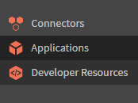

# 응용 프로그램 개발자 설명서

>[!NOTE]
>
>Learning Manager V1 API는 이제 더 이상 사용되지 않습니다. Learning Manager와 상호 작용할 V2 API를 사용하는 것이 좋습니다.


## 개요 {#overview}

[Adobe Learning Manager](http://www.adobe.com/in/products/learningmanager.html)는 클라우드 호스팅 방식의 학습자 중심 셀프서비스 학습 관리 솔루션입니다. 고객은 Learning Manager API로 Learning Manager 리소스에 프로그래밍 방식으로 액세스하여 다른 기업 응용 프로그램과 통합할 수 있습니다. Adobe 파트너 또한 기능을 확장하거나 다른 응용 프로그램 또는 서비스와 통합하여 Learning Manager의 가치 제안을 강화하는 데 API를 사용할 수 있습니다.

### 사용 시나리오 {#usagescenario}

개발자는 Learning Manager API를 사용하여 Learning Manager의 기능을 확장하거나 다른 기업 응용 프로그램 작업 과정을 통합한 자족적인 응용 프로그램을 만들 수 있습니다. 원하는 기술을 사용하여 웹 응용 프로그램, 데스크톱 클라이언트 또는 모바일 앱을 개발할 수 있습니다. 개발자는 Learning Manager 내에서 응용 프로그램 데이터에 액세스할 수 있습니다. 개발한 응용 프로그램은 Learning Manager 플랫폼 외부에 배포하며, 귀하는 해당 응용 프로그램의 확장된 소프트웨어 개발 수명 주기를 전적으로 제어합니다. 일반적으로 Learning Manager 계정과 함께 사용할 목적의 응용 프로그램은 고객의 조직에서 개발하며, 해당 응용 프로그램은 특정 고객 조직 전용입니다. 또한 Adobe 파트너는 Learning Manager API로 일반 응용 프로그램을 개발하며 대규모의 Learning Manager 고객이 이를 사용할 수 있습니다.

## Learning Manager API {#apidescription}

Learning Manager API는 REST 구조를 기반으로 하며 HTTP를 통해 Learning Manager Object Model의 주요 요소를 응용 프로그램 개발자에게 공개합니다. 개발자는 API 엔드 포인트 및 HTTP 메서드의 세부 정보를 파악하기 전에 다양한 Learning Manager 객체, 객체 속성, 상호 관계를 익힐 수 있습니다. 모델을 이해했다면 API 요청, 응답, API 전반에서 일반적으로 사용하는 몇 가지 프로그래밍 용어에 대한 기초적인 내용을 알고 있는 것이 유용합니다.

다양한 API 엔드 포인트 및 메서드에 대한 세부 정보는 다음을 참조하십시오.  [Learning Manager API 설명서](https://learningmanager.adobe.com/docs/primeapi/v2/).

## 학습자 API

Adobe Learning Manager - 학습자 API를 사용하면 사용자에 대한 사용자 정의 학습 경험을 만들 수 있습니다. 이러한 API를 사용하려면 유효한 사용자 토큰이 필요하며, 전체 라이선스/등록된 학습자가 있는 워크플로우의 목적으로만 사용해야 합니다.

>[!IMPORTANT]
>
>로그인하지 않은 사용자/공유 사용자 또는 기타 다른 경우를 지원하기 위해 데이터 검색 시 그대로 사용할 수 없습니다.

로그인하지 않은 사용 사례는 특별한 처리가 필요합니다.

**이러한 API의 적절한 사용에 대한 질문이 있는 경우 솔루션 아키텍처 팀에 연락하여 솔루션을 배포하기 전에 솔루션 설계자가 솔루션을 검사했는지 확인하십시오**.

## API 인증 {#apiauthentication}

Learning Manager에 API 호출을 하는 응용 프로그램을 작성하는 경우 통합 책임자 앱에서 귀하의 응용 프로그램을 등록해야 합니다.

Learning Manager API는 클라이언트 응용 프로그램 인증 및 승인에 OAuth 2.0 프레임워크를 사용합니다.

**절차**

**1. 애플리케이션 설정**

클라이언트 ID와 클라이언트 시크릿으로 응용 프로그램을 설정하여 적절한 엔드 포인트를 사용할 수 있습니다. 응용 프로그램을 등록하면 clientId 및 clientSecret을 가져올 수 있습니다. 브라우저에서는 SSO, Adobe ID 등 사전 구성된 계정을 이용하여 Learning Manager 사용자를 인증하는 Get URL을 사용해야 합니다.

```
GET https://learningmanager.adobe.com/oauth/o/authorize?client_id=<Enter your clientId>&redirect_uri=<Enter a url to redirect to>&state=<Any String data>&scope=<one or more comma separated scopes>&response_type=CODE.
```

인증이 성공적으로 끝나면 위의 URL에 입력된 redirect_uri로 브라우저가 리디렉션됩니다. 매개 변수 **코드**&#x200B;가 redirect uri와 함께 추가됩니다.

**2. 코드에서 새로 고침 토큰 얻기**

`POST https://learningmanager.adobe.com/oauth/token Content-Type: application/x-www-form-urlencoded`

POST 요청의 본문:

```
client_id: 
<enter your clientid>
 & 
 client_secret: 
 <enter your clientsecret>
  & 
  code: 
  <code from step 1></code>
 </enter>
</enter>
```

**3.** **새로 고침 토큰에서 액세스 토큰 획득**

액세스 토큰 획득 URL:

POST [https://learningmanager.adobe.com/oauth/token/refresh](https://learningmanager.adobe.com/oauth/token/refresh) Content-Type: application/x-www-form-urlencoded

POST 요청의 본문:

```
client_id: 
<enter your clientid>
 & 
 client_secret: 
 <enter your clientsecret>
  & 
  refresh_token: 
  <refresh token>
   
  </refresh>
 </enter>
</enter>
```

**액세스 토큰 세부 정보 확인 URL**

`GET https://learningmanager.adobe.com/oauth/token/check?access_token=<access_token>`

**사용 제한**

액세스 토큰은 7일간 유효합니다. 날짜가 지나면 새로 고침 토큰을 사용하여 새로운 액세스 토큰을 생성해야 합니다. 기존 액세스 토큰이 아직 유효한 상태에서 새로 고침 토큰을 이용하여 새로운 액세스 토큰을 생성하면, 기존 토큰은 반환됩니다.

Learning Manager에서 자주 사용되는 용어를 아래에서 참조하십시오.

**포함**

개발자는 단일 객체 API 모델 및 해당 모델에 관련된 여러 모델에 액세스할 수 있습니다. 관련 후속 모델에 액세스하려면 각 모델과 기타 모델과의 관계를 파악해야 합니다. **포함** 매개 변수를 사용하면 개발자가 종속 모델에 액세스할 수 있습니다. 여러 모델에 액세스할 때는 쉼표를 구분 기호로 사용합니다. 샘플 사용 및 자세한 내용 **포함**&#x200B;에서는 이 페이지의 샘플 API 모델 섹션을 참조하십시오.

**API 요청**

HTTP 요청을 만들어 API 요청을 할 수 있습니다. 엔드 포인트와 메서드에 따라 개발자는 GET, PUT, POST, DELETE, PATCH 등 다양한 HTTP 동사를 선택할 수 있습니다. 일부 요청에 대해 쿼리 매개 변수를 전달할 수 있습니다. 특정 데이터 모델에 대해 요청을 할 때, 사용자는 JSON API 사양에 설명된 관련 모델에 대해서도 요청할 수 있습니다. 일반적인 API 요청의 구조는 [샘플 모델 사용](#main-pars_header_1415780624)에 설명되어 있습니다.

**API 응답**

클라이언트가 API 요청을 하면 JSON API 사양에 따라 SON 문서를 획득합니다. 응답에는 HTTP 상태 코드도 포함되어 있습니다. 이 코드를 통해 개발자는 자신의 응용 프로그램 논리에서 적절한 다음 단계를 수행하는지 확인할 수 있습니다. 일반적인 API 응답의 구조는에 설명되어 있습니다  [샘플 모델 사용](#main-pars_header_1415780624).

**오류**

API 요청이 실패하면, 오류 응답을 획득합니다. 응답에서 반환된 HTTP 상태 코드는 오류의 원인을 표시합니다. 오류 코드는 API 참조 내의 각 모델에 대한 숫자로 표시됩니다. 200, 204, 400 및 404는 HTTP 액세스 문제를 나타내는 API에서 흔히 나타나는 오류입니다.

**필드**

API 객체 속성 및 그 관계는 집합적으로 필드라고 합니다. 자세한 내용은 [JSON API를 참조하십시오.](http://jsonapi.org/format/#document-resource-object-fields) 모델에서 하나 이상의 특정 속성을 가져오는 API 호출 시 필드를 매개 변수로 사용할 수 있습니다. 필드 매개 변수가 없는 경우, API 호출은 모델에서 사용 가능한 모든 속성을 가져옵니다. 예를 들어 다음 API 호출에서 필드는[스킬]=name은 스킬 모델만의 이름 속성을 가져옵니다.

https://learningmanager.adobe.com/primeapi/v2/users/{userId}/userSkills/{id}?include=skillLevel.skill&amp;fields[skill]=name

**번호 매기기**

API 요청에 대한 응답이 긴 객체 목록으로 돌아오는 경우가 있습니다. 그러한 경우 개발자는 번호 매기기 속성을 이용하여 각 페이지에 다양한 기록이 담긴 여러 페이지를 순차적으로 가져올 수 있습니다. 예를 들어 Learning Manager의 번호 매기기 속성에서는 한 페이지에 표시할 기록의 최대 개수를 설정할 수 있습니다. 또한, 한 페이지에 표시될 기록의 범위 값을 정의할 수 있습니다.

**정렬**

API 모델에서 정렬을 사용할 수 있습니다. 모델에 따라 결과에 적용할 정렬 유형을 선택합니다. 정렬은 오름차순 또는 내림차순으로 적용할 수 있습니다. 예를 들어, `code sort=name`이름에 오름차순이 적용됩니다. 지정한 경우 `code sort=-name`이름에 따라 내림차순입니다. 자세한 내용은 [자세한 내용은 JSON API 사양을 참조하십시오.](http://jsonapi.org/format/#fetching-sorting).

## API 사용 설명 {#samplemodel}

개발자가 스킬 레벨에 할당된 스킬 이름 및 최대 점수, 학습자가 해당 스킬에서 획득한 점수를 얻고자 하는 시나리오를 생각해 보겠습니다.

Learning Manager API의 사용자 스킬 모델 ID의 기본 구성 요소는 ID, 유형, 달성 일자, 생성 일자, 획득 점수입니다. 개발자가 GET 메서드를 사용하여 사용자 스킬 모델의 세부 정보를 획득하고자 할 때, 기본 속성에 속하는 데이터가 응답 결과에 표시됩니다.

하지만, 이 시나리오에서 개발자는 사용자의 스킬 이름과 스킬 레벨의 점수를 얻고자 합니다. Learning Manager API에서는 관계 필드와 포함 매개 변수를 사용하여 관련된 정보에 액세스할 수 있습니다. 사용자 스킬에 관련된 모델은 관계 태그로 획득합니다. 사용자 스킬과 함께 해당 모델을 호출하여 각 관련 모델의 세부 정보를 얻을 수 있습니다. 이 정보를 가져오려면 다음을 사용하십시오. **`code include`** 연관된 각 모델에 대해 점(마침표)으로 구분된 값이 있는 매개변수 쉼표를 구분 기호로 사용하여 user include=skillLevel.skill,course와 같은 다른 모델을 요청할 수 있습니다.

**API 호출**

`https://learningmanagerqe1.adobe.com/primeapi/v1/users/%7buserId%7d/userSkills/%7bid%7d?include=skillLevel.skill&fields%5bskill%5d=name&fields%5bskillLevel%5d=maxCredits&fields%5buserSkill%5d=pointsEarned`

예를 들어 사용자 ID는 746783, 사용자 스킬 ID는 746783_4426_1이 될 수 있습니다.

**API 호출의 응답**

```
\{ 
 "links": {"self": "https://learningmanager.adobe.com/primeapi/v2/users/746783/userSkills/746783_4426_1?include=skillLevel.skill&fields[userSkill]=pointsEarned&fields[skillLevel]=maxCredits&fields[skill]=name"}, 
 "data": { 
 "id": "746783_4426_1", 
 "type": "userSkill", 
 "attributes": {"pointsEarned": 5}, 
 "links": {"self": "https://learningmanager.adobe.com/primeapi/v2/users/746783/userSkills/746783_4426_1"} 
 }, 
 "included": [ 
 { 
 "id": "4426", 
 "type": "skill", 
 "attributes": {"name": "Java"}, 
 "links": {"self": "https://learningmanager.adobe.com/primeapi/v2/skills/4426"} 
 }, 
 { 
 "id": "4426_1", 
 "type": "skillLevel", 
 "attributes": {"maxCredits": 10} 
 } 
 ] 
} 
```

## Learning Manager 모델 {#models}

Learning Manager API를 사용하면 개발자가 RESTful 리소스로 Learning Manager 객체에 액세스할 수 있습니다. 각 API 엔드 포인트는 리소스를 나타냅니다. 이는 일반적으로 배지와 같은 인스턴스 또는 해당 객체의 집합입니다. 개발자는 PUT, GET, POST 및 DELETE 등의 HTTP 동사를 사용하여 해당 객체(집합)에서 CRUD(생성, 읽기, 갱신, 삭제) 작업을 수행할 수 있습니다.

+++V1 API

다음 다이어그램은 V1 API에서의 Learning Manager 객체 모델의 다양한 요소를 나타냅니다.


다음 표에서는 Learning Manager V1 객체 모델의 다양한 요소를 설명합니다.

<table border="1" cellspacing="0" cellpadding="0">
 <tbody>
  <tr>
   <td>
    <p><strong>일련 번호</strong></p></td>
   <td>
    <p><strong>Learning Manager 객체</strong></p></td>
   <td>
    <p><strong>설명</strong></p></td>
  </tr>
  <tr>
   <td>
    <p>1.      </p></td>
   <td>
    <p>사용자</p></td>
   <td>
    <p>사용자는 Learning Manager의 주요 모델입니다. 사용자는 일반적으로 학습 객체를 수료하는 조직 내부 및 외부의 학습자입니다. 그러나 사용자는 학습자 역할과 함께 작성자 또는 관리자의 역할도 수행할 수 있습니다. 사용자 ID, 유형, 전자 메일 등의 인라인 속성을 갖고 있습니다. </p></td>
  </tr>
  <tr>
   <td>
    <p>2.      </p></td>
   <td>
    <p>강의</p></td>
   <td>
    <p>강의는 Learning Manager에서 지원하는 학습 객체 중 하나입니다. 강의는 하나 이상의 모듈로 구성됩니다. </p></td>
  </tr>
  <tr>
   <td>
    <p>3.      </p></td>
   <td>
    <p>모듈</p></td>
   <td>
    <p>모듈은 Learning Manager의 학습 객체를 생성하는 구성 요소입니다. 강의실, 가상 강의실, 활동 및 자가 진행식의 네 가지 모듈 유형이 있습니다. 이 모듈 모델을 사용하여 계정 내의 모든 모듈의 세부 정보를 얻을 수 있습니다. </p></td>
  </tr>
  <tr>
   <td>
    <p>4.      </p></td>
   <td>
    <p>인증</p></td>
   <td>
    <p>성공적으로 강의를 마친 학습자는 인증을 획득합니다. 인증을 사용하려면 응용 프로그램에 강의가 필요합니다. </p></td>
  </tr>
  <tr>
   <td>
    <p>5.      </p></td>
   <td>
    <p>학습 프로그램</p></td>
   <td>
    <p>학습 프로그램은 사용자의 특정 학습 요구 사항을 충족할 수 있도록 맞춤 설계된 강의입니다. 학습 프로그램은 일반적으로 개별 강의를 포함한 학습 목표를 추진하기 위해 사용됩니다. </p></td>
  </tr>
  <tr>
   <td>
    <p>6.      </p></td>
   <td>
    <p>배지</p></td>
   <td>
    <p>배지는 성과를 표시합니다. 학습자가 강의를 진행하여 특정 단계에 도달했을 때 획득합니다. </p></td>
  </tr>
  <tr>
   <td>
    <p>7.      </p></td>
   <td>
    <p>스킬</p></td>
   <td>
    <p>스킬 모델은 레벨과 점수로 구성됩니다. 학습자는 관련 강의를 완료하면 스킬을 획득합니다. </p></td>
  </tr>
  <tr>
   <td>
    <p>8.      </p></td>
   <td>
    <p>인증 등록</p></td>
   <td>
    <p>이 모델은 단일 인증에 대한 사용자 등록 세부 정보를 제공합니다.</p></td>
  </tr>
  <tr>
   <td>
    <p>9.  </p></td>
   <td>
    <p>강의 등록</p></td>
   <td>
    <p>이 모델은 단일 강의에 대한 사용자 등록 세부 정보를 제공합니다. </p></td>
  </tr>
  <tr>
   <td>
    <p>10.  </p></td>
   <td>
    <p>강의 인스턴스</p></td>
   <td>
    <p>강의는 그에 관련된 하나 이상의 인스턴스를 갖고 있습니다. 강의 인스턴스를 가져올 수 있습니다. </p></td>
  </tr>
  <tr>
   <td>
    <p>11.  </p></td>
   <td>
    <p>강의 스킬</p></td>
   <td>
    <p>강의 스킬 모델은 강의를 완료하여 달성한 단일 스킬의 진행률을 지정합니다.</p></td>
  </tr>
  <tr>
   <td>
    <p>12.  </p></td>
   <td>
    <p>강의 모듈</p></td>
   <td>강의 모듈 모델은 모듈이 강의에 포함되는 방법을 지정합니다. 예를 들어 모듈을 사전 테스트에 사용할지 콘텐츠에 사용할지 결정합니다.</td>
  </tr>
  <tr>
   <td>
    <p>13.  </p></td>
   <td>학습 프로그램 인스턴스</td>
   <td>
    <p>학습 프로그램은 학습 프로그램 또는 사용자 정의된 인스턴스와 유사한 속성을 가진 여러 인스턴스로 구성될 수 있습니다. </p></td>
  </tr>
  <tr>
   <td>
    <p>14.  </p></td>
   <td>
    <p>작업 지원</p></td>
   <td>
    <p>작업 지원은 등록 또는 완료 조건 없이 학습자가 액세스할 수 있는 학습 콘텐츠입니다. 작업 지원 버전, 작성자 및 스킬 레벨 등 관련 모델과 함께 업데이트 날짜, 상태, ID 정보를 가져올 수 있습니다. </p></td>
  </tr>
  <tr>
   <td>
    <p>15.  </p></td>
   <td>
    <p>작업 지원 버전</p></td>
   <td>
    <p>작업 지원은 콘텐츠 숫자 변경 및 업로드 수에 근거하여 그에 관련된 하나 이상의 버전을 갖고 있습니다. 이 모델은 단일 작업 지원 버전의 세부 정보를 제공합니다. </p></td>
  </tr>
  <tr>
   <td>
    <p>16.  </p></td>
   <td>
    <p>학습 프로그램 인스턴스 등록</p></td>
   <td>
    <p>학습 프로그램은 하나 이상의 인스턴스로 구성됩니다. 학습자는 직접 또는 관리자에게 할당을 받아 학습 프로그램 인스턴스에 등록할 수 있습니다. 이 모델은 단일 학습 프로그램 인스턴스에 대한 사용자 등록 세부 정보를 제공합니다. </p></td>
  </tr>
  <tr>
   <td>
    <p>17.  </p></td>
   <td>
    <p>모듈 버전</p></td>
   <td>
    <p>모듈은 변경된 콘텐츠 업로드를 기반으로 하는 하나 이상의 버전을 갖고 있습니다. 전체 단일 모듈 버전에 대한 특정 정보를 획득하려면 이 모델을 사용합니다. </p></td>
  </tr>
  <tr>
   <td>
    <p>18.  </p></td>
   <td>
    <p>스킬 레벨</p></td>
   <td>
    <p>스킬 레벨은 레벨 관련 점수 및 레벨을 획득하기 위해 수료하는 하나 이상의 강의로 구성됩니다. </p></td>
  </tr>
  <tr>
   <td>
    <p>19.  </p></td>
   <td>
    <p>사용자 배지</p></td>
   <td>
    <p>사용자 배지는 단일 배지를 단일 사용자와 연결합니다. 달성 시점, 검증 URL 등의 세부 정보가 포함되어 있습니다. </p></td>
  </tr>
  <tr>
   <td>
    <p>20.  </p></td>
   <td>
    <p>사용자 스킬</p></td>
   <td>
    <p>사용자 스킬은 단일 사용자가 단일 스킬을 얼마나 많이 달성했는지 나타냅니다.</p></td>
  </tr>
 </tbody>
</table>

+++

+++V2 API

다음은 V2 API에서의 Learning Manager 클래스 다이어그램의 다양한 요소입니다.


<table>
 <tbody>
  <tr>
   <th><b>Learning Manager 객체</b></th>
   <th><b>설명</b></th>
  </tr>
  <tr>
   <td>계정</td>
   <td>Learning Manager 고객의 세부 정보를 압축합니다.</td>
  </tr>
  <tr>
   <td><code>
     badge
    </code></td>
   <td>배지는 성과를 표시합니다. 학습자가 강의를 진행하여 특정 단계에 도달했을 때 획득합니다. <br></td>
  </tr>
  <tr>
   <td><code>
     catalog
    </code></td>
   <td>카탈로그는 학습 객체의 집합입니다.</td>
  </tr>
  <tr>
   <td><code>
     user
    </code></td>
   <td>사용자는 Learning Manager의 주요 모델입니다. 사용자는 일반적으로 학습 객체를 수료하는 조직 내부 및 외부의 학습자입니다. 그러나, 사용자는 학습자 역할과 함께 작성자 또는 관리자의 역할도 수행할 수 있습니다. 사용자 ID, 유형, 전자 메일 등의 인라인 속성을 갖고 있습니다. </td>
  </tr>
  <tr>
   <td>리소스</td>
   <td>모듈이 압축하려는 각 콘텐츠 리소스를 모델링하는 데 사용됩니다. 모든 리소스는 <code>
     an
    </code> <code>
     loResource
    </code> 학습 객체에 대해서는 같지만, 콘텐츠 로케일의 전송 유형에서는 서로 다릅니다.<br></td>
  </tr>
  <tr>
   <td>사용자 알림</td>
   <td>이 모델은 학습자에 속한 알림 정보를 포함하고 있습니다.<br></td>
  </tr>
  <tr>
   <td>사용자 스킬</td>
   <td>사용자 스킬은 단일 사용자가 단일 스킬을 얼마나 많이 달성했는지 나타냅니다.<br></td>
  </tr>
  <tr>
   <td>사용자 배지</td>
   <td>사용자 배지는 단일 배지를 연결합니다. <code>
     with
    </code> 단일 사용자입니다. 달성 시점, <code>
     assertionUrl
    </code> 등. <br></td>
  </tr>
  <tr>
   <td>스킬</td>
   <td>스킬 모델은 레벨과 점수로 구성됩니다. 학습자는 관련 강의를 완료하면 스킬을 획득합니다. <br></td>
  </tr>
  <tr>
   <td>스킬 레벨</td>
   <td>스킬 레벨은 레벨 관련 점수 및 레벨을 획득하기 위해 수료하는 하나 이상의 강의로 구성됩니다. <br></td>
  </tr>
  <tr>
   <td>학습 객체</td>
   <td>학습 객체는 사용자가 등록하고 학습할 수 있는 다양한 종류의 객체에 대한 추상적 개념입니다. 현재 Learning Manager에는 네 가지 유형의 학습 프로그램이 있습니다. 강의, 인증, 학습 프로그램입니다 <code>
     and
    </code> 작업 지원입니다.<br></td>
  </tr>
  <tr>
   <td>학습 객체 인스턴스<br></td>
   <td>학습 객체의 특성 인스턴스입니다.<br></td>
  </tr>
  <tr>
   <td>학습 객체 리소스</td>
   <td>이는 의 개념과 동일합니다. <code>
     module
    </code>. 강의는 하나 <code>
     of
    </code> 모듈로 구성됩니다. Learning Manager에서는 여러 동등한 방법으로 모듈을 전송할 수 있습니다. 따라서 <code>
     loResource
    </code> 는 기본적으로 동등한 모든 리소스를 압축합니다.<br></td>
  </tr>
  <tr>
   <td>학습 객체 리소스 등급<br></td>
   <td>사용자가 등록한 학습 객체의 컨텍스트에 있는 특정 리소스를 수료한 결과를 압축합니다. 사용한 기간과 같은 정보가 있습니다. <code>
     user
    </code> 가 보낸 시간, 사용자의 진행률, 합격/불합격 상태 및 사용자가 모든 관련 퀴즈에서 획득한 점수 등의 정보를 갖고 있습니다.<br></td>
  </tr>
  <tr>
   <td>달력<br></td>
   <td>달력 객체는 다음과 같은 목록입니다. <code>
     upcoming classroom
    </code> 또는 가상 강의실 목록입니다.<br></td>
  </tr>
  <tr>
   <td>L1 피드백 정보<br></td>
   <td>L1 피드백은 학습 객체와 관련된 피드백 질문에 대한 학습자의 대답을 압축합니다. 학습자에게 해당 피드백을 수집하도록 구성된 경우 일반적으로 사용자가 학습 객체를 완료한 뒤 수집됩니다.<br></td>
  </tr>
  <tr>
   <td>등록<br></td>
   <td>이 추상적 개념은 특정 사용자를 특정 학습 객체 인스턴스에 할당한 내용에 속한 세부 정보를 압축합니다.<br></td>
  </tr>
 </tbody>
</table>

+++

개체 특성 및 관계 목록입니다.

+++account

**속성**
dateCreated\
게임화 사용\
ID\
locale\
loginUrl\
logoUrl\
이름\
서브 도메인\
themeData\
timeZoneCode

**관계**
contentLocales(localizationMetadata)\
gamificationLevels(gamificationLevel)\
timeZones(timeZone)\
uiLocales(localizationMetadata)

+++

+++배지

**속성**
id\
imageUrl\
이름\
상태

+++

+++카탈로그

**속성**
dateCreated\
dateUpdate\
설명\
ID\
isDefault\
isInternallySearchable\
isListable\
이름\
상태

+++

+++data

**속성**
id\
names

+++

+++게임화

**속성**
색상\
이름\
점

+++

+++학습 객체

**속성**
authorName\
dateCreated\
datePosted\
dateUpdate\
effectivenessIndex\
enrollmentType\
ID\
imageUrl\
isExternal\
isSubLoOrderEnforced\
loType\
상태\
태그

**관계**
authors(user)\
등록(learningObjectInstanceEnrollment)\
인스턴스(learningObjectInstance)\
prerequisiteLOs(learningObject)\
스킬(learningObjectSkill)\
subLOs(learningObject)\
supplementalLOs(learningObject)\
supplementaryResources(resource)

+++

+++learningObjectInstance

**속성**
completionDeadline\
dateCreated\
enrollmentCount\
ID\
isDefault\
seatLimit\
상태\
유효성

**관계**
배지(배지)\
L1 피드백 정보(피드백 정보)\
learningObject(learningObject)\
loResources(학습 객체 리소스)\
localizedMetadata(localizationMetadata)\
subLoInstances(learningObjectInstance)

+++

+++learningObjectInstanceEnrollment

**속성**
dateCompleted\
dateEnrolled\
dateStarted\
hasPassed\
ID\
progressPercent\
점수\
상태

**관계**
learner(user)\
learnerBadge(사용자 배지)\
learningObject(learningObject)\
loInstance(학습 객체 인스턴스)\
학습 객체 리소스 등급

+++

+++learningObjectResource

**속성**
externalReporting\
ID\
학습 객체 리소스 유형\
resourceType\
버전

**관계**
learningObject(learningObject)\
loInstance(학습 객체 인스턴스)\
localizedMetadata(localizationMetadata)\
자원(자원)

+++

+++learningObjectResourceGrade

**속성**
dateCompleted\
dateStarted\
dateSuccess\
duration\
hasPassed\
ID\
progressPercent\
점수

**관계**
학습 객체 리소스

+++

+++학습 객체 스킬

**속성**
제작진\
ID\
**관계**
learningObject(learningObject)\
스킬 레벨(스킬 레벨)

+++

+++권장 사항

**속성**
id\
이유

**관계**
learningObject(learningObject)

+++

+++resource

**속성**
authorDesiredDuration\
completionDeadline\
contentStructureInfoUrl\
contentType\
contentZipSize\
contentZipUrl\
dateCreated\
dateStart\
desiredDuration\
downloadUrl\
extraData\
hasQuiz\
hasToc\
ID\
instructorName\
isDefault\
locale\
위치\
이름\
onlyQuiz\
reportingInfo\
reportingType\
seatLimit

+++

+++스킬

**속성**
설명\
ID\
이름\
상태

**관계**
레벨(스킬 레벨)

+++

+++skillLevel

**속성**
id\
수평\
maxCredits\
이름\
**관계**
배지(배지)\
스킬(스킬)

+++

+++user

**속성**
아바타 URL\
약력\
contentLocale\
전송할 수 있습니다\
필드\
ID\
이름\
pointsEarned\
profile\
역할\
상태\
timeZoneCode\
uiLocale

**관계**
account(account)\
manager(user)

+++

+++userBad

**속성**
검증 URL\
dateAchieved\
ID\
modelType

**관계**
배지(배지)\
learner(user)\
model(learningObject)

+++

+++userCalendar

**속성**
강의\
courseType\
dateStart\
등록됨\
ID\
월\
분기

**관계**
containerLO(learningObject)\
course(learningObject)

+++

+++userNotification

**속성**
actionTaken\
채널\
dateCreated\
ID\
message\
modelIds\
modelName\
modelType\
읽기\
역할

+++

+++userSkill

**속성**
dateAchieved\
dateCreated\
ID\
pointsEarned

**관계**
learnerBadge(사용자 배지)\
learningObject(learningObject)\
스킬 레벨(스킬 레벨)\
user(user)

+++

## 응용 프로그램 개발 프로세스 {#registration}

## 필수 구성 요소 {#prerequisites}

개발자는 Learning Manager 평가판 계정을 생성하여 해당 계정이 모든 역할에 대한 완전한 액세스를 갖게 해야 합니다. 응용 프로그램을 작성하려면 개발자는 일부 사용자 및 강의를 생성하고 계정을 적절한 상태로 만들어 개발 중인 응용 프로그램이 샘플 데이터에 액세스할 수 있도록 해야 합니다.

## 클라이언트 ID 및 시크릿 생성 {#createclientidandsecret}

1. 위치 **통합 책임자** 로그인, 클릭 **[!UICONTROL 응용 프로그램]** 왼쪽 창에.

   

   *통합 책임자에서 응용 프로그램 선택*

1. 다음을 수행합니다. **[!UICONTROL 등록]** 응용 프로그램 세부 정보를 등록하려면 페이지 오른쪽 상단 모서리에 있습니다. 등록 페이지가 나타납니다.

   

   *응용 프로그램 등록*

   이 페이지의 모든 필드를 필수로 채워야 합니다.

   **응용 프로그램 이름**: 귀하의 응용 프로그램 이름을 입력합니다. 동일한 응용 프로그램 이름을 사용하지 않아도 됩니다. 모든 유효한 이름을 사용할 수 있습니다.

   **URL**: 응용 프로그램을 호스팅한 정확한 URL을 알고 있다면 입력합니다. 모르는 경우 회사 URL을 입력합니다. 유효한 URL 이름은 이 필드의 필수입니다.

   **리디렉션 도메인**: OAuth 인증 후 Learning Manager 응용 프로그램을 리디렉션할 응용 프로그램의 도메인 이름을 입력합니다. 여러 URL을 입력할 수 있지만 다음과 같은 유효한 URL을 사용해야 합니다. `http://google.com`, `http://yahoo.com` 등.

   **설명:** 응용 프로그램에 대한 간략한 설명을 입력합니다.

   **범위:** 4개의 사용 가능한 옵션 중 응용 프로그램의 범위를 정의할 옵션을 한 개 선택합니다. 여기에 입력된 선택을 바탕으로 귀하의 응용 프로그램에서 액세스할 수 있는 Learning Manager API가 결정됩니다. 예를 들어, **학습자 역할 읽기 액세스**&#x200B;그런 다음 귀하의 응용 프로그램에서는 모든 Learning Manager 학습자 API 엔드 포인트에 읽기 전용으로만 액세스할 수 있습니다.

   **이 계정에만 해당합니까?**\
   **예** - &#39;예&#39;를 선택하면 다른 계정 책임자는 응용 프로그램을 볼 수 없습니다.\
   **아니요** - &#39;아니요&#39;를 선택하는 경우, 다른 계정 책임자가 응용 프로그램 ID를 사용하여 이 응용 프로그램에 액세스할 수 있습니다. 응용 프로그램 ID는 Learning Manager 응용 프로그램 편집 모드에서 생성 및 표시됩니다.

   다음을 선택할 경우 **관리자 역할 읽기 및 쓰기 액세스** 응용 프로그램을 등록하는 동안 범위를 지정하고 **관리자 역할 읽기 액세스** api를 작성하는 동안 앱 등록 범위가 인증 작업 과정을 대체하기 때문에 응용 프로그램에 대한 쓰기 액세스 권한을 가질 수 있습니다.

1. 등록 페이지에 세부 정보를 채운 뒤 오른쪽 상단 모서리의 **[!UICONTROL &#39;등록&#39;]**&#x200B;을 클릭합니다.

## 응용 프로그램 개발 및 테스트 {#applicationdevelopmentandtesting}

개발자는 Learning Manager API를 사용하여 응용 프로그램을 만들 수 있습니다. 개발자는 자신의 계정이 유효한 사용자와 강의로 구성되어 있는지 확인해야 합니다. 개발자는 일부 더미 사용자 및 강의를 생성한 다음 평가판 계정에서 활동을 시뮬레이션하여 응용 프로그램의 기능을 테스트할 수 있습니다.

## 응용 프로그램 배포 {#applicationdeployment}

Learning Manager 책임자 또는 제작 계정의 통합 책임자가 조직 내 사용자가 이용하는 응용 프로그램 제작에 대한 소유권을 갖는 것이 좋습니다. 응용 프로그램을 테스트했고 제작 준비가 되었다면 제작 계정 책임자에게 알립니다. 이상적인 경우 책임자는 제작 계정 내 응용 프로그램을 위한 새로운 클라이언트 ID와 클라이언트 시크릿을 생성하고 안전한 방식으로 응용 프로그램을 통합하는 데 필요한 단계를 수행합니다. 응용 프로그램을 배포하는 실제 절차는 기업마다 다릅니다. 조직 내 Learning Manager 책임자는 조직 내 IT/IS 부서의 도움을 받아 배포를 완료해야 합니다.

## 외부 응용 프로그램 승인 {#externalapplicationapproval}

다음을 눌러 외부 응용 프로그램을 추가할 수 있습니다. **승인** 의 오른쪽 상단 **응용 프로그램** 페이지. 외부 응용 프로그램 ID를 입력한 다음 **&#39;저장&#39;**&#x200B;을 클릭합니다.


*외부 응용 프로그램 추가 및 승인*

## 자주 묻는 질문

+++Learning Manager에 전자상거래 통합 기능이 있습니까?

Adobe Learning Manager에는 전자상거래 통합 기능이 없습니다. 하지만 저희는 API를 제공하여 나만의 헤드리스 LMS를 만들고 전자상거래 기능을 구현할 수 있도록 합니다.
+++
