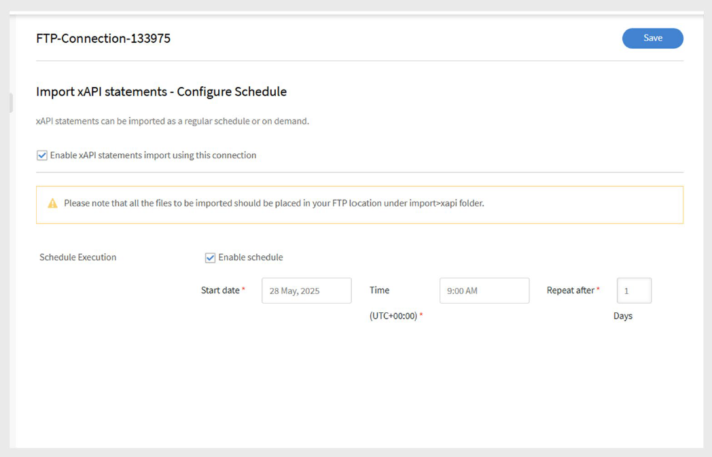
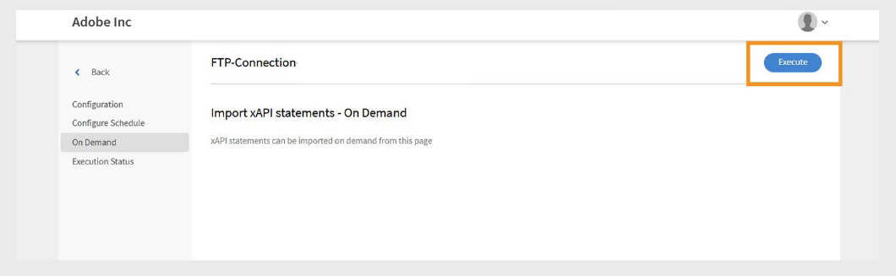

# Adobe Learning Manager의 FTP 커넥터

## 소개

FTP(File Transfer Protocol)는 인터넷 또는 로컬 네트워크를 통해 클라이언트와 서버 간에 파일을 전송하는 데 사용되는 표준 네트워크 프로토콜입니다. 이 기능을 사용하면 사용자가 원격 서버에서 파일을 업로드, 다운로드 및 관리할 수 있습니다. 보안 파일 전송에는 SFTP(SSH File Transfer Protocol) 및 FTPS(FTP Secure)와 같은 변형이 일반적으로 사용됩니다. FTP는 Adobe Learning Manager과 외부 플랫폼 간의 사용자 또는 교육 데이터 동기화와 같이 시스템 간의 데이터 교환을 자동화하기 위해 기업 환경에서 널리 채택되고 있습니다.

이 문서에서는 통합 책임자를 위한 Adobe Learning Manager의 FTP 커넥터 설정 및 사용에 대한 단계별 지침을 제공합니다. FTP 커넥터는 보안 파일 전송 프로토콜을 사용하여 Learning Manager와 외부 시스템 사이에서 자동화된 데이터 교환을 가능하게 합니다.

FTP 연결을 구성하고, 데이터 필드를 매핑하고, 자동화된 사용자 가져오기 또는 내보내기를 예약하고, 동기화 작업을 모니터링하는 방법에 대해 알아봅니다. 이 안내서는 외부 학습 플랫폼 또는 HR 시스템과의 원활한 안전한 통합을 지원합니다. 내부 사용자 및 xAPI 명령문을 가져오고, 사용자 스킬, 학습자 성적 증명서 및 xAPI 데이터를 내보낼 수 있습니다.

통합 책임자는 사용자, 사용자 데이터 또는 학습 콘텐츠를 마이그레이션하기 위한 CSV 파일을 생성하고 Adobe Learning Manager FTP 계정의 지정된 폴더에 업로드해야 합니다. 그런 다음 Adobe Learning Manager은 정의된 일정에 따라 데이터를 읽고, 병합하고 가져옵니다.

필요에 따라 또는 조직의 필요에 맞는 일정을 설정하여 이러한 작업을 수행합니다.

## FTP 통합의 이점

- 데이터 관리에 수작업으로 인한 수고와 수작업 오류 감소
- 여러 외부 소스의 데이터를 동시에 통합합니다.
- 온디맨드 및 예약된 데이터 작업을 모두 지원합니다.
- 서로 다른 시스템 형식 간의 자세한 필드 매핑을 사용할 수 있습니다.

## 사전 요구 사항

FTP 커넥터를 구성하기 전에 환경이 다음 요구 사항을 충족하는지 확인하십시오.

- FTP 커넥터 권한과 통합 관리자 역할.
- 파일 전송을 위한 적절한 대역폭이 있는 안정적인 인터넷 연결.
- 필요한 포트에서 FTP 트래픽을 허용하는 방화벽 구성입니다.
- 보안 요구 사항에 따라 필요한 포트 액세스

### 권한 및 액세스

다음과 같은 사항이 있는지 확인하십시오.

- SSH 키 생성 및 관리 액세스(SSH 인증을 사용하는 경우).
- 지정된 FTP 폴더에서 CSV 파일을 만들고 업데이트할 수 있는 권한입니다.

## 주요 기능

### FTP 커넥터를 사용하여 데이터 가져오기 및 내보내기

Adobe Learning Manager의 FTP 커넥터는 외부 시스템과 Adobe Learning Manager 계정 간의 데이터 교환을 간소화합니다. 예약 및 주문형 가져오기 또는 내보내기 작업을 지원하여 수작업을 줄이고 정확한 최신 정보를 보장합니다.

이 방법은 여러 외부 시스템과의 통합을 지원합니다. 서로 다른 시스템에서 별도의 CSV 파일을 생성하는 경우 Adobe Learning Manager에서 데이터를 병합하고 단일 일괄 처리로 가져옵니다.

### Adobe Learning Manager으로 데이터 가져오기

_사용자 데이터 가져오기_

구조화된 CSV 파일을 지정된 FTP 폴더에 업로드하여 내부 사용자 데이터를 가져옵니다. Adobe Learning Manager은 사용자 정보를 최신 상태로 유지하기 위해 구성된 일정에 따라 이러한 파일을 읽고 처리합니다.

_다중 소스 통합_

여러 개의 외부 시스템을 사용하는 경우 각 시스템에서 고유한 CSV 파일을 생성할 수 있습니다. Adobe Learning Manager에서 파일을 병합하고 데이터를 단일 일괄 처리하여 다른 소스에서 사용자 레코드를 보다 쉽게 관리할 수 있습니다.

_xAPI 가져오기_

또한 커넥터는 xAPI(Experience API) 명령문을 지원합니다. 타사 학습 시스템에서 가져온 다음, 여러 플랫폼에서 학습 활동을 추적하고 보고할 수 있습니다.

### Adobe Learning Manager에서 데이터 내보내기

_학습자 데이터 내보내기_

스킬 진행률, 강의 완료 및 성과 척도와 같은 사용자 데이터를 지정된 FTP 위치로 내보냅니다. 이 데이터를 외부 보고 또는 분석에 사용합니다.

_학습자 성적 증명서_

강의 완료, 인증 및 학습 경로가 포함된 세부 성적 증명서를 생성하고 내보내 규정 준수 및 자격 증명 확인을 지원합니다.

### 속성 매핑

CSV 파일 열을 Adobe Learning Manager 사용자 속성에 매핑합니다. 필요에 따라 매핑 구성을 재사용하고 업데이트할 수 있으므로 데이터 요구 사항의 변경 사항을 쉽게 적용할 수 있습니다.

### 스케줄링 및 자동화

가져오기 및 내보내기 작업을 매일, 매주 또는 사용자 정의 간격과 같은 일정한 간격으로 실행하도록 예약합니다. 이렇게 하면 수작업 없이 일관성 있는 데이터 업데이트가 가능합니다.

## FTP 커넥터 구성

Adobe Learning Manager과 외부 시스템 간에 보안 데이터 동기화를 설정하도록 FTP 커넥터를 구성합니다.

FTP 커넥터를 구성하려면:

1. 통합 책임자로 로그인합니다.
2. **Adobe Learning Manager FTP**&#x200B;를 선택한 다음 **시작하기**&#x200B;를 선택합니다.

   
   _시작 단추가 표시된 Adobe Learning Manager FTP 커넥터 인터페이스_

3. FTP 커넥터 설정 마법사를 계속하려면 **다음**&#x200B;을 선택하십시오.

   
   _구성 페이지에 FTP 커넥터 설정을 진행하기 위한 다음 단추가 표시됩니다_

### 인증 구성

Adobe Learning Manager은 세 가지 인증 방법을 지원하며, 각 방법에는 서로 다른 보안 수준과 복잡성 요구 사항이 있습니다.

#### 기본 인증

이 방법에서는 FTP 액세스에 대해 기존 사용자 이름 및 암호 자격 증명을 사용합니다. 구현이 간단하지만 SSH 기반 대안보다 보안성이 낮다.

1. **암호를 사용하여 기본 인증 만들기**&#x200B;를 선택합니다.
2. 제공된 필드에 FTP 사용자 이름과 암호를 입력합니다. 계속하기 전에 자격 증명을 올바르게 입력했는지 확인하십시오.

   
   _사용자 이름 및 암호 필드가 있는 FTP 인증 양식으로, 기본 인증 옵션이 선택되었음을 표시합니다._

#### 기존 SSH 키 인증

보안 인증을 위해 SSH 키 쌍을 이미 설정한 경우 이 방법을 사용하십시오.

1. **기존 SSH 키를 사용하여 인증 만들기**&#x200B;를 선택합니다.
2. 제공된 텍스트 필드에 공개 키 내용을 복사하여 붙여 넣습니다. 공개 키 형식이 올바른지 확인합니다(일반적으로 ssh-rsa 또는 ssh-ed로 시작25519).

   
   _공개 키 입력을 위한 텍스트 필드가 있는 SSH 키 인증 인터페이스_

#### 새 SSH 키 생성

이 FTP 연결에 대해 새 SSH 키 쌍을 만들려면 이 옵션을 사용합니다.

1. **새 SSH 키를 생성하여 인증 만들기**&#x200B;를 선택합니다.
2. **SSH 키 생성**&#x200B;을 선택하여 새 키 쌍을 만듭니다. 생성된 개인 키를 안전하게 다운로드하고 저장합니다. 공개 키는 FTP 연결에 대해 자동으로 구성됩니다.

   
   _SSH 키 생성 버튼 및 기타 구성 옵션이 있는 SSH 키 생성 화면_

## FileZilla를 사용하여 FTP에 연결

FileZilla는 FTP 연결 관리를 위한 선택적 도구입니다. 자동화된 Adobe Learning Manager 프로세스 외부에서 파일을 수동으로 업로드하거나, 디렉터리 구조를 확인하거나, 연결 문제를 해결해야 하는 경우 사용할 수 있습니다.

### FileZilla 설치 및 설정

FileZilla는 파일 전송 작업을 위한 사용자 친화적인 인터페이스를 제공하는 무료 오픈 소스 FTP 클라이언트입니다.

FTP를 FileZilla에 연결하려면:

1. [공식 웹 사이트](https://filezilla-project.org/)에서 FileZilla를 다운로드하고 설치합니다.
2. **FileZilla**&#x200B;을(를) 엽니다.
3. **파일**&#x200B;을 선택한 다음 **사이트 관리자**&#x200B;를 선택합니다.
4. **새 사이트**&#x200B;를 선택합니다.
5. 다음 세부 사항을 입력합니다.
   - **FTP 도메인:** 연결하려는 FTP 서버의 주소(예: ftp.example.com). Adobe Learning Manager의 FTP 커넥터 페이지에서 호스트 도메인을 찾을 수 있습니다.
   - **포트:** 기본 FTP 포트는 21입니다. 그러나 Adobe Learning Manager에서는 보안 연결을 위해 포트 22를 사용합니다.
   - **FTP 사용자 이름:** FTP 서버에 액세스하려면 로그인 이름이 필요합니다.
   - **FTP 암호:** FTP 사용자 이름에 연결된 암호입니다.
6. **연결**&#x200B;을 선택합니다.
7. 연결되면 로컬(왼쪽) 패널과 원격(오른쪽) 패널 간에 끌어다 놓아 파일을 전송할 수 있습니다.

## Adobe Learning Manager에서 FTP 커넥터 사용

### FTP 커넥터를 사용하여 내부 사용자 가져오기

사용자 가져오기 기능을 사용하면 HR 시스템 및 기타 외부 소스에서 Adobe Learning Manager으로 직원 데이터를 자동으로 동기화할 수 있습니다.

### 맵 속성

속성 매핑은 외부 데이터와 Adobe Learning Manager의 지원되는 데이터 구조 간에 연결을 만들어 데이터가 올바른 필드에 저장되도록 합니다. 이 과정은 꼭 필요합니다.

속성을 매핑하려면 다음을 수행합니다.

1. **FTP 커넥터** 페이지에서 **내부 사용자**&#x200B;를 선택합니다.
2. **열 매핑**&#x200B;을 선택합니다.
3. **특성 매핑** 페이지에서 다음을 수행합니다.
   - **왼쪽**&#x200B;에는 Adobe Learning Manager의 필수 필드가 표시됩니다.
   - **오른쪽**&#x200B;은 CSV 열 이름을 표시합니다. 처음에는 이 쪽에 빈 드롭다운이 포함되어 있습니다.
   - 샘플 CSV 파일을 업로드하려면 **CSV 선택**&#x200B;을 선택합니다. 그러면 오른쪽 드롭다운이 CSV의 열 이름으로 채워집니다. [이 문서](https://experienceleague.adobe.com/en/docs/learning-manager/using/integration/migration-manual#csv)를 참조하십시오.
   - 각 Adobe Learning Manager 필드를 해당 CSV 열로 매핑합니다.

   
   _왼쪽의 Adobe Learning Manager 필드와 오른쪽의 CSV 열 드롭다운을 표시하는 특성 매핑 인터페이스_

4. **저장**&#x200B;을 선택하여 매핑을 완료합니다.

저장 후 구성된 계정은 관리자 앱에서 **데이터 원본**(으)로 나타납니다. 그러면 관리자는 가져오기를 예약하거나 수동 동기화를 트리거할 수 있습니다.

### xAPI 명령문 가져오기

xAPI 명령문 가져오기를 사용하면 외부 학습 데이터를 Adobe Learning Manager으로 가져와 자세한 학습 활동 추적이 가능합니다.

_소스 구성_

xAPI 소스 구성은 외부 학습 시스템과 Adobe Learning Manager의 활동 추적 간의 연결을 설정합니다.

소스를 구성하려면 다음을 수행합니다.

1. Xapi 구성 섹션으로 이동합니다.
2. 구성 목록에서 **새 구성 추가**&#x200B;를 선택합니다.

   
   _새 구성 추가 단추 및 기존 구성 목록이 있는 구성 관리 페이지_

3. **이름** 및 **원본 파일 이름** 입력:
   - **이름:** 이 xAPI 원본에 대한 설명 식별자(예: LMS 통합 또는 외부 교육 시스템)입니다.
   - **소스 파일 이름:** FTP 폴더에 업로드될 정확한 파일 이름입니다(파일 확장자를 포함하여 정확히 일치해야 함).

   
   _이름 필드 및 원본 파일 이름 필드를 표시하는 구성 양식_

4. **저장**&#x200B;을 선택하여 기본 구성을 만듭니다.

_필터 추가(선택 사항)_

필터를 사용하면 특정 기준에 따라 xAPI 명령문을 선택적으로 가져올 수 있습니다.

소스에 필터를 추가하려면 다음을 수행하십시오.

1. 왼쪽 창에서 **필터**&#x200B;를 선택합니다.
2. **새 필터 추가**&#x200B;를 선택합니다.

   
   _새 필터 추가 단추가 있는 필터 구성 페이지_

3. 다음을 구성합니다.
   - **이름:** 필터 규칙에 대한 설명 이름입니다.
   - **조건:** 비교 연산자(같음, 포함, 보다 큼 등)

   
   _이름 필드 및 조건을 표시하는 필터 만들기 대화 상자_

4. **새 필터 추가**&#x200B;를 선택하여 필터를 더 추가합니다.
5. **작업** 열에서 필요에 따라 **저장** 또는 **삭제**&#x200B;를 선택합니다.
6. 필터를 추가한 후 **저장**&#x200B;을 선택합니다.

_필드 매핑_

필드를 매핑하려면 다음을 수행하십시오.

1. 왼쪽 창에서 **매핑**&#x200B;을 선택합니다.
2. **매핑** 페이지의 왼쪽에는 JSON 필드 경로가 표시되고 오른쪽에는 CSV 열 이름이 표시됩니다.

   
   _가져오기 원본에 대한 매핑 추가_

3. 기본적으로 다음의 필수 필드를 매핑합니다.
   - **actor.mbox:** 학습자(수행 중인 작업자)의 전자 메일 주소를 나타냅니다.
액션)을 클릭합니다. 누가 활동을 했는지 고유하게 식별합니다.
   - **verb.id:** 학습자가 수행하는 동작에 대한 식별자입니다. 예:
완료, 시도 또는 통과 학습자의 행동을 지정합니다.
   - **개체.id:** 학습자가 상호 작용한 학습 개체 또는 활동을 나타냅니다.
강의, 모듈 또는 학습 경로 등
4. **새 매핑 추가**&#x200B;를 선택하여 추가 필드를 매핑합니다.
5. 각 필드에 대해 적절한 **데이터 형식**(문자열, 숫자, 부울, 날짜)을 선택합니다.
6. **저장**&#x200B;을 선택하여 매핑을 완료합니다.

## 가져오기 예약

자동 스케줄링은 수작업 없이 일관된 데이터 동기화를 보장합니다.
현재 학습 활동 기록을 유지 관리합니다.

가져오기를 예약하려면 다음을 수행하십시오.

1. 왼쪽 창에서 **일정 구성**&#x200B;을 선택합니다.

   
   _사용 옵션 및 타이밍 컨트롤을 표시하는 구성 예약 페이지_

2. **이 연결을 사용하여 xAPI 문 가져오기를 사용하도록 설정합니다.**
3. 자동 가져오기를 설정하려면 **예약 사용**&#x200B;을 선택하세요.
4. 다음 매개 변수를 설정합니다.
   - 예약된 가져오기를 시작해야 하는 **시작 날짜:**.
   - **시간:** 가져오기 실행 시간입니다.
   - **다음 이후 반복:** 가져오기를 실행할 빈도(매일, 매주, 사용자 지정 간격)입니다.
5. **저장**&#x200B;을 선택합니다.

## 요청 시 실행(선택 사항)

온디맨드 실행은 정규 스케줄링된 작업 이외의 데이터를 즉시 임포트합니다.

온디맨드 가져오기를 사용하는 경우:

- 스케줄링 전에 새 구성 테스트
- 긴급 또는 시간에 민감한 데이터 업데이트 처리
- 일회성 데이터 마이그레이션 또는 수정 처리 가져오기 문제 해결

xAPI 명령문을 수동으로 가져오려면 다음을 수행합니다.

1. 왼쪽 창에서 **온디맨드**&#x200B;를 선택합니다.
2. **실행**&#x200B;을 선택합니다.

   
   _실행 단추가 있는 온디맨드 실행 페이지_

## 실행 상태 보기

상태 모니터링을 통해 가져오기 작업의 사전 예방적 관리와 문제의 빠른 파악이 가능합니다.

실행 상태를 보려면 다음을 수행합니다.

1. 모든 가져오기 실행 목록을 보려면 **실행 상태**&#x200B;를 선택하세요.
2. 페이지에 표시되는 항목은 다음과 같습니다.

   - 가져오기 작업이 시작된 **시작 날짜:**.
   - **기간:** 처리에 필요한 총 시간입니다.
   - **가져오기 유형:** 가져오기가 예약되었는지 아니면 온디맨드로 예약되었는지 여부.
   - **현재 상태:** 실시간 상태 정보입니다.
      - **진행 중:** 가져오기가 현재 실행 중입니다.
      - **완료됨:** 레코드 수가 포함된 완료 성공
      - **실패:** 진단 정보에 오류가 발생했습니다.

## 가져오기 실패 문제 해결

실행 상태 섹션은 모든 가져오기 작업을 시간 순서대로 포괄적으로 요약하여 제공하므로 관리자가 작업을 모니터링하고 문제를 빠르게 식별할 수 있습니다.

상태 표시기:

- **성공:** 가져오기가 오류 없이 완료되었습니다.
- **경고 서명:** 실행 중 오류 또는 문제를 나타냅니다.
- **진행 중:** 가져오기 작업이 현재 실행 중입니다.
- **보류 중:** 가져오기가 예약되었지만 아직 시작되지 않았습니다.

오류가 발생하면 시스템이 실패한 가져오기 실행 옆에 경고 표시기를 표시합니다. 오류 보고서 링크를 선택하여 자세한 오류 보고서를 다운로드합니다.
