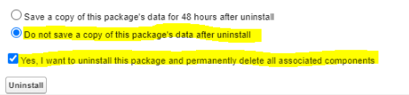

# Salesforce 패키지 설치

## 개요

Learning Manager에서는 Salesforce 앱 패키지를 제공합니다. SFDC에 설치 및 구성되면 영업 사원은 SFDC 포털에서 교육 활동을 수행할 수 있습니다. 이 앱을 설치한 SFDC 사용자는 새로운 교육 과정을 탐구하고, 권장 사항을 확인하며, SFDC 포털에서 바로 이와 같은 컨텐츠를 확인할 수 있습니다. 또한 사용자는 책임자가 SFDC 포털의 앱에서 바로 보낸 발행인란 형식의 공지를 받습니다.

### Learning Manager 앱에서 설정

1. Learning Manager 책임자 계정에 통합 책임자 권한으로 로그인합니다.
1. 다음을 수행합니다. **[!UICONTROL 응용 프로그램]** > **[!UICONTROL 추천 앱]**.
1. 다음을 수행합니다. **[!UICONTROL Salesforce]**.
1. Salesforce 앱 페이지의 설명란에 명시된 응용 프로그램 ID(클라이언트 ID라고도 함)와 클라이언트 비밀번호를 메모합니다.
1. 다음을 수행합니다. **[!UICONTROL 승인]** 승인을 마쳤어야 합니다.
1. 다음을 수행합니다. **[!UICONTROL 개발자 리소스]** > **[!UICONTROL 테스트 및 개발용 액세스 토큰]**.
1. OAuth 코드 얻기 섹션에서 클라이언트 ID 및 범위를 - admin:read,admin:write 로 설정해야 합니다. 다음을 수행합니다. **[!UICONTROL 제출]**.
1. 새로 고침 토큰 얻기 섹션에 클라이언트 ID와 클라이언트 비밀번호를 입력합니다. 다음을 수행합니다. **[!UICONTROL 제출]** 새로 고침 토큰을 확인합니다.

### Salesforce 앱에서 계정 만들기

1. Salesforce 등록 페이지에서 계정을 만듭니다. Salesforce 계정은 반드시 개발자 에디션이나 엔터프라이즈 에디션에서 개설해야 합니다.  [개발자 등록 URL](https://developer.salesforce.com/signup). Learning Manager에 사용할 Salesforce에 등록하려면 이메일 ID를 입력해야 합니다.
1. 확인 이메일을 통해 계정을 확인합니다.
1. 암호를 만들고 Salesforce에 로그인합니다.
1. 로그인 후 Salesforce URL(예: site.lightning.force.com)을 메모합니다.

### Learning Manager 패키지 설치

패키지를 설치하려면 먼저 Salesforce에서 기존 패키지를 삭제해야 합니다. 제거하기 전에 아래와 같이 설정을 활성화해야 합니다. 이러한 설정을 반드시 적용해야 하며, 그렇지 않으면 패키지를 설치할 수 없습니다.

*Learning Manager 패키지 설치*

>[!NOTE]
>
>Adobe Learning Manager 앱은 Salesforce Lightning 보기에서만 지원됩니다.

1. 실행:  [Learning Manager 패키지 URL](https://nam04.safelinks.protection.outlook.com/?url=https%3A%2F%2Ftest.salesforce.com%2Fpackaging%2FinstallPackage.apexp%3Fp0%3D04t1k0000008YWn&amp;data=04%7C01%7Ckillamse%40adobe.com%7Cf588f553fc694d2edee108d9a5c74711%7Cfa7b1b5a7b34438794aed2c178decee1%7C0%7C0%7C637723097572585825%7CUnknown%7CTWFpbGZsb3d8eyJWIjoiMC4wLjAwMDAiLCJQIjoiV2luMzIiLCJBTiI6Ik1haWwiLCJXVCI6Mn0%3D%7C1000&amp;sdata=mhYKVdwvS4F7WPruy0Kvw%2FsqgWxzTQpaZJyEACu8CNw%3D&amp;reserved=0).
1. (으)로 **로그인** 페이지에서 **[!UICONTROL 사용자 정의 도메인 사용]**.

1. 패키지 URL을 입력하고 **[!UICONTROL 계속]**. 설치 페이지에는 관리자 전용 설치 옵션이 선택되어 있어야 합니다. 이 옵션을 변경하지 마십시오.
1. 다음을 수행합니다. **Ins키 커**. 패키지가 설치되면 **[!UICONTROL 완료]**. &#39;설치된 패키지&#39; 페이지로 이동하면 설치된 패키지 Adobe Learning Manager를 확인할 수 있습니다.

1. &#39;설정&#39; 옆에 있는 &#39;앱 시작 관리자&#39;로 이동하여 &#39;Adobe Learning Manager&#39;를 검색합니다.
1. 앱을 구성하려면 **[!UICONTROL 구성]**.
1. 다음을 수행합니다. **[!UICONTROL 새로운 기능]** 그리고 다음 세부 사항을 추가합니다.

   * **구성:** 원하는 이름을 입력합니다.
   * **클라이언트 ID**: 첫 번째 섹션에서 확보한 값을 입력합니다.
   * **클라이언트 암호:** 첫 번째 섹션에서 확보한 값을 입력합니다.
   * **RefreshToken:** 첫 번째 섹션에서 확보한 값을 입력합니다.
   * **LearningManager 기본 URL:** Learning Manager가 호스팅되는 사이트의 URL입니다.
   * **리디렉션 사용 안 함:** Learning Manager에서 학습자 홈페이지로의 리디렉션을 비활성화합니다.

>[!NOTE]
>
>단일 구성만 만들 수 있습니다. 다른 구성을 추가하려고 하면 오류 메시지가 표시됩니다. 구성은 Salesforce 계정을 학습자 계정과 매핑합니다.

### 원격 사이트 설정 추가

1. 페이지의 오른쪽 상단에서 **[!UICONTROL 설정]**.
1. 위치 **빠른 찾기**&#x200B;원격 사이트 설정 을 검색합니다.
1. 다음을 수행합니다. **[!UICONTROL 새 원격 사이트]**.
1. 세부 정보를 입력합니다.

   1. **원격 사이트 이름:** 원하는 이름을 입력합니다.
   1. **원격 사이트 URL:** Learning Manager가 호스팅되는 사이트의 URL입니다.

1. Learning Manager를 실행합니다.

### Learning Manager 앱 알림 활성화

1. 오른쪽 상단에서 **설정**.
1. 사용자 정의 알림을 검색합니다.
1. 다음을 수행합니다. **[!UICONTROL 새로운 기능]**.
1. 다음 세부 사항을 입력합니다.

   1. **사용자 정의 알림 이름:** LearningManager 알림
   1. **API 이름:** LearningManager 알림

1. 둘 다 선택 **데스크톱** 및 **모바일** 를 지원되는 채널로 보냅니다.

1. 다음을 수행합니다. **[!UICONTROL 저장]**.
1. 모바일 장치용 푸시 알림을 활성화하려면 다음 단계를 따르십시오.

   1. 휴대폰에 Salesforce 모바일 앱을 설치합니다.
   1. 자격 증명을 사용하여 앱에 로그인합니다.
   1. 다음으로 이동: **설정** > **알림 전달 설정**.
   1. iOS 및 Android용 Salesforce를 추가합니다.

### Salesforce에서 Learning Manager 제거

1. Salesforce 앱에서 &#39;설치된 패키지&#39;로 이동합니다.
1. 다음을 수행합니다. **[!UICONTROL 제거]**.

## Salesforce 사용자용 Learning Manager 구성

Learning Manager 앱은 Salesforce 계정에 있는 사용자도 사용할 수 있습니다. Salesforce 관리자는 프로필을 기반으로 사용자를 추가할 수 있습니다. Salesforce 프로필은 Learning Manager의 프로필과 유사합니다. 예를 들어, 책임자, 통합 책임자, 강사 등입니다. Salesforce 책임자는 또한 사용자 정의 프로필을 만들 수 있습니다.

### 프로필

Salesforce 관리자는 프로필을 사용자에게 할당하거나 사용자 정의 프로필을 만들 수 있습니다.

>[!NOTE]
>
>사용자는 Salesforce와 Learning Manager 모두에 있어야 합니다.

*학습자에게 프로필 할당*

학습자를 추가할 때 해당 학습자에게 특정 프로필을 할당해야 합니다 그런 다음 해당 프로필로 이동하여 필요한 액세스 권한을 부여합니다.

학습자가 Learning Manager 앱을 보려면 모든 학습자의 앱을 활성화해야 합니다.

다음 단계는 Learning Manager 앱에 액세스 권한을 제공하는 것입니다.

*Learning Manager 앱에 액세스할 수 있는 권한 추가*

패키지를 설치하면 새 권한 세트가 만들어집니다. **Adobe Learning Manager 사용자**. 권한 집합으로 이동하여 사용자를 추가합니다.

사용자를 선택하고 그에 따라 권한을 할당합니다. 학습자는 이제 Learning Manager 앱에 액세스할 수 있습니다.

이제 사용자의 표준 프로필 같은 프로필을 선택하고 프로필을 클릭합니다. 다음을 수행합니다. **[!UICONTROL 편집]** 및 **사용자 정의 앱 설정** 섹션, 확인란을 활성화합니다 **Adobe Learning Manager**. 이렇게 하면 사용자가 앱에 액세스할 수 있습니다.

(으)로 **사용자 정의 탭 설정** 섹션, **학습자 홈** 드롭다운 목록에서 다음 옵션을 선택합니다. **[!UICONTROL 기본값 설정]**.

모든 프로필에서 앱을 볼 수 있도록 해야 합니다.

다음을 수행합니다. **[!UICONTROL 저장]** 그러면 모든 프로필에 속한 사용자가 Learning Manager 앱에 액세스합니다.
