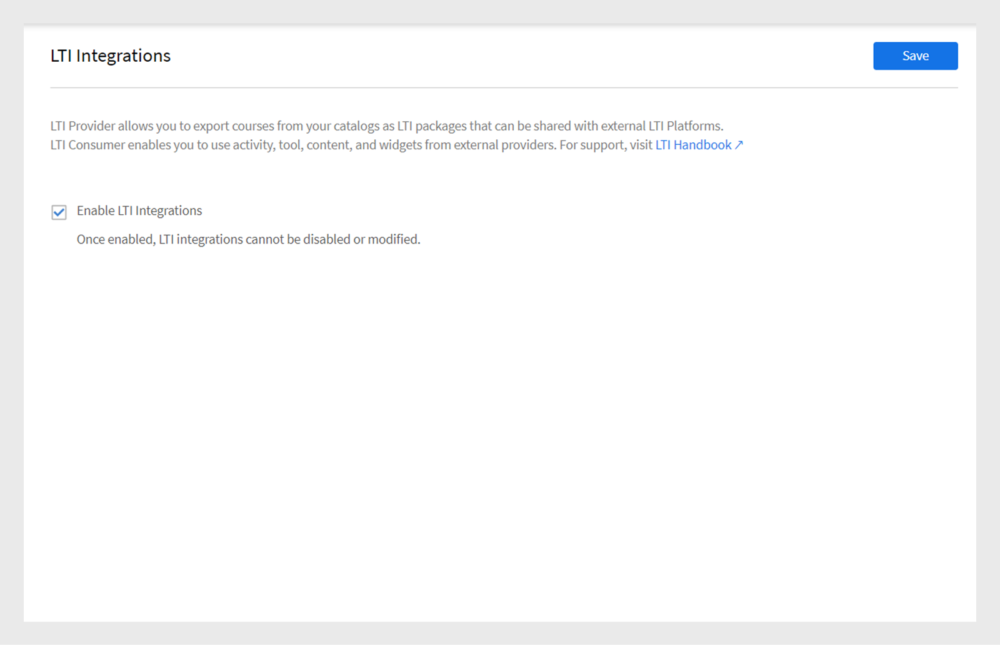

# LTI 통합

## LTI란 무엇입니까?

LTI(Learning Tools Interoperability)는 교육 환경 내에서 다양한 학습 애플리케이션을 통합하기 위한 IMS 표준입니다. 사용자는 로그인하거나 다른 LMS로 이동하지 않고도 LMS 내에서 직접 외부 콘텐츠 공급자의 외부 학습 콘텐츠에 액세스할 수 있습니다.

## Adobe Learning Manager과 LTI 통합

이제 Adobe Learning Manager에서 LTI 버전 1.3을 지원하여 도구 공급자 및 도구 소비자 역할을 모두 수행할 수 있습니다. 이 기능은 Adobe Learning Manager과 다른 LMS(교육 관리 시스템) 간의 상호 운용성을 향상시킵니다.

**도구 공급자인 LTI**: 도구 공급자인 LTI를 사용하면 외부 시스템을 LMS와 통합할 수 있습니다. Adobe Learning Manager은 LTI 도구 공급자 역할을 하여 다른 LMS 플랫폼이 해당 LMS 내에서 직접 Adobe Learning Manager의 학습 객체에 액세스할 수 있도록 합니다.

**도구 소비자로서의 LTI**: 도구 소비자로서의 LTI를 사용하면 LMS가 학습 도구 상호 운용성(LTI)을 통해 외부 도구를 통합할 수 있습니다. 이러한 시나리오에서, LMS는 외부 도구에 의해 제공되는 서비스의 소비자이다. Adobe Learning Manager은 LTI 도구 소비자 역할을 하여 서드파티 학습 도구를 통합할 수 있게 함으로써 Adobe Learning Manager 학습자가 Adobe Learning Manager 내에서 서드파티 도구의 학습 개체를 수료할 수 있게 합니다.

## ALM에서 LTI 커넥터 설정

Adobe Learning Manager에서 LTI 통합을 활성화하려면 다음 단계를 따르십시오.

1. **[!UICONTROL 통합 관리자]**(으)로 로그인합니다.
2. 홈페이지에서 **[!UICONTROL 응용 프로그램]** > **[!UICONTROL 추천 앱]**&#x200B;을 선택합니다.
3. **[!UICONTROL 응용 프로그램]** 페이지에서 **[!UICONTROL LTI 통합]**&#x200B;을 선택합니다.
4. **[!UICONTROL LTI 통합 사용]** 옵션을 선택하고 **[!UICONTROL 저장]**&#x200B;을 선택합니다.

_LTI 통합 사용_

>[!NOTE]
>
>LTI 통합 옵션을 활성화한 후에는 이를 수정하거나 비활성화할 수 없습니다.

이렇게 하면 관리자 계정에 새 LTI 통합 사이드바가 생성됩니다.

_LTI 사이드바_

새 사용자 지정 역할 **[!UICONTROL LTI 통합]**&#x200B;이(가) **[!UICONTROL 사용자 지정 역할]** 섹션의 **[!UICONTROL 계정 권한]** 아래에 추가되었습니다. 관리자는 사용자에게 이 역할을 할당하여 **[!UICONTROL LTI 통합]** 섹션에 액세스할 수 있도록 허용할 수 있습니다. 또한 관리자는 강의를 내보낼 수 있도록 이러한 사용자에게 **[!UICONTROL 카탈로그]** 권한을 부여해야 합니다. 이 설정에서 강의 내보내기를 위한 LTI 및 카탈로그 섹션에 대한 전체 액세스 권한을 제공합니다.

_LTI 통합 사용자 지정 역할_

## LTI 도구 공급자인 Adobe Learning Manager

LTI 공급자인 Adobe Learning Manager에서는 카탈로그의 강의를 외부 LMS 플랫폼과 공유할 수 있는 LTI 패키지로 내보낼 수 있습니다.

### LTI 자격 증명을 만들고 외부 LMS와 공유 - 관리 작업 과정

외부 LMS와 LTI 자격 증명을 공유하려면 다음 단계를 따르십시오.

1. **[!UICONTROL 관리자]**(으)로 로그인합니다.
2. 홈페이지에서 **[!UICONTROL LTI 통합]** > **[!UICONTROL LTI 도구 구성]**&#x200B;을 선택합니다. 이 페이지에서 구성 자격 증명을 확인할 수 있습니다.
3. 관리자는 LTI 사이트 등록을 위해 이러한 자격 증명을 외부 LMS와 공유할 수 있습니다.

   
   _LTI 도구 구성 자격 증명_

   * **[!UICONTROL 토큰 URL]**: LMS가 LTI 도구와의 통신을 인증하고 승인하기 위해 액세스 토큰을 요청하는 URL입니다.
   * **[!UICONTROL 대상 링크 URL]**: LMS에서 LTI 도구를 시작할 때 사용자가 리디렉션되는 대상 URL입니다.
   * **[!UICONTROL 공개 키 집합 URL]**: 보안 통신을 위해 보안 토큰을 확인하는 데 사용되는 공개 키를 제공하는 URL입니다.
   * **[!UICONTROL 리디렉션 URL]**: LTI 도구에 대한 작업을 완료한 후 사용자가 전송되는 URL로, 일반적으로 LMS로 다시 리디렉션됩니다.

### 외부 LMS 설정

Adobe Learning Manager 관리자가 공유한 자격 증명을 사용하면 외부 LMS 관리자가 Adobe Learning Manager을 등록하고 자격 증명을 생성합니다. 이러한 자격 증명은 Adobe Learning Manager을 도구 공급자로 설정하기 위한 마지막 단계로 Adobe Learning Manager에 추가됩니다. 다음은 외부 LMS에서 생성한 자격 증명입니다.

* **[!UICONTROL 발급자 또는 플랫폼 ID]**: 도구 공급자에게 LTI 시작 요청을 보내는 LMS 또는 플랫폼의 고유 식별자입니다.
* **[!UICONTROL 클라이언트 ID]**: 권한 부여를 위해 LMS에서 LTI 도구에 할당한 고유 식별자입니다.
* **[!UICONTROL 배포 ID]**: 여러 인스턴스를 관리하기 위해 특정 LTI 도구 배포를 LMS에 연결하는 식별자입니다.
* **[!UICONTROL 토큰 URL]**: LMS가 LTI 도구와의 상호 작용을 인증하고 승인하기 위해 액세스 토큰을 요청하는 끝점입니다.
* **[!UICONTROL 인증 URL]**: LMS가 LTI 연결을 인증하고 시작하기 위해 사용자를 보내는 URL입니다.
* **[!UICONTROL 공개 키 URL]**: LTI 도구에서 보안 토큰을 확인하고 보안 통신을 보장하기 위해 사용하는 공개 키를 제공하는 URL입니다.

### 도구 공급자로 Adobe Learning Manager 추가 - 관리 워크플로우

Adobe Learning Manager을 도구 공급자로 추가하려면 다음 단계를 따르십시오.

1. **[!UICONTROL 관리자]**(으)로 로그인합니다.
2. 홈페이지에서 **[!UICONTROL LTI 통합]** > **[!UICONTROL LTI 플랫폼]**&#x200B;을 선택합니다.
3. **[!UICONTROL 추가]**&#x200B;를 선택하고 외부 LMS에서 공유하는 자격 증명을 입력합니다.

   
   _새 LTI 플랫폼 추가_

4. 이러한 값이 모두 추가되면 **[!UICONTROL 유효성 검사]** 및 **[!UICONTROL 추가]**&#x200B;를 선택합니다.

### LTI 패키지 내보내기 - 관리자 워크플로우

LTI 도구를 사용하면 카탈로그의 교육을 LTI(Learning Tools Interoperability) 표준을 사용하여 외부 LMS(Learning Management Systems) 또는 플랫폼과 공유할 수 있는 다운로드 가능한 학습 콘텐츠 패키지로 내보낼 수 있습니다.

Adobe Learning Manager에서 과정을 내보내려면 다음 단계를 따르십시오.

1. **[!UICONTROL 관리자]**(으)로 로그인합니다.
2. 홈페이지에서 **[!UICONTROL LTI 통합]** > **[!UICONTROL LTI 패키지 내보내기]**&#x200B;를 선택합니다.
3. **[!UICONTROL 새 패키지 내보내기]**&#x200B;를 선택합니다.

   
   _LTI 패키지 내보내기_

4. 목록에서 필요한 카탈로그를 선택합니다. 카탈로그에서 사용 가능한 강의 목록을 볼 수 있습니다.
5. 필수 강의를 선택하고 **[!UICONTROL LTI로 내보내기]**&#x200B;를 선택합니다.
6. 실행 링크를 볼 과정을 선택합니다.
7. **[!UICONTROL 다운로드 링크]** 아이콘을 선택하여 패키지를 다운로드합니다. 패키지는 성공적으로 내보낸 IMSCC 파일을 포함하는 zip 파일입니다.

이 시작 링크 또는 IMSCC 파일을 사용하여 Adobe Learning Manager 과정을 외부 LMS로 내보낼 수 있습니다. 학습자는 LMS에서 Adobe Learning Manager 강의를 수료할 수 있습니다.

>[!NOTE]
>
>책임자가 실행 링크를 만든 후 강의를 편집하거나 모듈을 업데이트하면 링크가 자동으로 업데이트됩니다. 그러나 시작 링크가 생성된 후 관리자가 강의를 중단하는 경우 중단된 강의는 LTI 소비자에서 실행되지 않습니다.

## LTI 소비자로서의 Adobe Learning Manager - 관리 워크플로우

LTI 소비자로서 Adobe Learning Manager을 사용하면 외부 LTI 공급자의 활동, 도구, 콘텐츠 및 위젯을 사용할 수 있습니다.
Adobe Learning Manager을 LTI 소비자로 추가하려면 외부 LTI 공급자의 다음 자격 증명이 필요합니다.

* 가입자 로그인 URL
* 대상 링크 URL
* 리디렉션 URL
* 공개 키 유형

Adobe Learning Manager을 LTI 소비자로 추가하려면 다음 단계를 따르십시오.

1. **[!UICONTROL 관리자]**(으)로 로그인합니다.
2. 홈페이지에서 **[!UICONTROL LTI 통합]** > **[!UICONTROL LTI 도구 등록]**&#x200B;을 선택합니다.
3. **[!UICONTROL 추가]** > **[!UICONTROL 새 LTI 도구]**&#x200B;를 선택합니다.

   >[!NOTE]
   >
   >.csv 파일을 업로드하여 여러 LTI 도구를 가져올 수 있습니다.

4. LTI 공급자의 위의 자격 증명을 입력하십시오.

   
   _새 LTI 도구 추가_

5. 완료되면 **[!UICONTROL 유효성 검사]** 및 **[!UICONTROL 추가]**&#x200B;를 선택합니다.
6. 다음 화면을 볼 수 있습니다.

   
   _등록 자격 증명_

7. 등록을 위해 이러한 자격 증명을 LTI 공급자와 공유합니다. 등록이 완료되면 LTI 공급자로부터 시작 링크 또는 IMSCC 파일을 받아 강의를 가져올 수 있습니다.

### LTI 콘텐츠 만들기 - 작성자 작업 과정

LTI 공급자는 Adobe Learning Manager에 강의를 추가할 수 있는 실행 링크 또는 IMSCC 파일을 제공합니다. 외부 LMS의 강의를 추가하려면 다음 단계를 따르십시오.

1. **[!UICONTROL 작성자]**(으)로 로그인합니다.
2. **[!UICONTROL 콘텐츠 라이브러리]** > **[!UICONTROL 추가]** > **[!UICONTROL LTI 모듈]**&#x200B;을 선택합니다.

   
   _LTI 콘텐츠 추가 - 작성자_

3. **[!UICONTROL 이름]** 및 **[!UICONTROL 설명]**&#x200B;을 입력하십시오.
4. LTI 공급자에서 **[!UICONTROL 시작 링크]** 및 **[!UICONTROL 사용자 지정 매개 변수]**&#x200B;를 입력하십시오.
5. **[!UICONTROL 도구 공급자]** 드롭다운 메뉴에서 [!UICONTROL LTI 공급자]를 선택합니다.
6. **[!UICONTROL 폴더에 추가]** 옵션에서 **[!UICONTROL 공용]**&#x200B;을 검색하고 선택합니다. 그러면 모든 작성자가 강의를 사용할 수 있습니다.
7. **[!UICONTROL 저장]**을 선택합니다.
콘텐츠가 생성되면 강의를 생성할 때 이 콘텐츠를 추가할 수 있습니다.

### LTI 콘텐츠로 강의 생성 - 작성자 워크플로우

LTI 콘텐츠로 강의를 생성하려면 다음 단계를 따르십시오.

1. **[!UICONTROL 작성자]**(으)로 로그인합니다.
2. 홈페이지에서 **[!UICONTROL 과정]** > **[!UICONTROL 추가]**&#x200B;를 선택합니다.
3. 강의의 **[!UICONTROL 이름]** 및 **[!UICONTROL 설명]**&#x200B;을 입력하십시오.
4. **[!UICONTROL 모듈]** 옵션에서 **[!UICONTROL 모듈 추가]** > **[!UICONTROL 자가 진행식 모듈]**&#x200B;을 선택합니다.
5. 만든 **[!UICONTROL LTI 콘텐츠]**&#x200B;를 선택하고 **[!UICONTROL 저장]**&#x200B;을 선택합니다.
6. **[!UICONTROL 스킬]**, **[!UICONTROL 작성자]**, **[!UICONTROL 등록 유형]**&#x200B;과 같은 필수 세부 정보를 입력하십시오.
7. 완료되면 과정을 게시합니다. Adobe Learning Manager 학습자는 외부 LTI 공급자의 LTI 강의를 수강할 수 있습니다.

## LTI 내보내기 실패 시나리오

다음 유형의 강의는 LTI 강의로 내보낼 수 없습니다.

* **활동 모듈이 있는 과정**: 특정 활동 기반 모듈이 포함된 과정
* **다중 전달 유형의 강의**: 다중 전달 유형의 강의에는 자가 진행식 모듈, 가상 또는 강의실 모듈, 활동 모듈 및 혼합 학습이 포함됩니다.
* **필수 구성 요소가 있는 강의**: 사전 완료가 필요한 강의입니다.
* **다중 등록이 포함된 강의**: 다중 등록이 포함된 강의
* **여러 인스턴스가 포함된 강의**: 여러 전송 인스턴스를 제공하는 강의.

| 기본 인스턴스 | 하나 이상의 기본이 아닌 인스턴스 | 기대 | 오류 메시지 |
|---|---|---|---|
| 활성 | 없음 | 내보내기 | 없음 |
| 활성 | 활성 | 내보내기 안 함 | 다중 인스턴스 |
| 활성 | 중단됨 | 내보내기 안 함 | 다중 인스턴스 |
| 활성 | 삭제됨 | 내보내기 | 없음 |
| 중단됨 | 없음 | 내보내기 안 함 | Def 인스턴스 사용 중지 |
| 중단됨 | 활성 | 내보내기 안 함 | Def 인스턴스 사용 중지, 여러 인스턴스 |
| 중단됨 | 중단됨 | 내보내기 안 함 | Def 인스턴스 사용 중지, 여러 인스턴스 |
| 중단됨 | 삭제 | 내보내기 안 함 | Def 인스턴스 사용 중지 |

* **여러 개의 질문과 대답이 있는 강의**: MQA를 사용하는 강의.
* **인스턴스 전환이 활성화된 강의**: 학습자가 인스턴스 간에 전환할 수 있는 강의.
* **유료 과정**: 등록에 대한 결제가 필요한 과정.
* **학습 경로, 인증 또는 학습 계획의 일부**: 학습 경로 또는 계획의 일부
* **자가 등록하지 않은 강의**: 학습자 자가 등록하지 않은 강의로 제한됨.
* **강의실 또는 가상 강의실 강의**: 강의실 또는 가상 강의실 세션이 있는 강의입니다.
* **비필수 모듈이 있는 강의**: 선택적 또는 비필수 모듈이 포함된 강의

_내보내기 상태_

## LTI 제한 사항

다음은 LTI 소비자 및 LTI 공급자 모두에 대한 LTI 제한 사항입니다.

* 학습자의 강의 이용 경험에 영향을 주는 혼합 강의를 내보낼 수 있습니다.
* 강의실, 가상 강의실 또는 활동 모듈을 통해 자가 진행식 강의를 내보낼 수 있으므로 학습자의 강의 경험에 영향을 미칩니다.
* linkedIn 학습 및 Go1 과정과 같은 공유 과정을 내보낼 수 있습니다.
* ALM에서 이전 등록 날짜의 강의를 실행할 수 있으며, 이는 학습자의 강의 액세스 및 경험에 영향을 줍니다.
* 학습자가 iOS ALM 모바일 앱에서 LTI 강의를 수료할 수 없으며, 이는 강의 수강 경험에 영향을 미칩니다.
* 학습자는 서드파티 플랫폼에서 제공하는 ALM 모바일 앱에서 LTI 강의를 오프라인으로 다운로드하고 액세스할 수 없습니다.
* 관리자는 활성화된 카탈로그만 볼 수 있고 비활성화된 카탈로그는 볼 수 없습니다.
* ALM은 이름(63자) 및 이메일(64자) 길이에 제한이 있으며, 이 제한을 초과하는 외부 LTI 학습자는 액세스할 수 없습니다.
* 강의 완료 동기화 또는 등급 동기화 지연은 타사 LTI 시스템으로 인해 발생합니다.
* Teams 앱 또는 브라우저를 통해 LTI 강의를 이용하는 팀 학습자에 대해서는 강의 동기화 메시지가 표시되지 않아 학습자 알림에 영향을 미칩니다.
* 사용자 데이터 보고서는 LTI를 통해 등록된 사용자의 데이터를 내보낼 수 없습니다.
* 작성자가 도구 소비자에 시작 링크를 추가할 때 도구 공급자 이름이 자동으로 인식되지 않으므로 수동으로 선택해야 합니다.
* CSV를 통한 일괄 도구 업로드는 가져오기 오류를 방지하기 위해 악센트 부호가 있는 문자에 대한 UTF-8 인코딩이 필요합니다.
* LTI 계정 관리자는 LTI 모듈이 포함된 강의, 학습 경로 또는 인증을 공유할 수 없습니다.
* 완료된 ALM 과정에 대해 사용자가 플레이어를 다시 열면 등급을 다시 동기화할 수 없습니다. 학습자의 점수 업데이트에 영향을 주고 수동 다시 트리거가 필요합니다.
* ALM을 사용하면 활성 및 체험판 사용자만 LTI 강의를 수료할 수 있습니다.
* Moodle에서 활성화된 등급 동기화는 ALM 플레이어가 실행되지 않도록 하여 학습자의 강의 액세스 및 경험에 영향을 미칩니다.
* LTI 활성 필드는 단일 값이며 여러 값을 지원하지 않습니다.
* 핵심 콘텐츠가 없는 강의를 마이그레이션하는 동안 내보내기가 실패한 경우 실패 이유를 사용할 수 없습니다.
* 외부 LTI 강의 성적이 학습자 성적 증명서에 나타나지 않으며, L2 퀴즈 페이지에 점수가 표시되지 않아 학습자의 성적 추적에 영향을 미칩니다.

## 모범 사례

내보내기 실패를 방지하고 강의 내보내기를 쉽게 할 수 있도록 LTI를 지원하는 강의로 카탈로그를 생성하는 것이 좋습니다.

성공적인 내보내기 상태를 보여 주는 LTI 카탈로그
