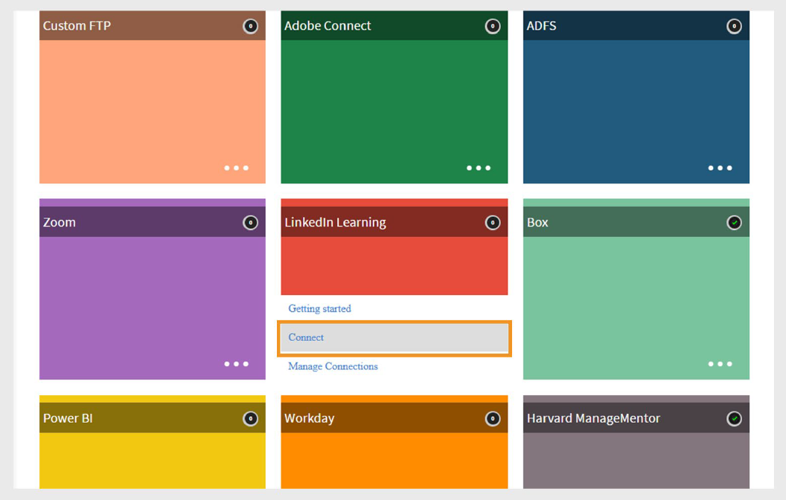

# Adobe Learning Manager의 linkedIn Learning 커넥터

## 도입

linkedIn Learning 커넥터를 사용하면 LinkedIn 학습 콘텐츠를 Adobe Learning Manager과 원활하게 통합할 수 있습니다. 이 커넥터를 통해 조직은 자동으로 LinkedIn 학습 과정을 Adobe Learning Manager으로 가져와 학습자가 플랫폼 내에서 직접 LinkedIn 과정을 찾고, 등록하고, 완료할 수 있습니다.

설정 시 LinkedIn 학습 콘텐츠에 대한 학습자 진행률이 Adobe Learning Manager에서 다시 추적되므로 책임자가 완료 여부와 소요 시간을 모니터링할 수 있습니다. 자동 콘텐츠 동기화를 예약하고, 온디맨드 가져오기를 실행하고, 언어, 라이브러리 또는 사용자 정의 태그로 시스템에 가져오는 과정을 필터링할 수 있습니다.

>[!NOTE]
>
>linkedIn Learning에서 과정을 가져오면 Adobe Learning Manager에서는 각 과정에 대한 고유한 LO(학습 개체) ID를 생성합니다. linkedIn 학습 콘텐츠에 소요된 학습 시간은 LinkedIn 플랫폼에서 Adobe Learning Manager에 보고합니다. linkedIn 플랫폼에서 이 데이터를 전송하지 않는 경우 Adobe Learning Manager에서는 데이터를 기록할 수 없으며 소요된 시간은 0으로 표시됩니다.

## linkedIn 학습 포털 설정 구성

linkedIn Learning 포털 설정을 구성하려면:

1. 관리자로 **LinkedIn Learning LMS**&#x200B;에 로그인합니다.
2. 상단 탐색 패널에서 **관리자**&#x200B;를 선택합니다.
3. **설정** 탭을 클릭합니다.
4. 왼쪽 탐색에서 **통합 재생**&#x200B;을 선택한 다음 **통합** 탭을 선택합니다.
5. **LMS 콘텐츠 시작 설정**&#x200B;을 확장합니다.
6. 다음 호스트 이름을 추가합니다.

   - learningmanager.adobe.com
   - learningmanagerlrs.adobe.com
   - cpcontents.adobe.com
7. **AICC 통합 활성화**&#x200B;를 선택합니다.

   
   _AICC 통합 활성화를 선택하여 LinkedIn Learning 커넥터 구성_

## Adobe Learning Manager에서 LinkedIn Learning 연결

linkedIn Learning 커넥터 구성 방법:

1. 통합 관리자로 Adobe Learning Manager에 로그인합니다.
2. **LinkedIn Learning** 타일 위로 마우스를 가져간 후 **연결**&#x200B;을 선택합니다.

   
   _연결을 선택하여 LinkedIn Learning 커넥터 구성_

3. 연결 설정 페이지에서 다음을 수행합니다.
   - **연결 이름**&#x200B;을 입력하십시오.
   - **응용 프로그램 키** 및 **보안 키**&#x200B;를 입력하십시오.

   
   _연결 이름, 응용 프로그램 키 및 비밀 키를 입력하여 LinkedIn Learning 커넥터를 구성하십시오_

   >[!NOTE]
   >
   >기업 책임자는 LinkedIn Learning Admin 포털에서 응용 프로그램을 만들어 이러한 키를 생성할 수 있습니다.

4. **저장**&#x200B;을 선택하여 연결을 추가합니다.

기존 연결을 편집하려면 **LinkedIn Learning** 타일에서 **연결 관리**&#x200B;를 선택합니다.

>[!IMPORTANT]
>
>이 커넥터를 구성하려면 먼저 계정에 대해 **마이그레이션** 기능을 사용하도록 설정해야 합니다.

## 연결 및 동기화 관리

linkedIn Learning 커넥터를 관리하려면:

1. **연결 관리**&#x200B;를 선택하고 연결을 선택합니다.
2. 왼쪽 창에서 **구성**&#x200B;을 선택합니다.
3. **연결 사용**&#x200B;을 선택합니다.

   
   _LinkedIn Learning 커넥터 구성 페이지에서 연결 사용 선택_

4. 자격 증명을 업데이트하려면 **편집**&#x200B;을 선택하십시오. **다시 설정**&#x200B;을 사용하여 편집을 실행 취소합니다.
5. 동기화를 자동화하려면 **예약 사용**&#x200B;을 선택하십시오.
6. 시작 날짜, 시간 및 빈도(예: 3일마다)를 설정합니다.
7. **저장**&#x200B;을 선택합니다.

### 온디맨드 동기화

온디맨드 동기화를 실행하려면

1. 왼쪽 창에서 **온디맨드 실행**&#x200B;을 선택합니다.
2. **시작 날짜**&#x200B;를 입력하십시오.
3. 실행 중 Adobe Learning Manager에 대한 **활성화** 또는 **액세스 비활성화**&#x200B;를 위해 다음 옵션 중 하나를 선택합니다.
   - **실행 중 Adobe Learning Manager에 대한 액세스 사용**: 사용자에 대한 가동 중지 시간이 없습니다.
   - **실행 중 Adobe Learning Manager에 대한 액세스를 사용하지 않도록 설정**: 동기화 중에는 응용 프로그램을 사용할 수 없습니다.

   
   _가져오기를 실행할 온디맨드 실행 선택_

4. **실행**&#x200B;을 선택하여 해당 날짜부터 LinkedIn Learning에서 사용자 피드 및 데이터를 가져옵니다.

모든 동기화 실행을 모니터링하려면 다음을 수행하십시오.

왼쪽 창에서 **실행 상태**&#x200B;를 선택하여 모든 동기화, 해당 기간, 유형(예약됨 또는 온디맨드) 및 현재 상태(진행 중, 완료됨)의 기록을 봅니다.

>[!NOTE]
>
>연결을 삭제하고 다시 만드는 경우 이전 실행이 유지되고 **실행 상태**&#x200B;에 표시됩니다. 가장 최근의 동기화만 다시 실행할 수 있습니다.

## LinkedIn 학습 콘텐츠 필터링

커넥터를 설정할 때 가져올 LinkedIn 학습 과정을 필터링할 수 있습니다.

필터를 설정하려면 다음을 수행하십시오.

1. 왼쪽 창에서 **필터**&#x200B;를 선택합니다.
2. **다음을 사용하여 교육 필터링**&#x200B;에서 필수 옵션을 선택하십시오.
   - **필터 없음** - 모든 과정을 가져옵니다.
   - **언어** - 특정 언어별로 강의를 필터링합니다.
   - **라이브러리** - LinkedIn Learning 라이브러리로 과정을 필터링합니다.
3. **언어**&#x200B;로 필터링하는 경우 원하는 언어를 선택하십시오. 예를 들어 **영어** 및 **스페인어**&#x200B;입니다.
4. **교육 가져오기**&#x200B;에서 강의를 가져올 위치를 선택합니다.
5. 가져온 강의 구성 방법을 선택합니다.
6. **다음을 기준으로 교육 분리** 옵션에 대해 아래 옵션 중 하나를 선택하십시오.

   - **언어** - 언어별 그룹화입니다.
   - **라이브러리** - 라이브러리별 그룹화.
7. **태그 가져오기**&#x200B;에서 가져온 강의에 적용할 태그 유형을 선택합니다.

   - **언어**
   - **라이브러리**
   - **제목**
   - **주제**
   - **사용자 지정 태그**
8. **사용자 지정 태그** 필드에 할당할 사용자 지정 태그를 입력합니다. 여러 태그를 쉼표로 구분합니다.

   
   _LinkedIn Learning 커넥터에서 데이터를 가져올 필터 옵션 선택_

9. 학습자가 이 강의를 등록 취소할 수 있도록 하려면 **사용자가 등록 취소할 수 있음**&#x200B;을 선택하십시오.
10. **저장**&#x200B;을 선택하여 필터를 적용하고 설정을 가져옵니다.
