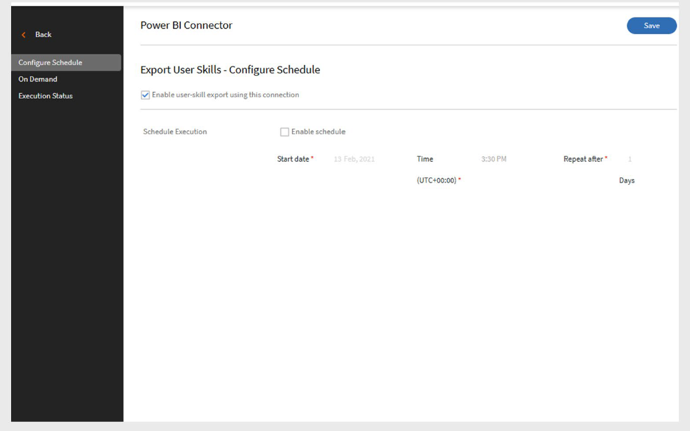

# Adobe Learning Manager의 Power BI 커넥터

## 소개

Power BI 커넥터를 통해 Adobe Learning Manager과 Microsoft Power BI(상업용 라이선스)를 통합하고 학습 데이터를 분석, 시각화 및 공유할 수 있습니다.

이러한 통합을 통해 통합 책임자는 학습자 성적 증명서, 사용자 스킬, xAPI 활동 보고서와 같은 라이브 데이터 세트를 선택한 Power BI 작업 영역으로 직접 자동으로 내보낼 수 있습니다.

연결되면 Power BI의 모든 기능을 사용하여 사용자 지정 대시보드 및 보고서를 만들 수 있습니다. 이를 통해 조직은 학습자 진행 상황, 스킬 성취, 교육 효과에 대한 깊은 통찰력을 얻고 실시간 학습 데이터를 기반으로 정보에 입각한 결정을 내릴 수 있습니다.

>[!NOTE]
>
>Adobe Learning Manager은 Microsoft Power BI의 상업용 버전과의 통합만 지원합니다. Government Cloud 버전과의 통합은 지원되지 않습니다.

## 사전 요구 사항

- **상업용 라이선스**&#x200B;가 있는 Microsoft Power BI만 지원됩니다.
- Power BI 앱 및 작업 영역을 만들 수 있는 권한이 있는지 확인하십시오.
- **테넌트 이름**, **앱 클라이언트 ID**, **앱 클라이언트 암호** 및 **작업 영역 ID**(선택 사항)을 얻습니다.

## Power BI 커넥터 구성

ALM을 Power BI과 연결하려면:

1. 통합 관리자로 Adobe Learning Manager에 로그인합니다.
2. **Power BI** 커넥터 타일 위로 마우스를 가져간 후 **연결**&#x200B;을 선택합니다.

   
   _연결을 선택하여 Power BI 커넥터 구성_

3. 다음 세부 사항을 입력합니다.

   - 클라이언트 ID
   - 클라이언트 시크릿
   - 테넌트 이름
   - 작업 영역 ID(선택 사항)

   
   _Power BI 구성에 필요한 세부 정보 입력_

4. **연결**&#x200B;을 선택합니다.

## Power BI 앱 등록

Power BI 앱을 등록하려면 다음을 수행하십시오.

1. [Power BI 앱 등록](https://app.powerbi.com/embedsetup)&#x200B;(으)로 이동합니다.
2. **조직에 대해 포함**&#x200B;을 선택하고 Microsoft 계정에 로그인합니다.
3. 앱 이름을 입력합니다.
4. **앱 유형**&#x200B;에서 **서버측 웹 앱**&#x200B;을 선택합니다.
5. **리디렉션 URL** 섹션에서 **사용자 지정 URL 사용**&#x200B;을 선택하고 [이 URL](https://learningmanager.adobe.com/ctr/app/azure/_callback):(환경에 필요한 경우 도메인 바꾸기)을 입력하십시오.
6. **홈 URL** 필드에 [이 URL](https://learningmanager.adobe.com/)을(를) 입력합니다.
7. **권한** 섹션에서 **모든 데이터 집합 읽기** 및 **모든 데이터 집합 읽기 및 쓰기**&#x200B;를 선택합니다.
8. **테넌트 이름**&#x200B;을(를) 가져오려면 Power BI 관리자에게 문의하십시오.
9. 작업 영역 ID가 없는 경우 Power BI에서 작업 영역을 만들고(Power BI Pro 필요) URL에서 ID를 복사합니다.
10. **앱 등록**&#x200B;을 선택하고 나중에 사용할 수 있도록 **클라이언트 ID** 및 **클라이언트 암호**&#x200B;를 저장하세요.

>[!NOTE]
>
>나중에 연결을 다시 인증해야 하는 경우 새 Power BI 앱을 만들고 환경에 대한 올바른 리디렉션 URL을 사용하십시오.

## 보고서를 Power BI으로 내보내기

연결을 구성한 후 다음 보고서를 내보낼 수 있습니다.

- **학습자 성적 증명서**
- **사용자 스킬**
- **xAPI 활동 보고서**
- **통합 보고서**(여러 보고서의 조합)

### 학습자 성적 증명서

#### 내보내기 예약

1. 왼쪽 패널에서 **학습자 성적 증명서**&#x200B;를 선택합니다.
2. 내보내기 페이지에서 **예약 사용**&#x200B;을 선택합니다.
3. **시작 날짜** 및 **시간**&#x200B;을 선택하세요.
4. 내보내기를 반복해야 하는 빈도(매일, 매주 등)에 대한 **간격**&#x200B;을 정의합니다.

   
   _학습자 성적 증명서에 대한 일정 내보내기 사용_

5. **저장**&#x200B;을 선택합니다.

#### 온디맨드 내보내기

- **시작 날짜**&#x200B;를 지정하고 온디맨드 내보내기를 실행하여 보고서를 수동으로 생성할 수 있습니다.
- 보고서에는 지정한 날짜부터 현재까지의 데이터가 포함됩니다.

### 사용자 스킬

#### 내보내기 예약

1. 왼쪽 패널에서 **사용자 스킬**&#x200B;을 선택합니다.
2. 내보내기 페이지에서 **예약 사용**&#x200B;을 선택합니다.
3. **시작 날짜** 및 **시간**&#x200B;을 선택하세요.
4. 내보내기를 반복해야 하는 빈도(매일, 매주 등)에 대한 **간격**&#x200B;을 정의합니다.

   
   _사용자 스킬 보고서 일정 내보내기 사용_

5. **저장**&#x200B;을 선택합니다.

#### 온디맨드 내보내기

- **시작 날짜**&#x200B;를 지정하고 온디맨드 내보내기를 실행하여 보고서를 수동으로 생성할 수 있습니다.
- 보고서에는 지정한 날짜부터 현재까지의 데이터가 포함됩니다.

### xAPI 활동 보고서 관리

**xAPI 문**&#x200B;을 Power BI으로 내보낼 수도 있습니다.

#### xAPI 내보내기 구성

1. **xAPI 활동 보고서 내보내기**&#x200B;를 선택합니다.
2. 왼쪽 창에서 **구성**&#x200B;을 선택합니다.

   - CSV 열과 일치하도록 JSON 경로 필드를 채웁니다.
   - 더 많은 경로를 포함하려면 **추가**&#x200B;를 선택하세요.
   - **편집**&#x200B;을 사용하여 필드를 업데이트합니다.
3. **저장**&#x200B;을 선택합니다.

#### 내보내기 예약

1. **일정 구성**&#x200B;을 선택합니다.
2. **이 연결을 사용하여 xAPI 문 내보내기 사용**&#x200B;을 선택합니다.
3. **시작 날짜**, **시간** 및 **간격**&#x200B;을 설정합니다.
4. **저장**&#x200B;을 선택합니다.

#### 온디맨드 내보내기

1. **온디맨드**&#x200B;를 선택합니다.
2. **시작 날짜**&#x200B;를 지정하십시오.
3. **실행**&#x200B;을 선택합니다.

>[!NOTE]
>
>LRS(학습 기록 저장소)의 일부 xAPI 문에 구성된 JSON 경로가 없는 경우 해당 값은 Power BI에 N/A로 표시됩니다.

#### 실행 상태 보기

- 시작 시간, 기간 및 상태를 포함하여 내보내기 기록을 보려면 **실행 상태**&#x200B;를 사용하세요.
- 경고 아이콘 은 실패한 실행을 나타냅니다. 링크를 클릭하여 오류 보고서를 .CSV 로 다운로드합니다.

### 통합 보고서

**통합 보고서**&#x200B;에서 데이터 결합:

- 학습자 성적 증명서
- 게임화
- 피드백 보고서
- 로그인/액세스
- 사용자 스킬
- 사용자 보고서
- 교육 보고서

이를 통해 Power BI에서 데이터를 병합하여 보다 강력한 대시보드를 만들 수 있습니다.

#### 통합 보고서 구성 만들기

1. **통합 보고서**&#x200B;를 선택한 다음 **구성**&#x200B;을 선택합니다.
2. **데이터 집합 이름** 필드에 고유한 이름을 입력합니다.
3. **데이터 내보내기를 위한 보고서 선택**&#x200B;에서 이 데이터 집합에 포함할 보고서를 하나 이상 선택하십시오.

   - 학습자 성적 증명서
   - 로그인/액세스
   - 교육 보고서
   - 게임화
   - 사용자 스킬
   - 피드백 보고서
   - 사용자 보고서
4. **사용자 그룹 필터 추가** 필드를 사용하여 내보낼 사용자 그룹의 데이터를 선택합니다. 기본적으로 **모든 사용자**&#x200B;가 선택됩니다.
5. **콘텐츠 카탈로그 필터 추가** 필드를 사용하여 콘텐츠 카탈로그별로 보고서를 필터링하십시오.
6. 필터 테이블에는 **사용자 그룹**, **카탈로그** 또는 **시간** 필터를 지원하는 보고서가 표시됩니다.

   
   _통합 보고서에 대한 구성 만들기_

7. 보고서 및 필터를 선택한 후 오른쪽 상단의 **저장**&#x200B;을 선택합니다.

#### 상태별 학습자 성적 증명서 필터링

- **모두:** 날짜 범위의 모든 레코드
- **완료됨:** 학습 활동만 완료됨
- **진행 중:** 진행 중인 활동만
- **시작되지 않음:** 아직 시작되지 않은 레코드를 제외합니다.
- **등록 취소됨:** 등록 취소된 레코드 포함

## Power BI 템플릿 다운로드

Adobe은 빠르게 시작할 수 있도록 준비된 Power BI 템플릿을 제공합니다.

- 템플릿을 다운로드하고, 보고서를 가져오고, 필요에 따라 사용자 정의합니다.
- 템플릿을 사용하여 처음부터 시작하지 않고도 매력적인 대시보드를 만들 수 있습니다.

## 학습 경로 관련 설정

보고서에 **학습 경로**&#x200B;가 표시되는 방법은 관리자 설정에 따라 다릅니다.

- **기존 연결:**

   - **학습 경로**&#x200B;를 사용하지 않도록 설정한 경우 관련 행 또는 열이 포함되지 않습니다.
   - 활성화된 경우 보고서에는 등록된 학습자에 대한 학습 경로(상위 레벨)가 포함됩니다.

- **새 연결:**

   - 학습 경로를 비활성화하면 열이 표시됩니다.

      - **포함된 경로:** 학습 프로그램 이름.
      - 학습 프로그램의 **포함된 경로 ID:** ID.
      - 학습 경로에 포함된 강의 ID **포함된 강의 ID:**&#x200B;입니다.
   - 활성화되면 **유형** 열은 관련된 학습 경로(상위 수준)를 사용합니다.
   - 새 연결의 경우, 변경 사항은 30일 후에 적용됩니다.

### 데이터는 어디에서 볼 수 있습니까**

내보낸 모든 데이터는 Power BI 계정에 데이터 집합으로 표시됩니다. 이를 사용하여 사용자 정의 대시보드 및 시각화를 빌드할 수 있습니다.
