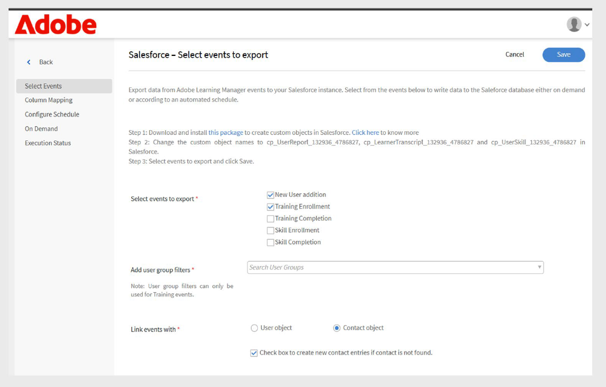

# Adobe Learning Manager용 Salesforce 커넥터

## 소개

Salesforce 커넥터는 Salesforce와 Adobe Learning Manager(ALM) 계정을 통합하여 자동 사용자 가져오기, 데이터 동기화 및 학습 기록 내보내기를 활성화합니다. 이 안내서에서는 커넥터를 구성하고, 사용자 데이터를 관리하고, Salesforce 내에 학습 인사이트를 통합하는 방법에 대해 설명합니다.

Adobe Learning Manager용 Salesforce 커넥터는 사용자를 자동으로 가져오고 사용자 정의 데이터 매핑을 지원하며 학습 기록을 Salesforce로 내보내 원활한 통합을 가능하게 합니다.

이 가이드를 따라 다음 작업에 대해 알아보십시오.

- Salesforce와 Adobe Learning Manager 간 보안 연결을 설정합니다.
- Salesforce에서 자동화된 사용자 가져오기 프로세스를 구성합니다.
- Salesforce 필드를 Adobe Learning Manager 속성에 효과적으로 매핑합니다.
- 포괄적인 보고를 위해 학습 기록을 Salesforce로 다시 내보냅니다.
- 대상 데이터 동기화에 대한 필터링 및 예약을 설정합니다.

## Salesforce 커넥터란 무엇입니까?

Salesforce 커넥터는 Salesforce CRM과 Adobe Learning Manager 간의 원활한 연결을 만들어 주는 강력한 통합 도구입니다. 이 커넥터는 사용자 정보, 연락처 데이터 및 학습 기록을 두 플랫폼 간에 자동으로 동기화하여 수동 데이터 입력을 제거합니다.

## 주요 기능

### 속성 매핑

이를 통해 Salesforce 필드와 Adobe Learning Manager 사용자 속성 간에 유연한 링크를 만들 수 있습니다. 이름, 이메일, 관리자와 같은 표준 필드를 Learning Manager 해당 속성에 매핑할 수 있습니다. 또한 이 커넥터는 두 플랫폼 모두에서 사용자 정의 필드를 지원하며, 데이터 정확성을 유지하기 위해 필요한 필드 유효성 검사를 포함하며, 나중에 가져올 때 재사용할 수 있도록 매핑 구성을 저장할 수 있습니다.

### 자동으로 사용자 가져오기

수동 CSV 파일 관리가 필요 없는 자동화된 가져오기 프로세스를 통해 사용자 온보딩 및 유지 관리를 간소화합니다.

- 중간 파일 형식 없이 Salesforce 사용자 개체에서 직접 가져오기.
- 사용자 프로필 변경의 실시간 동기화.
- 표준 사용자 및 외부 연락처 모두 지원.

### 가져오기 자동 예약

수동 작업 없이 데이터 통화를 유지하는 자동화된 동기화 일정을 구성합니다. 매일, 매주 또는 사용자 정의 간격 예약 옵션 중에서 선택합니다.

- 글로벌 조직의 표준 시간대 구성
- 최대/최대 비중 스케줄링으로 시스템 성능을 최적화합니다.

### 사용자 필터

- 필터링 기준을 특정 사용자 집단에 적용하고 데이터 동기화 효율성을 최적화합니다.
- 대상 교육 프로그램에 대한 역할 기반 필터링입니다.
- 지역별 구축을 위한 지리적 또는 위치 기반 필터링
- Salesforce 기준 및 공식을 사용한 사용자 정의 필드 필터링.

## 사전 요구 사항

Salesforce 커넥터를 구성하기 전에 환경이 다음 요구 사항을 충족하는지 확인하십시오.

- [Salesforce 조직 URL](https://myorg.salesforce.com)
- Salesforce 및 Adobe Learning Manager 모두에 대한 관리자 로그인 자격 증명입니다.
- Salesforce에서 시스템 관리자 또는 이와 동등한 권한.
- 적절한 라이선싱이 포함된 활성 Adobe Learning Manager 계정

## Salesforce 커넥터 구성

통합 책임자는 Adobe Learning Manager의 Salesforce 커넥터를 사용하여 Salesforce와 Adobe Learning Manager 간의 사용자 데이터 및 학습 기록의 동기화를 자동화할 수 있습니다.

Salesforce 커넥터를 만들려면:

1. 통합 책임자로 로그인합니다.
2. **Salesforce**&#x200B;을(를) 선택한 다음 **연결**&#x200B;을 선택합니다.

   
   _연결 단추가 강조 표시된 Salesforce 커넥터를 표시하는 Adobe Learning Manager 커넥터 페이지_

3. Salesforce 조직 URL을 입력하고 **연결**&#x200B;을 선택합니다. 그러면 Salesforce 로그인 페이지로 이동합니다.

   
   _사용자 이름 및 암호 입력 필드를 표시하는 Salesforce 로그인 양식_

4. 사용자 이름 및 암호로 로그인합니다. 2단계 인증 또는 보안 질문에 답변하는 등의 추가 인증 단계를 완료합니다.

   인증에 성공하면, 시스템 간에 설정된 연결을 확인하는 커넥터 개요 페이지가 나타납니다.

   
   _연결 성공 상태를 표시하는 Salesforce 커넥터 개요 페이지_

### 맵 속성

속성 매핑 속성 매핑을 이해하면 Salesforce 데이터 필드와 Adobe Learning Manager 사용자 속성 간에 필수 연결이 만들어져 사용자 정보가 시스템 간에 정확하게 전송되도록 합니다.

#### 매핑 요구 사항

- 모든 필수 Adobe Learning Manager 필드는 해당 Salesforce 필드에 매핑해야 합니다
- 매핑 구성은 재사용 가능하며 여러 가져오기에서 영구적입니다.

속성을 매핑하려면 다음을 수행합니다.

1. Salesforce 커넥터 개요 페이지로 이동합니다.
2. **내부 사용자**&#x200B;를 선택한 다음 **매핑 구성**&#x200B;을 선택하십시오.
3. 다음 중 하나를 선택합니다.

   - **사용자:** 직원 또는 내부 팀원이 사용하는 표준 Salesforce 계정
   - **연락처:** 고객, 파트너 또는 공급업체와 같은 외부 개인.

4. 매핑 페이지에서 Adobe Learning Manager의 활성 필드를 Salesforce 열과 일치시킵니다. **관리자** 필드는 사용자 관리자 전자 메일 필드에 매핑해야 합니다.

   
   _왼쪽에 Adobe Learning Manager 사용자 특성이 표시되고 오른쪽에 Salesforce 필드 드롭다운 선택 항목이 표시되는 필드 매핑 인터페이스_

5. **저장**&#x200B;을 선택하여 매핑을 완료합니다.

## 사용자 및 연락처 가져오기

Salesforce 커넥터를 통해 Adobe Learning Manager에서 Salesforce 계정과 연결하고 구성에 따라 사용자를 자동으로 가져올 수 있습니다.

- **내부 사용자**: Salesforce 사용자 계정이 있는 직원 및 직원 구성원입니다.
- **외부 연락처**: 고객, 파트너, 공급업체 및 기타 외부 관련자.
- **혼합 가져오기**: 단일 동기화 프로세스에서 사용자와 연락처의 조합입니다.
- **필터링된 가져오기**: 특정 조건을 기준으로 동기화를 대상으로 합니다.

Salesforce 커넥터를 통해 Adobe Learning Manager에서 Salesforce 계정과 연결하고 구성에 따라 사용자를 자동으로 가져올 수 있습니다.

커넥터는 표준 Salesforce 사용자 외에 연락처 가져오기를 지원합니다. 이를 통해 클라이언트 또는 파트너와 같은 외부 이해 관계자에게까지 교육 프로그램을 확장할 수 있습니다.

연락처를 가져오려면 다음을 수행하십시오.

1. **커넥터** 페이지에서 **Salesforce**&#x200B;을(를) 선택합니다.
2. 연결 페이지에서 **내부 사용자 가져오기**&#x200B;를 선택합니다.

   
   _내부 사용자 가져오기 옵션이 강조 표시된 Salesforce 커넥터 페이지_

3. **사용자 가져오기** 페이지에서 **연락처**&#x200B;를 선택합니다.
4. **가져오기 전에 연락처 필터링** 옵션에 대해 **예**&#x200B;를 선택합니다. **
5. 다음 옵션을 구성합니다.

   - **연락처 선택 열:** Adobe Learning Manager으로 가져올 필드를 선택합니다.
   - **값 지정:** 선택한 필드를 나타내는 값을 선택합니다.
   - Adobe Learning Manager 필드로 Salesforce 속성 매핑

   
   _필터링 옵션 및 필드 매핑을 보여 주는 가져오기 구성_&#x200B;에 연결

6. **저장**&#x200B;을 선택합니다.
7. **아니요. 모든 연락처 가져오기**, 연락처를 필터링하지 않고 직접 필드를 매핑할 수 있습니다.

## 학습 기록 내보내기

학습 기록 내보내기 기능을 사용하면 Adobe Learning Manager 데이터를 Salesforce와 공유하여 학습 결과와 CRM 데이터를 결합하는 포괄적인 보고 및 분석 기능을 만들 수 있습니다.

### Salesforce의 사용자 정의 개체

Adobe Learning Manager에서 학습 기록을 내보내기 전에 Salesforce에서 사용자 정의 개체를 만듭니다. 사용자 정의 개체를 사용하면 조직 또는 산업 요구와 관련된 데이터를 저장할 수 있습니다. 자세한 내용은 [Salesforce 사용자 지정 개체](https://trailhead.salesforce.com/en/content/learn/modules/data_modeling/objects_intro)를 참조하십시오.

### Adobe Learning Manager 패키지 설치

Adobe은 필요한 사용자 정의 개체를 만드는 사전 제작된 패키지를 제공합니다.

- [패키지 1](https://test.salesforce.com/packaging/installPackage.apexp?p0=04t1k0000008WPJ): 핵심 학습 개체 및 필드
- [패키지 2](https://test.salesforce.com/packaging/installPackage.apexp?p0=04t1k0000008WPT): 확장된 학습 분석 개체
- [패키지 3](https://test.salesforce.com/packaging/installPackage.apexp?p0=04t1k0000008WPi): 추가 보고 및 통합 개체

>[!IMPORTANT]
>
>패키지 URL의 [test.salesforce.com](https://acrobat.adobe.com/home/test.salesforce.com)을(를) 실제 Salesforce 조직 도메인으로 바꿉니다.

### 패키지 설치 프로세스

패키지를 설치하려면 다음을 수행하십시오.

1. 관리자 권한으로 Salesforce에 로그인합니다.
2. 브라우저에서 각 패키지 URL로 이동합니다.
3. 각 패키지에 대한 설치 마법사를 따라 학습 데이터에 액세스할 사용자에게 적절한 권한을 부여합니다.
4. Salesforce에서 사용자 정의 개체 이름을 바꿉니다.
5. 이벤트를 선택하고 **저장**&#x200B;을 클릭합니다.

>[!NOTE]
>
>패키지 설치 후 추가된 모든 활성 필드에 시스템 관리자 액세스 권한이 부여되었는지 확인합니다.

### 레코드 내보내기

레코드를 Salesforce로 내보내려면 다음을 수행하십시오.

1. **Salesforce** 커넥터 페이지에서 **통합 레코드 내보내기**&#x200B;를 선택합니다.
2. 다음에서 이벤트를 선택합니다.

   - 새 사용자 추가
   - 교육 등록
   - 교육 완료
   - 스킬 등록
   - 스킬 완료

3. **옵션을 사용하여**&#x200B;링크 이벤트에서 **연락처 개체**&#x200B;를 선택합니다. 이렇게 하면 Adobe Learning Manager에는 있지만 Salesforce에는 없는 사용자가 Salesforce에서 생성됩니다.

   
   _이벤트 선택 및 연결 옵션을 표시하는 학습 기록 내보내기 구성_

>[!NOTE]
>
>단일 계정 내에서 여러 연결을 생성할 수 있습니다. 각 연결은 Salesforce에서 최대 3개의 사용자 정의 개체를 지원할 수 있습니다. 동일한 Salesforce 계정에 대해 다중 연결을 생성하려면 최대 3개의 패키지를 설치할 수 있습니다. 설치된 패키지 수는 원하는 연결 수와 일치해야 합니다.

## Salesforce 응용 프로그램 설정

Adobe Learning Manager은 Salesforce 앱 패키지를 제공합니다. Salesforce 인스턴스에 설치 및 구성되면 영업 사용자는 Salesforce 포털 내에서 직접 교육에 액세스하고 교육을 완료할 수 있습니다. 이 앱을 통해 사용자는 Salesforce를 종료하지 않고도 새 강의를 찾고, 개인화된 추천 항목을 보고, 콘텐츠를 사용할 수 있습니다.

### Salesforce 응용 프로그램에 액세스

Salesforce 응용 프로그램을 설정하려면 다음을 수행하십시오.

1. 통합 책임자로 로그인합니다.
2. **응용 프로그램**&#x200B;을 선택한 다음 **추천 앱**&#x200B;을 선택합니다.
3. **Salesforce**&#x200B;을(를) 선택합니다.

   
   _Salesforce 앱 타일이 강조 표시된 추천 앱 섹션을 표시하는 Adobe Learning Manager 응용 프로그램 페이지_

4. 설명 텍스트 상자에 표시된 **응용 프로그램 ID** 및 **클라이언트 암호**&#x200B;을 확인하십시오.

   
   _설명 상자에 응용 프로그램 ID 및 클라이언트 암호를 표시하는 Adobe Learning Manager의 Salesforce 응용 프로그램 세부 정보 페이지_

5. **승인**&#x200B;을 선택하여 응용 프로그램을 활성화합니다.

### 액세스 토큰 생성

액세스 토큰을 생성하려면 다음을 수행하십시오.

1. Adobe Learning Manager에서 **개발자 리소스**(으)로 이동합니다.
2. **테스트 및 개발용 액세스 토큰**&#x200B;을 선택합니다.
3. **OAuth 코드 가져오기** 섹션에서 클라이언트 ID(응용 프로그램 ID)를 입력하고 범위를 **관리자:read,관리자:write**(으)로 설정해야 합니다.
4. **제출**&#x200B;을 선택합니다.
5. **새로 고침 토큰 받기** 섹션에서 **클라이언트 ID** 및 **클라이언트 암호**&#x200B;를 입력합니다.
6. **제출**&#x200B;을 선택하고 새로 고침 토큰 및 액세스 토큰을 확인합니다.

>[!IMPORTANT]
>
>생성된 새로 고침 토큰 및 액세스 토큰을 적어 둡니다.

### Salesforce 계정 만들기

Salesforce 계정이 없는 경우 다음 단계에 따라 Adobe Learning Manager 계정과 동일한 이메일 주소를 사용하여 계정을 만드십시오. 개발자 에디션이나 엔터프라이즈 에디션을 사용할 수 있습니다. Adobe Learning Manager 계정과 연결된 동일한 이메일 ID를 사용하여 등록하는 것이 중요합니다.

1. [Salesforce 개발자 등록 페이지](https://developer.salesforce.com/signup)로 이동합니다.
2. Adobe Learning Manager 계정에 사용된 것과 동일한 이메일 주소를 사용하여 필요한 세부 정보를 입력합니다.
3. 받은 편지함을 확인하고 Salesforce에서 보낸 전자 메일을 통해 계정을 확인합니다.
4. 암호를 설정하고 Salesforce에 로그인합니다.
5. 로그인한 후 구성 중에 사용할 Salesforce URL(예: https://yourorg.lightning.force.com)을 메모합니다.

### Adobe Learning Manager 패키지 설치

이 섹션에서는 Salesforce 환경에서의 Adobe Learning Manager 패키지 설치에 대해 설명합니다.

>[!IMPORTANT]
>
>Adobe Learning Manager 앱은 Salesforce Lightning 보기만 지원합니다. 계속하기 전에 Lightning 환경이 활성화되어 있는지 확인하십시오.

#### 패키지 설치

패키지를 설치하려면 다음을 수행하십시오.

1. [Adobe Learning Manager 패키지 URL](https://login.salesforce.com/packaging/installPackage.apexp?p0=04t1k0000008WOQ)을(를) 엽니다.
2. 로그인 페이지에 사용자 이름과 암호를 입력합니다.
3. **설치**&#x200B;를 선택합니다. 설치 페이지에서 관리자 전용 설치 옵션을 선택한 상태로 유지하며 변경하지 않습니다.
4. **완료**&#x200B;를 선택합니다. **설치된 패키지** 페이지로 이동하면 설치된 Adobe Learning Manager 패키지를 확인할 수 있습니다.

Adobe Learning Manager 패키지 설치를 확인할 수 있는 설치된 패키지 페이지로 리디렉션됩니다

#### 응용 프로그램 구성

응용 프로그램을 구성하려면 다음을 수행하십시오.

1. **앱 시작 관리자** 선택(설정 옆의 9도트 격자 아이콘)
2. Adobe Learning Manager을 검색합니다.
3. 앱을 구성하려면 **구성**&#x200B;을 선택하십시오.
4. **새로 만들기**&#x200B;를 선택하고 다음 세부 정보를 추가합니다.

   - **Config:** 원하는 구성 이름을 입력합니다.
   - **ClientID**: 첫 번째 섹션에서 확보한 값을 입력하십시오.
   - **ClientSecret:** 첫 번째 섹션에서 확보한 값을 입력합니다.
   - **RefreshToken:** 첫 번째 섹션에서 확보한 값을 입력하십시오.
   - **LearningManagerBaseURL:** Adobe Learning Manager이 호스팅되는 사이트의 URL입니다.

### 원격 사이트 구성

Salesforce에서 Adobe Learning Manager과 같은 외부 서비스와의 통신을 허용하려면 원격 사이트 설정이 필요합니다.

#### 원격 사이트 설정 추가

원격 사이트 설정을 추가하려면:

1. Salesforce의 오른쪽 상단에서 **설정**&#x200B;을 선택합니다.
2. 페이지의 오른쪽 상단에서 **설정**&#x200B;을 선택합니다.
3. **빠른 찾기**&#x200B;에서 **원격 사이트 설정**&#x200B;을 검색합니다.
4. **새 원격 사이트**&#x200B;를 선택합니다.
5. 다음 세부 정보를 입력합니다.

   - **원격 사이트 이름:** 선택한 이름(예: Adobe Learning Manager)을 입력하십시오.
   - **원격 사이트 URL:** Adobe Learning Manager이 호스팅되는 URL을 입력하십시오.
6. **저장**&#x200B;을 선택합니다.

### 알림 설정

사용자에게 학습 활동 및 업데이트에 대한 알림이 전송되도록 알림을 구성합니다.

#### 사용자 정의 알림 만들기

알림을 활성화하려면 다음을 수행합니다.

1. 오른쪽 상단에서 **설정**&#x200B;을 선택합니다.
2. **사용자 지정 알림**&#x200B;을 검색한 다음 **새로 만들기**&#x200B;를 선택합니다.
3. 다음 세부 사항을 입력합니다.

   - **사용자 지정 알림 이름:** LearningManagerNotification
   - **API 이름:** LearningManagerNotification

4. **데스크탑**&#x200B;과 **모바일**&#x200B;을(를) 모두 지원되는 채널로 선택합니다.
5. **저장**&#x200B;을 선택합니다.

#### 모바일 푸시 알림 활성화(선택 사항)

모바일 디바이스에서 알림을 수신하려는 사용자의 경우:

모바일 장치용 푸시 알림을 활성화하려면 다음 단계를 따르십시오.

1. 휴대폰에 Salesforce 모바일 앱을 설치합니다.
2. 자격 증명을 사용하여 앱에 로그인합니다.
3. **설정**(으)로 이동한 다음 **알림 배달 설정**&#x200B;을 선택합니다.
4. iOS 및 Android용 Salesforce를 추가합니다.

### 사용자 구성 및 권한

이 섹션에서는 Salesforce 내에서 Adobe Learning Manager 앱에 대한 사용자 액세스 및 권한 설정에 대해 설명합니다.

#### 사용자 프로필 이해

Adobe Learning Manager 앱은 Adobe Learning Manager에서의 역할에 해당하는 다양한 사용자 프로필을 지원합니다.

- 책임자
- 통합 책임자
- 강사
- 학습자
- 사용자 정의 프로필(필요한 경우)

#### 사용자 프로필 할당 또는 만들기

기존 프로필을 사용하거나 Adobe Learning Manager 사용자를 위한 맞춤형 프로필을 만들 수 있습니다.

**기존 프로필 사용**

1. **설정**(으)로 이동하고 **사용자**&#x200B;를 선택합니다.
2. **프로필**&#x200B;을 선택합니다.
3. 사용자의 역할에 맞는 프로필 선택
4. 패키지를 설치하는 동안 사용자에게 이 프로필을 할당합니다.

**사용자 지정 프로필 만들기**

1. {0 **설정]으로 이동하여**&#x200B;명의 사용자를 선택합니다. ****
2. **프로필**&#x200B;을 선택합니다.
3. **새 프로필**&#x200B;을 클릭합니다.
4. Adobe Learning Manager 사용자에 맞게 조정된 기존 프로필을 기반으로 사용자 정의 프로필을 만듭니다.

#### 프로필 구성

프로필을 구성하려면 다음을 수행합니다.

1. 패키지를 설치한 후 **구성**&#x200B;을(를) 선택한 다음 새로 만들기 **을(를) 선택합니다.**
2. 다음 세부 사항을 입력합니다.

   - **구성 이름**
   - **클라이언트 ID**
   - **클라이언트 암호**
   - **LearningManagerBaseURL**
   - **리디렉션 사용 안 함**

>[!NOTE]
>
>모든 학습자가 볼 수 있도록 Adobe Learning Manager 앱이 활성화되어 있는지 확인합니다.

#### 사용자 권한 설정

사용자를 선택하고 Adobe Learning Manager 앱에 액세스하는 데 필요한 권한을 할당합니다.

#### 프로필 설정 업데이트

1. 프로필(예: 표준 프로필)을 선택한 다음 **편집**&#x200B;을 선택합니다.
2. **사용자 지정 앱 설정** 섹션에서 **Adobe Learning Manager**&#x200B;에 대한 확인란을 선택하여 앱에 액세스할 수 있도록 설정합니다.
3. **사용자 지정 탭 설정** 섹션에서 **학습자 홈**&#x200B;을 **기본값 설정**&#x200B;으로 설정합니다.
4. **저장**&#x200B;을 선택하여 변경 내용을 적용합니다.

할당된 프로필을 보유한 학습자는 이제 Salesforce에서 Adobe Learning Manager 앱에 액세스할 수 있습니다.

Adobe Learning Manager용 Salesforce 커넥터를 구성했습니다. 이제 사용자는 Salesforce 내에서 학습 콘텐츠에 직접 액세스할 수 있으므로 조직의 교육 프로그램을 도입하고 참여도를 높일 수 있습니다.
