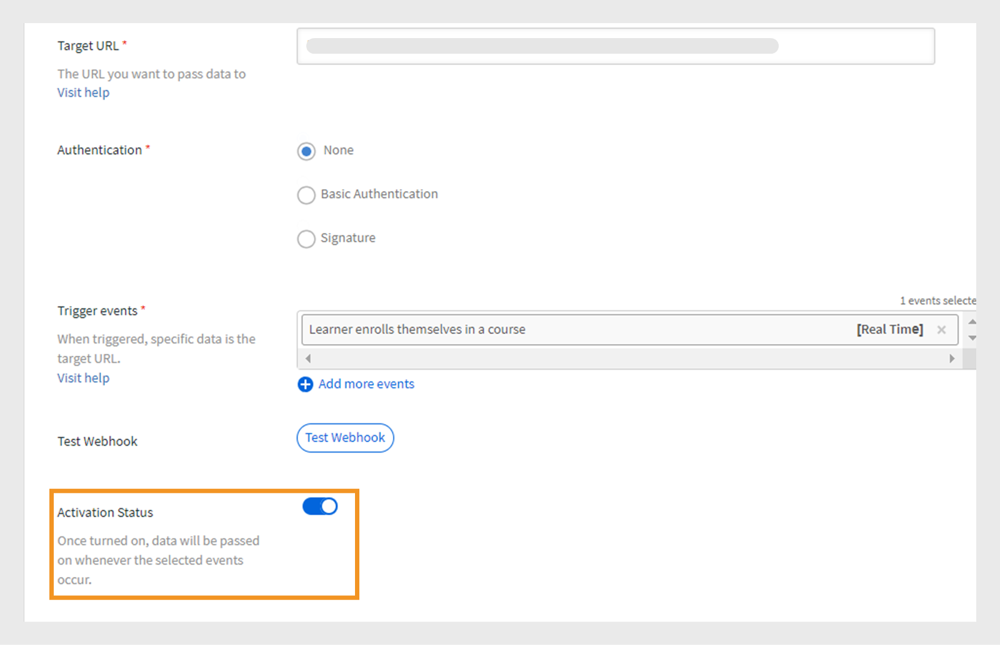

# Webhook

Webhook을 사용하면 특정 이벤트가 발생할 때 한 엔터티가 다른 엔터티로 실시간 데이터나 알림을 자동으로 보낼 수 있습니다. 이를 지속적으로 요청하지 않고도 다른 애플리케이션에 정보를 제공할 수 있게 된다. 예를 들어 사용자가 LMS(교육 관리 시스템) 과정을 완료한 경우 Webhook은 해당 정보를 CRM 또는 보고 도구와 같은 다른 플랫폼으로 자동으로 전송할 수 있습니다. Webhook은 통합을 통해 프로세스를 자동화하고 시스템 간에 수동 업데이트의 필요성을 줄이는 데 주로 사용됩니다. 데이터를 전송할 콜백 URL을 제공하여 Webhook을 설정합니다.

## Webhook 및 API

Webhook과 API는 모두 시스템이 서로 통신할 수 있도록 지원하지만 서로 다른 방식으로 작동합니다. API를 사용하면 사용자가 정보를 요청할 때만 정보가 공유됩니다. 예를 들어 학습자가 강의 진행률 데이터를 요구하는 경우 API에 요청을 보내고 API에서는 해당 정보를 제공합니다. 반면에 Webhook은 이벤트가 발생하면 데이터를 즉시 자동으로 전송합니다. 예를 들어 학습자가 강의를 완료하면 수동 요청 없이 리스너 URL로 데이터가 즉시 전송됩니다.

## 실시간 API란?

실시간 API를 사용하면 이벤트가 발생할 때 애플리케이션이 데이터를 즉시 교환할 수 있습니다. 사용자가 정보를 요청하면 대기하는 기존 API와 달리 실시간 API는 그 순간 데이터를 공유한다. Webhook은 실시간 API로 작동하며 지정된 이벤트가 발생할 때마다 데이터를 즉시 공유하도록 지원합니다. 실시간 API는 수동 요청 없이도 이러한 데이터 전송이 즉시 이루어지도록 하여 시스템을 즉시 업데이트할 수 있습니다.

## Webhook 이벤트

Webhook 이벤트는 데이터를 리스너 URL로 자동으로 전송하는 시스템에서 발생하는 특정 작업입니다. 예를 들어 학습자가 강의에 등록하면 Webhook 이벤트가 트리거되고 등록 세부 정보가 수신자 URL로 전송됩니다.
Webhook 이벤트는 다음 두 가지 범주로 분류됩니다.

* **실시간 이벤트**: 이벤트가 처리되어 실시간으로 대상 URL로 전송됩니다
* **실시간이 아닌 이벤트**: 이벤트는 배치로 처리되며 실시간이 아닌 지정된 시간에 전송됩니다

## 리스너 URL

리스너 URL은 이벤트가 발생할 때 데이터 정보를 수신하는 엔드 포인트 또는 대상입니다. 사용자가 강의에 등록하는 등 특정 이벤트가 발생하면 수동 요청 없이 세부 정보가 자동으로 이 URL로 전송됩니다. 리스너 URL은 이러한 모든 업데이트가 전달되는 주소입니다.
Webhook은 관련 정보를 JSON 형식으로 전송합니다. 다음은 Adobe Learning Manager에서 트리거된 이벤트에 대한 샘플 페이로드입니다.

```
{
  "accountId": 1010,
  "events": [
    {
      "eventId": "d5fb7071-10a9-46b2-9f9e-79dde346c052",
      "eventName": "COURSE_ENROLLMENT_BATCH",
      "timestamp": 1727414643000,
      "eventInfo": "1727414643000-047210-84242-0",
      "data": {
        "userId": 4279332,
        "loId": "course:7374992",
        "loInstanceId": "course:7376092_10250977",
        "loType": "course",
        "enrollmentSource": "ADMIN_ENROLL",
        "dateEnrolled": 1727414643
      }
    }
  ]
}
```

## Webhook 생성 및 관리 - 통합 관리자

Adobe Learning Manager에서 Webhooks 통합을 만들려면 아래 단계를 따르십시오.

1. **[!UICONTROL 통합 관리자]**(으)로 로그인합니다.
2. 홈페이지에서 **[!UICONTROL Webhook]** > **[!UICONTROL Webhook 추가]**&#x200B;를 선택합니다.

   
   _Webhook 추가_

3. Webhook의 **[!UICONTROL 이름]** 및 **[!UICONTROL 설명]**&#x200B;을 입력합니다.
4. 이벤트 데이터를 전달할 **[!UICONTROL 대상 URL]**(으)로 수신기 URL을 입력하십시오.
5. 인증 방법 중 하나를 선택합니다.
Webhooks에서의 인증은 수신기 URL로 전송된 데이터가 신뢰할 수 있는 소스에서 오는지 확인하는 보안 방법입니다.
   * **[!UICONTROL 없음]**: 인증이 필요하지 않습니다.
   * **[!UICONTROL 기본]**: 자격 증명 기반 인증입니다. 사용자 이름과 암호를 입력합니다.
   * **[!UICONTROL 서명]**: 시스템에서 특수 서명을 만들고 Webhook 데이터에 추가합니다. 수신 서버는 이 코드를 확인하여 데이터가 진짜이고 변경되지 않았는지 확인합니다. 서명을 생성하고 인증에 사용합니다. JSON으로 서명을 다운로드합니다.
6. **[!UICONTROL 트리거 이벤트]** 드롭다운에서 Webhook 이벤트를 선택합니다.

   >[!NOTE]
   >
   >Webhook 추가 페이지에서 Webhook 테스트 옵션을 선택하여 Webhook을 테스트할 수도 있습니다.

7. **[!UICONTROL 활성화 상태]** 토글을 선택하여 Webhook을 활성화합니다. 활성화되면 선택한 이벤트가 발생할 때마다 데이터가 전달됩니다.

>[!NOTE]
>
>최대 5개의 Webhook을 만들고 관리할 수 있습니다.

### Webhook 편집 - 통합 관리자

Adobe Learning Manager에서 Webhook을 편집하려면 다음 단계를 따르십시오.

1. **[!UICONTROL 통합 관리자]**(으)로 로그인합니다.
2. 홈페이지에서 **[!UICONTROL Webhooks]**&#x200B;을(를) 선택합니다.
3. 편집할 Webhook을 선택합니다.

   
   _Webhook 편집_
4. **[!UICONTROL 편집]**&#x200B;을 선택하여 Webhook 세부 정보를 수정하고 **[!UICONTROL 저장]**&#x200B;을 선택합니다.

### Webhook 제거 - 통합 관리자

Adobe Learning Manager에서 Webhook을 편집하려면 다음 단계를 따르십시오.

1. **[!UICONTROL 통합 관리자]**(으)로 로그인합니다.
2. 홈페이지에서 **[!UICONTROL Webhooks]**&#x200B;을(를) 선택합니다.
3. 삭제할 Webhook을 선택합니다.
4. Webhook을 제거하려면 **[!UICONTROL 삭제]**&#x200B;를 선택합니다.


_Webhook 제거_

### Webhook 사용 중지 - 통합 관리자

Webhook을 종료하려면 다음 단계를 따르십시오.

1. **[!UICONTROL 통합 관리자]**(으)로 로그인합니다.
2. 홈페이지에서 **[!UICONTROL Webhooks]**&#x200B;을(를) 선택합니다.
3. 편집할 Webhook을 선택합니다.
4. **[!UICONTROL 편집]**&#x200B;을 선택하고 **[!UICONTROL 활성화 상태]**&#x200B;를 비활성화하여 Webhook을 종료합니다.


_Webhook 사용 중지_

## 실시간 이벤트

| S.No | Webhook 이벤트 | 설명 |
|---|---|---|
| 1 | CI_STATS | 강의 인스턴스에 대한 인원 또는 대기자 명단 가용성이 변경되면 트리거됩니다. |
| 2 | COURSE_ENROLLMENT | 학습자가 강의에 등록할 때 트리거됩니다. |
| 3 | COURSE_COMPLETED | 학습자가 강의를 완료했을 때 트리거됩니다. |
| 4 | LEARNING_PATH_ENROLLMENT | 학습자가 학습 경로에 등록하면 트리거됩니다. |
| 5 | LEARNING_PATH_COMPLETE | 학습자가 학습 경로를 완료할 때 트리거됩니다. |
| 6 | CERTIFICATION_ENROLLMENT | 학습자가 인증에 등록하면 트리거됩니다. |
| 7 | CERTIFICATION_COMPLETED | 학습자가 인증을 완료하면 트리거됩니다. |
| 8 | COURSE_UNREGISTRATION | 학습자가 강의에서 등록 취소할 때 트리거됩니다. |
| 9 | LEARNING_PATH_UNREGISTRATION | 학습자가 학습 경로에서 등록 취소하면 트리거됩니다. |
| 10 | CERTIFICATION_UNENROLLMENT | 학습자가 인증에서 등록 취소할 때 트리거됩니다. |
| 11 | 학습 개체_초안 | 초안 상태의 학습 객체를 생성하는 동안 트리거됩니다. |
| 12 | LEARNING_OBJECT_DELETION | 학습 객체를 삭제하는 동안 트리거됩니다. |
| 13 | 학습 개체 수정 | 학습 객체를 수정하는 동안 트리거됩니다. |
| 14 | LEARNING_OBJECT_INSTANCE_MODIFICATION | 학습 객체 인스턴스를 생성하거나 수정하는 동안 트리거됩니다.<div><b>참고:</b> 강의를 게시한 후에만 강의 인스턴스를 사용하는 것이 좋습니다.</div> |
| 15 | LEARNING_OBJECT_INSTANCE_DELETION | 학습 객체 인스턴스를 삭제하는 동안 트리거됩니다. |

## 비실시간 이벤트

| S.No | Webhook 이벤트 | 설명 |
|---|---|---|
| 1 | COURSE_ENROLLMENT_BATCH | 책임자/관리자/플랫폼이 학습자를 강의에 등록할 때 트리거됩니다. |
| 2 | COURSE_COMPLETED_BATCH | 책임자/관리자/플랫폼이 강의를 완료로 표시하면 트리거됩니다. |
| 3 | LEARNING_PATH_ENROLLMENT_BATCH | 책임자/관리자/플랫폼이 학습자를 학습 경로에 등록할 때 트리거됩니다. |
| 4 | LEARNING_PATH_COMPLETED_일괄 처리 | 책임자/관리자가 학습 경로를 완료로 표시하면 트리거됩니다. |
| 5 | CERTIFICATION_ENROLLMENT_BATCH | 책임자/관리자/플랫폼이 학습자를 인증에 등록하면 트리거됩니다. |
| 6 | CERTIFICATION_COMPLETED_BATCH | 관리자/관리자/플랫폼이 인증을 완료로 표시할 때 트리거됩니다. |
| 7 | LEARNER_PROGRESS | 모듈이 완료될 때 학습자의 진행률을 추적합니다. |
| 8 | COURSE_UNENROLLMENT_BATCH | 책임자/관리자/플랫폼이 학습자를 강의에서 등록 취소할 때 트리거됩니다. |
| 9 | LEARNING_PATH_UNENROLLMENT_BATCH | 책임자/관리자/플랫폼이 학습 경로에서 학습자의 등록을 취소하면 트리거됩니다. |
| 10 | CERTIFICATION_UNENROLLMENT_BATCH | 책임자/관리자/플랫폼이 학습자를 인증에서 등록 취소할 때 트리거됩니다. |
| 11 | LEARNING_OBJECT_MODIFICATION_BATCH | 마이그레이션 작업 과정을 통해 학습 객체를 수정하는 동안 트리거됩니다. |
| 12 | LEARNING_OBJECT_INSTANCE_MODIFICATION_BATCH | 마이그레이션 작업 과정을 통해 학습 객체 인스턴스를 생성하거나 수정하는 동안 트리거됩니다. |

## Webhook에 대한 모범 사례

Webhook을 사용하면 서비스 간에 실시간 이벤트 기반 통신이 가능합니다. 그러나 부적절한 구현은 이벤트 손실, 시스템 성능 저하 또는 보안 위험을 초래할 수 있습니다. 다음은 내결함성, 안정성 및 보안에 중점을 두고 Webhook을 구현하는 모범 사례입니다.

### 내결함성

ALM Webhook 시스템의 내결함성은 가입자에게 이벤트 손실, 중복 이벤트 및 주문 외 전달과 같은 잠재적인 문제를 처리하도록 권장하는 기능을 제공합니다.

ALM의 연결 제한 시간은 10초로 구성되어 있고 소켓 제한 시간은 5초로 구성되어 있습니다. 기대는 고객이 메시지를 받는 즉시 이를 인정한다는 것이다. 이는 메시지를 처리하는 동안 클라이언트가 지연되지 않도록 하기 위한 것입니다. 일부 다운스트림 처리가 시간이 많이 소요되는 경우, 클라이언트는 여전히 이벤트를 즉시 승인하고 최종 시점에서 다운스트림 처리를 처리해야 합니다.

#### 데이터 보유

이벤트는 7일 동안 보관됩니다. 이 시간 내에 처리되지 않으면 영구적으로 손실됩니다. 마지막 날에 복구가 이루어지고 더 많은 시간이 필요한 경우 시스템은 보존 기간을 연장하지 않습니다.
이벤트가 소비되는 것보다 더 빠르게 생성되면 일부 이벤트가 유실될 수 있습니다. 흔치 않은 일이지만 가입자는 장기적인 이슈가 되지 않도록 모니터링을 해야 한다.

#### Webhook 비활성화

가입자가 Webhook 이벤트에 응답하지 않으면 ALM 시스템은 지수 백오프를 사용하여 Webhook을 재시도하여 가입자를 압도하지 않습니다.

재시도 프로세스는 초기 간격 5초로 시작됩니다. 가입자가 응답하지 않으면 대기 시간은 10초, 20초, 40초, 80초로 두 배 늘어나 결국 최대 5분까지 늘어난다. 5분이 되면 시스템은 7일의 보존 기간이 끝날 때까지 5분마다 계속 다시 시도합니다. 이 전체 기간 동안 구독자가 여전히 응답하지 않으면 Webhook이 자동으로 비활성화됩니다. 미리 알림 이메일이 정기적으로 구독자에게 전송됩니다.

#### 중복 이벤트

구독자가 이벤트 처리 후 응답하는 데 5초 이상 걸리는 경우 시스템에서 동일한 이벤트를 다시 처리하려고 시도할 수 있습니다. 이벤트 ID를 사용하여 이미 처리된 이벤트를 추적하는 것이 좋습니다. 또한 이벤트를 보낸 후 이벤트를 처리하기 전에 Webhook이 충돌하는 경우 동일한 이벤트 그룹이 다시 시도될 수 있습니다. 일괄 처리 ID 또는 개별 이벤트 ID를 사용하여 중복을 인식하고 무시하는 것이 좋습니다.

#### 순서가 틀린 이벤트

ALM은 이벤트를 올바른 순서로 유지하려고 하지만 특히 실시간 및 비실시간 이벤트 간에 이벤트가 순서에 맞지 않게 전달될 수 있습니다.

책임자가 한 번에 여러 학습자를 강의에 등록하면 등록 이벤트가 실시간이 아닌 것으로 표시됩니다. 그러나 학습자가 강의를 빨리 완료하면 완료 이벤트가 실시간으로 표시되고 등록 이벤트 전에 전달될 수 있습니다.

#### 내결함성 권장 사항

이러한 오류를 방지하려면 구독자는 Webhook 이벤트를 적극적으로 모니터링하고 누락된 이벤트, 중복 배달 또는 순서가 잘못된 시퀀스 등의 문제에 대한 알림을 설정해야 합니다.

## Webhook 이벤트에 대한 특정 지침

1. LEARNER_PROGRESS 이벤트를 먼저 받으면 아래에 나열된 이벤트를 무시합니다.

   * COURSE_ENROLLMENT
   * COURSE_ENROLLMENT_BATCH
   * LEARNING_PATH_ENROLLMENT
   * LEARNING_PATH_ENROLLMENT_BATCH
   * CERTIFICATION_ENROLLMENT
   * CERTIFICATION_ENROLLMENT_BATCH

2. 다음 이벤트 다음에 오는 경우 LEARNER_PROGRESS 이벤트를 무시합니다.

   * COURSE_COMPLETED
   * COURSE_COMPLETED_BATCH
   * LEARNING_PATH_COMPLETE
   * LEARNING_PATH_COMPLETED_일괄 처리
   * CERTIFICATION_COMPLETED
   * CERTIFICATION_COMPLETED_BATCH

3. 타임스탬프 필드를 사용하여 LEARNER_PROGRESS 이벤트를 제외하고 이벤트를 무시할지 또는 처리할지 여부를 결정합니다.


## 이벤트에 대한 샘플 페이로드

+++CI_STATS

```
{
  "accountId": 1234,
  "events": [
    {
      "eventId": "01234567-0458-4450-b5dd-6bc1edr4560",
      "eventName": "CI_STATS",
      "timestamp": 1725604147,
      "eventInfo": "1725604145-LoSt",
      "data": {
        "loInstanceId": "course:1234567_123456775",
        "waitlistCount": 0,
        "enrollmentCount": 10,
        "seatLimit": 30
      }
    }
  ]
}
```

+++

+++COURSE_ENROLLMENT

```
{
  "accountId": 1234,
  "events": [
    {
      "eventId": "29123ec1-4576-4ec5-a057-3a6dr45t9d6",
      "eventName": "COURSE_ENROLLMENT",
      "timestamp": 1725524713,
      "eventInfo": "1725524713000-040366-10488-0",
      "data": {
        "userId": 1234567,
        "loId": "course:1234567",
        "loInstanceId": "course:1234567_1234567",
        "loType": "course",
        "enrollmentSource": "SELF_ENROLL",
        "dateEnrolled": 1725524713
      }
    }
  ]
  }
```

+++

+++COURSE_ENROLLMENT_BATCH

```
{
  "accountId": 1234,
  "events": [
    {
      "eventId": "29572ec1-4576-4ec5-a057-3wsd43r59d6",
      "eventName": "COURSE_ENROLLMENT_BATCH",
      "timestamp": 1725524713,
      "eventInfo": "1725524713000-040366-10488-0",
      "data": {
        "userId": 1234567,
        "loId": "course:1234567",
        "loInstanceId": "course:12345678_123456788",
        "loType": "course",
        "enrollmentSource": "ADMIN_ENROLL",
        "dateEnrolled": 1725524713
      }
    }
  ]
  }
```

+++

+++COURSE_COMPLETED

```
{
  "accountId": 1234,
  "events": [
    {
      "eventId": "c1a3168c-6c98-4ed3-b0b0-ba3da5087c1c",
      "eventName": "COURSE_COMPLETED",
      "timestamp": 1725523823,
      "eventInfo": "1725523823000-040363-12018-0",
      "data": {
        "userId": 12345678,
        "loId": "course:12345671",
        "loInstanceId": "course:1234567_12345674",
        "loType": "course",
        "enrollmentSource": "SELF_ENROLL",
        "dateCompleted": 1725523818,
        "hasPassed": true
      }
    }
  ]
}
```

+++

+++COURSE_COMPLETED_BATCH

```
{
  "accountId": 1234,
  "events": [
    {
      "eventId": "c1a3168c-6c98-4ed3-b0b0-ba3da5087c1c",
      "eventName": "COURSE_COMPLETED_BATCH",
      "timestamp": 1725523823,
      "eventInfo": "1725523823000-040363-12018-0",
      "data": {
        "userId": 112345678,
        "loId": "course:12345678",
        "loInstanceId": "course:1234567_12345678",
        "loType": "course",
        "enrollmentSource": "ADMIN_ENROLL",
        "dateCompleted": 1725523818,
        "hasPassed": true
      }
    }
  ]
}
```

+++

+++LEARNING_PATH_ENROLLMENT

```
{
  "accountId": 1234,
  "events": [
    {
      "eventId": "96ed0791-338f-4c4c-83bc-9fwfr4564965",
      "eventName": "LEARNING_PATH_ENROLLMENT",
      "timestamp": 1725604249,
      "eventInfo": "1725604248000-040653-71396-0",
      "data": {
        "userId": 11234567,
        "loId": "learningProgram:123456",
        "loInstanceId": "learningProgram:12345_134567",
        "loType": "learningProgram",
        "enrollmentSource": "SELF_ENROLL",
        "dateEnrolled": 1725604248
      }
    }
  ]
}
```

+++

+++LEARNING_PATH_ENROLLMENT_BATCH

```
{
  "accountId": 1234,
  "events": [
    {
      "eventId": "96edft791-338f-4c4c-83bc-9f7erf94965",
      "eventName": "LEARNING_PATH_ENROLLMENT",
      "timestamp": 1725604249,
      "eventInfo": "1725604248000-040653-71396-0",
      "data": {
        "userId": 12345678,
        "loId": "learningProgram:12347",
        "loInstanceId": "learningProgram:12345_12345",
        "loType": "learningProgram",
        "enrollmentSource": "ADMIN_ENROLL",
        "dateEnrolled": 1725604248
      }
    }
  ]
  }
```

+++

+++LEARNING_PATH_COMPLETE

```
{
  "accountId": 1234,
  "events": [
    {
      "eventId": "e207104e-d554-4027-944b-08fty6fdddf",
      "eventName": "LEARNING_PATH_COMPLETED",
      "timestamp": 1725604392,
      "eventInfo": "1725604391000-040653-314618-0",
      "data": {
        "userId": 11080928,
        "loId": "learningProgram:12345",
        "loInstanceId": "learningProgram:12345_95662",
        "loType": "learningProgram",
        "enrollmentSource": "SELF_ENROLL",
        "dateCompleted": 1725604380,
        "hasPassed": true
      }
    }
  ]
  }
```

+++

+++LEARNING_PATH_COMPLETED_일괄 처리

```
{
  "accountId": 1234,
  "events": [
    {
      "eventId": "e207104e-d554-4027-944b-086debefdddf",
      "eventName": "LEARNING_PATH_COMPLETED",
      "timestamp": 1725604392,
      "eventInfo": "1725604391000-040653-314618-0",
      "data": {
        "userId": 12345678,
        "loId": "learningProgram:12345",
        "loInstanceId": "learningProgram:12345_95662",
        "loType": "learningProgram",
        "enrollmentSource": "ADMIN_ENROLL",
        "dateCompleted": 1725604380,
        "hasPassed": true
      }
    } 
    ]
    }
```

+++

+++CERTIFICATION_ENROLLMENT

```
{
  "accountId": 1234,
  "events": [
    {
      "eventId": "8bdfr76-148e-4128-80e9-b89123456755",
      "eventName": "CERTIFICATION_ENROLLMENT",
      "timestamp": 1725604672,
      "eventInfo": "1725604672000-040654-559128-0",
      "data": {
        "userId": 12345678,
        "loId": "certification:1234567",
        "loInstanceId": "certification:123456_160299",
        "loType": "certification",
        "enrollmentSource": "SELF_ENROLL",
        "dateEnrolled": 1725604672
      }
    }
  ]
}
```

+++

+++CERTIFICATION_ENROLLMENT_BATCH

```
{
  "accountId": 1234,
  "events": [
    {
      "eventId": "8b2ee776-148e-4128-80e9-12345678",
      "eventName": "CERTIFICATION_ENROLLMENT_BATCH",
      "timestamp": 1725604672,
      "eventInfo": "1725604672000-040654-559128-0",
      "data": {
        "userId": 123456788,
        "loId": "certification:1234567",
        "loInstanceId": "certification:12345678_160299",
        "loType": "certification",
        "enrollmentSource": "ADMIN_ENROLL",
        "dateEnrolled": 1725604672
      }
    }
  ]
  }
```

+++

+++CERTIFICATION_COMPLETED

```
{
  "accountId": 1234,
  "events": [
    {
      "eventId": "b8b63bf8-7521-4bc0-bc51-7f951ff63ea9",
      "eventName": "CERTIFICATION_COMPLETED",
      "timestamp": 1725604769,
      "eventInfo": "1725604768000-040654-756257-0",
      "data": {
        "userId": 12345678,
        "loId": "certification:1245678",
        "loInstanceId": "certification:1234567_160299",
        "loType": "certification",
        "enrollmentSource": "SELF_ENROLL",
        "dateCompleted": 1725604740
      }
    }
  ]
  }
```

+++

+++CERTIFICATION_COMPLETED_BATCH

```
{
  "accountId": 1234,
  "events": [
    {
      "eventId": "b8b63bf8-7521-4bc0-bc51-7f951ff63ea9",
      "eventName": "CERTIFICATION_COMPLETED_BATCH",
      "timestamp": 1725604769,
      "eventInfo": "1725604768000-040654-756257-0",
      "data": {
        "userId": 12345678,
        "loId": "certification:134567",
        "loInstanceId": "certification:1234567_160299",
        "loType": "certification",
        "enrollmentSource": "ADMIN_ENROLL",
        "dateCompleted": 1725604740
      }
    }
  ]
  }
```

+++

+++LEARNER_PROGRESS

```
{
  "accountId": 1234,
  "events": [
    {
      "eventId": "dd04d3a4-c3df-44fa-a1cf-7edd6e3d2075",
      "eventName": "LEARNER_PROGRESS",
      "timestamp": 1725604552,
      "eventInfo": "1725604551000-297002-5823-0",
      "data": {
        "loId": "course:7542090",
        "loType": "course",
        "userId": 12345678,
        "loInstanceId": "course:1234567_11234567",
        "dateStarted": 1725604380,
        "progressPercent": 50
      }
}
]
}
```

+++

+++COURSE_UNENROLLMENT

```
{
  "accountId": 1234,
  "events": [
    {
      "eventId": "f3417817-8cb8-40ea-a441-813bec1c7724",
      "eventName": "COURSE_UNENROLLMENT",
      "timestamp": 1725515824,
      "eventInfo": "1725506253000-040298-24078-0",
      "data": {
        "userId": 12345671,
        "loId": "course:12345678",
        "loInstanceId": "course:12345678_14450088",
        "loType": "course",
        "enrollmentSource": "ADMIN_ENROLL",
      }
    }
  ]
}
```

+++

+++COURSE_UNENROLLMENT_BATCH

```
{
  "accountId": 1234,
  "events": [
    {
      "eventId": "f3417817-8cb8-40ea-a441-8123e45724",
      "eventName": "COURSE_UNENROLLMENT_BATCH",
      "timestamp": 1725515824,
      "eventInfo": "1725506253000-040298-24078-0",
      "data": {
        "userId": 123456781,
        "loId": "course:12345678",
        "loInstanceId": "course:12345678_14450088",
        "loType": "course",
        "enrollmentSource": "SELF_ENROLL"
    }
   }
  ]
}
```

+++

+++학습 경로_등록 취소

```
{
  "accountId": 1234,
  "events": [
    {
      "eventId": "8e5df878-1dfd-47ac-9bfe-7d123456d1",
      "eventName": "LEARNING_PATH_UNENROLLMENT",
      "timestamp": 1725516573,
      "eventInfo": "1725506667000-040299-28209-0",
      "data": {
        "userId": 12345678,
        "loId": "learning_program:1234567",
        "loInstanceId": "learning_program:1234567_109139",
        "loType": "learning_program",
        "enrollmentSource": "SELF_ENROLL",
       
      }
    }
]
}
```

+++

+++LEARNING_PATH_UNENROLLMENT_BATCH

```
{
  "accountId": 1234,
  "events": [
    {
      "eventId": "8e5df878-1dfd-47ac-9bfe-7d4952e3edd1",
      "eventName": "LEARNING_PATH_UNENROLLMENT",
      "timestamp": 1725516573,
      "eventInfo": "1725506667000-040299-28209-0",
      "data": {
        "userId": 1234567,
        "loId": "learning_program:1234567",
        "loInstanceId": "learning_program:1234567_109139",
        "loType": "learning_program",
        "enrollmentSource": "ADMIN_ENROLL"
      }
    }
]
}
```

+++

+++CERTIFICATION_UNENROLLMENT

```
{
  "accountId": 1234,
  "events": [
    {
      "eventId": "7902766b-54d8-472d-b933-7e89d1b75ef8",
      "eventName": "CERTIFICATION_UNENROLLMENT",
      "timestamp": 1725517341,
      "eventInfo": "1725507900000-040304-1065-0",
      "data": {
        "userId": 12345678,
        "loId": "certification:1234567",
        "loInstanceId": "certification:12345678_162078",
        "loType": "certification",
        "enrollmentSource": "SELF_ENROLL"
      }
    }
  ]
}
```

+++

+++CERTIFICATION_UNENROLLMENT_BATCH

```
{
  "accountId": 1234,
  "events": [
    {
      "eventId": "7902766b-54d8-472d-b933-7e89d1b75ef8",
      "eventName": "CERTIFICATION_UNENROLLMENT_BATCH",
      "timestamp": 1725517341,
      "eventInfo": "1725507900000-040304-1065-0",
      "data": {
        "userId": 12345678,
        "loId": "certification:1234567",
        "loInstanceId": "certification:1234567_162078",
        "loType": "certification",
        "enrollmentSource": "SELF_ENROLL"
      }
    }
  ]
}
```

+++

+++LEARNING_OBJECT_DRAFT

```
{
  "accountId": 1234,
  "events": [
    {
      "eventId": "1712349f-26ec-453c-b56a-cdf18a841948",
      "eventName": "LEARNING_OBJECT_DRAFT",
      "timestamp": 1725519188,
      "eventInfo": "1725519188000-040344-48604-0",
      "data": {
        "loId": "course:12345671",
        "loType": "course"
      }
    }
  ]
}
```

+++

+++LEARNING_OBJECT_DELETION

```
{
  "accountId": 1234,
  "events": [
    {
      "eventId": "023456-5517-4c09-9cde-d953cdd8582c",
      "eventName": "LEARNING_OBJECT_DELETION",
      "timestamp": 1725605296,
      "eventInfo": "1234567800-040656-662792-0",
      "data": {
        "loId": "course:1234567",
        "loType": "course"
      }
    }
   ]
}
```

+++

+++LEARNING_OBJECT_MODIFICATION

```
{
  "accountId": 1234,
  "events": [
    {
      "eventId": "22345668-af3e-4dd3-a515-ce19d7234873",
      "eventName": "LEARNING_OBJECT_MODIFICATION_BATCH",
      "timestamp": 1725523081,
      "eventInfo": "123456000-039736-54153-0",
      "data": {
        "loId": "learningProgram:1234567",
        "loType": "learningProgram"

      }
    }
  ]
}
```

+++

+++LEARNING_OBJECT_MODIFICATION_BATCH

```
{
  "accountId": 1234,
  "events": [
    {
      "eventId": "2234567068-af3e-4dd3-a515-ce19d7234873",
      "eventName": "LEARNING_OBJECT_MODIFICATION_BATCH",
      "timestamp": 1725523081,
      "eventInfo": "123456700-039736-54153-0",
      "data": {
        "loId": "learningProgram:1234567",
        "loType": "learningProgram"

      }
    }
  ]
}
```

+++

+++LEARNING_OBJECT_INSTANCE_MODIFICATION

```
{
  "accountId": 1234,
  "events": [
    {
      "eventId": "b131da98-ab8d-43e9-b671-e79131cd69dc",
      "eventName": "LEARNING_OBJECT_INSTANCE_MODIFICATION",
      "timestamp": 1725603298,
      "eventInfo": "1723456000-040649-741781-0",
      "data": {
        "loInstanceId": "course:12345678_14453691",
        "loId": "course:12345678",
        "loType": "course"
        
      }
    }
  ]
}
```

+++

+++LEARNING_OBJECT_INSTANCE_MODIFICATION_BATCH

```
{
  "accountId": 1234,
  "events": [
    {
      "eventId": "b23458-ab8d-43e9-b671-e79131cd69dc",
      "eventName": "LEARNING_OBJECT_INSTANCE_MODIFICATION_BATCH",
      "timestamp": 1725603298,
      "eventInfo": "112345000-040649-741781-0",
      "data": {
        "loInstanceId": "course:12345678_14453691",
        "loId": "course:1234568",
        "loType": "course"

      }
    }
  ]
}
```

+++

+++LEARNING_OBJECT_INSTANCE_DELETION

```
{
  "accountId": 1234,
  "events": [
    {
      "eventId": "1234560-d73a-457b-83f3-666ba9654edb",
      "eventName": "LEARNING_OBJECT_INSTANCE_DELETION",
      "timestamp": 1725605491,
      "eventInfo": "17223456700-040657-236307-0",
      "data": {
        "loInstanceId": "course:1234567_14453849",
        "loId": "course:1234567",
        "loType": "course"

      }
    }
  ]
}
```

+++

