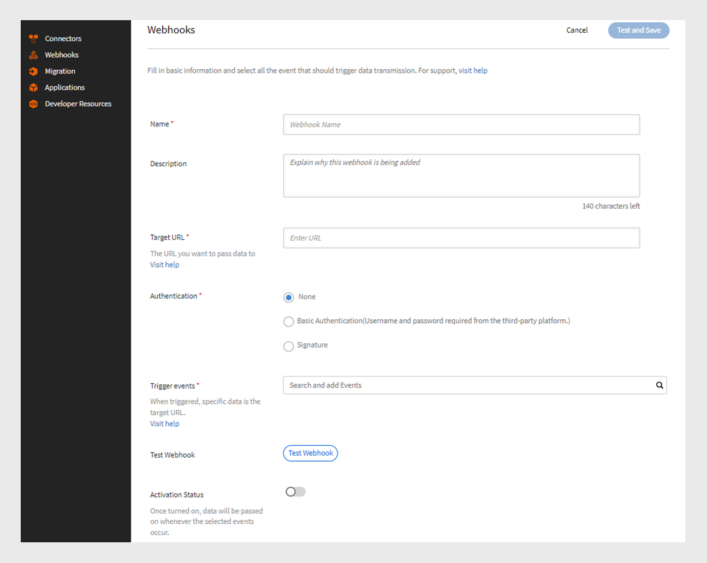

# Webhook

Webhook을 사용하면 특정 이벤트가 발생할 때 한 엔터티가 다른 엔터티로 실시간 데이터나 알림을 자동으로 보낼 수 있습니다. 이를 지속적으로 요청하지 않고도 다른 애플리케이션에 정보를 제공할 수 있게 된다. 예를 들어 사용자가 LMS(교육 관리 시스템) 과정을 완료한 경우 Webhook은 해당 정보를 CRM 또는 보고 도구와 같은 다른 플랫폼으로 자동으로 전송할 수 있습니다. Webhook은 통합을 통해 프로세스를 자동화하고 시스템 간에 수동 업데이트의 필요성을 줄이는 데 주로 사용됩니다. 데이터를 전송할 콜백 URL을 제공하여 Webhook을 설정합니다.

## Webhook 및 API

Webhook과 API는 모두 시스템이 서로 통신할 수 있도록 지원하지만 서로 다른 방식으로 작동합니다. API를 사용하면 사용자가 정보를 요청할 때만 정보가 공유됩니다. 예를 들어 학습자가 강의 진행률 데이터를 요구하는 경우 API에 요청을 보내고 API에서는 해당 정보를 제공합니다. 반면에 Webhook은 이벤트가 발생하면 데이터를 즉시 자동으로 전송합니다. 예를 들어 학습자가 강의를 완료하면 수동 요청 없이 리스너 URL로 데이터가 즉시 전송됩니다.

## 실시간 API란?

실시간 API를 사용하면 이벤트가 발생할 때 애플리케이션이 데이터를 즉시 교환할 수 있습니다. 사용자가 정보를 요청하면 대기하는 기존 API와 달리 실시간 API는 그 순간 데이터를 공유한다. Webhook은 실시간 API로 작동하며 지정된 이벤트가 발생할 때마다 데이터를 즉시 공유하도록 지원합니다. 실시간 API는 수동 요청 없이도 이러한 데이터 전송이 즉시 이루어지도록 하여 시스템을 즉시 업데이트할 수 있습니다.

## Webhook 이벤트

Webhook 이벤트는 데이터를 리스너 URL로 자동으로 전송하는 시스템에서 발생하는 특정 작업입니다. 예를 들어 학습자가 강의에 등록하면 Webhook 이벤트가 트리거되고 등록 세부 정보가 수신자 URL로 전송됩니다.

Webhook 이벤트는 다음 두 가지 범주로 분류됩니다.

* **실시간 이벤트**: 이벤트가 처리되어 실시간으로 대상 URL로 전송됩니다
* **실시간이 아닌 이벤트**: 이벤트는 배치로 처리되며 실시간이 아닌 지정된 시간에 전송됩니다

## 리스너 URL

리스너 URL은 이벤트가 발생할 때 데이터 정보를 수신하는 엔드 포인트 또는 대상입니다. 사용자가 강의에 등록하는 등 특정 이벤트가 발생하면 수동 요청 없이 세부 정보가 자동으로 이 URL로 전송됩니다. 리스너 URL은 이러한 모든 업데이트가 전달되는 주소입니다.
Webhook은 관련 정보를 JSON 형식으로 전송합니다. 다음은 Adobe Learning Manager에서 트리거된 이벤트에 대한 샘플 페이로드입니다.

```
{
  "accountId": 1010,
  "events": [
    {
      "eventId": "d5fb7071-10a9-46b2-9f9e-79dde346c052",
      "eventName": "COURSE_ENROLLMENT_BATCH",
      "timestamp": 1727414643000,
      "eventInfo": "1727414643000-047210-84242-0",
      "data": {
        "userId": 4279332,
        "loId": "course:7374992",
        "loInstanceId": "course:7376092_10250977",
        "loType": "course",
        "enrollmentSource": "ADMIN_ENROLL",
        "dateEnrolled": 1727414643
      }
    }
  ]
}
```

## Webhook 생성 및 관리 - 통합 관리자

Adobe Learning Manager에서 Webhooks 통합을 만들려면 아래 단계를 따르십시오.

1. **[!UICONTROL 통합 관리자]**(으)로 로그인합니다.
2. 홈페이지에서 **[!UICONTROL Webhook]** > **[!UICONTROL Webhook 추가]**&#x200B;를 선택합니다.

   
   _Webhook 추가_

3. Webhook의 **[!UICONTROL 이름]** 및 **[!UICONTROL 설명]**&#x200B;을 입력합니다.
4. 이벤트 데이터를 전달할 **[!UICONTROL 대상 URL]**(으)로 수신기 URL을 입력하십시오.
5. 인증 방법 중 하나를 선택합니다.
Webhooks에서의 인증은 수신기 URL로 전송된 데이터가 신뢰할 수 있는 소스에서 오는지 확인하는 보안 방법입니다.
   * **[!UICONTROL 없음]**: 인증이 필요하지 않습니다.
   * **[!UICONTROL 기본]**: 자격 증명 기반 인증입니다. 사용자 이름과 암호를 입력합니다.
   * **[!UICONTROL 서명]**: 시스템에서 특수 서명을 만들고 Webhook 데이터에 추가합니다. 수신 서버는 이 코드를 확인하여 데이터가 진짜이고 변경되지 않았는지 확인합니다. 서명을 생성하고 인증에 사용합니다. JSON으로 서명을 다운로드합니다.
6. **[!UICONTROL 트리거 이벤트]** 드롭다운에서 Webhook 이벤트를 선택합니다.

   >[!NOTE]
   >
   >Webhook 추가 페이지에서 Webhook 테스트 옵션을 선택하여 Webhook을 테스트할 수도 있습니다.

7. **[!UICONTROL 활성화 상태]** 토글을 선택하여 Webhook을 활성화합니다. 활성화되면 선택한 이벤트가 발생할 때마다 데이터가 전달됩니다.

>[!NOTE]
>
>최대 5개의 Webhook을 만들고 관리할 수 있습니다.

### Webhook 편집 - 통합 관리자

Adobe Learning Manager에서 Webhook을 편집하려면 다음 단계를 따르십시오.

1. **[!UICONTROL 통합 관리자]**(으)로 로그인합니다.
2. 홈페이지에서 **[!UICONTROL Webhooks]**&#x200B;을(를) 선택합니다.
3. 편집할 Webhook을 선택합니다.

   
   _Webhook 편집_
4. **[!UICONTROL 편집]**&#x200B;을 선택하여 Webhook 세부 정보를 수정하고 **[!UICONTROL 저장]**&#x200B;을 선택합니다.

### Webhook 제거 - 통합 관리자

Adobe Learning Manager에서 Webhook을 편집하려면 다음 단계를 따르십시오.

1. **[!UICONTROL 통합 관리자]**(으)로 로그인합니다.
2. 홈페이지에서 **[!UICONTROL Webhooks]**&#x200B;을(를) 선택합니다.
3. 삭제할 Webhook을 선택합니다.
4. Webhook을 제거하려면 **[!UICONTROL 삭제]**&#x200B;를 선택합니다.


_Webhook 제거_

### Webhook 사용 중지 - 통합 관리자

Webhook을 종료하려면 다음 단계를 따르십시오.

1. **[!UICONTROL 통합 관리자]**(으)로 로그인합니다.
2. 홈페이지에서 **[!UICONTROL Webhooks]**&#x200B;을(를) 선택합니다.
3. 편집할 Webhook을 선택합니다.
4. **[!UICONTROL 편집]**&#x200B;을 선택하고 **[!UICONTROL 활성화 상태]**&#x200B;를 비활성화하여 Webhook을 종료합니다.


_Webhook 사용 중지_

## 대체용 Webhook {#webhooks-for-alternates}

ALM은 외부 시스템과의 자동화, 통합 및 동기화를 지원하기 위해 대체 완료에 대한 전용 Webhook 이벤트를 제공합니다.

이러한 이벤트를 통해 외부 소비자는 대체 관계를 통해 부여받은 직접 완료와 완료 여부를 확실하게 구별할 수 있다.

### 개요

학습자가 대체 또는 관계를 통해 강의를 완료하면 ALM은 표준 강의 완료 Webhook와 별도의 Webhook 이벤트를 트리거합니다. 이렇게 하면 통합이 필요한 경우 대체 완료에 다르게 응답할 수 있습니다.

Webhook 이벤트는 과거 업데이트 및 관계 변경을 포함하여 소급 완료 또는 소급 미완료가 발생하는 경우에도 트리거됩니다.

### Webhook 이벤트 동작

* 개별 Webhook 이벤트는 학습자가 대상 강의에 대한 대체 상태를 통해 완료됨 을 수신하면 트리거됩니다.
* 이벤트는 학습자가 대체 관계를 통해 대상을 만족하는 구성된 소스 강의를 완료했을 때 생성됩니다.
* 이 Webhook은 직접 강의 완료에 대해 트리거되지 않습니다.
* 소급 완료 또는 소급 미완료가 활성화되면 영향을 받는 각 학습자 및 대상 강의에 대해 Webhook 이벤트가 발생합니다.

### Webhook 페이로드 세부 정보

대체 완료 Webhook 페이로드에는 다음 키 특성이 포함됩니다.

* **학습자 ID**
대체 완료를 받은 학습자를 식별합니다.
* **원본 과정**
학습자가 직접 완료한 과정 또는 학습 경로
* **대상 과정**
대체 관계를 통해 완료됨으로 표시된 강의입니다.
* **완료 방법**
완료 방법이 대체임을 나타냅니다.
* **완료 날짜**
원본 강의 완료 날짜로부터 추출됩니다.
* **관계 유형**
관계가 대체 관계인지 여부를 지정합니다.

소급 미완료 시나리오의 경우 Webhook 이벤트는 기존 대체 완료가 취소되었음을 나타냅니다.

### 통합 고려 사항

외부 시스템은 다음 Webhook 이벤트를 사용하여 다음을 수행할 수 있습니다.

* 학습자 기록 업데이트
* 완료 상태 동기화
* 알림 또는 다운스트림 워크플로우 트리거
* 규정 준수를 위해 감사 추적 유지

Webhook 소비자는 직접 완료와 대체 완료를 명시적으로 구별해야 합니다.

대체 완료는 기술, 배지 및 게임화 보상을 부여하지 않습니다. 피드백은 다운스트림 시스템에서 적절하게 처리해야 합니다.

## 적응형 학습 경로에 대한 Webhook

### 소개

Adobe Learning Manager에서는 **학습 경로(학습 프로그램)**&#x200B;의 완료 상태가 새로 고쳐질 때마다 외부 시스템에 알리는 **Webhook 이벤트**&#x200B;를 제공합니다. 이를 통해 학습자의 완료 기록이 롤백되거나 다시 계산될 때마다 다운스트림 시스템(예: HR, 보고 또는 분석 플랫폼)을 동기화할 수 있습니다.

두 가지 새로운 Webhook 이벤트 유형을 사용할 수 있습니다.

**학습 경로_완료_롤백** - **학습자**&#x200B;가 학습 경로의 완료 상태를 스스로 새로 고칠 때 트리거됩니다.

**학습 경로_완료_롤백_일괄 처리** - **관리자**&#x200B;가 **한 명 이상의 학습자**&#x200B;에 대한 학습 경로의 완료 상태를 새로 고칠 때 트리거됩니다(예: 대량 작업을 통해).

이러한 이벤트는 **공통 페이로드 구조**&#x200B;를 사용하며 Webhook 끝점에서 사용자 측의 완료 데이터를 업데이트하거나 다시 처리하는 데 사용할 수 있습니다.

### 공통 페이로드 구조

각 Webhook 요청에는 다음과 같은 최상위 구조가 포함됩니다.

```
{
  "accountId": 69735,
  "events": [
    {
      "eventId": "757b9d58-048c-4ae2-9fff-35f9def7ef29",
      "eventName": "LEARNING_PATH_COMPLETION_ROLLBACK",
      "timestamp": "2026-01-20T05:48:10.000Z",
      "eventInfo": "1768888090000-197513-137581-0",
      "data": {
        "userId": 13446697,
        "loId": "learningProgram:157165",
        "loInstanceId": "learningProgram:157165_148769",
        "loType": "learningProgram",
        "enrollmentSource": "SELF_ENROLL",
        "dateEnrolled": "2026-01-20T05:44:05.000Z"
      }
    }
  ]
}
```

**동일한 구조**&#x200B;가 두 이벤트 유형에 모두 사용됩니다. eventName과 데이터 내의 값(예: userId, loId, enrollmentSource)만 다릅니다.

#### 예: 학습자 시작 새로 고침

학습자가 학습 경로의 완료 상태를 새로 고치면 Webhook에서 LEARNING_PATH_COMPLETION_ROLLBACK 이벤트를 보냅니다.

```
{
  "accountId": 69735,
  "events": [
    {
      "eventId": "757b9d58-048c-4ae2-9fff-35f9def7ef29",
      "eventName": "LEARNING_PATH_COMPLETION_ROLLBACK",
      "timestamp": "2026-01-20T05:48:10.000Z",
      "eventInfo": "1768888090000-197513-137581-0",
      "data": {
        "userId": 13446697,
        "loId": "learningProgram:157165",
        "loInstanceId": "learningProgram:157165_148769",
        "loType": "learningProgram",
        "enrollmentSource": "SELF_ENROLL",
        "dateEnrolled": "2026-01-20T05:44:05.000Z"
      }
    }
  ]
}
```

이 이벤트를 사용하여 학습자가 명시적으로 새로 고침을 요청할 때 외부 시스템에서 **학습자 완료 데이터를 다시 계산하거나 재설정**&#x200B;합니다.

#### 예: 관리자가 시작한 배치 새로 고침

책임자가 하나 이상의 학습자에 대해 완료 새로 고침을 수행하는 경우(예: 그룹에 대한 기록 완료 수정) Webhook은 LEARNING_PATH_COMPLETION_ROLLBACK_BATCH 이벤트를 방출합니다.

```
{
  "accountId": 69735,
  "events": [
    {
      "eventId": "757b9d58-048c-4ae2-9fff-35f9def7ef29",
      "eventName": "LEARNING_PATH_COMPLETION_ROLLBACK_BATCH",
      "timestamp": "2026-01-20T05:48:10.000Z",
      "eventInfo": "1768888090000-197513-137581-0",
      "data": {
        "userId": 13446698,
        "loId": "learningProgram:157166",
        "loInstanceId": "learningProgram:157166_148770",
        "loType": "learningProgram",
        "enrollmentSource": "ADMIN_ENROLL",
        "dateEnrolled": "2026-01-21T05:44:05.000Z"
      }
    }
  ]
}
```

일괄 처리 작업에서 Webhook 엔드포인트는 완료가 새로 고쳐진 학습자당 하나씩 **단일 요청에서 여러 이벤트 개체**&#x200B;를 수신할 수 있습니다. 통합은 이벤트 배열을 반복하고 각 이벤트를 독립적으로 처리해야 합니다.

### 통합에서 이러한 이벤트를 사용하는 방법

다음 Webhook 이벤트를 사용하여 다음을 수행할 수 있습니다.

완료가 롤백되거나 다시 계산될 때 **완료 레코드를 외부 LMS/LRS, HR 또는 보고 시스템과 동기화**&#x200B;합니다.

재할당, 알림 또는 인증 및 배지 재계산과 같은 **다운스트림 워크플로 트리거**.

학습자 및 학습 경로 식별자와 함께 eventId, timestamp 및 eventInfo를 기록하여 **감사 추적을 유지**&#x200B;합니다.

Webhook 처리기는 최소한 다음 작업을 수행해야 합니다.

페이로드의 유효성을 검사하고 이벤트 []을(를) 구문 분석합니다.
eventName을 사용하여 변경 내용이 **learnerinitiated**&#x200B;인지 **admin/batchinitiated**&#x200B;인지 확인하십시오.

userId, loId 및 loInstanceId를 사용하여 시스템에서 해당 레코드를 찾아 업데이트합니다.
동일한 이벤트가 두 번 이상 전달되는 경우 중복 처리를 방지하기 위해 eventId를 활용합니다.

## 사용자 그룹 멤버십 추가 및 제거를 위한 Webhook

두 가지 새로운 Webhook 이벤트 유형은 최종 상태를 가집니다.

* 응답:ASYNCAPI_USERGROUP_USER_ADDED
* 응답:ASYNCAPI_USERGROUP_USER_REMOVED

### 샘플 페이로드

```
{
  "accountId": 69735,
  "events": [
    {
      "eventId": "cd2972c8-cb15-47a0-a23f-e4a16cb720f5",
      "eventName": "RESPONSE:ASYNCAPI_USERGROUP_USER_REMOVED",
      "timestamp": "2026-03-18T13:38:12.000Z",
      "eventInfo": "cd2972c8-cb15-47a0-a23f-e4a16cb720f5",
      "data": {
        "status": "SUCCESS",
        "request": {
          "metadata": { "event_id": "cd2972c8-cb15-47a0-a23f-e4a16cb720f5" },
          "data": [ { "type": "user", "id": "13446641" } ]
        }
      }
    }
  ]
}
```

### 주요 요소

* `accountId`이(가) ALM 계정을 식별합니다.
* `events`은(는) 이벤트 개체의 배열입니다.
* `eventId`이(가) 원래 비동기 요청 식별자와 일치합니다.
* `eventName`은(는) 추가 또는 제거 작업을 나타냅니다.
* `timestamp`은(는) 완료 시간을 표시합니다.
* `data.status`이(가) 현재 성공적인 일괄 처리에 대해 &quot;성공&quot;을 보고했습니다.
* `data.request`에 사용자가 보낸 정확한 요청이 포함되어 있습니다.

통합은 기본적으로 `eventId`(또는 `metadata.event_id`) 및 `status`의 키를 해제해야 합니다.

### 예

#### 비동기적으로 사용자 추가

**단계 1. 비동기 호출** 만들기

POST /primeapi/v2/async/userGroups/12345/users

```
{
  "metadata": {
    "event_id": "sync-2026-03-30T10:15:00Z-ug-12345",
    "sourceSystem": "HRIS",
    "batchId": "hr_2026_03_30_0001"
  },
  "data": [
    { "type": "user", "id": "11101219" },
    { "type": "user", "id": "11101220" }
  ]
}
```

**2단계. 즉시 응답 읽기**

```
{ "event_id": "sync-2026-03-30T10:15:00Z-ug-12345" }
```

이제 시스템에서 이 작업을 제출됨으로 표시할 수 있습니다.

**3단계. Webhook** 처리

Webhook 콜백 예:

```
{
  "accountId": 69735,
  "events": [
    {
      "eventId": "sync-2026-03-30T10:15:00Z-ug-12345",
      "eventName": "RESPONSE:ASYNCAPI_USERGROUP_USER_ADDED",
      "timestamp": "2026-03-30T10:15:43.000Z",
      "data": {
        "status": "SUCCESS",
        "request": {
          "metadata": {
            "event_id": "sync-2026-03-30T10:15:00Z-ug-12345",
            "sourceSystem": "HRIS",
            "batchId": "hr_2026_03_30_0001"
          },
          "data": [
            { "type": "user", "id": "11101219" },
            { "type": "user", "id": "11101220" }
          ]
        }
      }
    }
  ]
}
```

일반적인 소비자는 다음과 같은 혜택을 받게 됩니다.

* 내부 작업을 찾습니다.
* 필요에 따라 GET /userGroups/{id}/users를 사용하여 멤버십을 확인합니다.
* 작업을 완료로 표시합니다.

#### 비동기적으로 사용자 제거

동일한 신체 구조의 DELETE을 사용하여 제거는 대칭적이다.

```
{
  "metadata": {
    "event_id": "sync-2026-03-30T11:00:00Z-ug-12345",
    "sourceSystem": "HRIS",
    "batchId": "hr_2026_03_30_0002"
  },
  "data": [ { "type": "user", "id": "11101219" } ]
}
```

즉각적인 응답:

```
{ "event_id": "sync-2026-03-30T11:00:00Z-ug-12345" }
```

나중에 RESPONSE:ASYNCAPI_USERGROUP_USER_REMOVED Webhook이 동일한 eventId와 함께 도착합니다.

자세한 내용은 [사용자 그룹 멤버십에 대한 비동기 공용 API](/help/migrated/api-changes-alm.md#asynchronous-public-apis-for-user-group-membership)를 참조하십시오.
