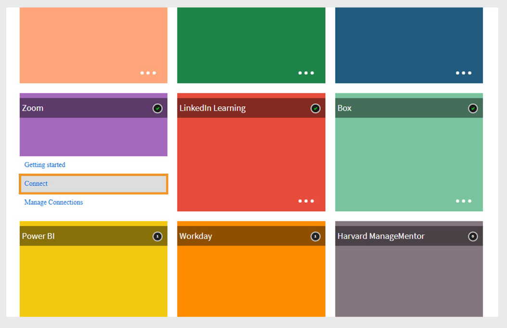

# Adobe Learning Manager의 Zoom 커넥터

## 소개

Adobe Learning Manager의 Zoom 커넥터를 통해 Zoom과 원활하게 통합되어 라이브 가상 강의실 세션을 제공할 수 있습니다. 이 통합을 통해 강사는 Learning Manager에서 직접 Zoom 회의를 주최하고, 학습자를 등록하며, 출석 및 완료 데이터를 추적할 수 있습니다. 학습자는 자동 초대를 받고 Adobe Learning Manager 계정을 통해 세션에 참여할 수 있습니다. 세션 후 출석 및 성과 데이터는 보고 및 추적을 위해 Adobe Learning Manager에 다시 동기화됩니다.

## Zoom 커넥터 설정

Zoom 커넥터를 구성하려면:

1. 통합 관리자로 Adobe Learning Manager에 로그인합니다.
2. **확대/축소** 타일 위로 마우스를 가져갑니다.

   
   _Adobe Learning Manager에서 Zoom 커넥터 구성_

3. **연결**&#x200B;을 선택합니다. Zoom 커넥터 설정 페이지가 열립니다.
4. 각 필드에 다음 계정 세부 정보를 입력합니다. Zoom 계정 관리자로부터 다음 자격 증명을 얻을 수 있습니다.

   * 연결 이름
   * Zoom 계정 ID
   * 클라이언트 ID
   * 클라이언트 시크릿
   * 최고 관리자 이메일 주소

   
   _Zoom 커넥터를 설정하려면 구성 세부 정보를 입력하십시오_

5. **연결**&#x200B;을 선택하여 통합을 설정합니다.

>[!NOTE]
>
>커넥터를 활성화할 때 **학습자는 Zoom 계정과 Adobe Learning Manager 계정 모두에 대해 동일한 전자 메일 주소**&#x200B;를 사용하여 사용자 데이터가 올바르게 동기화되도록 해야 합니다.

## 확대/축소 과정 만들기

연결이 설정되면:

1. **작성자**(으)로 로그인하여 새 가상 강의실 강의를 만드십시오.
2. 강의 생성 중 회의 시스템으로 **확대/축소**&#x200B;를 선택합니다.
3. 책임자, 관리자 또는 자가 등록을 통해 강의에 학습자를 할당합니다.
4. 등록 시 학습자는 강의 세부 정보가 포함된 이메일을 수신하게 됩니다.
5. 학습자는 Adobe Learning Manager 계정에 로그인하여 강의에 액세스하고 Zoom 세션에 참여할 수 있습니다.

## 출석 및 완료 추적

가상 세션이 종료된 후:

* Adobe Learning Manager은 Zoom에서 완료 상태를 자동으로 수신합니다.
* 책임자는 Adobe Learning Manager에서 출석 및 점수 보고서를 보고 학습자의 참여와 성과를 추적할 수 있습니다.

## Zoom 서버 간 OAuth 앱 만들기

Adobe Learning Manager에서 Zoom 커넥터를 사용하려면 Zoom 서버-서버 OAuth 앱을 만들고 필요한 범위를 구성해야 합니다.

### 필수 OAuth 범위

확대/축소에서 응용 프로그램을 만들 때 다음 범위가 선택되어 있는지 확인하십시오.

```
| Scope Description | Zoom Scope |
|---|---|
| View all user meetings | meeting:read:admin |
| View and manage all user meetings | meeting:write:admin |
| View report data | report:read:admin |
| View all user information | user:read:admin |
| Manage users | user:write:admin |
| Add a meeting registrant | meeting:write:registrant:admin |
| List all meeting registrants | meeting:read:list_registrants:admin |
| Manage sub-account meetings | meeting:write:meeting:master |
| View meeting participants report | report:read:list_meeting_participants:admin |
```
