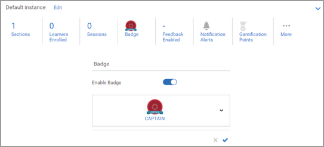
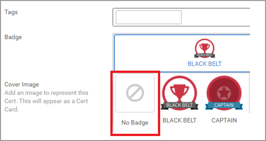

# 배지를 할당할 수 없음

## 문제

강의 또는 교육을 완료한 뒤에도 예상과 달리 배지가 수여되지 않습니다.

## 설명

학습자가 강의/학습 프로그램/인증을 완료한 후에도 배지가 수여되지 않습니다.

## 원인

배지는 학습 개체에 할당된 것으로 학습자가 학습 개체를 완료한 뒤에 추가됩니다.

이전 버전에서는 학습자가 학습 개체를 완료할 때 학습 개체에 할당된 배지가 없는 경우 나중에 배지를 추가할 수 없었습니다.

최신 버전에서는 이후에도 배지를 추가할 수 있습니다.

## 해결 방법

이 문제를 겪는 학습자는 다음의 단계를 실행합니다.

## 강의/학습 프로그램

1. 책임자로 로그인합니다.

1. 관련 학습 개체를 엽니다(강의/학습 프로그램)

1. **[!UICONTROL 인스턴스]** > **[!UICONTROL 배지]**&#x200B;를 클릭합니다.

   

1. 학습 개체에서 배지를 제거하고 **[!UICONTROL 저장]**&#x200B;을 클릭합니다.

   

1. 학습 개체에 배지를 다시 할당하고 **[!UICONTROL 저장]**&#x200B;을 클릭합니다.

   그러면 학습 개체에 등록된 모든 학습자에게 배지가 할당됩니다.

## 인증

1. 책임자로 로그인합니다.
1. 인증을 엽니다.
1. **[!UICONTROL 개요]** > **[!UICONTROL 배지]**&#x200B;를 클릭합니다.
1. 인증에서 배지를 제거하고 **[!UICONTROL 저장]**&#x200B;을 클릭합니다.

   

1. 인증에 배지를 다시 할당하고 **[!UICONTROL 저장]**&#x200B;을 클릭합니다.
