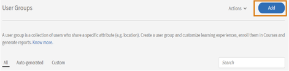

# Learning Manager에서 사용자 그룹에 강사 역할 기본 할당

## 문제

세션에 할당된 모든 사용자에게 강사 역할이 할당됩니다.

## 설명

여러 강사가 필요한 세션이나 책임자/작성자가 세션에 사용자 그룹을 할당하는 시나리오가 있습니다. 그러면 사용자 그룹의 모든 사용자에게 강사 역할이 할당됩니다.

## 원인

사용자 그룹의 사용자를 일괄 할당하는 중에는 역할을 분기할 수 없으며 이에 따라 모든 사용자에게 강사 역할이 할당됩니다.

## 솔루션

세션에 할당된 사용자 역할을 필터링하는 사용자 정의 사용자 그룹을 만듭니다. 사용자 그룹에서 할당된 강사 역할을 제거하려면 다음 단계를 수행합니다.

1. 책임자로 로그인합니다. 왼쪽 패널에서 **[!UICONTROL 전자 메일 템플릿]**.
1. 변경 사항의 전자 메일 트리거를 방지하려면 **[!UICONTROL 모두 비활성화]**.

   

1. 다음으로 이동: **사용자** > **사용자 그룹**. **[!UICONTROL 추가]**&#x200B;를 클릭합니다.

   

1. 다음과 같이 [사용자 그룹 추가] 창에서 사용자 정의 사용자 그룹을 만듭니다.

   * 사용자 정의 그룹의 이름을 **[!UICONTROL 이름]** 필드.
   * 아래 **[!UICONTROL 학습자 포함]** 필드에서 강사를 필터링할 사용자 그룹을 추가합니다.
   * 아래 **[!UICONTROL 학습자 제외]** 필드에서 강사 역할을 유지할 사용자를 추가합니다.

   

   위 단계에서 포함 집합에 추가할 사용자 목록을 만들고 제외 집합에 명시된 특정 사용자(강사)를 제거합니다.

1. 다음을 수행합니다. **[!UICONTROL 저장]** 변경 사항.
1. 다음으로 이동하여 생성된 사용자 정의 사용자 그룹을 검색합니다. **[!UICONTROL 사용자]** > **[!UICONTROL 내부]**.

   

1. 확인란을 클릭하여 그룹의 모든 사용자를 선택합니다.

   

1. 다음을 수행합니다. **[!UICONTROL 액션]** > **[!UICONTROL 역할 제거]** > **[!UICONTROL 강사 제거]**.

완료되면 2단계에서 비활성화된 이메일 트리거가 다시 활성화되었는지 확인합니다.
