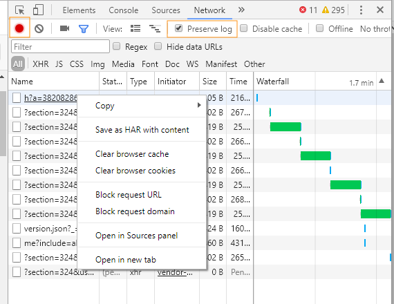

# HAR 파일 생성

Google Chrome에서 HAR 파일을 생성하는 방법을 알아보려면 계속 읽어보십시오.

HAR 파일을 생성하려면 다음 단계를 수행하십시오.

1. Google Chrome 창을 열고 새 탭을 엽니다.
1. 페이지에 대한 개발자 도구를 열고 마우스 오른쪽 단추 > Inspect을 클릭합니다.
1. 열기 **[!UICONTROL 네트워크]** 탭. 빨간색 기록 버튼이 활성화되어 있는지 확인합니다. 활성화 **[!UICONTROL 로그 유지]** 확인란.

   

   *네트워크 탭에서 로그 유지 확인란을 선택합니다*

1. 다음으로 로그인: [Learning Manager](https://learningmanager.adobe.com/acapindex.html) 자격 증명을 사용하여 강의를 수강합니다. 문제가 발생하는 모든 작업을 수행하십시오.
1. 개발자 도구에서 마우스 오른쪽 단추를 클릭하고 **콘텐츠를 사용하여 HAR로 모두 저장**.

   일부 Google Chrome 버전에서는 **[!UICONTROL 복사]** > **[!UICONTROL 모두 HAR로 복사]**.

   

   *모든 HAR 파일 복사*

1. 복사된 콘텐츠를 메모장 파일에 붙여 넣습니다. 데스크톱에 다른 이름으로 저장 **logs.har** 이메일을 통해 Adobe에게 전송할 수 있습니다.
