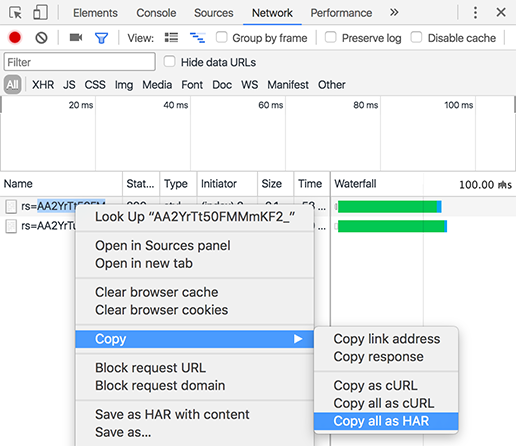

# HAR 파일 생성

Google Chrome에서 HAR 파일을 생성하는 방법을 알려면 읽어 보십시오.

HAR 파일을 생성하려면 다음 절차를 수행하십시오.

1. Google Chrome 창을 열고 새 탭을 엽니다.
1. 페이지에 대한 개발자 도구를 열고 마우스 오른쪽 단추 > [검사]를 클릭합니다.
1. **[!UICONTROL Network]** 탭을 엽니다. 빨간색 기록 버튼이 활성화되어 있는지 확인합니다. **[!UICONTROL 로그 유지]** 확인란을 선택합니다.

   

   *네트워크 탭에서 로그 유지 확인란을 선택합니다*

1. 자격 증명을 사용하여 [Learning Manager](https://learningmanager.adobe.com/acapindex.html)에 로그인하고 강의를 수강합니다. 문제가 발생하는 모든 작업을 수행하십시오.
1. 개발자 도구에서 마우스 오른쪽 단추를 클릭하고 **콘텐츠를 사용하여 HAR로 모두 저장**&#x200B;을 선택합니다.

   일부 Google Chrome 버전에서는 **[!UICONTROL 복사]** > **[!UICONTROL 모두 HAR로 복사]**&#x200B;를 선택해야 할 수 있습니다.

   

   *모든 HAR 파일 복사*

1. 복사된 콘텐츠를 메모장 파일에 붙여 넣습니다. 데스크톱에 **logs.har**(으)로 저장하고 Adobe에 전자 메일로 보냅니다.
