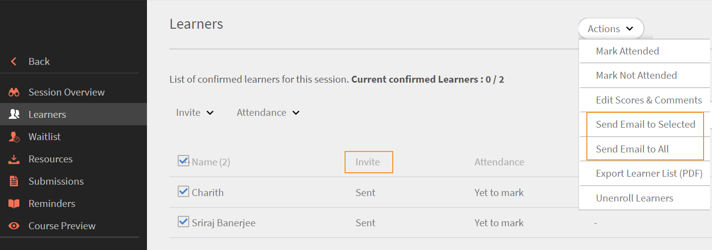

# 에서 Outlook 일정 초대에 대한 학습자의 응답 보기 [!DNL Learning Manager]

관리자와 강사가 일정 초대에 대한 학습자의 응답을 보는 방법에 대해 알아봅니다.

Learning Manager에서 교육 과정의 가상 강의/교실 세션에 등록한 학습자는 자세한 Outlook 일정 초대를 받습니다.

세션 초대에 대한 학습자의 응답은 Learning Manager에 기록되며 관리자와 강사가 세부 정보를 볼 수 있습니다.

학습자가 두 번 이상 동일한 초대에 응답하는 경우 최신 응답이 선택되어 이전 응답을 덮어씁니다. 세션 시간이 변경되면 모든 초대 응답이 지워지고 학습자가 요청에 다시 한 번 응답해야 합니다.

## 초대-응답-추적 기능 사용 {#enablingtheinvitereplytrackingfeature}

* 초대-응답-추적 기능을 활성화하려면 Adobe Learning Manager 지원에 문의하십시오.
* 계정에 대해 이 기능이 활성화되면, 작성자가 생성한 모든 향후 가상 강의/교실 세션에서 일정 초대에 대한 학습자의 응답을 기록할 수 있습니다.

초대-응답-추적 기능이 활성화되기 전에 생성된 가상 강의/교실 세션에 학습자가 등록되어 있으면 일정 초대에 대한 학습자의 응답이 기록되지 않습니다.

## 관리자로 초대 응답 보기 {#viewinginviteresponsesasanadmin}

가상 강의/교실 세션에 초대-응답-추적 기능이 활성화되어 있으면, 관리자는 다음과 같이 다른 권한과 함께 초대에 대한 학습자의 응답을 볼 수 있습니다.

1. 다음을 수행합니다. **[!UICONTROL 강의]** 왼쪽 탐색 패널에서 초대-응답-추적 기능의 활성화 후 생성된 과정을 확인합니다.
1. 다음을 수행합니다. **[!UICONTROL 출석 및 점수]** 왼쪽 탐색 패널에서
1. 학습자 이름과 일정 초대에 대한 응답을 포함한 아래 표를 표시하려면 **인스턴스** 및 **[!UICONTROL 모듈]** 를 참조하십시오.
1. 사용: **[!UICONTROL 초대]** 필터링 - 모든 응답, 수락, 거절, 미정 및 보냄 옵션을 기반으로 학습자를 봅니다.

   

1. 선택한 학습자에게만 전자 메일을 보내려면 을 클릭합니다. **[!UICONTROL 액션]** > **[!UICONTROL 선택된 사용자에게 전자 메일 보내기]** 출석 및 점수 페이지의 오른쪽 상단에서

   [출석 및 점수] 페이지에 표시된 모든 학습자에게 전자 메일을 보내려면 을 클릭합니다. **[!UICONTROL 액션]** > **[!UICONTROL 모든 사용자에게 전자 메일 보내기].**

1. [출석 및 점수] 페이지에 표시된 학습자의 세션 세부 정보에 대한 csv 보고서를 다운로드하려면 다음을 클릭합니다. **[!UICONTROL 액션]** > **[!UICONTROL 내보내기].**

## 강사로 초대 응답 보기 {#viewinginviteresponsesasaninstructor}

계정에 초대-응답-추적 기능이 활성화되면 아래 절차에 따라 일정 초대에 대한 학습자의 응답을 봅니다.

1. 다음을 수행합니다. **[!UICONTROL 예정된 세션]** 왼쪽 탐색 패널에서 강의를 선택합니다.
1. 다음을 수행합니다. **[!UICONTROL 학습자]** 왼쪽 탐색 패널에서 일정 초대에 응답한 학습자의 세부 정보를 확인할 수 있습니다.
1. 사용: **[!UICONTROL 초대]** 수락, 거절, 미정 및 보냄 옵션에 따라 학습자 이름을 필터링합니다.

   

1. 표시된 학습자 정보를 기반으로 학습자에게 전자 메일을 보낼 수 있습니다.

   선택한 학습자에게만 전자 메일을 보내려면 을 클릭합니다. **[!UICONTROL 액션]** > **[!UICONTROL 선택된 사람에게 전자 메일 보내기]**.

   표시된 표의 모든 학습자에게 전자 메일을 보내려면 **[!UICONTROL 액션]** > **[!UICONTROL 모든 사용자에게 이메일 보내기]**.

   

