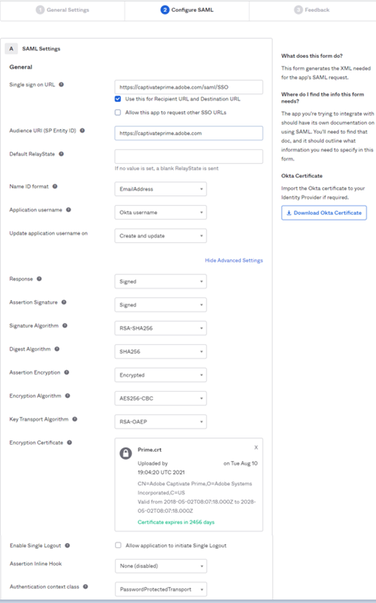

# Adobe Learning Manager와 Okta Active Directory 통합 {#okta-active-directory-integration-with-adobe-learning-manager}

이 문서에서는 Adobe Learning Manager를 Okta Active Directory(AD)와 통합하는 방법을 익힐 수 있습니다. Adobe Learning Manager를 Okta AD와 통합할 경우 다음 작업을 할 수 있습니다.

* Okta AD에서 Learning Manager 사용자의 액세스를 확인하고 제어합니다.
* 사용자가 Okta AD 계정을 사용하여 Adobe Learning Manager에 자동으로 로그인할 수 있습니다.
* 계정을 한 곳(Okta 포털)에서 관리할 수 있습니다.

Adobe Learning Manager는 IdP(Identity Provider) 및 SP(Service Provider) 관리형 SSO를 지원합니다.

## OKTA에서 응용 프로그램 만들기

1. Okta AD에서 관리자로 로그인합니다.
1. 다음을 수행합니다. **[!UICONTROL 응용 프로그램]**. 그러면 Okta에서 응용 프로그램 스토어가 열립니다.

   

   *Okta에서 응용 프로그램 스토어 보기*

1. 다음을 수행합니다. **[!UICONTROL 앱 통합 만들기]**.

   

   *앱 통합 구성 을 선택합니다*

1. 선택 **[!UICONTROL SAML 2.0]** 새 앱 통합 창에서 다음을 수행합니다.

   

   *SAML2.0 옵션 선택*

1. 선택 **[!UICONTROL SAML 통합 만들기]** > **[!UICONTROL 일반 설정 페이지]**. 응용 프로그램 이름을 입력합니다.

   응용 프로그램을 식별할 수 있는 고유한 이름을 사용하는 것이 좋습니다. 완료되면 **[!UICONTROL 다음]**.

   

   *응용 프로그램 이름 입력*

1. SAML 설정 구성 페이지에서 다음 단계를 수행하십시오.

   **IDP 설정의 경우:**

   1. 단일 인증 URL 필드에 URL을 입력합니다. [https://learningmanager.adobe.com/saml/SSO](https://learningmanager.adobe.com/saml/SSO)
   1. Audience URL 필드에 URL을 입력합니다. [https://learningmanager.adobe.com](https://learningmanager.adobe.com/)
   1. (으)로 **이름 ID 형식** 드롭다운 상자에서 **이메일 주소**.
   1. (으)로 **응용 프로그램 사용자 이름** 드롭다운에서 Okta 사용자 이름을 선택합니다.
   1. 속성을 추가로 전송하고 싶은 경우 **특성 문** (선택 사항)

   

   *SAML 속성 추가*

   **SP 설정:**

   1. 단일 인증 URL 필드에 URL을 입력합니다. [https://learningmanager.adobe.com/saml/SSO](https://learningmanager.adobe.com/saml/SSO)
   1. Audience URL 필드에 URL을 입력합니다. [https://learningmanager.adobe.com](https://learningmanager.adobe.com/)
   1. 이름 ID 형식 드롭다운 상자에서 **이메일 주소**.
   1. 응용 프로그램 사용자 이름 드롭다운 상자에서 Okta 사용자 이름을 선택합니다.
   1. 클릭 **고급 설정 표시**.
   1. 아래 **서명 알고리즘**, RSA-SHA256 선택
   1. (으)로 **어설션 알고리즘**, SHA256 선택
   1. (으)로 **어설션 암호화** dropbox에서 **암호화됨**.

   1. (으)로 **암호화 인증서** Adobe이 공유한 인증서 파일을 업로드합니다.
   1. 속성을 추가로 전송하고 싶은 경우 **특성 문** (선택 사항).

   

   *추가 속성 추가*

   완료되면 **[!UICONTROL 다음]**.

1. 대상 **피드백**  tab 은 선택 사항입니다. 이 옵션을 선택하고 피드백을 입력한 후 **[!UICONTROL 마침]**.

   

   *SAML 설정 완료*

## IDP 관리형 URL 및 메타데이터 파일 추출

IdP/SP 관리형 URL 및 메타데이터 파일을 보려면 다음 단계를 수행합니다.

1. 생성한 응용 프로그램을 엽니다.
1. 를 사용하여 **Single Sign-On** 탭, 클릭 **[!UICONTROL 지침 보기]**.

   

   *SSO 탭 선택*

   **IDP의 경우:**

   1. ID 공급자 단일 인증 URL은 IdP 시작 URL입니다.
   1. 텍스트 아래에 있는 모든 텍스트 복사 **선택 사항** 필드.
   1. 메모장을 열고 복사한 텍스트를 새 파일에 붙여넣습니다.
   1. 다음을 수행합니다. **[!UICONTROL 파일]** > **[!UICONTROL 다른 이름으로 저장]** > &quot;filename.xml&quot;. 메타데이터 파일이 됩니다.

   **SP의 경우:**

   1. ID 공급자 단일 인증 URL은 IdP 시작 URL입니다.
   1. ID 공급자 발급자는 엔터티 ID입니다.
   1. 텍스트 아래에 있는 모든 텍스트 복사 **선택 사항** 필드.
   1. 메모장을 열고 복사한 텍스트를 새 파일에 붙여넣습니다.
   1. 다음을 수행합니다. **[!UICONTROL 파일]** > **[!UICONTROL 다른 이름으로 저장]** > **[!UICONTROL filename.xml]**. 메타데이터 파일이 됩니다.

   

   *SP XML 파일 저장*

   이 파일을 XML 형식으로 저장해야 합니다.

## Adobe Learning Manager SSO 구성

Adobe Learning Manager SSO를 구성하려면 아래 문서에 설명된 단계를 따르십시오.

<!--

article not in TOC

[SSO Authentication](/help/migrated/kb/sso-authentication-for-learning-manager.md)
-->