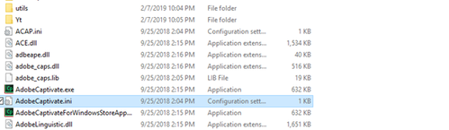

# Learning Manager EU 도메인에 게시할 수 없음 {#unable-to-publish-to-learning-manager-eu-domain}

## 문제

Adobe Captivate에서 Learning Manager EU Adobe으로 게시할 수 없습니다.

## 오류

계정을 찾을 수 없음

## 설명

작성자가 Adobe Captivate에서 Adobe Learning Manager로 강의를 게시하려는 경우가 있습니다. 그러나 &quot;계정을 찾을 수 없음&quot;이라는 오류 메시지가 나타나면서 강좌를 게시할 수 없습니다.

## 원인

이 문제는 Adobe Captivate이 기본적으로 Adobe Learning Manager의 미국 도메인에 콘텐츠를 게시하도록 구성되어 있기 때문에 발생합니다.

## 해결 방법:

참고 사항:

* 열려 있는 경우 Adobe Captivate 애플리케이션을 닫습니다.
* 아래 단계를 수행하려면 관리자 권한으로 시스템에 접속해야 합니다. 관리자 액세스 권한이 없는 경우 IT 팀에 도움을 요청하십시오.

아래 단계를 수행하십시오.

1. Adobe Captivate 설치 디렉토리로 이동합니다.

   예를 들면 다음과 같습니다.  `kbd C:\\Program Files\\Adobe\\Adobe Captivate 2019 x64` (2019는 Captivate 버전입니다. 다른 버전의 Adobe Captivate을 사용하는 경우 이 숫자가 다릅니다).

1. 구성 파일 복사 **AdobeCaptivate.ini** 동기화됩니다.

   
   *구성 파일 보기*

1. 데스크탑에서 복사한 파일을 메모장으로 엽니다.
1. LearningManagerBaseUrl 값 변경 = `https://learningmanager.adobe.com/inappstarter` - LearningManagerBaseUrl = `https://learningmanagereu.adobe.com/inappstarter`

   
   *PrimeBaseURL 보기*

1. 메모장에 변경 사항을 저장합니다.
1. 편집한 저장된 파일을 복사하여 파일 경로에 다시 붙여넣습니다. 다음 위치에서 원본 파일 바꾸기  `kbd C:\\Program Files\\Adobe\\Adobe Captivate 2019 x64`
1. 완료되면 Adobe Captivate을 실행하고 Learning Manager Adobe에 게시해봅니다.
