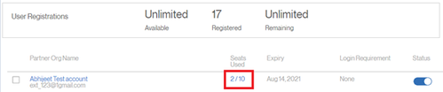

# 외부 사용자로 등록할 수 없음

## 문제

외부 학습자를 프로필에 등록할 수 없습니다.

## 오류

이메일 ID가 이미 등록되었습니다. 다른 이메일을 사용하십시오.

*이미 등록된 전자 메일의 오류 메시지*

## 설명

사용자를 외부 프로필에 등록할 수 없는 경우가 있습니다. 등록 과정에서 위의 오류 메시지가 사용자에게 나타납니다.

## 원인

이 문제는 아래 시나리오 중 하나에서 발생합니다.

* 사용자가 이미 다른 외부 프로필에 등록되어 있습니다.
* 사용자가 이미 내부 학습자로 등록되어 있습니다.
* 사용자가 삭제된 상태입니다.

## 해결 방법:

**시나리오 1:** 사용자가 이미 다른 외부 프로필에 등록되어 있습니다.

1. 책임자로 로그인합니다.
1. 아래 **관리**, 클릭 **[!UICONTROL 사용자]** > **[!UICONTROL 외부]**.
1. [사용된 시트]를 클릭하여 사용자가 이미 등록되어 있는 프로필을 엽니다.

   

   *사용자 프로필 열기*

1. 사용자를 선택하고 **[!UICONTROL 액션]** > **[!UICONTROL 프로필 변경]**.

   

   *사용자 프로필 변경*

   그러면 아래와 같이 새 프로필을 선택할 수 있는 창이 열립니다.

   

   *사용자 프로필 선택*

1. 새 라이브러리를 선택한 후 **[!UICONTROL 변경]**.

**시나리오 2:** 사용자가 내부 학습자로 등록되어 있습니다.

1. 책임자로 로그인합니다.
1. 아래 **관리**, 클릭 **[!UICONTROL 사용자]** > **[!UICONTROL 내부]**.
1. 학습자 프로필을 클릭하여 열고 편집 아이콘을 클릭합니다.

   

   *내부 학습자 프로필 열기*

1. 학습자의 이메일 주소를 변경하거나 추가 *_old* 기존 전자 메일 주소로 보냅니다. 이렇게 하면 이메일 주소가 해제됩니다.

   예를 들어 학습자의 이메일 주소가 다음과 같은 경우 *<abc@adobe.com>,* 다음으로 변경 *<abc_old@adobe.com>*

1. 다음을 수행합니다. **저장** 변경 사항을 저장합니다.

**시나리오 3**: 사용자가 삭제된 상태입니다.

1. 책임자로 로그인합니다.
1. 아래 **관리**, 클릭 **[!UICONTROL 사용자]** > **[!UICONTROL 사용자 정리]**.
1. 학습자를 선택하고 편집 아이콘을 클릭합니다.

   

   *사용자 이메일 주소 편집*

1. 학습자의 이메일 주소를 변경하거나 추가 *_old* 기존 전자 메일 주소로 보냅니다. 이렇게 하면 이메일 주소가 해제됩니다.

   예를 들어 학습자의 이메일 주소가 다음과 같은 경우 **<abc@adobe.com>**, 다음으로 변경 **<abc_old@adobe.com>**.
