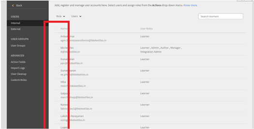

# Learning Manager에 선택 단추가 표시되지 않음

## 문제

라디오 단추가 누락되어 관리자가 다음을 수행할 수 없습니다(전체 목록 아님).

* 역할 할당 또는 제거.
* 환영 전자 메일 전송.
* 사용자를 삭제합니다.

## 원인

계정의 잘못된 테마로 인해 문제가 발생합니다.

*라디오 버튼이 표시되지 않음*

## 해결 방법

테마를 다시 로드하고 라디오 버튼의 모양을 수정합니다. 다음 단계를 수행하십시오.

1. 관리자의 경우 **[!UICONTROL 브랜딩]**.
1. (으)로 **테마** 섹션, **[!UICONTROL 편집].**
1. 아무 테마나 선택하고 변경 사항을 저장합니다.

   

   *테마 선택*

1. 이전 테마로 되돌리고 변경 사항을 저장합니다.
1. Adobe Learning Manager에서 로그아웃한 후 다시 로그인합니다.
