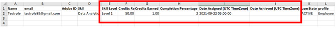

# 강의를 완료한 후 스킬을 달성할 수 없음

## 문제

학습자는 강의를 완료한 후에도 스킬을 획득하지 않습니다. 강의에 할당된 스킬은 로 유지됩니다. **진행 중** 학습자용

## 원인

이 문제는 다음과 같은 경우에 발생합니다. **필요한 점수** 이 기술을 달성하는 것은 **획득한 점수** 학습자가 강의를 완료한 후에 확인합니다.

## 해결 방법

현재 설정 확인 **스킬 점수** 및 **포인트** 스킬을 습득하는 데 필요한 정보 다음 단계를 따르십시오.

1. 학습자의 경우 **학습자 성적 증명서** 보고.
1. 학습자 성적 증명서를 생성하는 동안 **[!UICONTROL 고급 옵션]**&#x200B;옵션을 선택합니다. **[!UICONTROL 스킬 데이터 및 요약 시트 포함]**.

   

   *스킬 데이터 및 요약 시트 포함 옵션을 선택합니다.*

1. 다운로드한 학습자 성적 증명서 보고서를 엽니다.
1. 다음으로 이동: **[!UICONTROL 스킬 성적 증명서]** 시트. 여기에서 다음을 볼 수 있습니다. **[!UICONTROL 필요한 점수]** 및 **[!UICONTROL 획득한 점수]** 학습자별.

   예를 들어 아래 예에서 강의의 기술을 달성하는 데 필요한 점수는 50점입니다. 그러나 학습자는 한 점만 달성했습니다.

   

   *필수 크레딧 보기*

1. 특정 스킬에 할당된 점수를 확인하려면 책임자로 로그인하고 다음 위치로 이동하십시오 **스킬** 아래와 같이 탭합니다.

   

   *스킬 탭 실행*

1. 강의에 할당된 점수를 확인하려면 작성자로 로그인하고 강의를 엽니다. 다음을 수행합니다. **[!UICONTROL 설정]** > **강의 스킬** 아래와 같이:

   

   *강의 스킬 보기*
