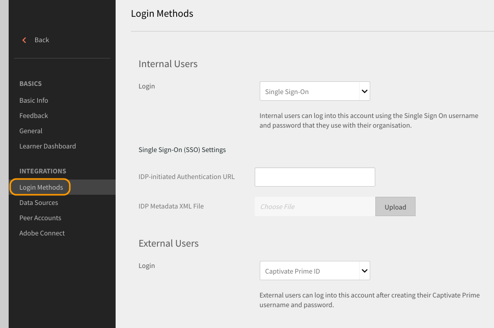
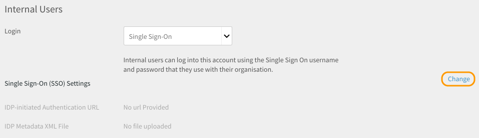

# SSO 인증을 사용하여 Learning Manager에 로그인

이 문서는 Learning Manager 계정에 로그인하도록 SSO 인증을 구성하는 데 도움이 됩니다.

SSO 인증을 구성하려면 다음 단계를 수행하십시오.

1. 열기 **[!UICONTROL 설정]** > **[!UICONTROL 로그인 방법.]**

   

1. 선택 **[!UICONTROL 내부 사용자]** 또는 **[!UICONTROL 외부 사용자]** 귀하의 요구 사항에 따라 다릅니다.
1. 옆에 있는 드롭다운을 클릭합니다  **[!UICONTROL 로그인]** option 키를 누른 상태에서 **[!UICONTROL Single Sign-On]**.

   

1. SSO(단일 사인온) 설정을 조정하려면 을 클릭합니다.  **[!UICONTROL 갈아입어.]**

   

1. Enter  **[!UICONTROL IDP 시작 인증 URL]** 서비스 공급자가 제공한 다음 을 클릭하여 XML 파일을 업로드합니다. **[!UICONTROL IDP 메타데이터 XML 파일.]**

   

   Learning Manager에서 구성하는 SSO는 SAML 2.0을 지원해야 합니다.

   이제 SSO 인증을 사용하여 Learning Manager에 로그인할 수 있습니다.

