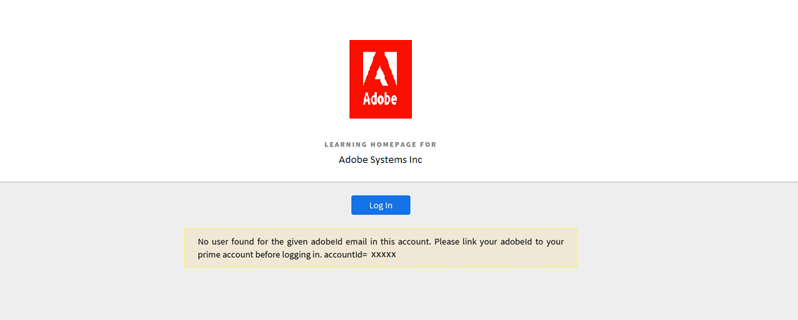

# Learning Manager에 로그인할 수 없음

## 문제

Adobe Learning Manager에 로그인하려고 하면 다음 오류 메시지가 표시됩니다.

*이 계정에서 입력한 Adobe ID 전자 메일에 대한 사용자를 찾을 수 없습니다. 로그인하기 전에 Adobe ID를 Learning Manager 계정에 연결하십시오.*

<!---->

## 원인

브라우저 캐시 및 쿠키로 인해 Adobe Learning Manager 플랫폼에 액세스할 수 없을 수 있습니다.

## 해결 방법

## 검색 기록/캐시 삭제

아래 링크는 브라우저 별 캐시 삭제 가이드입니다.

* [Google Chrome](https://support.google.com/accounts/answer/32050?co=GENIE.Platform%3DDesktop&hl=ko)
* [Internet Explorer](https://kb.wisc.edu/page.php?id=1514)
* [Microsoft Edge](https://www.bitdefender.com/support/how-to-clear-the-cache-and-cookies%C2%A0in-microsoft-edge-1914.html)
* [Firefox](https://kb.iu.edu/d/ahic)
* [Safari](https://oit.colorado.edu/tutorial/clear-web-browser-cache-safari-6)

## 시크릿 모드 사용

브라우저에서 시크릿 모드를 사용하여 Adobe Learning Manager에 로그인합니다. 자세한 내용은 [지침](https://support.google.com/chrome/answer/95464?co=GENIE.Platform%3DDesktop&hl=ko&oco=0)을 참조하십시오.

## 관리자에게 문의

여전히 로그인할 수 없는 경우 계정 관리자에게 문의하십시오. 관리자가 계정에 등록된 학습자인지 확인할 수 있습니다.

계정에 등록되어 있으나 여전히 로그인할 수 없는 경우 책임자는 로그인하려는 ID가 귀하의 Adobe ID과 동일한지 여부를 확인해야 합니다.

Adobe ID과 계정의 Adobe Learning Manager ID가 다른 경우도 있습니다.

## 새로운 기능

위 단계를 수행해도 여전히 로그인할 수 없는 경우, 관리자는 로그인 HAR 로그를 수집할 수 있습니다. 자세한 내용은 [HAR 파일 생성](/help/migrated/kb/generate-har-file.md)을 참조하십시오.

또한 문제를 추가로 디버깅할 수 있도록 Adobe Learning Manager 지원팀에 문의하십시오.
