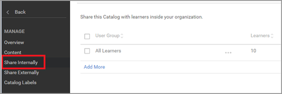

# Learning Manager에서 강의를 검색할 수 없음

## 문제

학습자가 Learning Manager에서 강의를 검색할 수 없습니다.

## 시나리오 1: 상위 학습 개체에서 등록이 진행됩니다.

### 요약

이 시나리오는 학습자가 강의를 검색했으나 해당 목록이 나열되지 않는 문제입니다. 그러나 학습자가 학습 프로그램/인증에 등록한 경우 학습자는 학습 개체에서 강의를 볼 수 있습니다.

### 이 문제가 발생하는 이유는 무엇입니까?

Learning Manager에서 학습자가 학습 프로그램/인증을 통해 등록하면 해당 강의의 등록은 학습 프로그램/인증을 통해 이루어집니다.

따라서 학습자는 **내 학습**&#x200B;에서 독립 실행형 강의를 검색할 수 없습니다.

그러나 학습자는 학습 프로그램/인증의 강의를 볼 수 없습니다.

## 시나리오 2: 학습자가 강의가 포함된 카탈로그에 액세스할 수 없습니다.

### 요약

학습자가 카탈로그 또는 학습 대시보드에서 강의를 검색할 수 없습니다.

### 이 문제가 발생하는 이유는 무엇입니까?

이 문제는 다음과 같은 상황에서 발생합니다.

* 학습자가 강의가 포함된 카탈로그의 일부가 아닙니다 **또는**
* 강의가 학습자가 액세스 할 수 있는 카탈로그의 일부가 아닙니다.

### 해결 방법

1. 책임자로 로그인합니다.

1. **[!UICONTROL 카탈로그]**&#x200B;를 클릭하고 강의가 포함된 카탈로그를 검색합니다.
1. 위에서 언급된 시나리오에 따라 **[!UICONTROL 내부적으로 공유]** 또는 **[!UICONTROL 콘텐츠]**&#x200B;를 클릭합니다.

   

   *내부적으로 카탈로그 공유*

1. 아래의 시나리오를 검토합니다.

   * 학습자가 카탈로그의 일부가 아님

     카탈로그를 공유하려면 **[!UICONTROL 추가]**&#x200B;를 클릭하고 사용자가 속한 사용자 그룹을 추가합니다. **[!UICONTROL 저장]**&#x200B;을 클릭합니다.

     

     *사용자 그룹 추가*

   * 카탈로그는 강의의 일부가 아님

     콘텐츠 섹션에서 **[!UICONTROL 콘텐츠 추가]**&#x200B;를 클릭하고 카탈로그에 추가하려는 강의를 선택합니다.

     

     *강의에 콘텐츠 추가*
