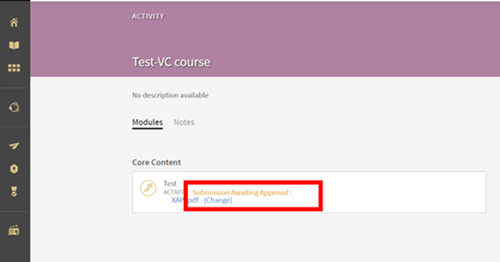
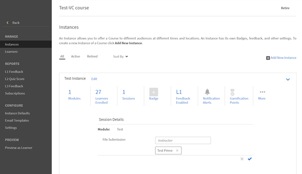

# Adobe Learning Manager에서 제출한 파일을 볼 수 없음

## 문제

학습자가 업로드한 제출 파일을 강사가 볼 수 없습니다.

## 설명

학습자가 **제출 활동 모듈**&#x200B;에 업로드한 파일을 강사가 볼 수 없습니다.

예를 들어, 다음과 같이 학습자는 이름이 **테스트 인스턴스**&#x200B;인 강의 인스턴스에 등록했습니다.

*인스턴스 보기*

그런 다음 학습자가 강의를 열고 활동 모듈에 파일을 업로드합니다.

강사가 제출을 승인하려고 하지만 승인할 수가 없습니다.

*활동 모듈에 파일 업로드*

## 원인

학습자가 등록된 강의 인스턴스에 강사가 없는 경우 이 문제가 발생합니다.

## 해결 방법

강사가 강의 인스턴스에 추가되어 있는지 확인하려면 아래의 단계를 따릅니다.

1. 강의 설정으로 이동합니다.
1. **관리** 섹션에서 **[!UICONTROL 인스턴스].**&#x200B;를 클릭합니다.
1. 학습자가 등록된 인스턴스에서 **[!UICONTROL 세션]**&#x200B;을 클릭합니다.

   

   *인스턴스에서 세션 선택*

   이 세션에 할당된 강사가 없습니다.

1. **[!UICONTROL 편집]**&#x200B;을 클릭합니다. 을 클릭합니다. 파일 제출을 승인하는 강사를 추가합니다.

   

   *강사 추가*
1. 변경 사항을 저장합니다.
