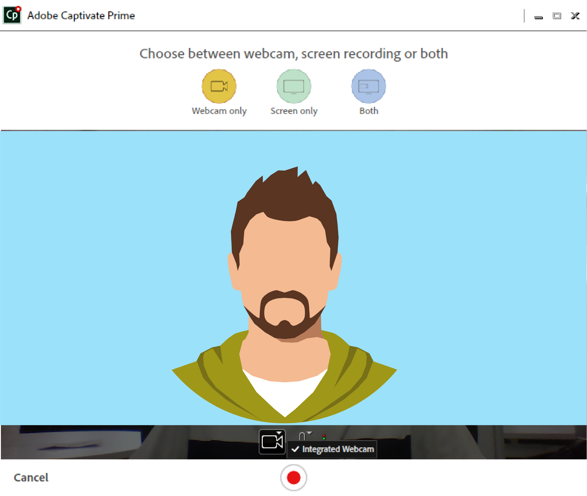
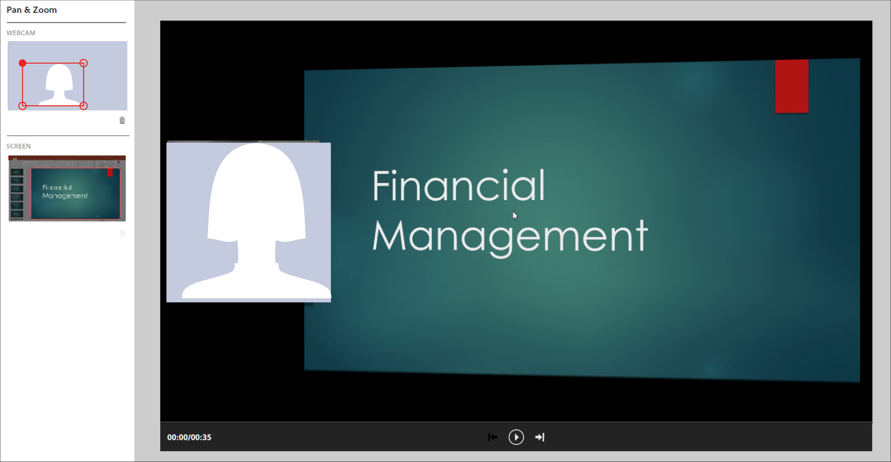
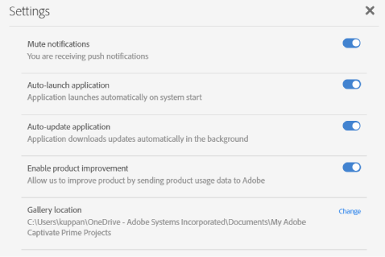

# Adobe Learning Manager 데스크탑 응용 프로그램

소셜 학습에서 공유할 수 있는 콘텐츠를 생성하고 개선하도록 Adobe Learning Manager의 데스크탑 응용 프로그램을 사용하는 방법에 대해 알아봅니다.

Adobe Learning Manager 데스크탑 응용 프로그램은 기본적으로 Learning Manager 소셜 학습을 사용하는 학습자들을 위한 것입니다. 응용 프로그램을 데스크탑에 설치하면 학습자는 콘텐츠를 생성하고 Learning Manager의 게시판에 게시하여 동료들 간에 정보성의 협업 및 소셜 학습을 용이하게 할 수 있습니다. 또한 데스크탑 응용 프로그램을 통해 학습자가 Learning Manager의 웹 응용 프로그램에 필수적으로 로그인되어 있지 않더라도 데스크탑에서 소셜 학습 알림을 받을 수도 있습니다.

학습자는 비디오, 오디오 및 스크린샷을 포함한 풍부한 콘텐트를 생성하고 다른 학습자와 공유할 수 있습니다. 콘텐츠는 말 그대로 소프트웨어 데모나 워크스루, 프레젠테이션, 팟캐스트 또는 공유할 수 있는 콘텐츠의 주석 스크린샷 등 무엇이든 될 수 있습니다.

Learning Manager 소셜 학습 웹 페이지에서 새 게시물을 클릭하고 비디오 녹화, 오디오 녹음, 스크린샷 찍기, 또는 Learning Manager 갤러리를 선택하여 데스크탑 응용 프로그램을 시작합니다. 소셜 학습에 대한 자세한 내용을 보려면 [여기를 클릭](feature-summary/social-learning-web-user.md)하십시오.

사용자에게 데스크탑 응용 프로그램이 없는 경우 Adobe Learning Manager 데스크탑 페이지에서 다운로드할 수 있습니다. 다운로드할 수 없다면 [여기를 클릭](../kb/troubleshooting-issues-with-adobe-learning-manager-desktop-app.md)하십시오.

사용자가 응용 프로그램 설치를 완료하면 Learning Manager 학습자 자격 증명을 사용하여 로그인해야 합니다. 홈 페이지는 아래 스크린샷과 같이 나타납니다.

>[!NOTE]
>
>소셜 학습이 계정에 대해 비활성화된 경우 학습자는 데스크탑 응용 프로그램을 사용할 수 없습니다.

<!---->
<!--*Home page*-->

## 비디오 만들기 {#creatingavideo}

데스크탑 응용 프로그램을 사용하면 사용자는 웹, 화면 및 둘 다를 레코딩할 수 있습니다.

<!---->
<!--*Record web, screen, or both*-->

다음을 수행하여 비디오 레코딩을 만들고 소셜 학습 웹 플랫폼에 게시합니다.

1. 하드웨어 및 소프트웨어 요구 사항이 충족되었는지 확인하십시오. 자세한 내용은 [시스템 요구 사항](../system-requirements.md)을 참조하십시오.
1. 소셜 학습에서 레코딩을 시작하려면 Learning Manager 데스크탑 응용 프로그램을 여는 비디오 레코딩 녹화(웹, 화면, 둘 다) 아이콘을 선택합니다. 사용자가 로그인한 데스크탑 응용 프로그램에서 콘텐츠를 생성하고 게시할 수 있습니다.
1. 데스크탑 응용 프로그램에서 레코딩을 시작하려면 Learning Manager 학습자 자격 증명을 사용하여 응용 프로그램에 로그인합니다.
1. 홈 페이지가 나타납니다.
1. 게시물을 생성하려면 홈 페이지에 제공된 세 가지 옵션 중 하나를 선택할 수 있습니다. 레코딩 창을 시작하려면 비디오 레코드 아이콘을 클릭합니다.
1. 요구 사항에 따라 웹캠, 화면 또는 둘 다를 선택할 수 있습니다.

   **웹캠** 웹캠은 오디오를 포함한 프로젝트 또는 응용 프로그램을 설명하거나 나타내는 내레이터를 캡처합니다. 라이브 창이 표시되게 하려면 위의 옵션에서 웹캠 아이콘을 선택합니다.

   **화면** 모니터 화면에서 수행된 작업을 기록합니다. 화면 아이콘을 선택하면 화면 중심에서 레코드 대화 상자와 함께 화면이 강조 표시됩니다.

   **둘 다** 내레이터와 화면 동작을 모두 기록합니다. 마지막 아이콘을 선택하면 화면이 강조 표시되고 사용자는 라이브 창을 받습니다.

1. 레코딩 환경 설정을 지정합니다.

   **카메라 선택** 비디오 레코드 창의 하단에서 비디오 카메라 아이콘을 클릭합니다. 사용자가 주어진 옵션에서 사용하려는 카메라를 선택합니다.

   **마이크 선택** 비디오 또는 오디오 창 아래쪽에 있는 마이크 아이콘을 클릭하고 지정된 옵션에서 사용자가 사용하려는 마이크를 선택합니다.

   >[!NOTE]
   >
   >사용자가 화면 또는 비디오로 오디오를 레코딩하지 않으려는 경우 오디오 아이콘 클릭 시 표시되는 드롭다운 목록에서 **없음** 옵션을 선택합니다.
   >
   >사용자가 화면 또는 자체 레코딩을 시작하면 오디오 지원 없이 레코딩을 계속할지 확인 여부를 묻는 팝업 대화 상자가 나타납니다. 계속하려면 예를 클릭합니다.

1. 레코드 버튼을 사용하여 레코딩을 시작합니다. 레코딩은 카운트다운(3초) 후 시작됩니다.
1. 레코딩하는 동안 일시 정지 또는 다시 시작 버튼을 클릭한 다음 원하는 경우 다시 시작합니다. 레코딩을 편집하려면 [레코딩 편집](adobe-learning-manager-app-for-desktop.md#Editing)을 참조하고 게시하려면 [레코딩 게시](adobe-learning-manager-app-for-desktop.md#Publishing)를 참조하십시오.

## 오디오 만들기 {#creatinganaudio}

<!---->
*오디오 녹음*

오디오를 레코딩하려면 다음을 수행합니다.

1. Learning Manager 데스크탑 응용 프로그램 시작 창에서 오디오 녹음 아이콘을 클릭합니다.
1. 마이크 볼륨 아이콘을 클릭하고 볼륨을 조정하여 마이크 볼륨이 켜져 있는지 확인합니다.
1. 레코딩 버튼을 클릭하여 레코딩을 시작합니다.
1. 사용자가 오디오 레코딩을 완료하면 일시 중지 버튼을 클릭하여 레코딩을 중지합니다.
1. 레코딩을 미리 보려면 재생 버튼을 클릭합니다.
1. 사용자가 동일한 파일에 추가 오디오를 레코딩하려면 **[!UICONTROL 다시 시작]**&#x200B;을 클릭합니다. 원하는 기록이 충족되면 을 클릭합니다. **[!UICONTROL 다음]** 원하는 위치에 파일을 저장합니다. 레코딩은 Adobe Learning Manager 앱에 저장되고 사용자는 데스크탑 갤러리에서 레코딩과 스크린샷을 볼 수 있습니다.
1. 레코딩을 편집하려면 [레코딩 편집](adobe-learning-manager-app-for-desktop.md#Editing)을 참조하고 게시하려면 [레코딩 게시](adobe-learning-manager-app-for-desktop.md#Publishing)를 참조하십시오.

## 스크린샷 만들기 {#creatingascreenshot}

스크린샷을 찍으려면 다음을 수행합니다.

1. Learning Manager 데스크탑 응용 프로그램 홈 페이지에서 스크린샷 아이콘을 클릭합니다.
1. 화면의 일부만 캡처하려면 일부 화면 자르기 아이콘을 클릭합니다. 전체 화면을 캡처하려면 전체 화면 캡처 아이콘을 클릭합니다.

   <!--
   *Capture a screenshot*-->

1. 다른 학습자가 프레젠테이션 또는 정적 콘텐트를 더 잘 이해하고 유지하는 데 도움이 되도록 콘텐트에 주석을 추가합니다.
1. 스크린샷을 편집하려면 [여기를 클릭](adobe-learning-manager-app-for-desktop.md#Editing)스크린샷을 게시하려면 [여기를 클릭](adobe-learning-manager-app-for-desktop.md#Publishing).

## 비디오, 오디오 및 스크린샷 편집 {#editing}

파일이 저장되면 다음 옵션을 사용하여 레코딩을 완벽하고 전문적으로 보일 수 있도록 하는 시스템에 편집 창이 즉시 나타납니다.

## 주석(비디오 레코딩 및 스크린샷) {#annotationsvideorecordingsandscreenshots}

주석은 특정 세부 사항을 강조 표시하거나 다른 사용자가 읽은 일부 텍스트를 작성하도록 비디오 레코딩 및 스크린샷에 사용할 수 있습니다.

>[!NOTE]
>
>비디오의 경우 사용자는 화면 상단에만 주석을 달 수 있습니다.

* 선택할 수 있는 다양한 주석에는 **타원**, **선**, **화살표**, 강조 표시&#x200B;**및**&#x200B;텍스트&#x200B;**가 있습니다.**

* 주석의 속성 패널에 있는 색상 패널에서 각 주석의 색상을 선택합니다.
* **텍스트**&#x200B;의 경우 다음 속성을 선택합니다: 글꼴, 굵게, 기울임꼴, 머리말, 정렬, 색상 및 배경색.

>[!NOTE]
>
>텍스트의 배경색을 보려면 배경색을 [예]로 설정합니다.

## 트리밍(모든 유형의 비디오 및 오디오 레코딩) {#trimalltypesofvideoandaudiorecordings}

필요하지 않은 비디오 또는 오디오 부분을 트리밍하거나 제거하려면 트리밍 도구를 사용합니다.

트리밍하려면 **[!UICONTROL 트리밍 시작]** 트리밍을 시작하려면 타임라인에서 버튼을 클릭하거나 더하기 아이콘을 클릭합니다. 그런 다음 플레이어에서 일시 중지 버튼을 클릭하여 트리밍을 중지합니다. **[!UICONTROL 확인]** 버튼을 클릭하여 트리밍을 완료합니다.

레코딩은 타임라인에 시간을 입력하여 트리밍할 수 있습니다. **[!UICONTROL 시작 시간]** 및 **[!UICONTROL 종료 시간]** 활성화 후 입력 필드 **[!UICONTROL 시간 배치 변경]**.

*트리밍 시작*

*트리밍 확인*

## 팬 및 확대/축소(모든 비디오 레코딩) {#panampzoomanyvideorecording}

팬 및 확대/축소 작업은 **둘 다** (웹캠 및 화면) 비디오 녹화. 기본적으로 전체 웹캠 또는 화면이 선택되어 있습니다 코너 핸들을 선택하고 드래그하여 표시하거나 포커스를 둘 화면의 부분을 선택합니다. 전체 화면으로 사용할 창을 두 번 클릭합니다.

*팬 및 확대/축소*

## 브랜딩(모든 유형의 비디오 레코딩) {#brandingalltypesofvideorecordings}

지속적인 테마와 함께 비디오의 고유한 이름을 만들려면 브랜딩 도구를 선택합니다. 브랜딩의 목표는 학습 관리 시스템에서 중요하고 차별화된 존재감을 확립하여 학습자가 전체 비디오를 보도록 확보하고 유지하는 것입니다.

브랜드 또는 테마를 비디오에 추가하려면 다음을 수행합니다.

1. 편집 창의 왼쪽 탐색 패널에서 브랜딩 아이콘을 클릭합니다.
1. 선택 **테마** 주어진 옵션에서 또는 사용자가 다음을 추가하여 자신의 테마를 사용자 정의할 수 있습니다. **시작**, **배경,** 및 **종료** 해당 시스템의 비디오

   >[!NOTE]
   >
   >더 많은 테마를 다운로드하려면 **더 많은 애셋 받기** 버튼을 클릭합니다.

1. 비디오 제목 텍스트를 추가하고 **다음에서 표시** 그리드에서 표시할 위치를 선택합니다.

   >[!NOTE]
   >
   >제목 텍스트는 브랜딩 비디오의 일부로만 추가할 수 있습니다. 테마는 제목을 브랜딩 비디오에 제공하기 전에 필요합니다.

1. 필요한 경우 발표자 이름 및 발표자 제목을 비디오에 추가합니다. 비디오를 재생하는 동안 표시할 프레젠터 이름 및 제목에 대한 재생 헤드 필드의 디스플레이에서 비디오 시간 범위 내의 숫자를 입력합니다.
1. 필요한 경우 비디오 화면의 왼쪽 또는 오른쪽에 브랜딩 아이콘을 추가합니다. 브랜딩 아이콘을 선택하려면 **[!UICONTROL 선택]** > **[!UICONTROL 시스템에서 찾아보기]**.
1. 비디오를 미리 보려면 미리 보기 화면에서 재생 버튼을 클릭합니다.

   

   *브랜딩*

## 추가 클립 레코딩(모든 유형의 비디오 및 오디오 레코딩) {#recordingadditionalclipsalltypesofvideoandaudiorecordings}

추가 오디오 및 비디오 클립은 기존 비디오 또는 오디오 파일에 레코딩할 수 있습니다.

새 레코딩을 시작하려면 추가 클립 레코드 아이콘을 클릭합니다. 새 레코딩은 편집 중인 레코딩의 재생 헤드 위치에 삽입됩니다.

## 비디오 레코딩, 오디오 레코딩 및 스크린샷 게시 {#publishing}

변경 및 편집이 모두 완료되면 **[!UICONTROL 공유]** > 를 입력하거나 검색합니다. **스킬 또는 보드** 게시물과 가장 관련이 깊음 > **게시물**.

<!---->
*웹에 게시*

## Learning Manager 데스크탑 갤러리 찾아보기 {#browsingcaptivateprimedesktopgallery}

모든 레코딩 및 스크린샷은 Adobe Learning Manager 데스크탑 응용 프로그램에 저장됩니다. 이러한 파일을 찾아보려면 **[!UICONTROL 갤러리]** 홈 페이지의 왼쪽 탐색 패널에서

>[!NOTE]
>
>갤러리는 소셜 학습에서 다음을 클릭하여 실행할 수도 있습니다. **Learning Manager 갤러리** 아이콘을 클릭합니다(게시물 생성 중).

갤러리 창에서 검색 필드에 찾고 있는 파일 이름을 입력합니다.

갤러리 창에서 새 레코딩을 생성하려면 **새로 레코딩** 버튼을 클릭합니다.

갤러리에서 파일을 편집하거나 삭제하려면 파일 하단에서 세 개의 점을 클릭하고 팝업 목록에서 옵션을 선택합니다.

## 알림 {#notifications}

Learning Manager의 알림은 학습자가 Learning Manager 웹 응용 프로그램에 로그인했는지 여부와 상관없이 알림 창에 나타납니다. 알림에는 사용자가 생성했거나 팔로우 중이거나 참여한 게시물 또는 게시판이 포함됩니다. 알림을 클릭하면 사용자가 Learning Manager 소셜 학습 웹으로 이동합니다.

알림을 음소거하려면 **[!UICONTROL 프로필 메뉴*]* > **[!UICONTROL 설정] > **[!UICONTROL 알림 음소거]**.

## Adobe Learning Manager 데스크탑 응용 프로그램의 설정 {#settingsinadobecaptivateprimedesktopapplication}

**설정** 페이지에서 다음 설정을 변경합니다.

알림 음소거, 응용 프로그램 자동 실행, 응용 프로그램 자동 업데이트, 제품 개선 활성화.

사용자는 **변경** 하이퍼링크를 클릭하여 갤러리 위치를 변경할 수도 있습니다.

*Adobe Learning Manager 앱 설정*
