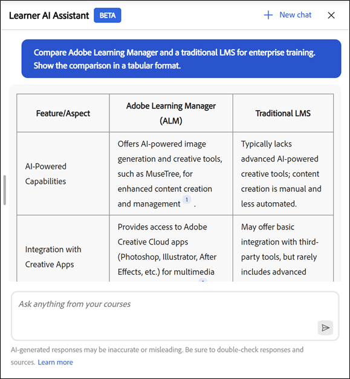

# 학습자 도우미

학습자용 학습자 AI 도우미(Beta)는 전체 강의를 살펴보지 않고도 할당된 학습 콘텐츠에서 답변을 빠르게 찾을 수 있도록 도와줍니다. 일반 언어로 질문을 하고 관련 강의 콘텐츠에 대한 소스 링크를 통해 정확하고 집중적인 응답을 받을 수 있습니다.

>[!IMPORTANT]
>
>학습자 AI 어시스턴트는 현재 Beta이며 단계별 롤아웃을 통해 릴리스됩니다. 액세스는 사용자에 따라 다를 수 있습니다.

## 학습자 AI 어시스턴트란?

학습자 AI Assistant는 Adobe Learning Manager에서 사용할 수 있는 신뢰할 수 있는 학습 콘텐츠를 사용하여 학습자 질문에 대한 빠르고 정확한 답변을 제공하는 Adobe Learning Manager의 GenAI 기반 채팅 도우미입니다. 인용문도 포함되어 있어 학습자는 항상 정보의 출처를 알고 있다.

## 왜 사용합니까?

* 학습자는 콘텐츠 과부하에 직면하여 어디서부터 시작해야 할지 어떤 리소스를 사용해야 할지 모르는 경우가 많습니다.

* 카탈로그 및 액세스 규칙을 사용하면 사용할 수 있는 콘텐츠를 찾기 어렵습니다.

* 학습 여정은 강의, 가상 강의실, 작업 지원, 평가 등 다양한 포맷과 교육 유형으로 나뉩니다.

* SCORM, PDF, 문서, 비디오 또는 대본과 같은 다양한 형식에서 특정 정보를 검색하는 쉬운 통합된 방법은 없습니다.

* 다양한 학습자 역할 및 산업(예: 영업, 마케팅, 지원, 운영)에는 상황에 맞는 빠른 답변이 필요한 고유한 정보 요구 사항이 있습니다.

## AI 어시스턴트가 받아쓸 수 있는 콘텐츠 유형은 무엇입니까?

AI 어시스턴트는 사용자에게 할당된 모든 유형의 학습 콘텐츠에서 다음과 같은 정보를 찾을 수 있습니다.

* **문서:** PDF, Word, PowerPoint, Excel, HTML

* **미디어:** 오디오(mp3, wav, m4a), 비디오(mp4, mov, wmv)

* **대화형 콘텐츠:** SCORM 1.2, SCORM 2004,

* **학습 개체 유형:** 과정, 학습 경로, 인증, 작업 지원

Adobe은 Adobe의 프라이빗 VPC 환경 내에서 호스팅되는 신뢰할 수 있는 서드파티 프로세싱 서비스를 사용하여 학습 콘텐츠를 안전하게 받아씁니다.

**중요**

AI 길잡이는 다음 콘텐츠만 소비합니다.

* 관리자가 학습자 도우미용으로 구성한 카탈로그에서 사용할 수 있으며,

* Adobe Learning Manager 내부 카탈로그의 일부입니다.

공유, 획득, 외부 또는 기타 비내부 카탈로그는 현재 릴리스에서 AI Assistant의 콘텐츠 소스로 지원되지 않습니다.

강의에 액세스할 수 없는 경우 관련 인용 링크에 액세스할 수 없습니다. 타사 라이브러리(예: LinkedIn Learning 또는 Go1)는 답변 검색에 포함되지 않습니다.

## 대화 기능

AI 어시스턴트는 단일 질문과 멀티턴 대화를 모두 지원합니다. 이렇게 하면 같은 세션 내의 이전 쿼리를 다시 표시합니다.

**대화 예:**

&quot;환불 정책은 무엇입니까?&quot;
길잡이: 요약을 제공합니다
&quot;30일 후 환불은 어떻습니까?&quot;
길잡이: 보다 구체적인 정보를 반환합니다.

## AI 길잡이의 사용 사례

### 적시 학습 지원(모든 학습자)

학습자는 작업하는 동안 전체 강의 재생이 아닌 빠른 답변이 필요한 경우가 많습니다. AI 어시스턴트를 통해 할당된 학습 콘텐츠에서 정밀한 정보를 즉시 검색할 수 있다.

**도움이 되는 기능:**

* 강의, 작업 지원 및 문서에서 특정 질문에 대한 직접적인 답변 얻기

* 인용문을 사용하여 정확하게 참조된 섹션으로 이동

* 여러 학습 객체 간의 검색 시간 단축

### 영업 지원 및 고객 대화

영업 팀은 라이브 고객 상호 작용 중에 빠르고 정확한 제품 및 프로세스 정보를 필요로 합니다. AI 비서는 온디맨드 지식 도우미 역할을 합니다.

**도움이 되는 기능:**

* 최신 제품 기능 및 포지셔닝 검색

* 교육 콘텐츠에서 빠른 영업 스크립트 또는 토킹 포인트 생성

* 할당된 학습 자료를 사용하여 제품 버전 또는 제품 비교

* 전체 강의를 다시 수강하지 않고도 영업 지식 강화

**예 2**

**목적:** AI Assistant를 사용하여 영업 담당자가 고객 비교 질문에 즉시 답할 수 있도록 지원합니다.

**권장 프롬프트:** Adobe Learning Manager과 기업 교육용 기존 LMS를 비교합니다. 비교를 표 형식으로 표시합니다.

### 마케팅 및 캠페인 준비도

마케팅 팀은 검토, 시작 또는 이해 관계자 토론에 앞서 빠른 업데이트자가 필요한 경우가 많습니다. AI 어시스턴트가 복잡한 학습 콘텐츠를 실행 가능한 통찰력으로 요약한다.

**도움이 되는 기능:**

* 긴 강의 또는 비디오를 주요 요지로 요약

* 회의 전에 프로세스 또는 제품 지식 새로 고침

* 관련 학습 콘텐츠를 탐색하여 전문성 강화

### 운영 및 프로세스 설명

운영, 지원 및 내부 팀은 정확한 프로세스 문서를 사용합니다. AI 어시스턴트를 통해 정책과 워크플로우를 즉시 명확하게 할 수 있습니다.

**도움이 되는 기능:**

* 내부 프로세스, SOP 및 규정 준수 지침에 대한 답변 찾기

* 긴 문서를 탐색하지 않고도 단계 수준 세부 사항을 명확하게 표시합니다.

* 반복적인 질문에 대한 SME의 의존도 감소

### 더 빠른 온보딩 및 역할 전환

새로운 직장으로 옮기는 신입 사원들은 종종 대규모 학습 카탈로그를 탐색하는 데 어려움을 겪습니다. AI 비서는 관련 답변을 안내하여 가속화합니다.

**도움이 되는 기능:**

* 할당된 콘텐츠에서 일반적인 온보딩 질문에 답변

* 역할별 개념에 대한 빠른 설명 제공

* 정보 과부하 없이 자기주도학습 지원

### 지식 갱신 및 지속적인 학습

경험이 많은 학습자는 재교육을 받는 것보다 빠른 재교육이 필요하다. AI 비서는 일의 흐름에 있어 지속적인 학습을 지원한다.

**도움이 되는 기능:**

* 강의를 다시 시청하지 않고 온디맨드로 지식 새로 고침

* 교육 완료 후 학습 성과 강화

* 학습 콘텐츠를 자주, 노력을 적게 기울이는 참여를 유도합니다.

## 학습자 AI 도우미가 콘텐츠를 사용하는 방식

학습자 AI 도우미를 사용하면 학습하는 동안 정확한 답변을 빠르게 찾을 수 있습니다. 이를 효과적으로 활용하기 위해서는 조수가 어떤 내용을 사용하는지, 어떤 내용을 사용하지 않는지, 어떻게 반응을 생성하는지 이해해야 한다.

### AI 어시스턴트는 어떤 콘텐츠를 사용합니까

학습자 AI 도우미는 Adobe Learning Manager에서 자신에게 할당된 학습 콘텐츠만 사용하여 질문에 답변합니다.

* 어시스턴트는 책임자가 학습자 AI 어시스턴트에 대해 활성화한 내부 카탈로그의 콘텐츠를 사용합니다.

* 도우미는 정보를 검색할 때 사용자의 역할, 그룹 구성원 및 카탈로그 권한을 준수합니다.

### AI 어시스턴트가 사용하지 않는 콘텐츠는 무엇입니까?

학습자 AI 어시스턴트는 응답이 할당된 학습 범위로 제한됩니다.

* 기본값, 공유됨, 획득됨, 외부 또는 기타 비내부 카탈로그의 콘텐츠는 사용하지 않습니다.

* linkedIn Learning 또는 Go1과 같은 서드파티 콘텐츠 라이브러리에서 정보를 검색하지 않습니다.

* 답변을 생성하기 위해 인터넷을 탐색하거나 외부 웹 사이트에 액세스하지 않습니다.

### AI 어시스턴트가 답변을 생성하는 방식

학습자 AI 도우미는 할당된 학습 콘텐츠를 분석하여 집중적이고 상황에 맞는 응답을 생성합니다.

* 모든 응답에는 원본 소스 콘텐츠를 참조하는 인용이 포함됩니다.

* 인용문을 선택하여 관련 강의, 모듈 또는 문서로 바로 이동할 수 있습니다.

* 인용문을 사용하면 정보를 확인하고 필요할 때 추가 컨텍스트를 탐색할 수 있습니다.

### AI 비서를 책임감 있게 사용

학습자 AI 어시스턴트를 학습 보조 도구로 사용하여 지식을 탐색하고 새로 고침하며 보강합니다.

* 사용 가능한 학습 콘텐츠를 기반으로 응답을 지침으로 처리합니다.

* 완전하고 권위 있는 정보는 인용된 출처 자료를 참조한다.

### 관리자가 액세스를 제어하는 방법

책임자는 학습자 AI 어시스턴트에 대한 액세스를 관리하고 학습자가 사용하는 콘텐츠를 제어합니다.

* 책임자는 특정 사용자 그룹에 비서를 할당합니다.

* 책임자는 도우미가 콘텐츠 소스로 사용할 수 있는 내부 카탈로그를 선택합니다.

* 이러한 컨트롤은 지원자가 승인되고 관련 있는 학습 콘텐츠만 표시하도록 합니다.

## 기본 제공 프롬프트 정보

학습자 AI 도우미에는 학습자가 일반적인 질문과 시나리오를 빠르게 시작할 수 있도록 도와주는 메시지가 내장되어 있습니다. 이러한 프롬프트는 학습자가 도우미와 상호 작용하는 방법을 안내하고 질문할 수 있는 질문 유형을 보여줍니다.

기본 제공 프롬프트는 계정별로 사용자 정의할 수 있습니다. 조직은 학습 목표, 학습자 역할, 용어 또는 특정 사용 사례를 반영하도록 이러한 프롬프트를 조정할 수 있습니다.

관리자는 CSM(Customer Success Manager)과 협력하여 계정에 대한 기본 제공 메시지를 구성, 수정 또는 업데이트할 수 있습니다. 프롬프트 사용자 정의는 계정 수준에서 관리되며 현재 릴리스의 Adobe Learning Manager 사용자 인터페이스 내에서 직접 구성할 수 없습니다.

학습자에게 표시되는 메시지는 Adobe으로 정의된 구성에 따라 계정에 따라 다를 수 있습니다.

## 학습자 AI 도우미 활성화

AI 어시스턴트(베타)는 학습자가 콘텐츠를 더 효과적으로 검색하고 참여할 수 있도록 AI 기반 지원을 제공합니다. 관리자는 특정 사용자 그룹 및 카탈로그에 기능을 할당하여 액세스를 제어합니다. AI Assistant를 구성할 때는 내부 카탈로그만 사용해야 합니다. 공유, 획득됨, 외부 또는 기타 비내부 카탈로그의 콘텐츠는 AI 어시스턴트 응답 및 인용의 표면에 대해 지원되지 않습니다.

책임자는 AI 어시스턴트 기능에 액세스할 수 있는 사용자 그룹과 내부 카탈로그를 선택합니다. 할당된 카탈로그에 AI 응답 및 인용을 통해 표면화하는 데 적합한 학습 콘텐츠만 포함되고 해당 카탈로그가 공유, 획득 또는 외부가 아닌 내부인지 확인해야 합니다.

AI 도우미(Beta)를 구성하기 전에 관리자 자격 증명이 있는지, 그리고 기능에 액세스할 수 있는 사용자 그룹과 카탈로그를 식별했는지 확인하십시오.

### 학습자 도우미 액세스 구성

학습자 AI 어시스턴트를 활성화하는 방법:

&#x200B;1. 관리자 권한으로 Adobe Learning Manager에 로그인합니다.

&#x200B;2. 홈페이지에서 **설정**&#x200B;을 선택합니다.

&#x200B;3. **설정** 메뉴에서 **학습자 AI 도우미(Beta)**&#x200B;를 선택합니다.

&#x200B;4. 토글 스위치를 선택하여 **학습자 AI 도우미(Beta)**&#x200B;를 활성화합니다.

&#x200B;5. **적격 사용자 그룹** 옵션에서 하나 이상의 사용자 그룹을 선택합니다.

&#x200B;6. **저장**&#x200B;을 선택하여 사용자 그룹 설정을 적용합니다.

&#x200B;7. **적격 카탈로그** 옵션에서 하나 이상의 카탈로그를 선택하십시오.

&#x200B;8. **저장**&#x200B;을 선택하여 카탈로그 설정을 적용합니다.

>[!IMPORTANT]
>
>내부 카탈로그만 AI Assistant에서 지원합니다. 공유, 획득됨, 외부 또는 기타 비내부 카탈로그를 선택한 경우 카탈로그가 적격 카탈로그 목록에 표시되더라도 AI 어시스턴트가 해당 콘텐츠를 표면화하지 않습니다.

## Adobe Learning Manager에서 학습자 AI 도우미 액세스

Adobe Learning Manager의 학습자 AI 도우미(베타)를 사용하면 학습하는 동안 빠르게 답변을 찾을 수 있습니다. 이 지능형 도구는 학습자 계정의 강의, 콘텐츠 및 플랫폼 기능에 대한 질문에 바로 답변합니다.

AI 길잡이는 관리자가 학습자 길잡이에 대해 활성화한 내부 카탈로그의 콘텐츠만 사용할 수 있습니다. 공유, 획득됨 또는 외부 카탈로그에만 있는 콘텐츠는 포함되지 않습니다.

학습자 AI 도우미(베타)는 선택한 학습자만 사용할 수 있습니다.

### AI Assistant 실행

학습자 AI 어시스턴트를 실행하려면

&#x200B;1. 학습자로 Adobe Learning Manager에 로그인합니다.

&#x200B;2. 홈페이지에서 **AI 도우미에 질문**&#x200B;을 선택합니다.

가 표시됩니다.

&#x200B;3. **학습자 AI 도우미(Beta)** 화면이 나타나면 **시작하기**&#x200B;를 선택합니다.

>[!NOTE]
>
>AI 어시스턴트를 처음 시작할 때는 사용 전 동의를 반드시 해야 한다. 동의 대화 상자는 최초 실행 중에만 표시됩니다. 이후 모든 실행의 경우 음성 안내를 입력할 수 있도록 AI Assistant로 직접 이동합니다.

&#x200B;4. 텍스트 필드에 프롬프트를 입력합니다.

&#x200B;5. 응답을 받으려면 **Enter**&#x200B;를 누르십시오. 답변, 소스 및 권장 사항을 검토하십시오.

Adobe을 사용하면 계정 수준에서 즉시 사용자 정의할 수 있습니다. 기본 제공 메시지를 구성하거나 업데이트하려면 Adobe 고객 성공 관리자(CSM)에게 문의하십시오.

AI 어시스턴트 응답에는 학습자가 정보의 출처를 쉽게 확인할 수 있도록 모든 응답과 함께 인용문이 포함됩니다. 인용된 각 참조 링크는 원래 강의 모듈, 작업 지원 또는 기타 학습 콘텐츠에 연결됩니다.

학습자는 다음을 수행할 수 있습니다.

* 참조된 정확한 섹션으로 이동하려면 인용구 번호 인라인을 선택합니다

* 응답 하단에서 **소스 표시**&#x200B;를 선택하여 전체 소스 목록을 엽니다.

학습자 도우미에는 정보의 출처를 나타내기 위해 모든 응답과 함께 인용문이 포함됩니다. 각 인용문은 답을 생성하는 데 사용된 원래 강의, 모듈 또는 학습 객체에 직접 연결됩니다.

인용을 선택하여 Adobe Learning Manager에서 실제 강의 페이지를 열고 컨텍스트에 따라 전체 내용을 검토할 수 있습니다. 인용 내용은 정보를 확인하고, 추가 세부 정보를 탐색하고, 신뢰할 수 있는 출처에서 계속 학습하는 데 도움이 됩니다.

## 검색을 사용하여 AI 길잡이에 액세스

책임자는 검색 막대에서 직접 AI 어시스턴트를 시작할 수도 있습니다. 질문을 입력하고 아래에 표시되는 옵션에서 **AI 도우미에 질문**&#x200B;을 선택하면 할당된 학습 콘텐츠에서 답변을 얻을 수 있습니다.

## 학습자 AI 도우미(베타) 응답에 대한 피드백 제공

학습자 AI 어시스턴트(베타)에서 생성된 응답에 대한 피드백은 정확성, 관련성 및 전반적인 성능을 개선하는 데 도움이 됩니다.

### 응답 좋아요 또는 싫어요

* **엄지손가락 올리기**&#x200B;를 선택하고, 응답에서 도움이 되는 항목을 선택하고, 선택적으로 댓글을 추가한 다음 **제출**&#x200B;을 선택합니다.

* **밑으로**&#x200B;를 선택하고 응답이 도움이 되지 않는 이유를 선택하고 댓글을 추가한 다음 **제출**&#x200B;을 선택합니다.

## AI Assistant에서 새 채팅 시작

학습자는 언제든지 현재 대화를 지우고 새 채팅을 시작할 수 있습니다.

* AI 도우미 화면에서 **새 채팅**&#x200B;을 선택한 다음 **예**&#x200B;를 선택합니다.

