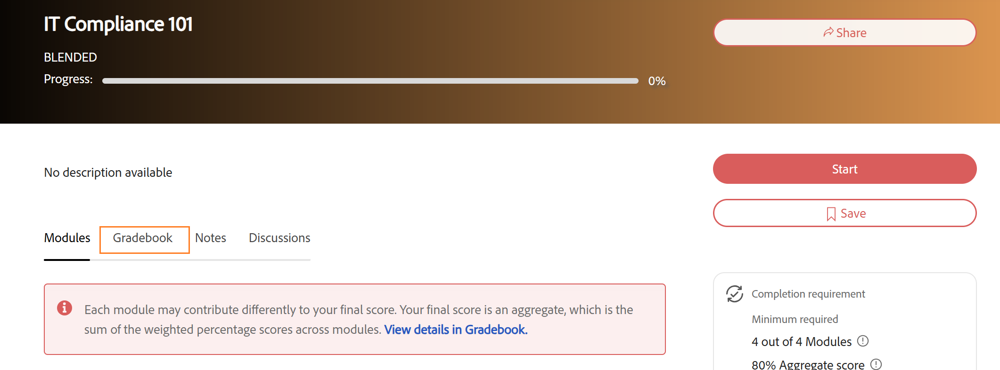
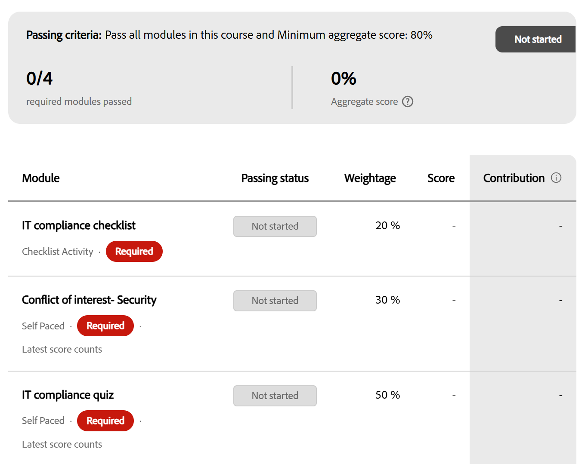

# 학습자용 성적 증명서

## 그레이드북으로 강의 시작

Adobe Learning Manager에서 강의에 대해 그레이드북이 활성화되어 표시되면 **그레이드북** 탭이 강의 개요 페이지에 표시됩니다. 이를 사용하여 각 모듈에 대한 가중 점수, 현재 합산 점수 및 합격 여부에 따라 강의를 더 완료해야 하는지 여부를 확인할 수 있습니다.

## 그레이드북을 사용할 수 있는 경우

작성자 또는 관리자가 강의에 대한 그레이드북 가시성을 활성화한 경우 강의 플레이어에서 **그레이드북** 탭이 **모듈**, **참고** 및 **토론**&#x200B;과 함께 나타납니다. 탭이 표시되지 않거나, 이 강의에 대해 성적 증명서가 활성화되지 않았거나, 책임자가 학습자 가시성을 비활성화했습니다. 점수는 계속 기록되어 관리자에게 표시될 수 있습니다.

등록 중 언제든지 **Gradebook** 탭을 열 수 있습니다.

* **시작하기 전:** 등록 후에 해당 가중치, 각 항목의 최대 점수 및 작성자가 설정한 합격 기준과 함께 점수를 매길 수 있는 모듈의 전체 목록이 표시됩니다. 이것은 시작하기 전에 강의 점수를 정확히 어떻게 매기는지 보여줍니다.
* **진행 중:** 모듈과 점수를 완료하면 아직 시도하지 않았거나 등급을 기다리는 모듈과 함께 지금까지 점수를 표시하도록 성적 증명서가 업데이트됩니다.
* **완료 후:** 성적 증명서에는 모든 최종 모듈 점수, 계산된 총 강의 점수 및 헤더의 **합격** 결과가 표시됩니다.

## 그레이드북 보기

* **내 학습**&#x200B;에서 강의를 선택합니다.
* 강의 페이지에서 **성적 증명서** 탭을 선택합니다.

  성적 증명서 헤더에는 다음이 표시됩니다.

  

* **통과 조건:** 필요한 최소 집계 점수 및 모듈 수
* 총 모듈 중 완료한 필수 모듈 수
* 현재 **집계 점수**(백분율)
* 현재 강의 상태: **시작되지 않음**, **완료 보류 중**, **합격** 또는 **실패**

헤더 아래의 모듈 테이블에는 각 모듈에 대해 다음 열이 표시됩니다.

| **열** | **표시 내용** |
|------------|-------------------|
| **모듈** | 모듈 이름 및 유형 |
| **상태** | 이 모듈에 대한 완료 또는 점수 상태(아래 상태 참조) |
| **가중치** | 이 모듈이 집계 점수에 기여하는 비율입니다 |
| **점수** | 이 모듈에 대한 점수(예: 40/100) |
| **기여도** | 이 모듈이 지금까지 총 점수에 추가한 실제 백분율 점수 |

## 모듈 탭에서 모듈 가중치 보기

또한 그레이드북을 열지 않고도 **모듈** 탭에서 각 모듈의 가중치를 확인할 수 있습니다.

강의 페이지에서 **모듈** 탭을 선택합니다.

**모듈** 탭에는 각 모듈의 가중치 비율과 과정을 완료하는 데 필요한 모듈 수가 표시됩니다.

## 다중 시도 시 모듈 점수

모듈이 여러 번 시도를 허용하는 경우, 성적 증명서에 표시되는 점수는 강의 작성자가 구성한 방식에 따라 다릅니다.

* **최고:** 모든 시도에서 가장 좋은 점수가 표시됩니다. 나중에 시도했을 때 점수가 낮다고 해서 기록된 점수가 줄어드는 것은 아닙니다.
* **최신:** 가장 최근 시도에서 얻은 점수가 항상 표시됩니다. 이후 시도에서 점수가 낮을수록 이전 점수가 대체됩니다.

## 모듈 상태 이해

성적표의 각 모듈에는 다음 상태 중 하나가 표시됩니다.

| **상태** | **의미** |
|------------|-------------------|
| **완료됨** | 모듈 완료 및 점수 기록 |
| **진행 중** | 모듈이 시작되었지만 아직 완료되지 않음 |
| **시작되지 않음** | 모듈이 아직 열리지 않음 |
| **실패** | 모듈이 점수를 부여했으며 점수가 모듈의 통과 임계값을 충족하지 않았습니다. |
| **검토 대기 중** | 모듈이 완료되었지만 강사 또는 관리자의 점수를 기다리고 있습니다. |
| **가중치 없음** | 모듈 유형이 점수 매기기(PDF, 비디오 등)를 지원하지 않고 집계에 기여하지 않음 |

## 집계 점수 계산 방법

총 점수는 각 점수화된 모듈의 가중치 기여도의 합계입니다.

(최대 점수÷ 달성한 점수) × 가중치 % = 모듈 기여도

성적 증명서의 **기여도** 열은 현재 집계에 대한 각 모듈의 기여도를 표시합니다. **가중치 없음**&#x200B;으로 표시된 모듈은 이 계산에서 제외됩니다.

점수부여 스케일이 모든 모듈에서 동일할 필요는 없습니다. 모듈은 100점 만점에, 모듈은 10점 만점에 두 가지 모두 정확한 기여를 한다. 공식은 가중치를 적용하기 전에 각각을 정규화합니다.

## 성적 증명서 점수 보기 및 보고

Adobe Learning Manager의 관리자는 강의에 등록된 모든 학습자에 대한 가중 성적 증명서 점수를 보고, 모듈별로 개별 학습자 성능으로 드릴인하고, 필터링된 학습자 성적 증명서를 다운로드하고, 콘텐츠 감사 추적 보고서에서 성적 증명서 구성 변경 사항을 추적할 수 있습니다.

## 강의에 대한 성적 증명서 보기

강의에 대해 그레이드북이 활성화되면 강의를 열 때 **보고서** 아래의 왼쪽 탐색에 새로운 **L2 피드백 - 그레이드북** 섹션이 나타납니다.

* 관리자 권한으로 Adobe Learning Manager에 로그인합니다.
* 왼쪽 탐색에서 **과정**&#x200B;을 선택하고 검토할 과정을 엽니다.
* 강의 탐색의 **보고서**&#x200B;에서 **L2 피드백 - 성적 증명서**&#x200B;를 선택합니다. **활성 피드백 성과표** 페이지가 열립니다.

다음 항목이 표시됩니다.

1. 강의의 합격 기준(필요한 최소 모듈 및 최소 합계 점수)
2. 등급별로 학습자를 보기 위한 필터 행: **합격**, **불합격** 또는 **완료 보류 중**
3. 합산 점수 공식: 각 모듈에 대한 합산 점수 = Σ(최대 점수÷ 달성된 점수) × 가중치
4. 각 학습자의 **집계 점수** 및 점수를 매길 수 있는 각 모듈에 대한 점수를 보여 주는 학습자 목록
5. 강의에 여러 인스턴스가 있는 경우 강의 인스턴스 간에 전환하는 인스턴스 드롭다운

점수화된 모듈을 아직 시도하지 않은 학습자는 점수 열에 대시를 표시합니다. 점수, PDF, 비디오, 오디오 및 이와 유사한 기능을 지원하지 않는 모듈은 점수 열로 표시되지 않습니다.

## 개별 학습자 점수 보기

**활성 피드백 성적 증명서**&#x200B;에서 학습자의 이름을 선택합니다.

개별 학습자 보기에는 다음이 표시됩니다.

1. 학습자 이름, 전자 메일 및 상태(**완료 보류 중**, **합격** 또는 **실패**)
2. 학습자가 완료한 총 점수 및 필수 모듈 수
3. 모듈 이름, 유형, 필수 여부, 상태, 가중치, 달성한 점수 및 집계에 대한 기여도를 보여 주는 모듈 테이블

모듈 테이블에는 점수를 매길 수 있는 모듈과 점수를 매길 수 없는 모듈이 모두 포함됩니다. 점수를 매길 수 있는 모듈은 해당 점수와 기여도를 표시합니다. 점수를 매길 수 없는 모듈은 [점수] 및 [기여도] 열에 대시를 표시합니다.

## 점수 모듈

책임자 및 강사에 대한 점수 매기기 동작이 현재 워크플로우에서 변경되지 않습니다.

* 기본 콘텐츠가 점수를 보고하면 **SCORM, AICC, xAPI 및 기본 퀴즈 모듈**&#x200B;이 자동으로 점수를 매깁니다.
* **강의실 세션, 가상 강의실 세션 및 활동 모듈**&#x200B;은 강사 또는 관리자가 **출석 및 점수** 페이지에서 채점합니다.

## 강의의 학습자 성적 증명서 다운로드

다음 두 가지 방법 중 하나를 통해 성적 증명서 페이지에서 이 강의로 필터링된 학습자 성적 증명서를 직접 다운로드할 수 있습니다.

* **활성 피드백 성적 증명서**&#x200B;에서 페이지의 오른쪽 상단에 있는 **학습자 성적 증명서 다운로드**&#x200B;를 선택합니다.
* 관리자 홈 페이지에서 **보고서**&#x200B;를 선택한 다음 **사용자 지정 보고서**&#x200B;를 선택합니다. 사용 가능한 보고서 목록에서 **학습자 성적 증명서**&#x200B;를 선택합니다.

자세한 내용은 릴리스에서 변경 사항 보고 를 참조하십시오.

## 콘텐츠 감사 추적 이벤트

콘텐츠 감사 추적은 두 개의 등급별 구성 이벤트를 캡처합니다.

| **이벤트** | **표시되는 경우** |
|-----------|---------------------|
| **학습자본 업데이트됨** | 작성자가 강의에 대한 그레이드북을 활성화하거나 비활성화하는 경우 |
| **모듈 두께 업데이트됨** | 작성자가 모듈의 가중치 비율을 변경하는 경우 |

자세한 내용은 릴리스에서 변경 사항 보고 를 참조하십시오.

이 항목을 사용하여 누가 성적 증명서 구성을 변경했는지, 특히 여러 작성자가 동일한 강의에서 협업하는 환경에서 언제 변경했는지 추적할 수 있습니다.

## 문제 해결

**L2 피드백 - 성적 증명서 섹션이 강의 탐색에 표시되지 않습니다.**

강의를 생성할 때 강의 작성자가 그레이드북을 활성화해야 합니다. 작성자가 강의 생성을 위해 그레이드북을 활성화했는지 확인합니다. 그레이드북을 사용할 수 있기 전에 강의를 생성한 경우 소급하여 추가할 수 없습니다. 새 강의 버전이 필요합니다.

**완료된 모듈에도 불구하고 학습자의 총 점수는 0입니다**

강의에 가중치 값이 할당된 점수를 매길 수 있는 모듈이 하나 이상 있는지 확인합니다. 학습자가 완료한 모든 모듈(PDF, 비디오, 오디오)이 점수를 매길 수 없는 경우 합산 점수는 계산되지 않습니다. 또한 점수화된 모듈이 아직 **검토 대기 중** 상태가 아닌지 확인합니다. 등급 미달된 모듈은 강사가 점수를 입력하기 전까지는 집계에서 제외됩니다.

**다운로드한 학습자 성적 증명서에 가중치 열이 없습니다**

이 열은 그레이드북이 활성화되어 있고 하나 이상의 모듈에 가중치 값이 저장된 경우에만 나타납니다. 작성자가 그레이드북을 활성화하고 총 100%의 가중치 값을 저장했는지 확인합니다.

**학습자가 모든 필수 모듈을 완료했지만 완료 보류 중으로 표시됩니다**

하나 이상의 모듈이 여전히 강사 또는 관리자의 점수를 기다리는 중일 수 있습니다(**검토 대기 중** 상태). 모든 필수 모듈이 완료와 점수를 모두 기록할 때까지 과정을 완료할 수 없습니다. **출석 및 점수**&#x200B;의 미결 점수를 입력하여 보류 상태를 지웁니다.
