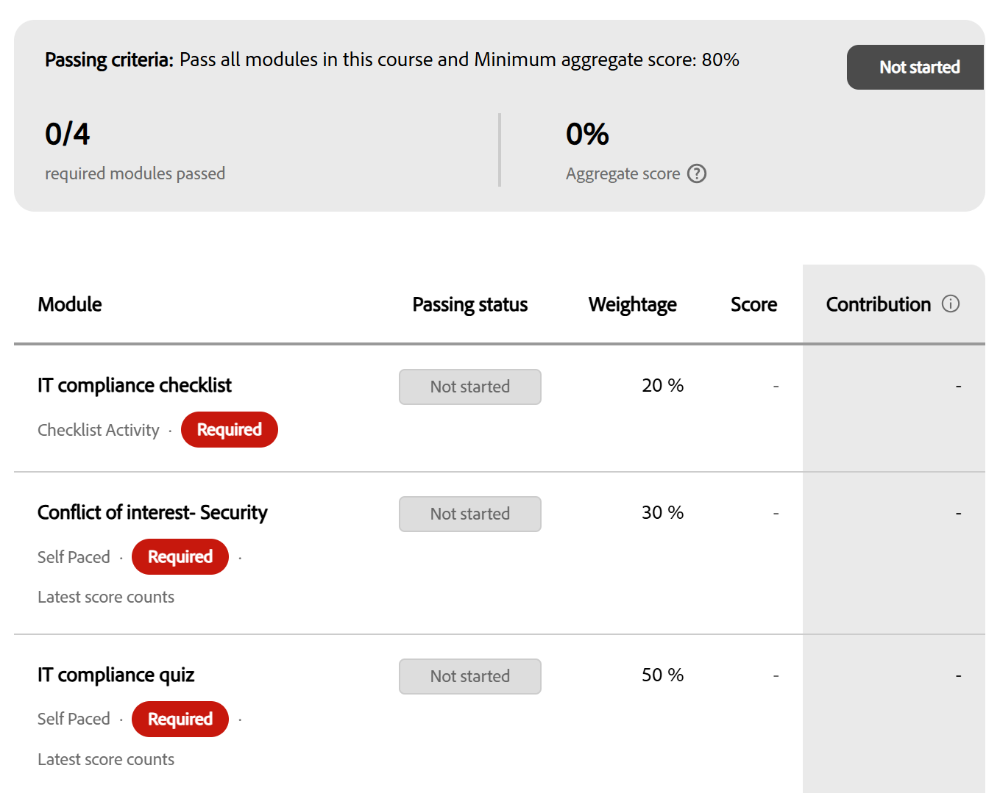

# 학습자용 성적 증명서

## 그레이드북으로 강의 시작

Adobe Learning Manager에서 강의에 대해 그레이드북이 활성화되어 표시되면 **그레이드북** 탭이 강의 개요 페이지에 표시됩니다. 이를 사용하여 각 모듈에 대한 가중 점수, 현재 합산 점수 및 합격 여부에 따라 강의를 더 완료해야 하는지 여부를 확인할 수 있습니다.

## 그레이드북을 사용할 수 있는 경우

작성자 또는 관리자가 강의에 대한 그레이드북 가시성을 활성화한 경우 강의 플레이어에서 **그레이드북** 탭이 **모듈**, **참고** 및 **토론**&#x200B;과 함께 나타납니다. 탭이 표시되지 않거나, 이 강의에 대해 성적 증명서가 활성화되지 않았거나, 책임자가 학습자 가시성을 비활성화했습니다. 점수는 계속 기록되어 관리자에게 표시될 수 있습니다.

등록 중 언제든지 **Gradebook** 탭을 열 수 있습니다.

* **시작하기 전:** 등록 후에 해당 가중치, 각 항목의 최대 점수 및 작성자가 설정한 합격 기준과 함께 점수를 매길 수 있는 모듈의 전체 목록이 표시됩니다. 이것은 시작하기 전에 강의 점수를 정확히 어떻게 매기는지 보여줍니다.
* **진행 중:** 모듈과 점수를 완료하면 아직 시도하지 않았거나 등급을 기다리는 모듈과 함께 지금까지 점수를 표시하도록 성적 증명서가 업데이트됩니다.
* **완료 후:** 성적 증명서에는 모든 최종 모듈 점수, 계산된 총 강의 점수 및 헤더의 **합격** 결과가 표시됩니다.

## 그레이드북 보기

* **내 학습**&#x200B;에서 강의를 선택합니다.
* 강의 페이지에서 **성적 증명서** 탭을 선택합니다.

  성적 증명서 헤더에는 다음이 표시됩니다.

  

* **통과 조건:** 필요한 최소 집계 점수 및 모듈 수
* 총 모듈 중 완료한 필수 모듈 수
* 현재 **집계 점수**(백분율)
* 현재 강의 상태: **시작되지 않음**, **완료 보류 중**, **합격** 또는 **실패**

헤더 아래의 모듈 테이블에는 각 모듈에 대해 다음 열이 표시됩니다.

| **열** | **표시 내용** |
|------------|-------------------|
| **모듈** | 모듈 이름 및 유형 |
| **상태** | 이 모듈에 대한 완료 또는 점수 상태(아래 상태 참조) |
| **가중치** | 이 모듈이 집계 점수에 기여하는 비율입니다 |
| **점수** | 이 모듈에 대한 점수(예: 40/100) |
| **기여도** | 이 모듈이 지금까지 총 점수에 추가한 실제 백분율 점수 |

## 모듈 탭에서 모듈 가중치 보기

또한 그레이드북을 열지 않고도 **모듈** 탭에서 각 모듈의 가중치를 확인할 수 있습니다.

강의 페이지에서 **모듈** 탭을 선택합니다.

**모듈** 탭에는 각 모듈의 가중치 비율과 과정을 완료하는 데 필요한 모듈 수가 표시됩니다.

## 다중 시도 시 모듈 점수

모듈이 여러 번 시도를 허용하는 경우, 성적 증명서에 표시되는 점수는 강의 작성자가 구성한 방식에 따라 다릅니다.

* **최고:** 모든 시도에서 가장 좋은 점수가 표시됩니다. 나중에 시도했을 때 점수가 낮다고 해서 기록된 점수가 줄어드는 것은 아닙니다.
* **최신:** 가장 최근 시도에서 얻은 점수가 항상 표시됩니다. 이후 시도에서 점수가 낮을수록 이전 점수가 대체됩니다.

## 모듈 상태 이해

성적표의 각 모듈에는 다음 상태 중 하나가 표시됩니다.

| **상태** | **의미** |
|------------|-------------------|
| **완료됨** | 모듈 완료 및 점수 기록 |
| **진행 중** | 모듈이 시작되었지만 아직 완료되지 않음 |
| **시작되지 않음** | 모듈이 아직 열리지 않음 |
| **실패** | 모듈이 점수를 부여했으며 점수가 모듈의 통과 임계값을 충족하지 않았습니다. |

## 집계 점수 계산 방법

총 점수는 각 점수화된 모듈의 가중치 기여도의 합계입니다.

(최대 점수÷ 달성한 점수) × 가중치 % = 모듈 기여도

성적 증명서의 **기여도** 열은 현재 집계에 대한 각 모듈의 기여도를 표시합니다. **가중치 없음**&#x200B;으로 표시된 모듈은 이 계산에서 제외됩니다.

점수부여 스케일이 모든 모듈에서 동일할 필요는 없습니다. 모듈은 100점 만점에, 모듈은 10점 만점에 두 가지 모두 정확한 기여를 한다. 공식은 가중치를 적용하기 전에 각각을 정규화합니다.
