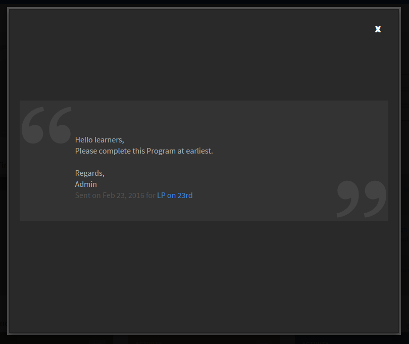

# 공지

책임자가 정의한 사용자 그룹에 멀티미디어 메시지(텍스트, 이미지 또는 비디오)로 공지사항을 보낼 수 있습니다.

책임자는 학습자에게 이벤트 또는 활동 발생을 알리는 공지를 브로드캐스트할 수 있습니다. 공지가 특정 그룹이나 학습 객체 사용자에게 브로드캐스트되면 대상 그룹에 연결된 모든 학습자가 알림을 받습니다.

## 공지 알림 {#announcementsnotification}

학습자의 대시보드에 강조 표시된 제목 표시줄로 알림 브로드캐스트 메시지가 나타납니다. 학습자가 공지 시점에 온라인 상태가 아닌 경우, Learning Manager 응용 프로그램에 로그인할 때 알림이 표시됩니다. 또한 학습자는 알림에서 이전 공지를 볼 수 있습니다.

*보류 중인 공지 알림*

&#39;보기&#39;를 클릭하면 공지 목록을 볼 수 있습니다. 샘플 공지 목록은 다음과 같습니다.

*모든 공지 보기*

## 샘플 공지 {#asampleannouncement}

아래에 있는 샘플 공지를 참조하십시오.

*공지에 대한 세부 정보 보기*

