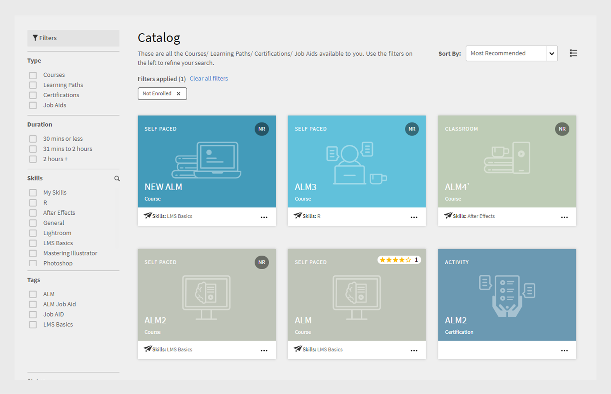

# 카탈로그

Learning Manager 카탈로그에서 사용 가능한 학습 객체를 확인하는 방법 알아보기

**카탈로그** 회사 계정에서 학습자 역할에 사용할 수 있는 모든 강의, 학습 프로그램, 인증 및 작업 지원으로 구성됩니다.

학습자는 다음에서 할당되고 자격이 있는 모든 학습 객체(학습 프로그램, 강의 및 인증)를 볼 수 있습니다. **기본 카탈로그**. 이러한 학습 객체는 학습자의 역할, 지정, 사용자 그룹, 프로필 등에 따라 각 학습자에게 고유합니다.

학습 객체의 스킬 및 유형(자가 진행식, 혼합, 강의실, 가상 강의실, 활동)으로 학습 객체 목록을 필터링할 수 있습니다. 왼쪽 창에 있는 학습 객체, 스킬, 완료 상태 등의 옵션을 사용하여 필터링할 수도 있습니다.

페이지의 위에 있는 검색 막대를 사용하여 익숙한 학습 객체의 이름을 입력합니다.

*카탈로그 보기*

학습자는 교육 형식(예: 강의실, 자가 학습 또는 가상 강의실)을 기반으로 교육을 필터링할 수 있습니다. 또한 학습자는 교육 지속 기간을 기반으로 교육을 필터링할 수도 있습니다. 이미 사용 가능한 스킬 레벨 필터는 이제 책임자가 활성화/비활성화할 수 있습니다.

*교육 형식에 따라 교육 필터링*

교육 지속 기간에 따라 필터링할 수도 있습니다. 지속 기간 필터에는 이전 작업 및 테스트 지속 기간이 포함되지 않습니다.

*강의 기간별 필터링*

교육 **기간** 및 **형식** 필터는 기본 인스턴스와 계정 기본 설정 로케일에 사용할 수 있는 교육 콘텐츠를 기준으로 식별됩니다.

교육이 게시되면 데이터가 반영되어 교육을 필터링할 수 있기까지 최대 1시간이 소요됩니다.
