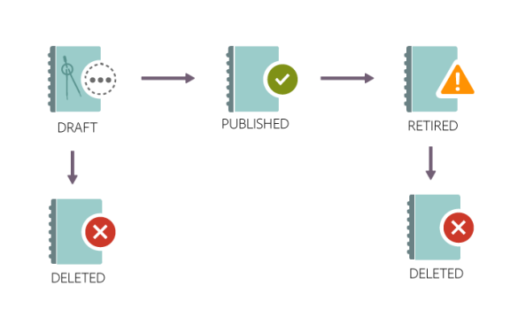

# 강의

이 문서에서 Learning Manager 강의를 보고 이용하는 방법을 알아보십시오. 토론에 참여하고 피드백을 제공합니다.

작성자는 강의를 생성합니다. 학습자는 강의를 수강할 수 있으며, 책임자는 강의 이용률을 기준으로 학습자의 성과를 추적할 수 있습니다.

## 개요 {#overview}

Adobe Learning Manager를 통해 학습자는 강의, 학습 프로그램 및 인증에 액세스할 수 있습니다. 학습자는 카탈로그를 통해 사용 가능한 모든 강의를 찾아보거나 자신이 선택한 강의에 등록할 수 있습니다. 학습자는 학습 탭에서 등록된 모든 강의와 할당된 강의를 볼 수 있습니다.

>[!NOTE]
>
>학습자는 Apple Store에서 Learning Manager iPad 앱을, Google Play에서 Learning Manager Android 앱을 설치한 다음 모바일 장치에서 강의에 액세스할 수 있습니다. 모든 학습자 역할 기능은 앱에서도 사용할 수 있습니다. 또한 학습자는 오프라인으로 강의를 수강할 수 있으며, 온라인으로 전환하면 원활하게 액세스할 수 있습니다. 자세한 내용은  [iPad 및 Android 태블릿 사용자](ipad-android-tablet-users.md) 기능을 사용하여 자세한 내용을 살펴보십시오.

## 강의 보기 {#viewingcourses}

학습자로 이용할 수 있는 모든 강의 목록을 볼 수 있습니다. 홈 페이지나 왼쪽 창에서 내 학습 을 클릭하여 등록한 모든 강의를 봅니다.

*할당된 강의 보기*

아직 강의를 시작하지 않은 경우 강의 옆에 있는 시작 버튼을 클릭하면 됩니다. 이미 강의 이용을 시작한 경우에는 계속 버튼을 클릭할 수 있습니다.

완료한 강의를 보려면 강의 옆에 있는 &#39;재방문&#39; 버튼을 클릭합니다.

강의에는 여러 인스턴스가 있을 수 있습니다. 세부 정보를 보려면 강의 이름을 클릭합니다. 오른쪽 창에서 각 강의 인스턴스에 대한 마감 날짜를 볼 수 있습니다.

*완료한 과정 보기*

## 강의 효과 {#courseeffectiveness}

강의 효과 점수는 학습자가 학습 요구에 가장 효과적인 점수를 매길 수 있도록 도와줍니다. 강의 효과성은 학습자에게 강의의 유용성을 이해하기 위해 평가된다. 특정 강의의 사용자 수별로 받은 피드백을 바탕으로 계산된다. 피드백을 주는 학습자의 비율이 더 많으면 강의 효과도 등급이 높다.

강의 내용에 대한 학습자 피드백 결과, 학습자를 위한 강의 퀴즈 결과 및 강의 학습을 기반으로 학습자를 평가하는 관리자의 피드백 조합입니다.

학습자는 강의 페이지에서 아래 스냅샷과 같이 강의 축소판에서 강의 효과 등급을 볼 수 있습니다. 이 강의의 등급은 14로 표시됩니다.

*강의 효과 등급 보기*

강의 효과 등급에 대한 세부 정보를 보려면 강의 효과 값을 클릭합니다. 팝업이 아래와 같이 나타납니다.

*강의 효과 보기*

팝업 오른쪽 하단 모서리에 있는 아래쪽 화살표를 클릭하여 강의 효과 계산이 어떻게 수행되는지 확인합니다.

*강의 효과 계산*

## 강의 및 학습 프로그램 검색 {#searchingcoursesandlearningprograms}

Adobe Learning Manager에서는 원하는 강의를 빠르고 쉽게 찾을 수 있습니다. 다음과 같은 방법으로 강의를 검색할 수 있습니다.

1. 오른쪽 상단에 표시된 검색 아이콘을 클릭합니다. 검색 필드가 나타납니다. 강의/학습 프로그램 이름 또는 강의와 관련된 키워드를 입력합니다. 메타데이터, 노트, 스킬, 배지 또는 태그로 강의를 검색할 수 있습니다. 태그는 검색 필드 내에서 검색할 수 있습니다. 즉, 태그를 입력할 때 검색 필드에 표시됩니다.
1. 학습자는 유형, 스킬, 태그 및 상태를 사용하여 카탈로그 페이지에서 검색 결과를 구체화할 수 있습니다.

정렬 기준을 클릭하고 드롭다운 메뉴에서 선택하여 관련성, 이름 또는 게시 날짜별로 강의를 정렬할 수 있습니다.

검색 결과 페이지에서 다음에 따라 강의를 필터링할 수 있습니다. **duration** 강의 및 강의 **형식** 를 클릭합니다. 이렇게 하면 과정을 검색할 때 유연성이 향상되고 나에게 적합한 과정을 찾을 수 있습니다.

## 강의 등록 {#enrollingforcourses}

학습자는 다음 세 가지 방법으로 강의에 등록됩니다.

1. 책임자/관리자는 조직의 필요에 따라 일부 학습자를 필수 강의에 등록합니다.
1. 관리자는 팀원들에게 일부 강의를 지명합니다. 강의/학습 프로그램을 수락 또는 거부할 수 있는 옵션이 있는 알림이 표시됩니다. 학습자가 지정을 수락하면 강의/학습 프로그램에 등록됩니다.
1. 학습자는 직접 강의/학습 프로그램에 등록할 수 있습니다.

   1. 강의/학습 프로그램이 자가 등록 유형인 경우 학습자는 즉시 등록됩니다.
   1. 강의/학습 프로그램이 관리자 승인 유형인 경우 학습자가 **승인 보류 중** 상태. 관리자의 승인 후 학습자는 강의에 등록됩니다.
   1. 학습자가 이미 대기자 명단에 등록된 강의(강의실의 경우)에 등록하면 다른 사람이 강의에서 탈퇴하거나 관리자가 강의를 승인할 때까지 기다려야 합니다.

학습자는 본인의 선택에 따라 다양한 강의에 등록할 수 있습니다. 강의 탭에는 등록/할당된 모든 강의가 표시됩니다.

그러나, 카탈로그 위로 마우스를 이동하고 &#39;탐색&#39;을 클릭하여 카탈로그 아래에 나열된 강의를 거치는 옵션이 있습니다. 등록 페이지가 나타납니다. 강의를 강의 목록에 포함하려면 페이지의 오른쪽 상단에 있는 등록 을 클릭합니다.

강의/학습 프로그램에 여러 인스턴스/세션이 있을 수 있습니다. 카탈로그에서 강의/학습 프로그램 타일 이름을 클릭하여 세부 정보를 봅니다. 각 강의/학습 프로그램 인스턴스의 마감일을 기준으로 강의/학습 프로그램 인스턴스에 등록되는 것을 볼 수 있습니다.

**관심 강의 등록**

계획된 세션이 없는 모든 강의실 강의에 관심을 표현하기 위해 등록할 수 있습니다. 강의 세션이 시작될 때마다 강의에 참여하라는 알림이 표시됩니다.

## 학습자로서의 워크플로우

학습자는 등록 후에만 강의를 평가할 수 있습니다. 다음에서 모든 강의의 평균 평가 등급을 확인할 수 있습니다. **홈** 페이지, **내 학습** 페이지 및 **카탈로그**.

1. 다음으로 로그인: **학습자**. 이 경우 **홈 페이지**.

1. 검색 막대에 강의명을 입력하여 강의를 검색합니다. 또는 표시된 강의 목록에서 **내 학습** 또는 **카탈로그** 왼쪽 창에서 열기.

1. 강의를 선택한 다음 **[!UICONTROL 등록]**.

   
   *강의 등록*

1. 그에 따라 강의를 평가할 별의 수를 선택합니다. 1이 가장 낮고, 5가 가장 높은 점수입니다. 그런 다음 **[!UICONTROL 제출]**.

   
   *강의 등급 제출*

   가장 최근 항목이 평가로 간주되므로 학습자는 평가 등급을 여러 번 제공하는 것으로 피드백을 다시 제출할 수 있습니다.

1. 제출 후 확인 메시지가 표시됩니다.

   
   *피드백 확인 메시지*

   메시지를 클릭하면 피드백을 다시 제출할 수 있습니다. 등급이 제출되면 메시지가 3초 동안 표시되며 이후 등급이 표시됩니다. 등급을 변경하고자 하는 경우, 다른 수의 별을 선택하고 제출합니다.

강의는 평균 등급 기준으로 정렬됩니다. 오른쪽 위 모서리에 있는 정렬 기준: 드롭다운을 사용하면 케이스를 정렬할 수 있습니다 **카탈로그**.

## 강의 수강 {#consumingnbspacourse}

강의에 등록한 후, 강의 시작을 클릭하면 강의를 수강할 수 있습니다. 또는 을 클릭합니다 **[!UICONTROL 강의]** 아이콘을 **[!UICONTROL 학습]** 탭. 수강하고 싶은 강의를 선택하십시오.

아직 강의를 시작하지 않은 경우 강의 제목 옆에 있는 시작 버튼을 클릭합니다.

브라우저 창에서 강의의 모든 모듈을 볼 수 있습니다.

**플레이어 기능**

**목차** - 강의를 듣는 동안 플레이어는 창의 왼쪽에 해당 강의 콘텐츠 목차를 표시합니다. 각 항목을 클릭하고 직접 탐색할 수 있습니다.

**책갈피** - 강의 모듈에 모듈 TOC가 있는 경우 모듈 TOC의 항목은 나중에 참조할 수 있도록 책갈피에 추가할 수 있습니다. 책갈피가 지정된 경우 목차 항목 옆에 리본 아이콘이 나타납니다. 리본을 다시 클릭하여 책갈피를 삭제할 수 있습니다.

**노트** - 강의를 듣는 동안 메모를 기록할 수 있는 규정이 있습니다. 메모를 기록한 후에는 PDF으로 저장하고 다운로드하거나 등록된 학습자의 전자 메일 ID로 메모를 전자 메일로 보낼 수 있습니다. [저장]을 클릭하면 PDF 파일로 저장할 위치를 선택할 수 있는 옵션이 제공됩니다.

*강의 노트 필기*

**폐쇄 자막** - Adobe Captivate으로 개발한 강의의 경우 강의 개발 중에 폐쇄 자막이 활성화되면 학습자가 자막을 볼 수 있습니다. 플레이어 아래쪽에 있는 CC 를 클릭합니다. 폐쇄 자막 옵션은 Captivate 8.0.2 HTML 콘텐츠에 대해서만 사용할 수 있습니다. 다른 모든 유형의 모듈에서는 CC 옵션이 재생 막대에 나타나지 않습니다.

**강의 재방문** - 두 가지 가능한 시나리오에서 두 가지 모드로 강의를 다시 방문할 수 있습니다.

* 강의가 완료 상태일 때 다시 방문 을 클릭합니다.
* 강의가 미완료 상태일 때 계속 을 클릭합니다.

**전체 화면** 플레이어 오른쪽 하단 모서리에 있는 전체 화면 아이콘을 클릭하면 전체 화면 창에서 강의를 볼 수 있습니다.

**탐색 단추** 위/아래 화살표를 클릭하여 pdf, docx 및 pptx 콘텐츠의 여러 슬라이드에서 이동할 수 있습니다. 슬라이드 화살표를 사용하여 모든 유형의 콘텐츠에 대해 다음 항목으로 이동할 수 있습니다.

**과정 닫기** 플레이어 오른쪽 상단에 있는 닫기(x) 아이콘을 클릭하여 과정을 종료합니다.

*강의 종료 후 강의 설명 페이지의 &#39;재방문&#39; 버튼을 클릭하면 강의를 다시 방문할 수 있습니다.*

## 별점 매기기

학습자가 강의에 등록한 후에만 강의에 대한 평가 피드백을 제공할 수 있습니다. 강의 개요 페이지에서 학습자는 별을 사용하여 강의를 평가할 수 있습니다(1개: 가장 낮음, 5개: 가장 높음).

*평가 등급을 피드백으로 제공*

학습자는 특정 별(5개 중)을 선택하고 등급을 제출할 수 있습니다. 학습자는 다른 별을 클릭하여 선택 항목을 편집할 수도 있습니다. 제출하면 &#39;피드백을 제공해주셔서 감사합니다&#39; 메시지가 표시됩니다.

학습자가 피드백을 다시 제출하려면 메시지를 클릭합니다. **제출**버튼이 다시 활성화됩니다. 학습자는 강의 등록 후 평가 등급을 여러 번 제공할 수 있습니다. 가장 최근의 등급만 인정됩니다.

학습자가 등급을 제공하면 평균 평가 등급 및 의 평가 등급 기능을 제공한 학습자의 수가 **강의 개요** 페이지.

*강의 개요*

이 기능은 모든 기존 계정에서 비활성화됩니다. 책임자는 설정에서 해당 기능을 활성화할 수 있습니다. 그러면 학습자에게 평가 등급이 표시됩니다.

## 콘텐츠 마켓플레이스

콘텐츠 마켓플레이스 옵션은 학습자 앱의 왼쪽 창에 있습니다. 해당 옵션을 클릭하면 모든 강의/전체 카탈로그 및 큐레이트된 플레이리스트를 볼 수 있습니다.

아래의 페이지에서 카탈로그에 표시된 강의를 확인할 수 있습니다. 각 강의에는 강의 기간과 다양한 범위의 강의 주제가 표시됩니다. 페이지 왼쪽의 필터에서 주제를 선택할 수 있습니다.

정확하게 2분 동안 강의를 미리 볼 수 있습니다.

*마켓플레이스에서 강의 미리 보기*

책임자가 다양한 강의를 살펴보고 미리 볼 수 있도록 초대하면 알림이 표시됩니다.

학습자는 전체 카탈로그 또는 의 선별된 플레이리스트에 대한 관심을 표시할 수 있습니다 **큐레이트된 플레이리스트** 섹션으로 이동하십시오.

*큐레이트된 플레이리스트 보기*

강의/교육에 대한 관심을 표시하면 관심은 기록되고 책임자가 해당 기록을 가져올 수 있습니다.

학습자 앱에서 모든 책임자는 콘텐츠 마켓플레이스에 액세스할 수 있습니다. 책임자가 액세스 권한을 취소하면 학습자는 콘텐츠 마켓플레이스 탭을 볼 수 없습니다.

책임자가 초대한 학습자는 콘텐츠 마켓플레이스를 탐색할 수 있습니다.

>[!NOTE]
>
>콘텐츠 마켓플레이스는 Internet Explorer 11을 지원하지 않습니다.

모든 필터 및 기타 옵션은 아래 비디오에서 확인할 수 있습니다.

### 콘텐츠 미리 보기

강의를 미리 보고 각자의 학습 요구 사항에 맞는 강의인지 확인할 수 있습니다. **미리 보기**단추를 클릭하고 강의 미리 보기를 확인합니다. 미리 보기는 2분 동안 사용할 수 있습니다.

*마켓플레이스에서 콘텐츠 미리 보기*

## 콘텐츠 허브

콘텐츠 허브를 통해 책임자와 SME(주제전문가)는 학습자 앱의 필수 플레이리스트를 관심 목록에 추가할 수 있습니다. 플레이리스트를 관심 목록에 추가한 책임자는 구매 요청 양식을 다운로드하여 Adobe 영업 담당자와 공유할 수 있습니다.

책임자는 SME가 관심이 있는 플레이리스트를 관심 목록에 추가하도록 초대할 수 있습니다.

학습자 역할의 책임자라면 누구나 콘텐츠 허브를 사용할 수 있습니다. 책임자는 SME가 구매하고자 하는 플레이리스트를 관심 목록에 추가할 수 있도록 허용합니다.

학습자 역할의 관리자에게는 콘텐츠 허브 페이지가 매번 표시되므로 플레이리스트를 쉽게 관심 목록에 추가할 수 있습니다. 책임자는 본인의 계정에 있는 일부 SME에게만 이 페이지에 대한 액세스를 허용하여 적합한 플레이리스트를 관심 목록에 추가하도록 도울 수 있습니다. 책임자 권한으로 기업 교육 페이지를 방문하면 손쉽게 액세스 권한을 부여할 수 있습니다.

## 강의 인스턴스 선택 {#choosecourseinstance}

세션이 만료된 강의 인스턴스에 등록된 학습자인 경우 이제 다른 세션으로 전환하여 진행할 수 있습니다. 이는 LP가 유연한 경우에만 수행할 수 있습니다.

강의 인스턴스를 변경하려면 다음 단계를 따르십시오.

1. 카탈로그 > 학습 프로그램을 엽니다.

   
   *학습 프로그램 선택*

1. 모든 과정을 보려면 라디오 단추를 사용하고, 선택하지 않은 인스턴스가 있는 과정을 보려면 선택합니다. 참고: 인스턴스를 완료한 학습자는 다른 인스턴스로 전환할 수 없습니다.

   
   *모든 강의 또는 선택하지 않은 인스턴스가 있는 강의 보기*

1. 강의의 인스턴스 드롭다운 메뉴에 사용 가능한 인스턴스가 표시됩니다. 드롭다운 목록에서 인스턴스를 선택합니다.

   
   *인스턴스 선택*

1. 선택한 인스턴스를 적용하려면 **[!UICONTROL 등록 업데이트]**. 등록 업데이트 옵션은 페이지의 오른쪽 상단에서 사용할 수 있습니다.

   새로 선택한 인스턴스가 등록되었습니다. 학습자가 다른 LO의 일부인 강의 인스턴스에 등록되어 있고 유연한 학습 프로그램의 일부인 강의 인스턴스를 업데이트하면 경고 메시지가 표시되면 다른 학습 객체에서 자동으로 등록이 취소됩니다.

## 강의 완료 {#completingacourse}

학습자는 필요한 수의 강의 모듈을 완료하여 강의를 완료할 수 있습니다. 강의 완료 조건은 작성자가 필수로 설정한 모듈의 수에 따라 달라집니다. 최소 완료 조건을 사용하여 강의에 등록하면 강의 페이지의 오른쪽 창에서 완료 조건을 볼 수 있습니다.

*완료 조건 보기*

예를 들어 특정 강의의 완료 조건이 두 모듈 중 하나로 지정된 경우 한 모듈만 완료하면 해당 강의를 완료한 것으로 표시됩니다. 이 경우 첫 번째 모듈을 완료하면 진행률 표시줄에 100% 완료 상태가 표시됩니다.

모듈이 작성자가 주문한 대로 설정된 경우 필요한 모듈 수를 먼저 완료한 다음 순서대로 완료해야 합니다. 모듈이 정렬되지 않은 경우 지정된 모듈 수를 임의의 순서로 완료할 수 있습니다.

필요한 수의 모듈로 강의를 완료한 후 옵션 모듈을 완료하고자 하는 경우 해당 강의로 재방문할 수 있습니다.

## 토론 보기 및 참여 {#viewingandpariticpatingindiscussions}

학습자는 토론 탭을 사용하여 다른 학습자 및 강사와 상호 작용할 수 있습니다. 보거나 등록한 모든 강의의 게시물을 볼 수 있습니다. 책임자가 강의에 토론을 활성화한 경우, 해당 강의의 노트 탭 옆에 있는 토론 탭을 볼 수 있습니다.

토론 탭을 클릭하면 해당 강의에 대한 기존 게시물과 댓글을 볼 수 있습니다. 이미 강의에 등록한 경우, 다른 사용자가 볼 수 있도록 게시물 또는 주석을 입력할 수도 있습니다. 메시지를 입력한 후 [게시]를 클릭합니다. 게시물은 10자 이상이어야 합니다.

게시물은 토론 탭에 즉시 표시됩니다. 게시물을 Newset First 또는 Oldest First로 정렬하고 작성한 게시물을 삭제할 수 있습니다. 강의 등록을 취소한 후에도 모든 게시물을 조회하고 작성한 게시물을 삭제할 수 있습니다.

*참가자 토론 보기*

외부 사용자에게는 토론 탭이 활성화되지 않습니다.

*토론 탭*

## 강의 사용 주기 {#courselifecycle}

일반적인 과정 수명 주기는 다음과 같습니다.

**초안** - 작성자가 강의 생성 및 저장을 완료하면 이 상태에서는 학습자가 아직 강의를 수강할 수 없습니다.

**게시됨** - 작성자가 강의 게시를 완료했을 때. 이 상태에서는 학습자가 강의를 등록할 수 있습니다.

**중단됨** - 강의를 게시한 후 작성자가 학습자 카탈로그에 강의가 나타나는 것을 원하지 않으면 강의를 중단 상태로 변경할 수 있습니다.

**삭제됨** - Adobe Learning Manager에서 완전히 제거된 상태의 강의입니다. 강의는 오직 초안 또는 중단됨 상태일 때만 작성자가 삭제할 수 있습니다.

*강의 라이프 사이클 개요*
