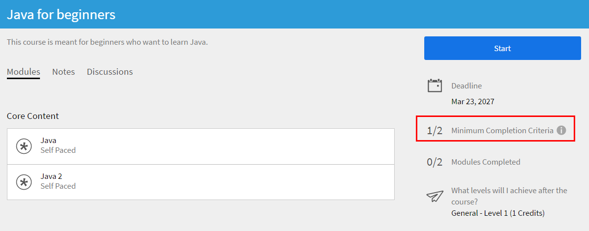

# 내 학습

이 문서를 통해 Learning Manager에서 강의를 보고 이용하는 방법을 알아봅니다. 토론에 참여하고 피드백을 제공합니다.

작성자는 강의를 생성합니다. 학습자는 강의를 수강할 수 있고 책임자는 강의 이용량에 따라 학습자의 성과를 추적할 수 있습니다.

## 개요 {#overview}

Adobe Learning Manager에서 학습자는 강의, 학습 프로그램 및 인증에 액세스할 수 있습니다. 학습자는 카탈로그를 사용하여 사용 가능한 모든 강의를 찾아보거나 원하는 강의에 직접 등록할 수 있습니다. 학습자는 학습 탭에서 등록된 모든 강의와 할당된 강의를 볼 수 있습니다.

>[!NOTE]
>
>학습자는 Apple Store에서 Learning Manager iPad 앱을, Google Play에서 Learning Manager Android 앱을 설치한 다음 모바일 장치에서 강의에 액세스할 수 있습니다. 모든 학습자 기능을 앱에서도 사용할 수 있습니다. 학습자는 오프라인으로 강의를 수강한 다음 온라인에서 원활히 액세스할 수 있습니다. 자세한 내용은 [iPad 및 Android 태블릿 사용자](ipad-android-tablet-users.md) 기능을 참조하십시오.

## 학습 객체 보기 {#viewingcourses}

학습자가 사용 가능한 모든 강의 목록을 볼 수 있습니다. 홈 페이지나 왼쪽 창에서 내 학습 을 클릭하여 등록한 모든 강의를 봅니다.

*할당된 과정 보기*

아직 강의를 시작하지 않은 경우 강의 옆의 &#39;시작&#39; 버튼을 클릭할 수 있습니다. 강의 이용을 이미 시작한 경우 &#39;계속&#39; 버튼을 클릭할 수 있습니다.

완료된 강의를 보려면 강의 옆에 있는 &#39;재방문&#39; 버튼을 클릭합니다.

강의에는 여러 인스턴스가 있을 수 있습니다. 세부 정보를 보려면 강의 이름을 클릭합니다. 오른쪽 창에서 각 강의 인스턴스의 기한을 볼 수 있습니다.

*완료된 과정 보기*

## 강의 효과 {#courseeffectiveness}

강의 효과 점수는 학습자가 학습 요구에 가장 효과적인 점수로 강의를 선택할 수 있도록 도와줍니다. 강의가 학습자에게 유용했는지 파악하기 위해 강의 효과를 평가합니다. 특정 강의 사용자로부터 받은 피드백을 기반으로 계산됩니다. 피드백을 주는 학습자의 비율이 높을수록 강의 효과 등급도 높아집니다.

강의 내용에 대한 학습자 피드백 결과, 학습자를 위한 강의 퀴즈 결과 및 강의 학습을 기반으로 학습자를 평가하는 관리자의 피드백 조합입니다.

강의 페이지에서 학습자는 아래 스냅샷처럼 강의 썸네일에 나타나는 강의 효과 등급도 볼 수 있습니다. 이 강의의 등급은 14로 나타납니다.

*강의 효과 등급 보기*

강의 효과 등급에 대한 세부 사항을 확인하려면 강의 효과 값을 클릭합니다. 아래와 같이 팝업이 나타납니다.

*강의 효과 보기*

팝업의 오른쪽 아래 모서리에 있는 아래로 화살표를 클릭하면 강의 효과가 어떻게 계산되는지 볼 수 있습니다.

*강의 효과 계산*

## 강의 및 학습 프로그램 검색 {#searchingcoursesandlearningprograms}

Adobe Learning Manager에서는 원하는 강의를 빠르고 쉽게 찾을 수 있습니다. 다음과 같은 방법으로 강의를 검색할 수 있습니다.

1. 오른쪽 상단 모서리에 표시된 검색 아이콘을 클릭합니다. 검색창이 나타납니다. 강의/학습 프로그램 이름 또는 강의와 관련된 키워드를 입력합니다. 메타데이터, 노트, 스킬, 배지 또는 태그로 강의를 검색할 수 있습니다. 검색 필드 내에서 태그를 검색할 수 있습니다. 즉, 검색 필드에 입력을 하면 태그가 표시됩니다.
1. 학습자가 유형, 스킬, 태그 및 상태를 사용하면 카탈로그 페이지의 검색 결과를 구체적으로 볼 수 있습니다.

정렬 기준을 클릭하고 드롭다운 메뉴에서 선택하여 관련성, 이름 또는 게시 날짜별로 강의를 정렬할 수 있습니다.

검색 결과 페이지에서 강의 **기간** 및 강의 **형식**&#x200B;에 따라 강의를 필터링할 수 있습니다. 이렇게 하면 과정을 검색할 때 유연성이 향상되고 나에게 적합한 과정을 찾을 수 있습니다.

## 강의 등록 {#enrollingforcourses}

학습자는 다음 세 가지 방법으로 강의에 등록됩니다.

1. 책임자/관리자는 조직의 필요에 따라 일부 학습자를 필수 강의에 등록합니다.
1. 관리자는 팀 구성원에게 강의 일부를 지정합니다. 강의/학습 프로그램을 수락하거나 거부할 수 있는 옵션이 있는 알림을 받습니다. 학습자가 지정을 수락하면 강의/학습 프로그램에 등록됩니다.
1. 학습자는 강의/학습 프로그램에 직접 등록할 수 있습니다.

   1. 자가 등록으로 강의/학습 프로그램을 등록하는 경우 학습자는 즉시 등록됩니다.
   1. 강의/학습 프로그램이 관리자 승인 유형이면 학습자가 **승인 보류 중** 상태로 이동합니다. 관리자의 승인 후 학습자는 강의에 등록됩니다.
   1. 학습자가 이미 대기 목록에 있는 강의(강의실의 경우)에 등록했다면 다른 사람이 강의를 중단하거나 책임자가 강의를 승인할 때까지 기다려야 합니다.

학습자는 원하는 내용에 따라 다양한 강의를 직접 등록할 수 있습니다. 강의 탭에는 등록/할당된 모든 강의가 나타납니다.

그러나, 카탈로그 위로 마우스를 이동하고 &#39;탐색&#39;을 클릭하여 카탈로그 아래에 나열된 강의를 거치는 옵션이 있습니다. 등록 페이지가 나타납니다. 강의를 강의 목록에 넣으려면 페이지의 오른쪽 상단 모서리에 있는 &#39;등록&#39;을 클릭합니다.

강의/학습 프로그램에는 여러 인스턴스/세션이 있을 수 있습니다. 카탈로그에서 강의/학습 프로그램 타일 이름을 클릭하면 세부 정보를 볼 수 있습니다. 강의/학습 프로그램의 각 인스턴스 기한을 바탕으로 강의/학습 프로그램 등록 인스턴스를 볼 수 있습니다.

**관심 강의 등록**

세션이 아직 계획되지 않은 강의실 강의에 관심을 등록할 수 있습니다. 강의 세션에 참여할 수 있으면 귀하에게 알림이 전송됩니다.

>[!NOTE]
>
>학습자가 동시에 또는 겹치는 시간에 두 개의 다른 세션에 등록한 경우 충돌 메시지가 표시됩니다.

## 인스턴스 전환

강의의 특정 인스턴스에 등록한 학습자는 강의의 사용 가능한 전체 인스턴스 목록을 확인하고 자신에게 더 적합한 다른 인스턴스로 전환할 수 있습니다. 전환하는 이유는 학습자가 이전 인스턴스에 출석하지 못했거나 신규 인스턴스의 세션 시간 배치가 더 적합하다거나 또는 다른 이유일 수 있습니다.

학습자의 강의 진행률, 퀴즈 점수 등이 신규 인스턴스로 전달됩니다. 이 기능은 대체로 강의실 및 혼합 강의용이지만 자가 진행식 강의를 포함한 모든 유형의 강의를 지원합니다.

인스턴스 전환 설정에 관계없이 전체 인스턴스 보기 옵션이 나타납니다. 이제 학습자는 두 개 이상의 강의 인스턴스가 있는 경우 모든 인스턴스를 볼 수 있는 옵션을 보게 됩니다.

인스턴스 전환 옵션이 활성화되면 학습자는 강의를 완료할 때까지 다양한 인스턴스로 전환할 수 있습니다. 이 옵션이 비활성화되면 학습자는 인스턴스를 볼 수 있지만 강의에 등록할 수 없습니다.

학습자가 **전체 인스턴스 보기**&#x200B;를 선택하면, 전체 강의 인스턴스를 확인할 수 있습니다.

_학습자 콘솔에서 모든 인스턴스 페이지 보기_

_학습자 페이지에서 인스턴스 전환_

책임자는 학습자용 인스턴스를 전환할 수 있습니다. Admin Console에서 강의를 선택하고 **[!UICONTROL 학습자]** 섹션으로 이동하여 사용자를 선택한 다음 **[!UICONTROL 작업]** 버튼을 선택합니다. 그런 다음 **[!UICONTROL 인스턴스 전환]**&#x200B;을 선택하고 원하는 인스턴스를 선택합니다.

_Admin Console에서 인스턴스 전환_

_인스턴스 프롬프트 전환_

학습자 또는 책임자 앱에서 강의 인스턴스가 완료될 때까지 인스턴스를 전환할 수 없습니다.

작성자는 강의를 생성하는 동안 &#39;인스턴스 전환&#39;을 활성화하거나 비활성화할 수 있습니다. 인스턴스 전환은 무료 강의에서만 사용할 수 있습니다.

## 학습자로의 워크플로우

학습자는 등록 후에만 강의를 평가할 수 있습니다. **홈** 페이지, **내 학습** 페이지 및 **카탈로그**&#x200B;에서 모든 강의에 대한 평균 평가 등급을 볼 수 있습니다.

1. **학습자**(으)로 로그인합니다. **홈 페이지**&#x200B;가 로드됩니다.

1. 검색 막대에 강의명을 입력하여 강의를 검색합니다. 대신 왼쪽 창에서 **내 학습** 또는 **카탈로그**&#x200B;를 클릭하여 표시된 강의 목록에서 선택할 수 있습니다.

1. 강의를 선택한 후 **[!UICONTROL 등록]**&#x200B;을 클릭합니다.

   
   *강의 등록*

1. 그에 맞춰 강의를 평가할 별의 수를 선택합니다. 1이 가장 낮고, 5가 가장 높은 점수입니다. 그런 다음 **[!UICONTROL 제출]**&#x200B;을 클릭합니다.

   
   *강의 등급 제출*

   가장 최근 항목이 평가로 간주되므로 학습자는 평가 등급을 여러 번 제공하는 것으로 피드백을 다시 제출할 수 있습니다.

1. 제출 후 확인 메시지가 표시됩니다.

   
   *피드백 확인 메시지*

   메시지를 클릭하면 피드백을 다시 제출할 수 있습니다. 등급이 제출되면 메시지가 3초간 표시되며 이후 등급이 표시됩니다. 등급을 변경하고자 하는 경우, 다른 수의 별을 선택하고 제출합니다.

강의는 평균 등급 기준으로 정렬됩니다. **카탈로그**&#x200B;에서 사용 가능한 오른쪽 상단 모서리에 있는 정렬 기준 드롭다운을 사용하면 케이스를 정렬할 수 있습니다.

## 강의 수강 {#consumingnbspacourse}

강의에 등록하면 &#39;강의 시작&#39;을 클릭하여 강의를 시작할 수 있습니다. 또는 **[!UICONTROL 학습]** 탭에서 **[!UICONTROL 강의]**&#x200B;를 클릭합니다. 수강할 강의를 선택합니다.

아직 강의를 시작하지 않은 경우 강의 제목 옆의 &#39;시작&#39; 버튼을 클릭합니다.

브라우저 창에서 강의의 모든 모듈을 볼 수 있습니다.

**플레이어 기능**

**목차** - 강의를 듣는 동안 플레이어는 창의 왼쪽에 해당 강의 콘텐츠 목차를 표시합니다. 각 주제를 클릭하면 바로 검색할 수 있습니다.

**책갈피** - 강의 모듈에 모듈 목차가 있는 경우 모듈 목차에 있는 항목은 나중에 참조할 수 있도록 책갈피로 표시할 수 있습니다. 북마크가 표시되면 TOC 항목 옆에 리본 아이콘이 나타납니다. 북마크는 리본을 다시 클릭하면 삭제할 수 있습니다.

**메모** - 강의를 듣는 동안 메모를 기록하는 데 프로비전을 사용할 수 있습니다. 메모를 기록한 후 PDF로 저장하고 다운로드하거나 등록된 학습자의 이메일 ID로 메모를 보낼 수 있습니다. &#39;저장&#39;을 누르면 PDF 파일로 저장할 위치를 선택하는 옵션이 나타납니다.

*강의 노트 작성*

**닫힌 자막** - Adobe Captivate으로 개발한 강의의 경우 강의 진행 중에 닫힌 자막이 활성화되면 학습자가 자막을 볼 수 있습니다. 플레이어 하단의 &#39;CC&#39;를 클릭합니다. 닫힌 자막 옵션은 8.0.2 HTML 콘텐트에서만 사용할 수 있습니다. 다른 모든 유형의 모듈에서는 CC 옵션이 재생 표시줄에 나타나지 않습니다.

**강의 재방문** - 두 가지 가능한 시나리오에서 두 가지 모드로 강의를 재방문할 수 있습니다.

* 강의 완료 상태에서 &#39;재방문&#39;을 클릭합니다.
* 강의가 완료되지 않은 상태라면 &#39;계속&#39;을 클릭합니다.

**전체 화면** 플레이어의 오른쪽 하단에 있는 전체 화면 아이콘을 클릭하여 전체 화면 창에서 강의를 봅니다.

**탐색 단추** 위쪽/아래쪽 화살표를 클릭하여 pdf, docx 및 pptx 콘텐츠의 슬라이드 사이를 이동할 수 있습니다. 모든 유형의 콘텐트에서 다음 주제로 이동할 때 슬라이드 화살표가 사용됩니다.

**강의 닫기:** 플레이어의 오른쪽 상단 모서리에 있는 닫기(x) 아이콘을 클릭하여 강의에서 나갑니다.

*강의를 종료한 후 강의 설명 페이지의 &#39;재방문&#39; 단추를 클릭하여 강의를 다시 방문할 수 있습니다.*

## 다중 등록 인스턴스

강의에 여러 인스턴스가 있는 경우 학습자는 특정 인스턴스를 선택하여 등록할 수 있습니다. 필요한 경우 인스턴스 간에 전환할 수도 있습니다.

## 평가 등급

학습자가 강의에 등록한 후에만 강의에 대한 평가 피드백을 제공할 수 있습니다. 강의 개요 페이지에서 학습자는 별을 사용하여 강의를 평가할 수 있습니다(1개: 가장 낮음, 5개: 가장 높음).

*별점을 피드백으로 제공*

학습자는 특정 별(5개 중)을 선택하고 등급을 제출할 수 있습니다. 학습자는 다른 별을 클릭하여 선택 항목을 편집할 수도 있습니다. 제출하면 &#39;피드백을 제공해주셔서 감사합니다&#39; 메시지가 표시됩니다.

학습자가 피드백을 다시 제출하려면 메시지를 클릭합니다. **제출** 단추가 다시 활성화됩니다. 학습자는 강의 등록 후 평가 등급을 여러 번 제공할 수 있습니다. 가장 최근의 등급만 인정됩니다.

학습자가 등급을 제공하면 평균 평가 등급 및 **강의 개요** 페이지에서 평가 등급을 제공한 학습자의 수가 표시됩니다.

*과정 개요*

이 기능은 모든 기존 계정에서 비활성화되어있습니다. 책임자는 설정에서 해당 기능을 활성화할 수 있습니다. 그러면 학습자에게 평가 등급이 표시됩니다.

## 콘텐츠 마켓플레이스

콘텐츠 마켓플레이스 옵션은 학습자 앱의 왼쪽 창에 있습니다. 해당 옵션을 클릭하면 모든 강의/전체 카탈로그 및 큐레이트된 플레이리스트를 볼 수 있습니다.

아래의 페이지에서 카탈로그에 표시된 강의를 확인할 수 있습니다. 각 강의에는 강의 기간과 다양한 범위의 강의 주제가 표시됩니다. 페이지 왼쪽의 필터에서 주제를 선택할 수 있습니다.

정확하게 2분 동안 강의를 미리 보기 할 수 있습니다.

*마켓플레이스에서 강의 미리 보기*

책임자가 다양한 강의를 살펴보고 미리 볼 수 있도록 초대하면 알림이 표시됩니다.

학습자는 전체 카탈로그 또는 **큐레이트된 플레이리스트** 섹션에서 큐레이트된 플레이리스트에 대한 관심을 표시할 수 있습니다.

*큐레이트된 플레이리스트 보기*

강의/교육에 대한 관심을 표시하면 관심은 기록되고 책임자가 해당 기록을 가져올 수 있습니다.

학습자 앱에서 모든 책임자는 콘텐츠 마켓플레이스에 액세스할 수 있습니다. 책임자가 액세스 권한을 취소하면 학습자는 콘텐츠 마켓플레이스 탭을 볼 수 없습니다.

책임자가 초대한 학습자는 콘텐츠 마켓플레이스를 탐색할 수 있습니다.

>[!NOTE]
>
>콘텐츠 마켓플레이스는 Internet Explorer 11을 지원하지 않습니다.

모든 필터 및 기타 옵션은 아래의 비디오에서 확인할 수 있습니다.

### 콘텐츠 미리 보기

강의를 미리 보고 각자의 학습 요구 사항에 맞는 강의인지 확인할 수 있습니다. **미리 보기** 단추를 클릭하고 강의 미리 보기를 확인합니다. 미리 보기는 2분 간 사용할 수 있습니다.

*마켓플레이스에서 콘텐츠 미리 보기*

## 콘텐츠 허브

콘텐츠 허브를 통해 책임자와 SME(주제전문가)는 학습자 앱의 필수 플레이리스트를 관심 목록에 추가할 수 있습니다. 플레이리스트를 관심 목록에 추가한 책임자는 구매 요청 양식을 다운로드하여 Adobe 영업 담당자와 공유할 수 있습니다.

책임자는 SME에게 관심이 있는 플레이리스트를 관심 목록에 추가하라고 권유할 있습니다.

학습자 역할의 책임자라면 누구나 콘텐츠 허브를 사용할 수 있습니다. 책임자가 허용할 경우 SME는 구매 의사가 있는 플레이리스트를 관심 목록에 추가할 수 있습니다.

학습자 역할의 관리자에게는 콘텐츠 허브 페이지가 매번 표시되므로 플레이리스트를 쉽게 관심 목록에 추가할 수 있습니다. 책임자는 본인의 계정에 있는 일부 SME에게만 이 페이지에 대한 액세스를 허용하여 적합한 플레이리스트를 관심 목록에 추가하도록 도울 수 있습니다. 책임자 권한으로 기업 교육 페이지를 방문하면 손쉽게 액세스 권한을 부여할 수 있습니다.

## 강의 인스턴스 선택 {#choosecourseinstance}

세션이 만료된 강의 인스턴스에 등록된 학습자라면 이제 다른 세션으로 전환하여 진행할 수 있습니다. 이것은 LP가 유연해야 가능합니다.

강의 인스턴스를 바꾸려면 다음 단계를 따르십시오.

1. &#39;카탈로그&#39; > &#39;학습 프로그램&#39;에 들어갑니다.

   
   *학습 프로그램 선택*

1. 모든 과정을 보려면 라디오 단추를 사용하고, 선택하지 않은 인스턴스가 있는 과정을 보려면 선택합니다. 참고: 인스턴스를 완료한 학습자는 다른 인스턴스로 전환할 수 없습니다.

   
   *선택하지 않은 인스턴스가 있는 모든 강의 또는 강의 보기*

1. 강의 인스턴스 드롭다운 메뉴에서 사용 가능한 인스턴스가 나타납니다. 드롭다운 목록에서 적절한 인스턴스를 선택합니다.

   
   *인스턴스 선택*

1. 선택한 인스턴스를 적용하려면 **[!UICONTROL &#39;등록 업데이트&#39;]**&#x200B;를 클릭합니다. 등록 업데이트 옵션은 페이지 오른쪽 위에서 사용할 수 있습니다.

   새로 선택한 인스턴스가 등록되었습니다. 학습자가 다른 LO의 일부인 강의 인스턴스에 등록되어 있고 유연한 학습 프로그램의 일부인 강의 인스턴스를 업데이트하면 경고 메시지가 표시되면 다른 학습 객체에서 자동으로 등록이 취소됩니다.

## 언어 기반 진행률 관리

학습자 진행률은 각 로케일에 대해 별도로 추적하여 플레이어에서 언어 간 전환이 이전에 달성한 진행률에 영향을 주지 않도록 할 수 있습니다. 각 모듈의 진행률은 사용자 및 모듈 수준 모두에서 독립적으로 유지되므로 학습자가 다른 로케일에서 콘텐츠를 탐색할 때 진행률을 덮어쓰지 않도록 합니다.

예를 들어 학습자가 영어 진행률이 75%에 도달한 다음 스페인어로 전환하면 0%로 재설정하는 대신 75%에서 영어로 다시 돌아갑니다. 각 로케일은 고유의 진행률 상태를 저장하여 학습자가 개인별 진행률을 잃지 않고 여러 언어로 원활하게 콘텐츠를 탐색하고 완료할 수 있습니다.

다음 콘텐츠 유형은 언어 기반 학습자 진행에 지원되지 않습니다.

* 비디오 및 오디오 콘텐츠는 지원되지 않습니다.
* Go1, LinkedIn Learning, getAbstract 및 Harvard ManageMentor를 포함하는 서드파티 콘텐츠는 지원되지 않습니다.
* 학습 기록 저장소(LRS)에 데이터를 보내지 않는 콘텐츠는 진행 상황을 추적하거나 저장하지 않습니다.
* 모바일 앱 사용자는 오프라인 모드에서 이 기능의 진행률을 추적할 수 없습니다.

## 강의 완료 {#completingacourse}

학습자는 강의 완료에 필요한 강의 모듈 수를 마칠 수 있습니다. 강의 완료 기준은 작성자가 필수로 설정한 모듈 수에 따라 달라집니다. 최소 완료 기준을 사용하여 강의에 등록하면 강의 페이지의 오른쪽 창에서 완료 기준을 볼 수 있습니다.

*완료 조건 보기*

예를 들어 특정 강의에서 두 모듈 중 하나의 완료 기준이 있으면 한 모듈만 완료하여도 해당 강의를 완료한 것으로 나타납니다. 이 경우 첫 번째 모듈을 완료하면 진행 표시줄에 100% 완료 상태로 표시됩니다.

작성자가 모듈 순서를 설정했다면 필요한 모듈 수를 순서대로 완료해야 합니다. 모듈 순서가 설정되지 않았다면 순서에 상관없이 일정 개수의 모듈을 완료할 수 있습니다.

필요한 모듈 숫자로 강의를 완료한 경우에 선택 모듈을 완료하려면 강의를 재방문하면 됩니다.

## 토론 보기 및 참여 {#viewingandpariticpatingindiscussions}

학습자는 토론 탭을 사용하여 다른 학습자 및 강사와 상호 작용할 수 있습니다. 보거나 등록한 모든 강의의 게시물을 볼 수 있습니다. 책임자가 강의 토론을 사용하도록 설정했다면 해당 강의 노트 탭 옆에 있는 토론 탭을 볼 수 있습니다.

토론 탭을 클릭하면 해당 강의의 기존 게시물과 주석을 볼 수 있습니다. 강의에 이미 등록했다면 다른 사용자가 볼 수 있는 게시물이나 주석을 입력할 수도 있습니다. 메시지를 입력한 다음에 &#39;게시&#39;를 클릭합니다. 게시물은 10자 이상으로 이루어져야 합니다.

게시물은 토론 탭에 즉시 나타납니다. 게시물을 최신 첫 게시물 또는 오래된 첫 게시물로 정렬하고 작성한 게시물을 삭제할 수 있습니다. 강의 등록을 취소하여도 모든 게시물을 볼 수 있으며 작성한 게시물을 삭제할 수 있습니다.

*참가자 토론 보기*

외부 사용자는 토론 탭을 사용할 수 없습니다.

*토론 탭*

## 관심 강의 등록

학습자는 활성 인스턴스가 없는 강의에 관심을 등록할 수 있습니다.

이자를 등록하려면

1. 학습자로 Adobe Learning Manager에 로그인합니다.
2. **[!UICONTROL 카탈로그]**(으)로 이동하여 활성 인스턴스가 없는 강의를 선택하십시오.
3. 강의 개요 페이지에서 **[!UICONTROL 관심 등록]**&#x200B;을 선택합니다.

   
   _학습자 UI의 강의 개요 섹션, 관심 항목 등록 옵션 강조 표시_

## 강의 사용 주기 {#courselifecycle}

일반적인 강의 사용 주기는 다음과 같습니다.

**초안** - 작성자가 강의 생성 및 저장을 완료하면 이 상태인 경우 학습자는 강의를 사용할 수 없습니다.

**게시됨** - 작성자가 강의 게시를 완료한 경우. 이 상태인 경우 학습자는 강의에 등록할 수 있습니다.

**중단됨** - 강의를 게시한 후 작성자가 학습자 카탈로그에 강의가 나타나는 것을 원하지 않으면 강의를 중단 상태로 변경할 수 있습니다.

**삭제됨** - Adobe Learning Manager 응용 프로그램에서 완전히 제거된 상태의 강의입니다. 강의는 오직 초안 또는 중단 상태일 때만 작성자가 삭제할 수 있습니다.

*강의 수명 주기 개요*
