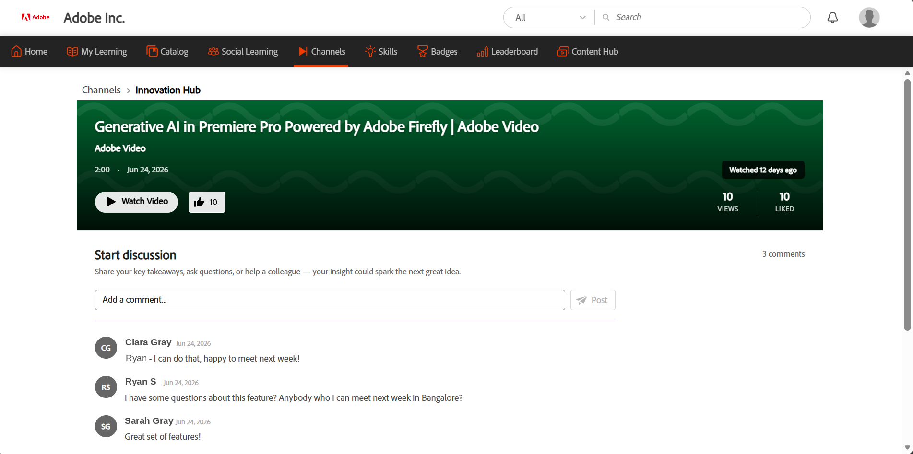

# 채널 탐색 및 참여

채널은 학습자가 Adobe Learning Manager 내의 웹 및 클라우드 컨플루언스 페이지에서 선별된 비디오 기반의 비공식 학습 콘텐츠를 발견하고 액세스하는 데 도움을 줍니다. 관리자는 기록된 지식 공유 및 지식 전송 세션을 호스팅하는 엔터프라이즈 웹 페이지나 클라우드 연결 페이지에 연결하여 채널을 만들 수 있습니다.

여러 내부 사이트에서 검색하는 대신 Learning Manager에서 직접 채널 콘텐츠를 검색할 수 있습니다. 채널은 중앙 집중식으로 관련 비디오를 검색하고, 새로운 콘텐츠에 대해 최신 정보를 제공하며, 조직의 자가 진행식 학습 리소스에 참여할 수 있는 기능을 제공합니다.

**주요 이점**

- 기업 웹 페이지와 클라우드 통합 페이지의 비디오 콘텐츠를 한 곳에서 액세스할 수 있습니다.
- 여러 내부 웹 사이트를 탐색하지 않고도 학습 리소스를 찾을 수 있습니다.
- 새 콘텐츠가 추가되었을 때 최신 정보를 유지하려면 채널을 구독하십시오.
- Adobe Learning Manager에서 직접 비디오를 보고 좋아하세요.
- 토론에 참여하고 공유된 콘텐츠를 중심으로 다른 학습자와 공동 작업을 수행합니다.
- 내 역할 및 관심사와 관련된 선별된 비디오 컬렉션을 탐색합니다.

## 채널 찾기

**채널** 페이지를 사용하여 새 콘텐츠를 찾고, 구독하는 채널에 액세스하고, 원하는 비디오를 볼 수 있습니다.

1. Adobe Learning Manager에 로그인합니다.

1. 상단 탐색 막대에서 **채널**&#x200B;을 선택합니다.

     **채널** 페이지가 열리고 기본적으로 **모두** 탭이 표시됩니다.

   

   *채널 페이지의 모든 탭에서 사용 가능한 채널을 검색하고 구독할 수 있습니다.*

1. 다음 탭을 사용하여 채널 콘텐츠를 찾아봅니다.

   | **탭** | **설명** |
   |----|----|
   | **모두** | 사용 가능한 모든 채널을 표시합니다. 이 탭을 사용하여 새 채널을 검색하고 구독할 수 있습니다. |
   | **구독** | 구독한 채널만 표시합니다. |
   | **좋아요** | 여러 채널에 걸쳐 마음에 드는 비디오를 모두 표시합니다. |

1. 채널에서 사용 가능한 모든 비디오를 보려면 채널에 대해 **모두 보기**&#x200B;를 선택하세요.

## 채널 구독

채널 구독을 통해 내게 가장 관련된 콘텐츠에 빠르게 액세스하고 새 비디오가 추가되더라도 최신 상태를 유지할 수 있습니다.

1. **모두** 탭에서 구독하려는 채널로 이동합니다.

1. **구독** 단추를 선택합니다.

     채널이 **구독** 탭에 추가됩니다.

1. **구독** 탭을 선택합니다.

     이 옵션은 구독하고 있는 모든 채널을 표시합니다.

   

   *빠른 액세스를 위해 구독 탭에서 수집한 구독 채널*

### 채널 구독 취소

더 이상 채널을 팔로우하지 않으려면 **구독** 단추를 다시 선택하십시오. 이 채널은 **구독** 탭에서 제거되고 **모두** 탭에서 언제든지 액세스할 수 있습니다.

## 비디오 시청

조직 채널에서 비디오를 시청하여 선별된 지식 공유 및 학습 콘텐츠에 액세스합니다.

비디오를 보려면 채널로 이동하여 비디오 축소판 또는 재생 아이콘을 선택합니다. 비디오 세부 정보 페이지에서 **비디오 시청** 단추를 선택하여 비디오를 열고 재생합니다.

## 비디오 좋아요

비디오를 **좋아요** 탭에 저장하고 나중에 빠르게 찾을 수 있도록 좋아요.

비디오를 좋아하려면 비디오 카드 또는 비디오 세부 정보 페이지에서 **좋아요** 단추를 선택하십시오. 좋아요 수가 업데이트되고 비디오가 **좋아요** 탭에 추가되어 쉽게 액세스할 수 있습니다.

나중에 찾을 수 있도록 좋아하는 비디오가 저장된 좋아요 탭.

## 토론 참여

각 비디오에 대한 토론을 사용하여 통찰력을 공유하고, 피드백을 제공하고, 질문을 할 수 있습니다. 각 비디오에는 고유한 토론 스레드가 있습니다.

주석을 게시하려면 다음을 수행하십시오.

1. 논의하려는 비디오를 엽니다.

1. **토론 시작** 섹션으로 이동합니다.

1. **주석 추가** 상자에 주석을 입력합니다.

1. **게시물**&#x200B;을 선택합니다.

     댓글이 토론 스레드에 추가되고 비디오를 보는 다른 학습자에게 표시됩니다.

   

   *비디오를 보고, 유사 항목 및 조회 수를 확인하고, 비디오 세부 정보 페이지에서 토론에 참여하세요.*
