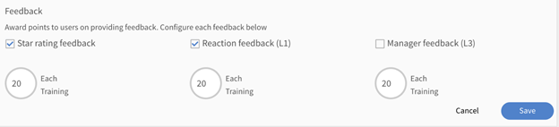

# 게임화

Learning Manager의 게임화 기술을 사용하여 사용자 참여를 유도하십시오.

게임화는 게임이 아닌 컨텍스트에 게임적 사고 방식과 구조를 활용하여 학습하면서 점수를 획득하는 방식으로 사용자의 참여를 유도하는 방법입니다.

## 개요 {#overview}

게임 기술을 활용하여 학습자의 참여를 유도하고 목표 달성의 동기를 북돋우고 싶다면, Learning Manager의 게임화 기능을 사용해 보십시오. 학습자는 동료와 경쟁하며 다양한 학습 활동의 점수를 획득하고 브론즈, 실버, 골드, 플래티넘 레벨을 달성할 수 있습니다.

학습자는 획득한 점수를 바탕으로 성과 레벨을 볼 수 있습니다. 레벨에는 습득이 빠른 학습자, 자기 주도 등이 있습니다. **내외부 학습자 모두 이 기능에 액세스할 수 있습니다.**

## 순위표 {#leaderboard}

리더보드는 주요 경쟁사의 순위 점수를 보여주는 스코어보드 역할을 하는 게임화 기능입니다. 학습자는 순위표에서 게임화 점수를 볼 수 있습니다.

학습자의 홈 페이지의 왼쪽 창에서 **[!UICONTROL 게임화]**&#x200B;를 클릭합니다. 순위표를 보려면 순위표 링크를 클릭합니다. 이 기능을 통해 학습자는 본인이 특정 팀 회원을 상대로 어느 정도의 위치인지 파악할 수 있습니다. 순위표는 팀 내 다른 회원과의 상대적인 순위 또한 볼 수 있습니다.

학습자 순위표의 일부 기능:

* 게임화가 해당 인스턴스에 활성화된 경우 학습 프로그램 인스턴스에 등록된 학습자는 서로의 점수를 확인할 수 있습니다.
* 비교할 팀 회원을 포함하려면 **[!UICONTROL 동료 추가]**&#x200B;를 클릭합니다. 팀원의 프로필 사진이 순위표 페이지 상단의 타임라인 배율에 추가됩니다. 타임라인 표는 귀하의 시작 점수를 보여주며 팀 회원보다 더 많은 점수를 획득할 때마다 오른쪽으로 위치를 이동시킵니다. 오직 같은 그룹에 있는 회원과만 비교할 수 있습니다.
* **사용자 그룹:** 언제든지 **[!UICONTROL 나를 다음으로 순위 매기기]** 옵션을 사용하여 순위를 비교할 팀 구성원 프로필을 선택할 수 있습니다. 사용자 그룹 선택 필드에서 그룹을 입력하고 선택합니다. 모든 팀원의 목록과 최신 포인트가 아래에 나열되어 있습니다. 내부 사용자와 외부 사용자 모두 목록을 볼 수 있지만 내부 사용자만 다른 내부 학습자를 검색할 수 있습니다.

* 또한 &#39;귀하의 순위와 비슷한 사람&#39; 대화 상자는 귀하의 레벨보다 높거나 낮거나 귀하의 레벨과 같은 팀원의 이름을 표시합니다.
* 외부 사용자가 내부 사용자로 변환하면 타임라인이 자동으로 업데이트됩니다.

## 일관된 학습을 위한 점수

Adobe Learning Manager는 사용자가 학습 플랫폼에 일관되게 액세스하고 학습 활동을 참여하도록 독려하는 새로운 게임화 작업을 소개합니다. 이제 관리자는 이 작업을 위해 학습자가 한 주, 한 달 또는 한 분기에 1, 2, 3, 4일 동안의 학습 활동을 수행하면 점수를 주도록 새로운 규칙을 설정할 수 있습니다.

이 규칙의 게임화 점수는 24시간마다 한 번 부여됩니다. 예를 들어 학습자가 아시아 태평양 표준시(PST)로 오늘 오전 8시에 학습 활동을 수행하고 금일 게임화 점수를 받았다면 PST 기준으로 익일 오전 8시 이후에 학습 활동을 수행해야 다음 날의 게임화 점수 부여 대상이 됩니다.

다음 활동을 학습 활동으로 간주합니다.

* Fluidic Player에서 강의, 학습 경로 또는 인증서 사용
* 작업 지원 다운로드
* 첨부 파일 다운로드
* 노트 추가
* 소셜 학습 대시보드 액세스
* 소셜 학습 대시보드에서 댓글 달기
* 소셜 학습 대시보드에 게시

L1 및 L3 피드백과 평가 등급을 제공하기 위한 **게임화 점수**

이제 관리자는 Adobe Learning Manager를 사용하여 L1 피드백, L3 피드백 및 평가 등급을 제공할 때 사용자에게 점수를 주는 게임화 기준을 활성화할 수 있습니다.

*피드백 등급 보기*

이 기능은 사용자가 적극적으로 학습자뿐만 아니라 책임자에게도 유익한 피드백을 제공하도록 독려하여, 책임자가 학습자의 관점을 더 잘 이해하고 강의의 효율성을 더 잘 평가할 수 있도록 합니다.

## 과제 {#tasks}

학습자는 5개의 게임화 과제를 사용할 수 있습니다. 학습자 홈페이지 창의 오른쪽 상단 모서리에 있는 원 안에서 게임화 점수를 볼 수 있습니다. 각 작업에 대한 할당을 보려면 게임화 를 클릭합니다.

시스템이 게임화 페이지를 표시합니다. 페이지에는 아래에 표시된 모든 학습자 과제 및 점수가 표시됩니다.

>[!NOTE]
>
>특정 과제의 게임화 점수는 누적되지 않습니다. 하지만 학습자가 여러 과제에서 해당 점수를 획득한 경우, 학습자 계정에는 점수가 누적됩니다.
>
>강의에 점수를 할당할 때, 책임자는 학습자가 점수를 점진적으로 획득할 수 있도록 해야 합니다.

**습득이 빠른 학습자용**

이 과제는 학습자가 월/분기/연 내에 일정 강의를 완료할 때 적용할 수 있습니다. 습득이 빠른 학습자를 격려하기 위한 과제입니다.

가능한 시나리오는 다음과 같습니다.

1. 월/분기/연 내에 2개의 강의를 완료한 학습자는 20점을 획득합니다.
1. 월/분기/연 내에 4개의 강의를 완료한 학습자는 100점을 획득합니다.
1. 8개의 강의를 완료한 학습자는 300점을 획득합니다.
1. 10개의 강의를 완료한 학습자는 500점을 획득합니다.

>[!NOTE]
>
>책임자는 해당 점수를 획득하기 위해 완료해야 하는 강의 수와 기간을 수정할 수 있습니다.
>
>과제 내에서 점수는 학습자에게 누적 부여되지 않습니다. 예를 들어 학습자가 단일 강의를 완료하여 20점을 얻었다고 가정해 보겠습니다. 학습자가 2개의 강의를 완료했을 때, 학습자는 100점을 획득합니다. 기존의 20점은 고려하지 않습니다.

**자기 주도 학습자용(a)**

이 과제는 학습자가 지정된 수의 강의에 등록하고 월/분기/년 이내에 완료할 때 적용됩니다. 이 경우 책임자는 이 작업을 활성화하여 점수를 할당하고 권장할 수 있습니다.

가능한 시나리오:

1. 월/분기/연 내에 1개의 강의에 등록한 학습자는 50점을 획득합니다.
1. 학습자가 월/분기/년 이내에 두 개의 강의에 등록하면 150점을 받습니다.

>[!NOTE]
>
>책임자는 강의의 수와 기간을 수정할 수 있습니다.

**자기 주도 학습자용(b)**

이 과제는 학습자가 월/분기/연 내에 완료해야 하는 수의 강의보다 많은 수의 강의에 등록하여 완료했을 때 적용할 수 있습니다. 이러한 경우 책임자는 이 과제에 점수를 할당하여 학습자를 독려할 수 있습니다.

할당된 강의에 추가적으로 등록하는 학습자에게 가능한 시나리오:

1. 월/분기/연 내에 1개의 강의에 등록한 학습자는 20점을 획득합니다.
1. 학습자가 월/분기/년 이내에 두 개의 강의에 등록하면 100점을 받습니다.
1. 월/분기/연 내에 3개의 강의에 등록한 학습자는 300점을 획득합니다.
1. 월/분기/연 내에 4개의 강의에 등록한 학습자는 500점을 획득합니다.

>[!NOTE]
>
>책임자는 강의의 수와 기간을 수정할 수 있습니다. 예를 들어 세 번째 경우에서 강의의 수를 3개에서 5개로, 점수를 80점으로 수정할 수 있습니다.

**스킬 향상용(a)**

이 과제는 학습자가 다수의 역량을 완료할 때 적용할 수 있습니다. 책임자는 이 과제를 선택하여 학습자가 최대한 많은 역량을 획득하도록 독려할 수 있습니다.

역량 스킬 향상용에서 가능한 시나리오:

1. 1개의 역량을 달성한 사용자는 100점을 획득합니다.
1. 학습자가 두 가지 역량을 달성하면 300점을 획득하게 된다.
1. 학습자가 세 가지 역량을 달성하면 600점을 획득하게 된다.
1. 학습자가 4개의 역량을 달성하면 900점을 획득하게 된다.

>[!NOTE]
>
>이 과제에는 기한을 적용할 수 없습니다. 책임자는 각 시나리오에 대한 강의의 수를 수정할 수 있습니다.

**스킬 향상용(b)**

이 과제는 학습자가 더 높은 수준의 역량을 완료했을 때 적용할 수 있습니다.

특정 역량 내 스킬 향상용에서 가능한 시나리오:

1. 학습자가 한 레벨을 달성하면 100점을 받게 됩니다.
1. 학습자가 두 가지 레벨을 달성하면 200점을 받게 됩니다.
1. 학습자가 세 가지 레벨을 달성하면 500점을 받게 됩니다.

>[!NOTE]
>
>이 과제에는 기한을 적용할 수 없습니다. 책임자는 각 시나리오에 대한 레벨 수를 수정할 수 있습니다. 학습자가 더 높은 레벨을 달성하고 나서 더 낮은 수준의 역량을 달성하면 높은 레벨에서만 점수를 획득합니다.

**조기 완료 점수**

이 과제는 학습자가 강의를 가장 먼저 완료한 N명 안에 들었을 때 적용할 수 있습니다.

가능한 시나리오:\
강의를 가장 먼저 완료한 10명 안에 든 학습자는 100점을 받습니다.

**적시 완료 점수**

이 과제는 학습자가 강의 완료 기한보다 지정된 일수만큼 빠르게 강의를 완료했을 때 적용할 수 있습니다.

가능한 시나리오:\
강의 개시 후 10일 이내에 강의를 완료한 학습자는 100점을 획득합니다.

**레벨 달성**

학습자의 레벨 상태는 &#39;내 강의&#39; 페이지의 원으로 표시된 페이지 오른쪽 상단 모서리에 표시됩니다. 학습자는 학습 기간 동안 획득한 점수에 따라 다른 레벨을 달성합니다.

1. 브론즈 - 학습자가 1500점을 달성하면
1. 실버 - 학습자가 2500점을 획득한 경우입니다.
1. 골드 - 학습자가 3000점을 달성한 경우.
1. 플래티넘 - 학습자가 5000점을 달성한 경우.

## 자주 묻는 질문 {#frequentlyaskedquestions}

**1. 학습자로 순위표를 확인하려면 어떻게 해야 합니까?**

학습자 앱에서 왼쪽 창의 **[!UICONTROL 소셜 학습]**&#x200B;을 클릭합니다. 이 페이지의 오른쪽 하단 모서리에 소셜 순위표가 나타납니다.
