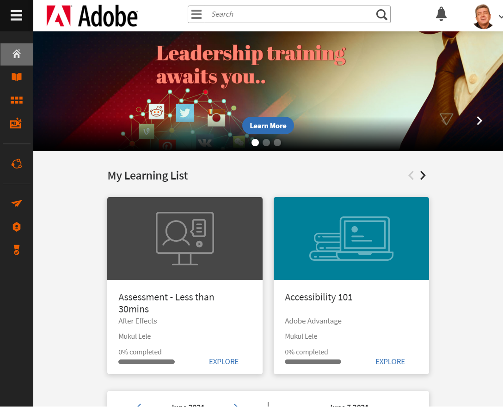

# 학습자로 시작하기

Learning Manager 학습자 앱 시작하기

Learning Manager의 학습자 앱은 완전한 위젯 기반으로 한두 번의 클릭으로 다양한 기능을 오고 가게 해줍니다.

Learning Manager 웹 응용 프로그램에서 학습자로 로그인하면 홈페이지에 다음 위젯이 표시됩니다.

**내 학습**: 유형별 및 기한별로 학습 객체를 보고 클릭할 수 있습니다. 내 학습 위젯에서 원을 클릭하여 학습 객체 유형으로 직접 이동하거나 기한 내에 학습 객체를 표시합니다.

**내 스킬**: 페이지의 오른쪽 상단 모서리에서 스킬 맵을 볼 수도 있습니다. 참조  [스킬 맵](skills-levels.md)기능을 사용하여 자세한 내용을 살펴보십시오.

**학습 개체 위젯**: 내 학습 바로 아래에 있는 이 섹션에는 사용자의 학습 객체가 표시됩니다. 내 학습 아래에서 모든 [강의](courses.md), [학습 프로그램](learning-programs.md) 및 [인증](certifications.md) 사용자가 등록하거나 사용자에게 할당했습니다. 직접 학습 객체를 사용하거나 이 위젯에서 학습 객체를 다시 방문할 수 있습니다.

**학습 일정**: 이 위젯은 매 분기마다 귀사에서 예정된 학습 및 계획된 학습의 목록을 표시합니다. 특정 강의에 등록한 경우 등록 상태가 등록됨입니다.

**권장된 학습**: 이 위젯에서는 회사의 책임자/관리자가 귀하의 프로필에 권장하는 모든 강의를 볼 수 있습니다. 이 링크를 누르면 강의 페이지로 이동할 수 있습니다.

**내 도전 과제**: 강의를 완료한 후 배지를 받습니다. 이러한 배지는 페이지 맨 위의 사용자 프로필 옆에 표시됩니다. 배지를 클릭하여 특정 정보를 가져옵니다. 배지에 대한 자세한 내용은 다음을 참조하십시오.  [배지](badges.md) 기능.

이 위젯은 학습자의 게임화 점수도 표시합니다. 게임화 링크를 클릭하여 게임화의 세부 사항 및 기타 기능을 확인할 수 있습니다. 게임화 점수 및 리더 보드에 대한 자세한 내용은 을 참조하십시오.  [게임화](gamification.md) 기능.

iPad 또는 Android 태블릿을 사용하여 Learning Manager에 액세스하는 경우, 이 페이지의 iPad 및 Android 탭 앱 항목 섹션을 참조하십시오.

## 학습 타임라인 {#learningtimeline}

학습 타임라인에는 학습자가 완료해야 하는 강의와 함께 일정이 표시됩니다. 이 섹션에서는 모든 강의, 인증 및 학습 프로그램에 대한 경고를 기한 오름차순으로 볼 수 있습니다. 각 학습 활동의 마감일은 왼쪽 창에 표시됩니다.

왼쪽 타일의 각 학습 개체를 클릭하여 오른쪽 창에서 해당 정보를 강의 카드로 표시합니다. 강의/학습 프로그램/인증 타일을 클릭하여 각 학습 객체의 전체 정보를 볼 수 있습니다.

타임라인 영역 위에 마우스를 가져가면 오른쪽에 스크롤 막대가 표시됩니다. 스크롤 막대를 사용하여 위 또는 아래로 이동하고 추가 경고를 봅니다.

## iPad 및 Android 앱 사용자 {#ipadandandroidappusers}

iPad 또는 Android 태블릿의 Learning Manager 앱에 학습자로 로그인하면 홈 탭에 다음과 같은 정보가 표시됩니다.

학습 및 카탈로그 기능으로 이동하려면 다음 아이콘을 누릅니다. **메뉴** 드롭다운을 클릭하고 적절한 옵션을 선택합니다.

### 오프라인으로 앱 이용

iPad 및 Android 태블릿에서 Learning Manager 앱을 오프라인으로 액세스할 수 있습니다. 오프라인 모드에서 강의를 다운로드하여 수강하고, 네트워크와 연결하여 콘텐츠를 온라인 앱에 다시 동기화합니다.

1. 상단의 메뉴 드롭다운을 누르고 학습 옵션을 누릅니다. 이용 가능한 모든 강의 목록이 타일로 표시됩니다.
1. 학습 콘텐츠를 다운로드하려면 각 학습 객체 타일 하단에 있는 다운로드 아이콘을 누릅니다.

   

1. 온라인 상태에서는 콘텐츠를 온라인으로 동기화할 것인지 확인하는 메시지가 앱 상단 표시줄에 나타납니다. 대답이 예인 경우 빨간색 막대를 탭합니다. 녹색 표시줄은 콘텐츠가 온라인 앱과 동기화되고 있음을 나타냅니다.

**장치 저장소 추적**

장치 저장소를 주기적으로 모니터링할 수 있습니다.\
앱의 오른쪽 상단에 있는 프로필 아이콘을 탭한 다음 을 탭합니다. **장치 저장소** menu 옵션을 사용합니다.

아래와 같이 앱 스토리지 정보 대화 상자가 나타납니다.

앱 스토리지 정보를 활용하여 기기, 앱, 다운로드한 강좌의 전체 공간을 확인할 수 있다. 이 정보를 통해 그에 따라 강의를 다운로드할 수 있습니다. 장치에서 다운로드한 강의를 삭제하려면 각 강의 이름 옆의 X 아이콘을 누릅니다.
