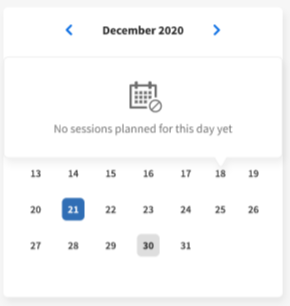
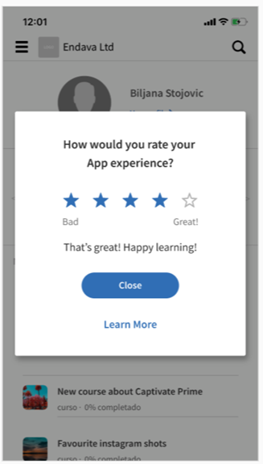

# 모바일 및 태블릿 학습자 앱

이 문서에서 스마트폰 및 태블릿용 Learning Manager 학습자 앱을 다운로드하는 방법을 알아보십시오. 모바일 또는 태블릿에서 강의를 수료하는 방법을 알아보십시오.

## 개요 {#overview}

Android 휴대폰 및 iPhone 사용자 모두 학습자용 Learning Manager 앱을 이용할 수 있습니다. Google Play Store(Android OS) 또는 iTunes(macOS)에서 Learning Manager 앱을 다운로드하십시오.

이 앱을 다운로드하고 설치한 후 학습자 자격 증명을 사용하여 앱에 로그인합니다. Learning Manager 모바일 앱을 열면 기본적으로 다음 화면이 표시됩니다.

*Learning Manager 앱의 홈 페이지*

## 홈 페이지 {#homepage}

몰입형 레이아웃 옵션을 사용하도록 설정한 모든 계정의 경우 몰입형 레이아웃 구성을 지원하는 완전히 새로운 홈페이지가 있습니다. 홈 페이지는 다음에 대한 카드 목록으로 구성됩니다.

|  |  |
|---|---|
|  |  |

*홈페이지의 카드 목록*

*학습자의 소셜 피드*

## 피드백 등급 {#feedbackrating}

Learning Manager는 학습자에게 모바일 앱 사용 경험에 대한 피드백 제공을 요청하는 메시지를 표시합니다. 이 피드백은 한 달에 한 번 표시되며 사용자가 앱을 경험한 다음 피드백을 제공할 수 있는 충분한 시간 간격을 제공합니다.

<!--
|  | |
|---|---|
-->

기존 사용자의 경우 앱을 최신 버전으로 업데이트한 후 처음으로 플레이어를 닫으면 피드백 팝업이 표시됩니다.

피드백 수집은 익명이며 앱 설정에서 구성을 통해 사용 현황 데이터&#x200B;**공유 옵션을**&#x200B;사용하도록 설정한 사용자에게만 표시됩니다.

## 배지 다운로드 {#downloadbadge}

학습자는 자신의 배지를 PDF 및 이미지 형식으로 다운로드할 수 있습니다. 사용자 프로필 섹션에서 아래로 스크롤하고 링크를 클릭하여 배지를 다운로드합니다. 다운로드한 배지는 기본 장치 폴더에 저장됩니다. 이 앱을 사용하면 다운로드가 완료된 직후 폴더 또는 파일을 열 수 있습니다.

|  |
|---|

*배지 다운로드*

## 모바일 웹 반응형 레이아웃 {#responsive}

학습자가 모바일 앱을 설치하지 않았더라도 장치를 사용하여 교육을 이용할 수 있도록 하는 완전한 반응형 모바일 웹 환경입니다.

장치에서 브라우저를 통해 먼저 학습자 앱에 로그인하는 경우 학습자 앱은 모바일 친화적인 반응형 레이아웃 형식으로 표시됩니다.

모바일 웹 반응형 UI 지원은 계정이&#x200B;**몰입형 레이아웃에 대해서만 구성된** 경우에만 사용 가능합니다. 반응형 UI는 **클래식 레이아웃에 사용할 수 없습니다**.

<!--
<table>
 <tbody>
  <tr>
   <td>
    
<strong>Home page</strong>

    
<strong>View options</strong>

    
<strong>Start course</strong>
</td>
   <td>
    
<strong>My Learning List</strong>

    
<strong>View catalog</strong>

    
<strong>Apply filters</strong>
</td>
   <td>
    
<strong>Recommendations based on interest</strong>

    
<strong>View notifications</strong>

    
<strong>Share url</strong>
</td>
  </tr>
 </tbody>
</table>
-->

## ALM 웹에서 프롬프트 다운로드

사용자가 모바일 장치에서 ALM 링크를 열거나 ALM 웹을 사용할 때 더 나은 경험을 위해 앱을 다운로드하라는 메시지가 표시되어야 합니다.

_ALM 앱 다운로드_

## 모바일 몰입형 경험에서 지원되지 않는 기능 {#unsupportedfeaturesinmobileimmersiveexperience}

다음 워크플로우는 학습자의 클래식 환경에 표시됩니다.

* 다중 시도
* Flexi LP
* 파일 업로드 시나리오
* L1 피드백 제공

지원되지 않는 다른 앱 기능은 다음과 같습니다.

* 소셜 앱: 학습자가 홈페이지의 소셜 위젯을 클릭하면 클래식 환경으로 리디렉션됩니다.
* 프로필 설정/프로필 편집
* 배지/스킬 보기
* 순위표: 학습자가 홈페이지의 순위표 위젯을 클릭하면 클래식 환경으로 리디렉션됩니다.
* 작업 지원을 다운로드 중입니다.
* 검색에서 옵션을 필터링합니다.

이제 소셜 학습에서 모바일 몰입형 웹 경험을 지원합니다.

기존에 모바일 몰입형 앱에서 지원되지 않던 몇 가지 기능이 포함됩니다. 이것들은:

| **지역** | **지원되지 않음** |
|---|---|
| 게시판 | 게시판 생성, 게시판 편집, URL 복사, 삭제, 보고서, 정렬, 필터 |
| 게시물 | 설문 조사 유형 게시물 생성, 편집, 게시물에 다중 첨부, URL 복사, 맨 위에 고정 |
| 코멘트/답글 | 편집, 정답으로 표시, 댓글 또는 답장에 이미지/비디오/오디오 업로드 중 |
| 미디어 | 오디오 캡처, 오디오 파일만 업로드 |
| 기타 | 알림, 게시물 보기, 소셜 순위표, 팔로우한 사람, 사용자 프로필 |

## 학습자가 작업 지원을 다운로드할 수 있도록 활성화 {#download-job-aid}

모바일 몰입형 모드에서 학습자는 작업 지원을 다운로드할 수 있습니다. Settings(설정)**를 누른**&#x200B;다음 Catalogs(카탈로그)를&#x200B;**누릅니다**. 표시되는 목록에서 작업 지원을 다운로드합니다.

|  |
|---|

*작업 지원 다운로드*

## 학습자가 학습자 성적 증명서를 다운로드할 수 있도록 활성화 {#download-learner-transcript}

모바일 몰입형 모드에서 학습자는 학습자 성적 증명서를 다운로드할 수 있습니다.

|  |  |
|---|---|

*학습자 성적 증명서 다운로드*

## 배지 및 스킬 보기 {#viewbadgesandskills}

**배지, 스킬, 게임화 점수 보기**

기본 화면의 프로필 정보 아래에는 최근 달성한 배지, 스킬, 게임화 점수가 표시됩니다. 휴대폰에서는 최근 달성한 배지가 표시됩니다. 자세한 내용을 보려면 오른쪽으로 밉니다.

**보류 중인 학습**

기본적으로 화면에는 등록된 강의가 표시됩니다. 도넛 표에는 지난 학습 기한, 기한이 다가오는 학습, 진행 중인 학습이 표시됩니다.

과정을 탭하면 과정 세부 정보, 완료 날짜(해당되는 경우)를 볼 수 있습니다. 이 화면에서 완료 상태에 따라 강의를 계속하거나 재방문할 수 있습니다.

*보류 중인 학습 보기*

**카탈로그 보기**

화면 하단의 책 아이콘 옆에 있는 아이콘을 탭합니다. 모든 관련 학습 객체가 있는 카탈로그를 즉시 볼 수 있습니다. 격자 레이아웃으로 표시하거나 자세히 보기를 선택할 수 있습니다. 권장 사항을 선택하여 학습 기록을 기반으로 한 코스 권장 사항을 확인합니다.

*과정 추천 보기*

## 학습 객체 정렬 및 필터링 {#sortandfilterlearningobjects}

**정렬 및 필터링**

강의의 오른쪽 상단 모서리에 있는 정렬 아이콘을 클릭하거나 카탈로그 화면을 클릭하여 알파벳 또는 게시된 일자로 학습 객체를 정렬합니다. 유형, 완료 상태, 스킬 또는 태그로 학습 객체를 필터링할 수도 있습니다. 탭한 다음 필터를 선택하고 &#39;적용&#39;을 눌러 필터를 적용합니다.

**검색 기능 사용**

휴대폰 화면의 오른쪽 상단에 검색 아이콘이 있습니다. 아이콘을 클릭하여 강의 메타데이터, 고유 ID, 스킬 등으로 학습 객체를 검색할 수 있습니다.

**프로필, 설정 및 알림 관리**

화면 왼쪽 상단의 메뉴를 눌러  프로필, 알림 및 계정 설정을 봅니다.

또한 이 메뉴에서 강의의 출석을 표시하는 QR 코드를 스캔할 수 있습니다.

QR 코드&#x200B;**스캔 옵션을 누르고**&#x200B;코드를 스캔하기만 하면 됩니다.

**오프라인 강의 수료**

온라인 상태에서 다운로드한 강의를 사용하면 Learning Manager는 서버를 호출하는 대신 다운로드한 강의에 액세스합니다.

## QR 코드를 스캔하여 등록 {#qrcode}

QR 코드를 스캔하여 강의에 등록할 수 있습니다. 학습 책임자가 QR 코드를 생성하면 앱에서 QR 코드를 스캔하여 강의에 등록할 수 있습니다.

1. QR 코드를 스캔하려면 화면 왼쪽 상단 모서리를 탭  하세요.
1. **QR 코드 스캔**&#x200B;을 탭합니다.

QR 코드 스캔 기능을 사용하면 학습자는 학습 책임자가 생성한 QR 코드에 따라 아래 동작 중 하나를 수행할 수 있습니다.

* **등록:** 학습자가 QR 코드를 스캔하여 과정에 등록할 수 있습니다.
* **완료:** 학습자는 QR 코드를 스캔하여 강의를 완료됨으로 표시할 수 있습니다.
* **등록 및 완료:** 학습자는 QR 코드를 스캔하여 등록과 동시에 완료 표시를 할 수 있습니다.
* **출석 표시:** 학습자가 QR 코드를 스캔하여 특정 세션의 출석을 표시할 수 있습니다.

## 학습 객체 이름 변경 {#renaminglearningobjects}

책임자는 학습 객체 용어를 변경할 수 있습니다. 변경하려면 [학습 객체 이름 변경](../../administrators/feature-summary/settings.md#main-pars_header_1570157145)을 참조하십시오.

## 소셜 학습 {#socialmobile}

이번 업데이트에서는 다음 기능은 지원되지 않습니다. 다음 기능은 사용할 수 없습니다.

* 게시판을 만들거나 팔로우합니다.
* 게시물에 URL을 복사합니다.
* 게시물을 스토리로 추가하거나 게시물로 즐겨찾기로 추가하거나 상단에 고정할 수 있습니다.
* 소셜 리더 보드를 봅니다.

소셜 학습은 사용자가 비공식 환경에서 아이디어와 의미 있는 인사이트를 공유하도록 장려하는 Learning Manager 모바일 앱의 플랫폼입니다. 이는 전통적인 학습 개념을 보충하는 방법입니다.

소셜 학습을 통해 사용자는 주변의 전문 지식을 사용하여 정확하고 간결한 정보를 얻을 수 있습니다. 학습자는 해당 정보를 신속하게 적용하여 과제를 완료하고 목표를 달성할 수 있습니다.

사용자는 모바일 앱을 사용하여 콘텐츠를 공유하고 공유된 콘텐츠의 유효성을 확인하여 서로 상호 작용할 수 있습니다.

이 플랫폼에서 공유할 수 있는 다른 유형의 콘텐츠는 비디오, 오디오, 스크린샷, 텍스트, 질문 및 투표입니다. 또한 사용자는 온라인 학습을 동료와 공유할 수 있습니다.

이 기능은 책임자가 계정에 대해 **소셜 학습**&#x200B;을 활성화한 경우에만 디바이스 앱에서 사용할 수 있습니다.

## 앱에서 소셜 학습 실행 {#launchsociallearningontheapp}

앱이 실행되면 **소셜** 아이콘을 누릅니다.

*소셜 학습 보기*

## 게시판에 게시물 만들기 {#createapostinaboard}

다른 소셜 플랫폼과 마찬가지로 Learning Manager 모바일 앱에서는 게시판에 게시물을 작성할 수 있으므로 같은 게시판에 속한 모든 학습자는 게시물을 보고 댓글을 달며, 댓글과 함께 파일을 업로드할 수 있습니다.

게시물을 작성하려면 화면 오른쪽 하단에 있는 추가 아이콘](/help/migrated/learners/feature-summary/assets/prime-add.png) 아이콘을 탭합니다

*게시물 추가*

<table>
 <tbody>
  <tr>
   <td>
    

</td>
   <td>
    
게시물을 작성하거나 URL을 붙여넣습니다.
</td>
  </tr>
  <tr>
   <td>
    

</td>
   <td>
    
모바일 카메라로 사진을 촬영하고 게시물과 함께 업로드합니다.
</td>
  </tr>
  <tr>
   <td>
    

</td>
   <td>
    
모바일 카메라로 비디오를 녹화합니다.
</td>
  </tr>
  <tr>
   <td>
    
 
</td>
   <td>
    
모바일 카메라로 오디오를 녹음합니다.
</td>
  </tr>
  <tr>
   <td>
    

</td>
   <td>
    
게시판에 문서 또는 파일을 업로드합니다.
</td>
  </tr>
  <tr>
   <td>
    
 
</td>
   <td>
    
질문합니다.
</td>
  </tr>
  <tr>
   <td>
    
 
</td>
   <td>
    
게시물에 투표를 만듭니다.
</td>
  </tr>
 </tbody>
</table>

## 지원되는 콘텐츠 형식 {#supportedcontentformat}

<table>
 <tbody>
  <tr>
   <td>
    
<strong>콘텐츠 유형</strong>
</td>
   <td>
    
<strong>확장</strong>
</td>
  </tr>
  <tr>
   <td>
    
비디오
</td>
   <td>
    
wmv, f4v, asf, 3gp, 3g2, avi, mov, h264, m4v, mp4, MPEG, mpg
</td>
  </tr>
  <tr>
   <td>
    
오디오
</td>
   <td>
    
mp3, amr, m4a, wav, wma, aac
</td>
  </tr>
  <tr>
   <td>
    
정적 파일
</td>
   <td>
    
PDF, ppt, pptx, doc, docx, xls, xlsx
</td>
  </tr>
  <tr>
   <td>
    
이미지
</td>
   <td>
    
jpg, jpeg, png, bmp, gif
</td>
  </tr>
 </tbody>
</table>

게시물 작성 후, 게시물을 업로드할 게시판을 선택하십시오. 게시판 선택을 누르고 필요한 게시판을 검색하십시오.

게시글을 작성한 후 게시를 누르고 다른 학습자가 해당 게시글을 볼 수 있도록 댓글을 게시합니다.

모바일 앱에서는 게시판을 만들 수 없습니다. 게시판을 만들려면 웹 앱에 학습자로 로그인해야 합니다. 게시판을 만드는 방법에 대한 자세한 내용은 [Learning Manager](/help/migrated/learners/feature-summary/social-learning-web-user.md)의 소셜 학습을 참조하십시오.

## 게시물에서 수행할 수 있는 작업 {#actionsthatcanbeperformedonapost}

* 게시물에 댓글을 달고 권한에 따라 게시판에서 게시물을 봅니다.
* 게시판에서 댓글을 편집하거나 삭제합니다.
* 권한에 따라 게시물을 편집하거나 삭제합니다.
* 게시물이 개인 정보를 침해하거나 해당 내용이 부적절한 경우 게시물 남용을 신고하십시오. 게시물이 신고되면 게시판 책임자와 중재자에게 추가 조치를 위한 알림이 전송됩니다.
* 게시물을 좋아    하거나 싫     어합니다.
* 댓글에 좋아요   또는 싫어요  .

## 다른 게시판에 게시물 만들기 {#createapostinotherboards}

다른 게시판에도 게시물을 만들 수 있습니다.

**모든 게시판**&#x200B;을 누르면 다른 학습자가 게시판에서 수행한 활동을 볼 수 있습니다.

*모든 이사회 활동 보기*

필요한 게시판으로 이동하여 댓글을 게시하십시오.

## 게시판에 미디어 공유 {#sharemedia}

<!---->

사진, 문서 또는 오디오나 비디오 파일을 게시판에 공유하면 다른 게시판 팀원이 게시물을 보고 상호 작용을 시작할 수 있습니다. 모든 미디어를 공유하려면

1. 공유할 미디어를 엽니다.
1. 공유 버튼을 누르고 Learning Manager를 선택합니다.
1. 미디어를 공유할 보드를 선택합니다.
1. 게시&#x200B;**를 탭합니다**.

Reddit 또는 Quora에서 의견을 공유할 수 있는 것처럼 외부 앱에서 콘텐츠를 게시할 수도 있습니다.

## 수료를 증명하는 외부의 인증서 에셋 업로드 {#externalcert}

아래 단계를 따르십시오.

1. 학습자 자격 증명을 사용하여 디바이스 앱에 로그인합니다.
1. 작성자가 생성한 인증서를 검색합니다.
1. 외부 인증서 목록에서 필요한 인증서를 선택하여 등록합니다.
1. 수료&#x200B;**증명을 누르고** PDF 또는 이미지 등의 파일을 업로드합니다.

   |  |  |
   |---|---|

*완료 증빙 자료 업로드*

1. 파일을 업로드한 후 **제출**&#x200B;을 누릅니다. 확인 메시지가 표시됩니다.

**파일 업로드**

1. 파일을 업로드한 후 **제출**&#x200B;을 누릅니다.

   수료를 증명하는 파일은 1개만 업로드할 수 있습니다. 여러 파일을 업로드하려고 시도하면 다음 메시지가 표시됩니다.

   **변경 사항이 손실됩니다. 계속하시겠습니까?**

1. 상태가 **승인 보류 중**&#x200B;으로 변경되며 주황색으로 표시됩니다.

   모바일 앱에서는 업로드된 파일을 보거나 다운로드할 수 없습니다.

관리자가 제출을 승인하면 상태가 **승인됨**&#x200B;으로 변경되고 녹색으로 표시됩니다.

관리자가 제출을 거부하는 경우 상태는 **거부됨**&#x200B;으로 변경되고 빨간색으로 표시됩니다.

|  |  |  |
|---|---|---|

*제출 상태 보기*

거부되면 수료를 증명하는 파일을 업로드할 수 있습니다.

* 제출 보류 중 및 거부&#x200B;**됨 상태**&#x200B;인 경우에만 파일을 제출할 수 있습니다.
* 상태가 승인 보류 중 및 승인됨인 **경우 파일을 제출할 수 없습니다**.

## LinkedIn 학습에서 강의 수강 {#linkedin}

Learning Manager는 이미 학습 플랫폼 내에서 LinkedIn 학습 과정을 지원합니다. 이제 학습자는 Learning Manager 모바일 앱에서 이러한 LinkedIn 학습 과정을 수강할 수 있습니다. 디바이스 앱에서 강의를 검색한 후 강의를 시작합니다.

LinkedIn 앱이 이미 설치되어 있으면 강의가 앱 또는 기본 브라우저에서 열립니다. 여기서 LinkedIn 자격 증명을 사용하여 로그인해야 합니다.

LinkedIn 앱을 통해 강의를 수강하는 경우 학습 관리자 내에서 진행 상황이 추적되지 않습니다. 따라서 LinkedIn Learning 앱 대신 브라우저에서 과정을 시작하는 것이 좋습니다.

>[!NOTE]
>
>인터넷 연결이 활성화되어 있는 경우에만 과정을 수강할 수 있습니다.

|  |  |  |
|---|---|---|

*LinkedIn Learning에 과정 등록*

LinkedIn 학습 과정에서 소요된 학습 시간은 LinkedIn 콘텐츠/LinkedIn 플랫폼에서 Learning Manager 학습 플랫폼으로 전달합니다.

LinkedIn 학습에서 학습 시간을 전송하지 않는 경우 학습 플랫폼에서 기록할 수 없습니다. 이 경우 Learning Manager에 표시되는 학습 소요 시간은 0입니다.

## 강의실 및 활동 모듈에 대한 파일 제출 {#submitfile}

학습자는 강의 수료를 증명하는 파일을 강사에게 제출할 수 있습니다. 강사는 파일 콘텐츠를 기반으로 제출을 승인하거나 거부할 수 있습니다.

작성자는 학습자가 모바일 앱에서 사용할 교실 및 활동 모듈만 만들 수 있습니다.

학습자가 강의를 시작하면 아래 스크린샷과 같이 파일 업로드 링크와 함께 파일 제출&#x200B;**상태가**&#x200B;보류 중으로 화면에 표시됩니다.

*파일 제출 상태*

파일을 업로드하려면 **파일 업로드**&#x200B;를 클릭합니다.

파일을 업로드하고 제출&#x200B;**버튼을 클릭합니다**.

 

*파일 제출*

## 업로드에 지원되는 파일 유형 {#supportedfiletypesforupload}

<table>
 <tbody>
  <tr>
   <td>
    
<b>콘텐츠 유형</b>
</td>
   <td>
    
<b>확장</b>
</td>
  </tr>
  <tr>
   <td>
    
비디오
</td>
   <td>
    
wmv, f4v, asf, 3gp, 3g2, avi, mov, h264, m4v, mp4, MPEG, mpg
</td>
  </tr>
  <tr>
   <td>
    
오디오
</td>
   <td>
    
mp3, amr, m4a, wav, wma, aac
</td>
  </tr>
  <tr>
   <td>
    
정적 파일
</td>
   <td>
    
PDF, ppt, pptx, doc, docx, xls, xlsx
</td>
  </tr>
  <tr>
   <td>
    
이미지
</td>
   <td>
    
jpg, jpeg, png, bmp, gif
</td>
  </tr>
 </tbody>
</table>

## 제출 승인 또는 거부 {#approvalorrejectionofsubmission}

파일을 업로드하면 상태가 승인 보류 중으로 **변경됩니다.**. 그런 다음 강사는 보류 중인 제출](/help/migrated/instructors/feature-summary/learners.md)물 목록을 [확인하고 강사 웹 앱을 통해 제출을 승인하거나 거부합니다.

강사가 제출을 승인하면 학습자 모바일 앱의 상태가 **승인됨**&#x200B;으로 변경됩니다.

<!---->

강사가 제출을 거부하면 학습자 모바일 앱의 상태가 거부됨&#x200B;**으로**&#x200B;변경됩니다.

<!---->

파일을 다시 제출하려면 **파일 업로드** 링크를 클릭합니다.

## iPad 및 태블릿용 Learning Manager {#captivateforipadandtablets}

iPad 또는 Android 태블릿의 Learning Manager 앱에서 학습자로 로그인하면 다음과 같은 **홈** 화면이 표시됩니다.

<!---->

학습 및 카탈로그 기능으로 이동하려면 메뉴&#x200B;**드롭다운을**&#x200B;탭하고 적절한 옵션을 선택합니다.

<!---->

강의 집합을 바둑판식/카드 보기 대신 목록 보기로 볼 수 있는 옵션도 있습니다.

## 오프라인으로 앱 이용 {#accesstheappoffline}

iPad와 Android 태블릿에서 Learning Manager 응용 프로그램을 오프라인 상태로 사용할 수 있습니다. 과정 및 학습 프로그램을 다운로드할 수 있습니다. 과정을 수강하고, 오프라인 모드에서 학습 프로그램을 사용하고, 네트워크에 연결할 때 콘텐츠를 온라인 앱과 다시 동기화합니다.

1. 상단의 메뉴&#x200B;**드롭다운을 탭**&#x200B;하고 학습&#x200B;**옵션을 탭합니다**. 이용 가능한 모든 강의 리스트가 표시됩니다.
1. 학습 콘텐츠를 다운로드하려면 각 학습 내용 아래에 있는 다운로드 아이콘을 탭합니다.

   

   *콘텐츠 다운로드*

   앱 상단의 막대에 장치의 네트워크 상태를 나타내는 프롬프트가 나타납니다.

   * 빨간색 막대는 장치에 네트워크를 사용할 수 없음을 나타냅니다.
   * 녹색 막대는 네트워크가 다시 온라인 상태임을 나타냅니다.

사용자는 녹색 막대에서 온라인 콘텐츠 보기 버튼을 클릭하여 **온라인 모드로** 다시 전환할 수 있습니다. 장치의 콘텐츠는 사용자가 온라인 모드로 전환될 때 동기화됩니다.

## 몰입형 모바일에서 다중 항목 카트 지원

이제 학습자는 여러 강의, 학습 경로 또는 인증을 장바구니에 추가하고 함께 구매할 수 있습니다. ALM에서 다중 품목 장바구니 보기 

<!--## Track device storage {#trackdevicestorage}

You can monitor your device storage periodically.

Tap the profile icon at the upper-right corner of the app and tap **Device Storage** menu option.

An app storage information dialog appears as shown below.

Using the app storage information, you can check the total space of device, app and the downloaded courses. This information enables you to download courses accordingly. To delete the downloaded courses in the device, tap delete icon adjacent to each course name.-->
