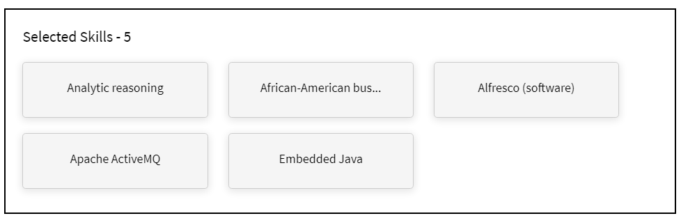

# 학습자 홈페이지

## 개요 {#overview}

책임자가 몰입형 레이아웃을 활성화하면 앱에 로그인할 때 학습자에게 완전히 개선된 사용자 인터페이스가 제공됩니다.

>[!NOTE]
>
>IE11 브라우저는 몰입형 레이아웃을 지원하지 않습니다.

## 몰입형 레이아웃을 위한 새로운 학습자 UI

>[!IMPORTANT]
>
>새로운 학습자 UI를 단계적으로 출시할 예정입니다.

더욱 세련되고 업데이트된 디자인으로 학습자 UI를 새로 고쳤습니다. 새 UI는 **[!UICONTROL 학습자 홈]**, **[!UICONTROL 내 학습]**, **[!UICONTROL 카탈로그]** 및 **[!UICONTROL 강의 개요]** 랜딩 페이지에서 일관된 사용자 환경을 제공하는 것을 목표로 합니다. 새로운 시각 요소는 현재 디자인 스타일을 따르므로 보다 사용하기 쉽고 매력적으로 보입니다. 이번 업데이트에는 새로운 발행인란, 사이드 패널 및 컨템퍼러리 위젯이 포함됩니다.

>[!NOTE]
>
>개선된 사용자 인터페이스는 몰입형 레이아웃에만 적용됩니다. 모바일 웹/앱은 아직 이러한 변경 사항을 지원하지 않으며 향후 릴리스에서 업데이트할 예정입니다.

_이전 사용자 인터페이스_

_새 사용자 인터페이스_

### 홈페이지

홈페이지에는 사이드 패널, 상단 헤더, 향상된 강의 카드 및 위젯이 향상된 새로운 디자인이 있습니다.

_새 홈페이지_

### 카탈로그 페이지

더 나은 사용자 경험을 제공하기 위해 구성된 필터 및 향상된 강의 카드로 카탈로그 페이지의 새로운 모양이 만들어졌습니다.

_카탈로그 페이지_

### 강의 개요 페이지

강의 개요 페이지에 새로운 모양이 나타나고, 강의 세부 정보가 표시됩니다. 이 페이지는 학습자가 필요한 모든 정보를 얻는 데 도움을 줍니다.

_강의 개요 페이지_

### 강의 카드

또한 강의 카드에는 세부 사항을 더 효과적으로 표시하기 위해 다시 설계된 레이아웃이 있습니다. 개편된 강의 카드에서는 등록에 필요한 관련 메타데이터가 강조 표시됩니다. 이 메타데이터에는 작성자 또는 공급자와 함께 올바른 게시 또는 기한, 등급 및 설명이 포함됩니다.

_이전 강의 카드_

_새 과정 카드_

**LinkedIn** 및 **Go1** 플랫폼에서 가져온 강의의 경우 강의 카드에는 **LinkedIn** 및 **Go1**&#x200B;의 원래 게시 날짜가 표시됩니다. 사용자 인터페이스에서 이러한 특정 게시 날짜를 볼 수도 있습니다.

### 사이드바 및 검색 바

새로운 UI 요소로 사이드바 업데이트, 새 검색 막대에는 검색 단추가 없으므로 보다 깔끔해 보입니다. 학습자는 키워드를 입력하고 Enter 키를 눌러 검색을 시작하거나 검색 막대 아래에서 결과를 선택할 수 있습니다.

_사이드바 및 검색 막대_

### 발행인란 {#masthead}

포함된 URL이 있는 비디오 또는 이미지 캐러셀을 특징으로 합니다. [관리자는 이미지 또는 비디오를 업로드](../../administrators/feature-summary/announcements.md#masthead) 에셋을 발행인란으로 업로드하고 학습자 그룹에 대해 가시성을 설정할 수 있습니다.

*발행인란 보기*

### 내 학습 목록 {#mylearninglist}

학습자가 수강한 교육을 표시합니다. 이러한 교육은 수평으로 나열된 카드로 표시됩니다. 오른쪽 또는 왼쪽 버튼을 클릭하여 강의를 검색할 수 있습니다.

*내 학습 목록 보기*

또한 왼쪽 및 오른쪽으로 스와이프하여 목록을 탐색할 수 있습니다.

강의를 재개하려면 카드에서 **[!UICONTROL 계속]**&#x200B;을 클릭하면 플레이어가 시작됩니다.

각 교육 카드에 있는 아이콘의 모습은 책임자 앱(**설정** > **일반** > **교육 카드 아이콘 활성화**)을 통해 책임자가 활성화/비활성화합니다.

**내 학습 목록에 추가**

**관심 영역을 기반으로 추천됨** 및 **피어 활동 목록을 기반으로 추천됨**&#x200B;에서 강의 카드 위에 마우스를 올려 놓으면 **내 학습 목록**&#x200B;에 강의를 추가하는 옵션을 볼 수 있습니다. 강의 카드에서 **[!UICONTROL +]**&#x200B;을 클릭하면 강의가 **내 학습 목록**&#x200B;에 추가됩니다.

*내 학습 목록에 추가*

## 스킬 레벨 선택 {#chooseskilllevels}

학습자라면 다음 레벨에 따라 강의 카탈로그를 필터링할 수 있습니다.

* 초급자
* 중급자
* 고급

옵션을 선택하면 선택에 따라 강의 카탈로그를 볼 수 있습니다.

*스킬 레벨 선택*

## 준수 대시보드 위젯

준수 대시보드 위젯을 통해 학습자는 준수 레이블을 사용하여 예정된 기한이 있는 강의/학습 경로/인증서를 필터링할 수 있습니다. 이 기능은 ALM Teams 앱, AEM, 모바일 앱, 몰입형 및 SF 앱을 포함한 모든 학습자 앱에서 사용할 수 있습니다.

_준수 대시보드 위젯_

## 달력 {#calendar}

예약된 세션 및 교육을 표시합니다. 달력을 찾아보고 다음 달에 대한 교육을 확인합니다.

*예약된 세션에 대한 일정 보기*

달력 위젯에는 다음의 기능이 있습니다. 다음을 볼 수 있습니다.

* 월별 교육입니다. 왼쪽 또는 오른쪽으로 스크롤합니다.
* 등록할 수 있는 향후 강의실 또는 VC 교육입니다.
* 등록한 향후 강의실 또는 VC 교육입니다.
* 관리자가 승인한 강의실 또는 VC 교육입니다.

## 소셜 피드 {#socialfeed}

*소셜 피드 보기*

다른 사용자들이 이야기하는 내용을 확인해 보십시오.

위젯은 기간 동안의 활동을 요약합니다. 해당 사항:

* 범위 또는 그룹 내에 있는 활성 사용자와 사용자의 활동을 표시합니다.
* 지난 2주 내에 생성된 게시물을 표시합니다.

## 프로필 스킬 {#profileskills}

프로필 스킬은 강의 추천에 사용됩니다. 책임자가 스킬을 사용자 또는 사용자의 그룹에 할당하는 경우 스킬이 학습자의 프로필 스킬에 추가됩니다. 학습자가 스킬을 프로필에 추가하면 모든 스킬 레벨이 학습자의 프로필 스킬에 추가됩니다. 학습자가 스킬 위에 마우스를 올려 놓으면 스킬의 이름, 스킬 추가 방법, 레벨, 스킬 완료 백분율 및 점수를 볼 수 있습니다.

*프로필 스킬 보기*

학습자가 강의에 등록하는 경우 점수를 기반으로 한 외부 스킬만 프로필 스킬에 추가됩니다. 또한 학습자는 외부 스킬을 검색하고, 선택하고, 프로필에 추가할 수 있습니다.학습자가 학습자 앱에 처음으로 로그인하고, 학습자의 스킬이 이미 있는 경우 스킬은 내 프로필에 나타납니다.

## 관심 영역을 기반으로 추천 {#recommendationbasedonyourareaofinterest}

선택한 관심 영역을 기반으로 교육을 표시합니다. 권장 사항은 머신 러닝 알고리즘을 기반으로 합니다.

*추천 과정 보기*

더 많은 추천 항목을 보려면 **보기/업데이트**&#x200B;를 클릭하여 기술을 업데이트할 수 있습니다.

스킬을 추가한 후 향후 추천은 환경 설정에 따라 더 많은 대상이 지정되며 집중됩니다.

책임자가 **스킬 탐색** 옵션을 비활성화한 경우 스킬에 관심을 추가할 수 있습니다.

추천 강의는 카드로 표시됩니다. 카드에 마우스를 가져다 대면 과정의 세부 사항을 더 확인할 수 있습니다.

제품 용어도 지원됩니다.

**산업 정렬 스킬**

책임자가 책임자 앱에서 **산업 정렬** 옵션을 활성화한 경우 스킬의 네트워크 그래프를 볼 수 있게 됩니다.

이러한 스킬은 책임자가 교육 유형을 산업 정렬로 설정하는 경우에만 볼 수 있습니다.

스킬 맵 시각화에서 스킬을 검색하여 추가할 수 있습니다.

*스킬 맵 시각화*

내 계정에 있는 모든 스킬을 표시하려면 **내 계정에 있는 교육에 대한 스킬 표시** 옵션을 활성화합니다.

스킬을 추가한 후 선택한 스킬을 기본 꼭짓점으로, 관련된 스킬을 더 작은 꼭짓점으로 방향이 지정된 그래프를 볼 수 있습니다.

선택한 스킬도 **선택한 스킬** 섹션에 표시됩니다.

*선택한 스킬*

스킬을 추가하려면 **[!UICONTROL 추가]**&#x200B;를 클릭합니다.

## 피어 활동을 기반으로 추천 {#recommendationbasedonpeeractivity}

동료가 수강하고 있는 내용에 따라 교육을 표시합니다. 이 또한 머신 러닝 알고리즘 기반입니다. 권장 사항은 사용자 정의 및 산업 정렬 학습자 모두를 위한 교육을 기반으로 합니다.
