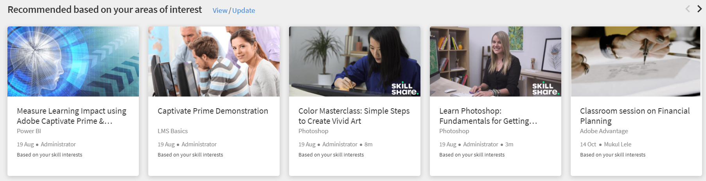

# 학습자 홈페이지

## 개요 {#overview}

책임자가 몰입형 레이아웃을 활성화하면 학습자가 앱에 로그인한 후 완전히 개선된 사용자 인터페이스를 표시합니다.

>[!NOTE]
>
>몰입형 레이아웃은 IE11 브라우저에서 지원되지 않습니다.

위젯의 활성화 여부에 따라 학습자는 다음을 볼 수 있습니다.

## 발행인란 {#masthead}

포함된 URL이 있는 비디오 또는 이미지 캐러셀을 특징으로 합니다. 대상 [관리자는 모든 이미지 또는 비디오를 업로드할 수 있습니다.](../../administrators/feature-summary/announcements.md#masthead) 발행인란 자산을 만들고 학습자 그룹에 대한 가시성을 설정합니다.

*발행인란 보기*

## 내 학습 목록 {#mylearninglist}

학습자가 수강한 교육을 표시합니다. 이러한 교육은 수평으로 나열된 카드로 표시됩니다. 오른쪽 또는 왼쪽 버튼을 클릭하여 강의를 검색할 수 있습니다.

*내 학습 목록 보기*

또한 왼쪽 및 오른쪽으로 스와이프하여 목록을 탐색할 수 있습니다.

강의를 재개하려면 **[!UICONTROL 계속]** 카드를 사용하면 플레이어가 시작됩니다.

각 교육 카드에 있는 아이콘의 모습은 책임자 앱( )을 통해 책임자가 활성화/비활성화합니다&#x200B;**설정** > **일반** > **교육 카드 아이콘 활성화**).

**내 학습 목록에 추가**

강의 카드 위에 마우스를 가져가면 **관심 영역을 기반으로 추천** 및 **피어 활동 목록을 기반으로 하는 권장**, 다음에 강의를 추가하는 옵션을 볼 수 있습니다. **내 학습 목록**. 다음을 수행합니다. **[!UICONTROL +]** 강의 카드에서 강의가 **내 학습 목록**.

*내 학습 목록에 추가*

## 스킬 레벨 선택 {#chooseskilllevels}

학습자는 다음 수준에 따라 강의 카탈로그를 필터링할 수 있습니다.

* 초보자
* 중급자
* 고급

옵션을 선택하면 선택한 내용에 따라 강의 카탈로그를 볼 수 있습니다.

*스킬 레벨 선택*

## 달력 {#calendar}

예약된 세션 및 교육을 표시합니다. 달력을 찾아보고 다음 달에 대한 교육을 확인합니다.

*예약된 세션에 대한 일정 보기*

달력 위젯에는 다음과 같은 기능이 있습니다. 다음을 볼 수 있습니다.

* 월별 교육입니다. 왼쪽 또는 오른쪽으로 스크롤합니다.
* 등록할 수 있는 향후 강의실 또는 VC 교육입니다.
* 등록한 향후 강의실 또는 VC 교육입니다.
* 관리자가 승인한 강의실 또는 VC 교육입니다.

## 소셜 피드 {#socialfeed}

*소셜 피드 보기*

다른 사용자들이 이야기하는 내용을 확인해 보십시오.

위젯은 기간 동안의 활동을 요약합니다. 해당 사항:

* 범위 또는 그룹에 있는 활성 사용자와 사용자의 활동을 표시합니다.
* 지난 2주 동안 작성된 게시물을 표시합니다.

## 프로필 스킬 {#profileskills}

프로필 스킬은 강의 추천에 사용됩니다. 책임자가 스킬을 사용자 또는 사용자 그룹에 할당하는 경우 스킬이 학습자의 프로필 스킬에 추가됩니다. 학습자가 스킬을 프로필에 추가하면 모든 스킬 레벨이 학습자의 프로필 스킬에 추가됩니다. 학습자가 스킬 위에 마우스를 올려 놓으면 스킬의 이름, 스킬 추가 방법, 레벨, 스킬 완료 백분율 및 점수를 볼 수 있습니다.

*프로필 스킬 보기*

학습자가 강의에 등록하는 경우 점수를 기반으로 한 외부 스킬만 프로필 스킬에 추가됩니다. 또한 학습자는 외부 스킬을 검색하고, 선택하고, 프로필에 추가할 수 있습니다.학습자가 학습자 앱에 처음으로 로그인하고, 학습자의 스킬이 이미 있는 경우 스킬은 내 프로필에 나타납니다.

## 관심 영역을 기반으로 추천 {#recommendationbasedonyourareaofinterest}

선택한 관심 영역을 기반으로 교육을 표시합니다. 권장 사항은 머신 러닝 알고리즘을 기반으로 합니다.

*추천 과정 보기*

더 많은 추천 항목을 보려면 을 클릭하여 기술을 업데이트할 수 있습니다. **보기/업데이트**.

스킬을 추가하면 향후 권장 사항이 사용자의 환경 설정에 따라 더 많은 대상으로 지정되고 집중됩니다.

책임자가 옵션을 비활성화한 경우 **스킬 탐색**, 본인의 스킬에 흥미를 더할 수 있습니다.

추천 강의가 카드로 표시됩니다. 카드에 마우스를 가져다 대면 과정의 세부 사항을 더 확인할 수 있습니다.

제품 용어도 지원됩니다.

**산업 정렬 스킬**

책임자가 옵션을 활성화한 경우 스킬의 네트워크 그래프를 볼 수 있게 됩니다 **산업 정렬** 있습니다.

이러한 스킬은 책임자가 교육 유형을 산업 정렬로 설정하는 경우에만 볼 수 있습니다.

스킬 맵 시각화에서 스킬을 검색하고 추가할 수 있습니다.

*스킬 맵 시각화*

옵션 활성화 **내 계정에 나와있는 교육에 대한 스킬 표시**&#x200B;계정에 있는 모든 스킬을 표시하려는 경우

스킬을 추가한 후 선택한 스킬을 주 정점으로 하고 연결된 스킬을 작은 정점으로 하는 힘 방향 그래프를 볼 수 있습니다.

선택한 스킬도 **선택한 스킬** 섹션으로 이동하십시오.

*선택한 스킬*

스킬을 추가하려면 **[!UICONTROL 추가]**.

## 피어 활동 기반 추천 {#recommendationbasedonpeeractivity}

동료가 수강하고 있는 내용에 따라 교육을 표시합니다. 이는 다시 머신 러닝 알고리즘에 의해 구동된다. 권장 사항은 사용자 정의 및 산업 정렬 학습자 모두를 위한 교육을 기반으로 합니다.
