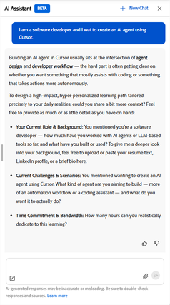

# 학습 경로 에이전트란?

학습 경로 에이전트는 AI 어시스턴트를 사용하여 구조화된 학습 경로를 생성합니다. 책임자가 할당한 표준 학습 경로와는 달리, 이러한 학습 경로는 안내가 제공되는 대화를 통해 생성됩니다. 목표에 대해 설명하고 상담사는 학습 요구에 맞는 경로를 작성합니다.

상담사는 조직의 내부 강의 카탈로그에서 콘텐츠를 먼저 가져와 승인되고 팀과 관련된 강의의 우선 순위를 지정합니다. 관리자가 서드파티 콘텐츠를 활성화한 경우 상담사는 서비스 범위의 간격을 채우기 위해 연결된 외부 공급자의 강의도 포함할 수 있습니다. 저장된 경로 내에서 항상 강의에 자동으로 등록되므로 즉시 학습을 시작할 수 있습니다.

맞춤형 학습 경로는 두 가지 주요 사용 사례에 맞게 설계되었습니다.

- **대상 기술 개발**: 새로운 책임을 준비하거나 검토에서 확인된 기술 격차를 없애는 등 특정 비즈니스 성과를 달성하거나 성과 목표에 빠르게 도달해야 하는 경우.
- **깊이 있는 전문 지식 구축**: 선택한 도메인, 기술 또는 분야의 초보자에서 전문가로 오랜 기간 동안 진급하고자 할 때.

## 대화 기반 접근 방식의 작동 방식

상담사가 당신이 있는 곳에서 당신을 만납니다. 먼저 일반 언어로 학습하고자 하는 내용을 자신이 가지고 있는 만큼 또는 작은 세부 사항으로 설명하는 것으로 시작합니다. 그런 다음 상담사는 귀하의 역할, 특정 과제 및 매주 학습에 집중할 수 있는 시간을 파악하기 위해 후속 질문을 합니다.

답변에서 상담사는 제안된 숙련도 수준으로 3~5개의 학습 주제를 식별합니다. 상담사가 일치하는 강의를 검색하기 전에 이러한 주제를 검토하고 변경을 요청하거나 확인할 수 있습니다. 그런 다음 상담사는 각 강의, 설명, 기간 및 모듈 수를 보여 주는 명명된 학습 경로를 생성합니다. 저장하기 전에 패스를 추가로 조정할 수 있습니다.

경로를 저장하면 모든 강의에 자동으로 등록됩니다. 경로는 _개인 설정된 학습 경로_ 섹션의 홈 페이지에 표시되며 시작할 준비가 되었습니다.

### 콘텐츠 소스 및 강의 선택

상담사는 명시된 목표와의 관련성, 현재 숙련도 수준, 사용 가능한 총 시간 및 콘텐츠가 업데이트된 최근 시간을 기준으로 강의를 선택합니다. 상담사가 사용 가능한 카탈로그에서 특정 주제에 대해 일치하는 강의를 찾을 수 없는 경우, 해당 영역에 대한 추가 콘텐츠를 요청하기 위해 관리자에게 문의하도록 안내하고 제안합니다.

### 홈페이지의 개인화된 학습 경로

저장된 모든 개인 맞춤화된 학습 경로는 홈페이지의 _개인 맞춤화된 학습 경로_ 스트립에 표시됩니다. 각 카드에는 경로 이름, 강의 수 및 중단한 부분부터 다시 시작하려면 _계속_ 단추가 표시됩니다.

### 학습 경로 공유

개인화된 학습 경로를 저장하면 동료와 공유할 수 있습니다. 공유하면 링크 또는 이메일 초대가 전송됩니다. 동료가 공유 경로를 열면 단일 동작으로 등록할 수 있습니다. 공유는 팀에 있는 여러 사람이 유사한 학습 목표를 가지고 있고, 해당 사람이 동일한 구조화된 계획을 따르도록 하려는 경우 유용합니다.

### 모범 사례

- 대화를 시작할 때 가능한 한 구체적으로 학습 목표를 설명하십시오. 상담사가 더 많은 컨텍스트를 가지고 있을수록 경로는 더 관련성이 높아집니다.
- 생성된 경로가 실제 일정에 맞도록 사전에 시간 약정을 제공하십시오. 상담사는 자연어를 이해합니다. &quot;주 2일 저녁&quot; 또는 &quot;하루 30분&quot;은 모두 유효합니다.
- 상담사에게 강의 생성을 요청하기 전에 제안된 주제를 검토합니다. 해당 단계에서 주제를 확인하거나 조정하면 이후 강의 목록을 수정하는 것보다 시간이 절약됩니다.
- 항목에 일치하는 콘텐츠가 없는 경우 메모하고 관리자에게 문의하여 카탈로그에 관련 강의를 추가하도록 요청하십시오.

## 개인화된 학습 경로 에이전트 구성

개인화된 학습 경로 에이전트는 설정에서 AI 도우미 옵션을 활성화하면 Adobe Learning Manager에서 기본적으로 활성화됩니다.

>[!NOTE]
>
> 콘텐츠 가시성은 기존 카탈로그 액세스 규칙을 따릅니다. 학습자는 이미 액세스 권한이 있는 카탈로그의 강의만 보고 받습니다. 개인화된 학습 경로 에이전트는 카탈로그 제한을 우회하지 않습니다.

각 소스 내에서 상담사는 학습자의 목표와 관련성이 있고 강의 수준이 학습자가 지정한 숙련도와 얼마나 잘 일치하는지에 따라 강의 순위를 지정합니다.

카탈로그의 항목에 일치하는 강의를 사용할 수 없는 경우 상담사는 학습자에게 알리고 관리자에게 해당 영역에 대한 콘텐츠를 요청할 것을 제안합니다.

<!-- 
### Monitor credit usage

The Personalized Learning Path agent consumes AI credits each time a learner generates a path. To monitor and manage usage:

1. In the left navigation of the administrator's home page, select **Billing**.
2. Select the **AI Credits** tab. The **Learning Path** agent appears as a line item in the features list.
3. Review current usage and adjust the credit allocation or usage limit as needed.

>[!CAUTION]
>
>If the credit limit for the Learning Path agent is reached, learners receive an in-app message that the agent is unavailable and are directed to contact an administrator. Increase the allocation to restore access. 
-->

## 학습자 AI 어시스턴트로 개인화된 학습 경로 생성

Adobe Learning Manager의 학습자 AI 어시스턴트를 사용하여 목표, 배경 및 사용 가능한 시간에 맞게 개인화된 학습 경로를 생성할 수 있습니다. 그런 다음 프로필에 저장하고 즉시 학습을 시작합니다.

### 학습자 AI 비서를 열고 대화를 시작합니다

1. 홈 페이지에서 **AI 도우미**&#x200B;를 선택합니다.
2. 텍스트 필드에 학습 목표를 입력합니다. 가능한 한 구체화하세요. 예:
   - *저는 소프트웨어 개발자이며 커서를 사용하여 AI 에이전트를 만들고 싶습니다.*
   - *관리자 역할로 승진했으며 어려운 대화를 처리하는 방법을 배우고 싶습니다.*
   - *분석가로 재무 모델링을 마스터하고 싶습니다.*
     

3. 필요한 경우 이전 세션이 열려 있는 경우 _+새 채팅_&#x200B;을 선택하여 새로운 대화를 시작하십시오.

참고:

- 필요에 따라 이력서, 관리자 피드백 이메일 또는 프로젝트 개요와 같은 _종이 클립_ 아이콘을 사용하여 문서를 첨부합니다. 에이전트는 문서를 사용하여 학습 목표 및 배경에 대한 추가 컨텍스트를 가져옵니다.
- _보내기_&#x200B;를 선택합니다.

### 목표와 배경 설명

에이전트는 목표를 확인하는 메시지로 응답하고 경로를 조정하기 위한 추가 컨텍스트를 요청합니다. 일반적으로 다음에 대해 묻습니다.

- _현재 역할 및 배경_ 이미 알고 있는 내용, 역할에 얼마나 오래 있었거나 관련된 경험.
- _특정 문제 또는 시나리오_ 이 학습으로 즉시 해결해야 하는 실제 상황.
- _시간 약정_ 현실적으로 학습에 전념할 수 있는 주당 시간 수입니다.

모든 질문에 대답할 필요는 없습니다. 귀하의 학습 목표 또는 도전 과제에만 필요한 입력이 필요합니다. 상담사는 사용자가 제공하는 컨텍스트를 계속 진행합니다.

>[!TIP]
>
>상담사는 자연스러운 시간 표현을 이해합니다. &#39;주 2회 저녁&#39;, &#39;하루 30분 정도&#39;, &#39;주말 두어 시간&#39;이라고 말하면 상담사가 주간으로 전환해 추정한 후 확진한다.

응답을 입력하고 _보내기_&#x200B;를 선택합니다.

상담사가 추천 항목을 표시할 때까지 대화를 계속합니다.

### 제안된 주제 검토

충분한 컨텍스트를 수집한 상담사는 3~5개의 학습 주제 목록을 제시하며 각 주제에는 제목, 간략한 설명, 제안된 숙련도 수준이 포함됩니다.

1. 항목 목록을 주의 깊게 읽으십시오. 상담사는 공유한 내용에 따라 숙련도 레벨을 선택하지만 변경을 요청할 수 있습니다.
2. 예를 들어 숙련도 수준을 변경하거나 항목을 교체하는 등 주제를 조정하려면 채팅에 피드백을 입력합니다. 예를 들어, 나는 이미 첫 번째 주제에 대해 어느 정도 알고 있다. 중급으로 바꿔주시겠어요?
3. 제안된 토픽이 만족스러우면 채팅에서 답변하거나 토픽이 표시되면 제안된 확인 프롬프트를 선택하여 확인합니다.

### 학습 경로 검토

상담사는 사용 가능한 카탈로그를 검색하고 이름이 지정된 학습 경로를 작성합니다. 경로에 표시되는 항목은 다음과 같습니다.

- 경로 이름 및 예상 총 기간
- 각 강의 제목, 설명, 기간 및 모듈 수
- 일부 항목에 일치하는 사용 가능한 콘텐츠가 없는 경우 표시됩니다.

일부 항목에 일치하는 콘텐츠가 없는 경우:

상담사가 이러한 특정 주제에 대한 강의를 찾을 수 없음을 알리고 해당 영역에 대한 콘텐츠를 요청하기 위해 관리자에게 연락하는 것을 제안합니다. 경로는 강의를 찾은 주제에 대해 계속 생성됩니다.

<!-- - Review the path. If you want to change something, for example, remove a course, adjust the scope, or explore different topics. Type your request in the chat\. For example, Can you remove the first course and replace it with something shorter? -->
경로가 만족스러우면 상담사에게 학습 경로 저장을 입력하여 저장하도록 요청합니다.

### 학습 과정 저장 및 액세스

경로를 저장하면 상담사가 저장을 확인하고 경로 내의 모든 강의에 자동으로 등록합니다.

경로에 액세스하는 방법:

- 확인 메시지에서 _학습 경로로 이동_&#x200B;을 선택하여 즉시 엽니다. 또는
- 언제든지 홈 페이지의 _개인 설정된 학습 경로_ 스트립에서 찾을 수 있습니다.

### 학습 경로 공유

경로 개요 페이지에서 저장된 경로를 동료와 공유할 수 있습니다.

1. 홈 페이지의 _개인 설정된 학습 경로_ 스트립에서 저장된 경로를 엽니다.
2. _공유_&#x200B;를 선택합니다.
3. 생성된 링크를 공유하거나 이메일 주소를 입력하여 직접 초대를 보냅니다.

공유 링크를 받는 동료는 단일 동작으로 경로에 등록할 수 있습니다.

## 모범 사례

- 역할과 현재 당면 과제에 대한 컨텍스트를 제공합니다. 구체적일수록 과정 선택의 관련성이 높아진다.
- 주별 시간 약정을 자연어로 언급합니다. 패스가 생성되기 전에 에이전트가 해석을 확인합니다.
- 경로 생성을 요청하기 전에 제안된 항목을 검토합니다. 해당 단계에서 주제를 조정하는 것은 이후에 강의 목록을 수정하는 것보다 빠릅니다.\.
- 생성된 경로에 이미 완료한 과정이 포함되어 있으면 상담사에게 알립니다. 그것은 대안을 제시할 수 있다.

## 자주 묻는 질문

_저장된 개인 맞춤화된 학습 경로는 어디에서 찾을 수 있습니까?_

저장된 모든 경로는 홈 페이지의 _개인 설정된 학습 경로_ 스트립에 표시됩니다. 각 카드에는 경로 이름과 _계속_ 단추가 표시됩니다. 여기에서 경로를 열어 전체 강의 목록과 진행 상황을 확인할 수도 있습니다.

_저장할 수 있는 개인 맞춤화된 학습 경로 수_

홈 페이지의 _개인 설정된 학습 경로_ 스트립에 최대 10개의 경로가 표시됩니다.

_관련 학습 경로를 얻기 위해 어떤 정보를 제공해야 합니까?_

최소한 자신의 학습 목표나 해결하고자 하는 구체적인 과제를 설명하십시오. 컨텍스트를 많이 제공할수록 패스가 향상됩니다.\. 유용한 정보에는 현재 역할, 해당 작업을 수행한 기간, 관련 이전 경험, 현실적으로 학습에 헌신할 수 있는 주당 시간 등이 포함됩니다.

_상담사가 내 주제와 일치하는 강의를 찾을 수 없으면 어떻게 됩니까?_

상담사가 대화에서 하나 이상의 주제에 대해 일치하는 강의를 찾을 수 없다고 직접 알려줍니다. 강의가 있는 주제만 사용하여 경로를 생성합니다.

상담사가 귀하의 주제에 대한 강의를 찾을 수 없는 경우 해당 목표에 대한 경로를 생성할 수 없음을 알립니다. 두 경우 모두 학습 관리자에게 연락하여 사용할 수 있는 콘텐츠가 없는 주제를 알려줍니다. 향후 경로 요청이 다루어지도록 관련 강의를 카탈로그에 추가할 수 있습니다.

<!-- 
_How does the agent decide which courses to include?_

The agent prioritizes your organization's internal course catalog above external sources. It selects courses based on relevance to your stated goal, whether the course level matches your proficiency, how recently the content was published or updated, and quality signals such as ratings and completion rates\. Your administrator controls which content sources are available. 
-->

_학습 경로에서 주제를 조정할 수 있습니까?_

예. 대화 중 상담사에게 경로를 생성하기 전에 주제를 추가, 제거 또는 변경하도록 요청할 수 있습니다. 에이전트는 항목 목록을 업데이트하고 일치하는 경로를 다시 생성합니다.

_생성된 경로에서 개별 강의를 변경할 수 있습니까?_

아니요. 상담사가 경로를 생성하면 강의 선택이 수정됩니다. 개별 강의를 교체, 제거 또는 대체할 수 없습니다. 에이전트가 권장하는 것은 경로에 포함된 것입니다.

제안된 강의가 적절하지 않은 경우 생성 전에 뒤로 돌아가 주제를 조정하는 것이 가장 좋은 방법입니다. 상담사는 사용자가 확인한 주제를 기준으로 강의를 선택하므로 주제 범위나 숙련도 수준을 변경하면 다른 강의 세트가 생성됩니다.

_상담사가 후속 질문을 계속하는 이유는 무엇입니까?_

상담사는 관련 주제를 식별하기 위해 학습 목표를 충분히 명확하게 파악해야 합니다. &#39;마케팅을 배우고 싶다&#39;처럼 초기 메시지가 광범위했다면 범위를 좁히기 위해 질문을 던진다. 역할, 직면한 문제, 학습 후 수행할 수 있는 작업에 대한 자세한 세부 정보를 제공하면 상담사가 주제 생성으로 더 빠르게 이동하는 데 도움이 됩니다.