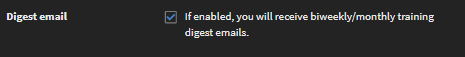

# 프로필 설정

이 문서에서 학습자 프로필을 설정하고 프로필 사진을 추가하는 방법을 알아보십시오. 프로필의 학습자 성적 증명서를 다운로드하는 방법을 알아보십시오.

## 프로필 설정 구성 {#configuringprofilesettings}

1. 페이지의 오른쪽 상단 모서리에서, 프로필 또는 사진 옆에 있는 드롭다운 화살표를 클릭합니다.
1. &#39;프로필 설정&#39;을 선택합니다.
1. 팝업 대화 상자가 나타나면, 다음 작업을 수행할 수 있습니다.

   * 프로필 사진 추가/업데이트: 사진 위로 마우스를 가져갑니다. &#39;업로드&#39;를 클릭하고 사진을 추가합니다. 사진을 변경하려면 &#39;편집&#39;을 클릭합니다.
   * 사진 삭제: 프로필 사진 위로 마우스를 가져갑니다. &#39;삭제&#39;를 클릭합니다.
   * &#39;내 정보&#39; 아래에 있는 텍스트 영역을 클릭하여 &#39;내 정보&#39; 내용을 추가합니다.
   * 필드 옆에 있는 &#39;편집&#39;을 클릭하여 &#39;내 정보&#39;를 수정합니다.
   * 프로필에 로케일을 설정합니다. 로케일 드롭다운에서 원하는 언어를 선택합니다.
   * 프로필에 현재 로케일을 설정합니다.
   * 프로필에 표준 시간대를 설정합니다.
   * 데이터가 포함된 학습자 성적 증명서를 다운로드합니다.

   
   *학습자 환경 설정 보기*

   &#39;내 학습 성적 증명서 다운로드&#39; XLS 링크를 클릭하면, 시스템에 엑셀 시트를 다운로드합니다. 엑셀 시트에는 수료한 학습 목표, 각 학습 목표의 완료 상태, 학습 목표에 해당하는 기한, 달성한 스킬 등의 세부 정보가 포함되어 있습니다. 이 시트를 다운로드하면 학습 프로필의 전반적인 데이터를 빠르게 얻을 수 있습니다.

1. 책임자가 다이제스트 전자 메일을 활성화했으며 귀하가 DND 목록에 없다면 다이제스트 전자 메일을 구독하거나 구독 취소할 수 있습니다. 아래에서 옵션을 활성화합니다.

   
   *다이제스트 전자 메일 구독 또는 구독 취소*

   책임자가 설정한 빈도를 기반으로 학습자는 격주 또는 월별 기준으로 전자 메일을 수신합니다.

## 다이제스트 전자 메일 구독 취소 {#unsubscribefromdigestemails}

메일을 받으면 다음을 클릭하여 다이제스트 전자 메일 구독을 취소할 수 있습니다. **구독 취소** 이메일의 하단에 있는 링크.

클릭 후 **[!UICONTROL 구독 취소]**, 다음으로 리디렉션됩니다. **프로필 설정** 전자 메일 수신 옵션을 비활성화할 수 있는 페이지입니다.

## 다이제스트 전자 메일의 구조 {#anatomyofadigestemail}

다이제스트 전자 메일은 다음 섹션으로 구성됩니다.

<table>
 <tbody>
  <tr>
   <td>
    
<b>섹션</b>
</td>
   <td>
    
<b>설명</b>
</td>
  </tr>
  <tr>
   <td>
    
개인 교육 요약
</td>
   <td>
    
이 섹션에서는 교육에 소요된 시간(분)을 언급하여 학습자의 교육 메트릭을 개인화합니다.

    
학습자가 사용한 시간을 기반으로 콘텐트는 아래 정의된 규칙에 따라 사용자 정의됩니다.

    
(사용한_시간)이 60분 이상인 경우 다음과 같은 텍스트가 나타납니다.

    
<i>"지난 2주/1개월 동안 <b>(사용한 시간_소요)</b> 스킬을 향상하기 위한 몇 분 간의 훈련. 아래 나열된 항목은 귀하가 더 자세히 알아볼 수 있는 몇 가지 권장 사항입니다." </i>

    
 (사용한_시간)이 60분 미만인 경우 다음 텍스트가 나타납니다.

    
<i>"지난 2주/1개월 동안 <b>(사용한 시간_소요)</b> 스킬을 향상하기 위한 몇 분 간의 훈련. 아래 나열된 항목은 귀하가 시작하고 지속하는 데 유용할 수 있는 몇 가지 권장 사항입니다."</i>
</td>
  </tr>
  <tr>
   <td>
    
교육 활동
</td>
   <td>
    
이 섹션에서는 해당 계정에 대한 교육 활동의 조직 레벨 요약을 표시합니다.

    
교육 활동 요약은 다음과 같이 구성됩니다. 

    <ul>
     <li>계정에서 사용할 수 있는 교육의 수입니다.</li>
     <li>교육 활동을 적극적으로 사용 중인 공동 학습자의 수입니다.</li>
     <li>동료가 사용한 학습 시간의 수입니다.</li>
     <li>계정에서 스킬을 향상하는 데 동료가 사용한 평균 시간(분)입니다.</li>
    </ul></td>
  </tr>
  <tr>
   <td>
    
권장된 과정
</td>
   <td>
    
이는 학습자에 대해 권장된 교육을 포함하는 개인화된 섹션입니다. 이 섹션에서 학습자는 추천 엔진이 선택한 세 가지 교육을 볼 수 있습니다.

    
각 교육에는 탐색 버튼이 있으며 이를 클릭하면 학습자 앱의 홈 페이지로 리디렉션됩니다.  
</td>
  </tr>
  <tr>
   <td>
    
순위표
</td>
   <td>
    
각 학습자의 게임화 점수와 함께 각 막대가 학습자를 나타내는 막대 차트를 표시합니다(책임자가 모든 학습자에 대해 게임화를 활성화한 경우에만 해당).

    
순위표는 다음 항목을 표시합니다.

    <ul>
     <li>학습자가 획득한 점수입니다.</li>
     <li>다음 레벨에 도달하기 위해 필요한 점수입니다.</li>
    </ul>
    
리더와 해당 사용자 범위에서 학습자와 가장 가까운 두 명의 학습자를 표시하는 미니 순위표도 있습니다.

    
순위표가 비어 있는 경우 이 섹션은 전자 메일에 표시되지 않습니다.
</td>
  </tr>
  <tr>
   <td>
    
<a>소셜 게시물</a>
</td>
   <td>
    
이 섹션에서는 최신 세 가지 소셜 게시물을 표시합니다.

    
학습자는 생성 날짜, 게시판 이름, 게시물 제목(있는 경우), 사용자 이름 및 크리에이터의 아이콘을 볼 수 있습니다. 게시물에는 비디오, 문서, PDF 또는 기타 파일이 포함될 수 있습니다.

    
각 게시물에는 학습자를 학습자 앱의 소셜 학습 페이지로 리디렉션하는 링크가 있습니다.

    
최근 게시물이 없으면 전자 메일에서 이 섹션은 학습자에게 표시되지 않습니다.
</td>
  </tr>
 </tbody>
</table>

## 자주 묻는 질문 {#frequentlyaskedquestions}

**1. 학습자 성적 증명서를 다운로드하는 방법은 무엇입니까?**

오른쪽 상단에서 **[!UICONTROL 사용자 프로필]** > **[!UICONTROL 프로필 설정]**. 대화 상자가 나타나면 다음을 클릭합니다 **내 학습 성적 증명서 다운로드(XLS)**.

*학습자 성적 증명서 다운로드*
