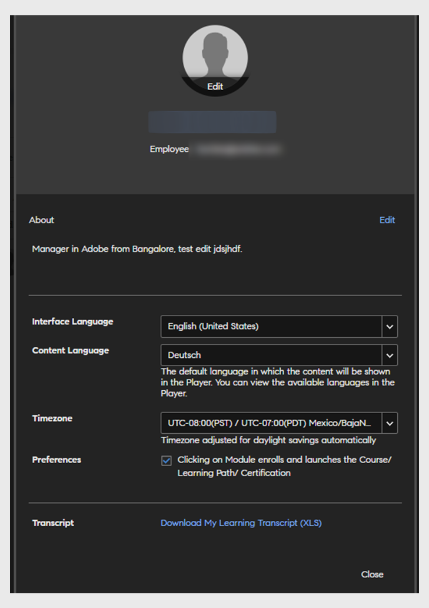

# 프로필 설정

이 문서에서 학습자 프로필을 설정하고 프로필 사진을 추가하는 방법을 알아보십시오. 프로필의 학습자 성적 증명서를 다운로드하는 방법을 알아보십시오.

## 프로필 설정 구성 {#configuringprofilesettings}

1. 페이지의 오른쪽 상단 모서리에서, 프로필 또는 사진 옆에 있는 드롭다운 화살표를 클릭합니다.
1. &#39;프로필 설정&#39;을 선택합니다.
1. 팝업 대화 상자가 나타나면, 다음 작업을 수행할 수 있습니다.

   * 프로필 사진 추가/업데이트: 사진 위로 마우스를 가져갑니다. &#39;업로드&#39;를 클릭하고 사진을 추가합니다. 사진을 변경하려면 &#39;편집&#39;을 클릭합니다.
   * 사진 삭제: 프로필 사진 위로 마우스를 가져갑니다. &#39;삭제&#39;를 클릭합니다.
   * &#39;내 정보&#39; 아래에 있는 텍스트 영역을 클릭하여 &#39;내 정보&#39; 내용을 추가합니다.
   * 필드 옆에 있는 &#39;편집&#39;을 클릭하여 &#39;내 정보&#39;를 수정합니다.
   * 프로필에 로케일을 설정합니다. 로케일 드롭다운에서 원하는 언어를 선택합니다.
   * 프로필에 현재 로케일을 설정합니다.
   * 프로필에 표준 시간대를 설정합니다.
   * 데이터가 포함된 학습자 성적 증명서를 다운로드합니다.

   
   *학습자 기본 설정 보기*

   &#39;내 학습 성적 증명서 다운로드&#39; XLS 링크를 클릭하면, 시스템에 엑셀 시트를 다운로드합니다. 엑셀 시트에는 수료한 학습 목표, 각 학습 목표의 완료 상태, 학습 목표에 해당하는 기한, 달성한 스킬 등의 세부 정보가 포함되어 있습니다. 이 시트를 다운로드하면 학습 프로필의 전반적인 데이터를 빠르게 얻을 수 있습니다.

## 자주 묻는 질문 {#frequentlyaskedquestions}

**1. 학습자 성적 증명서를 다운로드하는 방법은 무엇입니까?**

오른쪽 상단 모서리에서 **[!UICONTROL 사용자 프로필]** > **[!UICONTROL 프로필 설정]**&#x200B;을 클릭합니다. 대화 상자가 나타나면 **내 학습 성적 증명서 다운로드(XLS)**&#x200B;를 클릭합니다.

*학습자 성적 증명서 다운로드*
