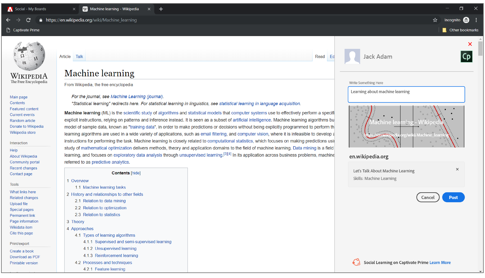

# 소셜 학습에 공유

소셜 북마클릿을 사용하여 사용자의 온라인 학습을 소셜 웹에 즉시 공유하는 방법을 알아보십시오.

소셜 학습에 공유는 학습자가 웹 페이지 및 블로그와 같은 자신의 온라인 학습을 피어와 공유하도록 허용하는 북마클릿입니다. 이 기능은 데스크탑 브라우저에서만 지원됩니다.

북마크 표시줄에서 이 북마클릿을 클릭하면 공유될 브라우저에 따라 웹 페이지 내에 또는 웹 페이지와 함께 팝업 창이 열립니다.

<!---->

브라우저에서 팝업 창이 허용되어 있는지 확인하십시오.

Learning Manager에 로그인하면 북마클릿이 자동으로 사용자의 계정으로 로그인됩니다. 그렇지 않은 경우 Learning Manager 자격 증명을 학습자로 사용하여 로그인해야 합니다.

게시물에 대한 설명을 추가한 후 게시하려는 보드를 선택하고 **[!UICONTROL &#39;게시&#39;]**&#x200B;를 클릭합니다. 게시판은 대시보드에 게시되며 을 클릭하여 볼 수 있습니다. **Post로 이동**.

## 소셜 북마클릿을 북마크 표시줄에 공유 추가 {#addsharetosocialbookmarklettothebookmarksbar}

**이 북마클릿을 브라우저의 북마크 표시줄에 추가하려면 다음을 수행하십시오.**

1. 브라우저에서 북마크 탭을 사용하도록 설정되어 있는지 확인합니다.
1. Learning Manager에 학습자로 로그인합니다.
1. 왼쪽 탐색 창에서 &#39;소셜 학습&#39;을 클릭합니다. 표시되지 않는 경우 책임자에게 문의하십시오.
1. **소셜에 공유** 아이콘을 브라우저의 북마크로 드래그합니다.

   Mac의 Chrome 및 Windows의 Microsoft Edge와 같은 일부 브라우저에서는 드래그 앤 드롭이 작동하지 않습니다. 자세한 내용을 보려면 [여기를 클릭](share-to-social.md#add%20bookmarkl-let%20manually)하십시오.

   <!---->

## 다른 브라우저에서 북마크 사용 {#enablingthebookmarksbarondifferentbrowsers}

## Chrome {#chrome}

* 브라우저 창의 상단 오른쪽 모서리에 3개 점으로 표시되는 기본 메뉴 버튼을 클릭합니다.
* 드롭다운 메뉴에서 설정을 선택합니다. 설정 화면은 다음을 입력하여 액세스할 수도 있습니다. **chrome://settings** 브라우저 주소창에 추가합니다.
* 레이블이 지정되어 있는 옵션이 포함된 모양 섹션을 찾으면 확인란과 함께 북마크가 표시됩니다. 페이지 로드 시 북마크 표시줄이 항상 표시되도록 하려면 확인란을 한 번 클릭하여 선택합니다. 이 기능을 사용하지 않으려면 확인 표시를 제거하기만 하면 됩니다.

## Mozilla Firefox {#mozillafirefox}

* 메뉴 버튼을 클릭하고 사용자 정의를 선택합니다.
* 화면 하단의 도구 모음 드롭다운 메뉴를 클릭하고 북마크 도구 모음을 선택합니다.
* &#39;완료&#39;를 클릭합니다.

## Internet Explorer {#internetexplorer}

* 브라우저의 상단 오른쪽 모서리에서 설정 아이콘을 마우스 오른쪽 단추로 클릭합니다. 또는 사용 **Alt + C** 즐겨찾기 모음 창이 열리기 위한 키보드.
* 브라우저에 즐겨찾기 모음이 표시되도록 하려면 **[!UICONTROL 즐겨찾기 막대]**.

## Microsoft Edge {#microsoftedge}

* 브라우저 창의 상단 오른쪽 모서리에 3개 점으로 표시되는 기본 메뉴 버튼 > 설정 > 즐겨찾기 모음을 클릭합니다.
* 즐겨찾기 모음을 사용하도록 설정하려면 켜기/끄기 스위치를 클릭합니다.

## Safari {#safari}

* 메뉴 보기 > 즐겨찾기 모음 표시를 클릭합니다. (키보드 바로가기: **Command + Shift + B**)

## 다른 브라우저에서 북마클릿을 북마크 표시줄에 수동으로 추가하는 방법 {#add-bookmark-let-manually}

책갈피 표시줄에 책갈피 알체를 수동으로 추가하려면 마우스 오른쪽 버튼으로 **소셜에 공유** 아이콘 > **링크 주소 복사**&#x200B;을 입력한 다음 아래 절차를 따르십시오.

## Mac OS의 Chrome {#chromeinmacos}

1. 브라우저에서 축소된 메뉴 아이콘 을 클릭합니다. >  **책갈피** > **책갈피 관리자.**
1. 책갈피 메뉴 옵션 을 클릭합니다. > **새 책갈피를 추가합니다.**
1. 팝업 대화 상자에 2개의 입력 필드가 표시됩니다. 첫 번째 필드에 **소셜에 공유**&#x200B;와 같은 북마크에 대해 선택한 이름을 입력합니다.
1. **소셜에 공유** 링크 주소를 두 번째 필드에 붙여넣습니다.

## Windows의 Microsoft Edge {#microsoftedgeinwindows}

1. 즐겨찾기 모음이 표시되는지 확인합니다. 즐겨찾기 모음 > **새 폴더 만들기**&#x200B;를 마우스 오른쪽 버튼으로 클릭합니다.
1. 원하는 즐겨찾기 모음 폴더에 URL을 추가하려면 **책갈피 허브** 아이콘 > **책갈피 아이콘**.
1. 원하는 온라인 페이지를 폴더에 저장한 다음 이름을 소셜에 공유로 변경합니다.
1. 책갈피 허브 아이콘 > 소셜에 공유 > URL 편집 을 선택합니다.
1. 링크 주소를 붙여넣고 입력 버튼을 클릭합니다.
