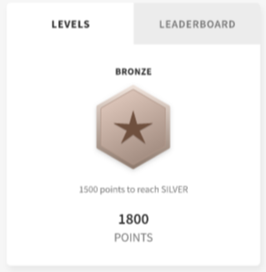
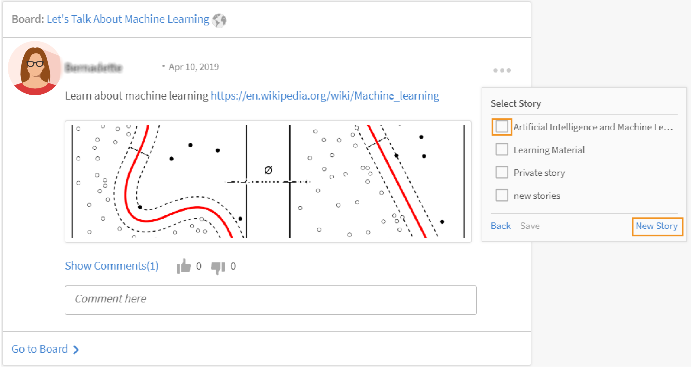

# Learning Manager의 소셜 학습

학습자로 소셜 학습을 사용하는 방법 알아보기

소셜 학습은 사용자가 비공식 환경에서 아이디어와 의미 있는 인사이트를 공유하도록 장려하는 Learning Manager의 플랫폼입니다. 이는 전통적인 학습 개념을 보충하는 방법입니다. 온라인 강의를 완료한다고 해서 사용자가 소셜 수준에서 동료와 상호 작용할 수 있는 것은 아닙니다.

단순히 교육에 참석하는 것만으로 사용자가 학습한 모든 내용을 유지할 수 있는 것도 아닙니다. 반면 소셜 학습을 사용하면 사용자는 주변의 전문 지식을 활용하여 정확한 정보를 얻을 수 있습니다. 결국 사용자는 해당 정보를 신속하게 적용하여 과제를 완료하고 목표를 달성할 수 있습니다.

마찬가지로 Learning Manager 소셜 학습 기능을 통해 사용자는 콘텐츠를 공유하고 학습함으로써 다른 사용자와 상호 작용할 수 있습니다.

이 플랫폼에서 공유할 수 있는 다른 유형의 콘텐츠는 비디오, 오디오, 스크린샷, 텍스트, 질문 및 투표입니다. 사용자는 **소셜 북마클릿에 공유**&#x200B;를 사용하여 동료와 온라인 학습을 공유할 수도 있습니다. 자세한 내용은 [소셜 학습에 공유](share-to-social.md)를 참조하세요.

**Adobe Learning Manager 데스크탑 응용 프로그램**&#x200B;을 사용하여 콘텐츠를 보드에 게시할 수도 있습니다. 자세한 내용은 [데스크탑용 Adobe Learning Manager 앱](../adobe-learning-manager-app-for-desktop.md)을 참조하세요.

책임자가 소셜 학습을 활성화한 경우에만 해당 기능이 학습자에게 표시됩니다.

 

*학습 대시보드 보기*

<table>
 <tbody>
  <tr>
   <td>
    
<b>소셜 학습 번호</b>
</td>
   <td>
    
<b>용어 또는 개념</b>
</td>
   <td>
    
<b>간단한 설명</b>
</td>
  </tr>
  <tr>
   <td>
    
1
</td>
   <td>
    
내 보드
</td>
   <td>
    
게시판은 사용자가 만든 게시물 중 <code>
      collection
     </code>개입니다. 내 보드에는 사용자가 참여하고, 생성하고, 팔로우한 게시물이 모두 표시됩니다.
</td>
  </tr>
  <tr>
   <td>
    
2
</td>
   <td>
    
모든 보드
</td>
   <td>
    
모든 보드 페이지에서 사용자는 활동 범위를 공유하는 모든 학습자가 생성한 보드를 볼 수 있습니다.
</td>
  </tr>
  <tr>
   <td>
    
3
</td>
   <td>
    
댓글
</td>
   <td>
    
사용자는 보드에서 생성한 게시물에 댓글을 달고 볼 수 있습니다. 
</td>
  </tr>
  <tr>
   <td>
    
4
</td>
   <td>
    
답변
</td>
   <td>
    
사용자는 보드 내 게시물에서 작성된 댓글에 답변할 수 있습니다.
</td>
  </tr>
  <tr>
   <td>
    
5
</td>
   <td>
    
업보트/다운보트
</td>
   <td>
    
업보트 및 다운보트를 클릭하여 게시물에 좋아요 또는 싫어요를 표시할 수 있습니다.
</td>
  </tr>
  <tr>
   <td>
    
6
</td>
   <td>
    
소셜 순위표
</td>
   <td>
    
소셜 순위표에서 사용자는 소셜 학습에 참여한 학습자와 획득한 점수를 확인할 수 있습니다.
</td>
  </tr>
  <tr>
   <td>
    
7
</td>
   <td>
    
내가 팔로우한 사람
</td>
   <td>
    
여기에서 사용자는 팔로우하는 다른 학습자 이름과 생성한 게시물 수를 확인할 수 있습니다.
</td>
  </tr>
  <tr>
   <td>
    
8
</td>
   <td>
    
인기 스킬
</td>
   <td>
    
모든 보드 섹션에서 학습자가 자주 사용하는 스킬과 해당 스킬을 사용하여 생성한 게시물 수를 확인할 수 있습니다.
</td>
  </tr>
  <tr>
   <td>
    
9
</td>
   <td>
    
소셜에 공유
</td>
   <td>
    
소셜에 공유는 사용자가 웹 페이지 및 블로그와 같은 자신의 온라인 학습을 Learning Manager 소셜 학습에 직접 공유하도록 허용하는 북마클릿입니다.
</td>
  </tr>
  <tr>
   <td>
    
10
</td>
   <td>
    
새 게시물
</td>
   <td>
    
새 게시물 버튼을 사용하여 사용자는 보드 내에서 콘텐츠를 만들고 게시할 수 있습니다.
</td>
  </tr>
 </tbody>
</table>

## 콘텐츠를 게시물로 만들기 {#creatingcontentasapost}

보드 내에서 콘텐츠를 게시물로 만들 수 있습니다. 게시물을 만들려면 아래 단계를 따르십시오.

1. **[!UICONTROL 새 게시물]을 클릭합니다.**

   
   *새 게시물 선택*

1. 게시할 콘텐츠 유형을 텍스트, 질문, 비디오, 오디오, 투표, 스크린샷 중에서 선택합니다. 기존 콘텐츠를 사용자 시스템 또는 Adobe Learning Manager 데스크탑 응용 프로그램의 갤러리에서 업로드할 수 있습니다.

   Adobe Learning Manager 데스크탑 앱을 사용해 비디오 또는 화면, 오디오를 레코딩하고 스크린샷을 찍습니다. 자세한 내용은 [Adobe Learning Manager 데스크톱 응용 프로그램](../adobe-learning-manager-app-for-desktop.md)을 참조하세요.

   <!---->

1. 게시물과 관련된 보드 또는 스킬을 검색합니다. 게시판이 없으면 **[!UICONTROL 새 게시판 만들기]**&#x200B;를 클릭하세요.

   

   *보드 만들기*

   내부 또는 외부 사용자의 경우, 그리고 책임자가 보드를 만들 수 있는 액세스 권한을 부여한 경우 보드를 만들 수 있습니다. 보드를 만들 수 있는 권한이 없으면 **새 보드 만들기** 링크가 나타나지 않습니다.

1. 팝업 대화 상자에 세부 정보를 입력하고 보드 유형을 다음에서 선택합니다.

   * **공개** - 게시물의 참여와 가시성은 모든 사용자가 사용할 수 있습니다.
   * **비공개** - 게시물은 게시판 작성자, 중재자 및 게시판에 추가된 사용자만 볼 수 있습니다.
   * **제한** - 보드 소유자, 책임자 및 보드 중재자만 게시물을 만들 수 있습니다. 다른 사용자는 댓글/답글, 투표/다운보팅 등으로 참여할 수 있습니다.

   <!---->

   >[!NOTE]
   >
   >소셜 학습자 앱에서는 **관리자**&#x200B;만 사용자 그룹(내부/외부)으로 비공개 보드를 만들 수 있습니다.
   >
   >책임자, 작성자, 학습자, 관리자, 강사 등을 제외한 기타 모든 사용자 사용자 그룹으로 비공개 보드를 만들 수 **없습니다**. 비공개 보드를 만드는 동안에는 **사용자 그룹**&#x200B;의 섹션을 볼 수 없습니다.

   책임자 전용- **비공개**&#x200B;를 선택하면 **사용자** 및 **사용자 그룹**&#x200B;의 두 가지 옵션이 표시됩니다. **사용자 그룹** 옵션을 선택한 다음 비공개 보드를 공유할 사용자 그룹을 추가합니다.

   사용자 그룹 필드에서 내부, 외부, 또는 사용자 정의 그룹을 선택할 수 있습니다. 그러면 범위 설정에 관계없이 지정된 모든 사용자 그룹에서 비공개 보드를 볼 수 있습니다.

1. 콘텐츠를 공유하려면 **[!UICONTROL 게시]**&#x200B;를 클릭하세요. 게시를 클릭하면 사용자에게 알림이 표시됩니다.

   콘텐츠는 [보드 중재자/주제전문가](social-learning-web-user.md#HowtobecomeaSubjectMatterExpertSME)가 큐레이션할 수 있는 소셜 학습 콘텐츠에 대해 책임자가 설정한 큐레이션 설정을 기반으로 게시됩니다.

   <!---->

1. 책임자가 큐레이션 설정을 수동 전용 큐레이션으로 설정한 경우 사용자는 게시물이 승인 또는 거부되면 알림을 받습니다. 게시물이 거부되면 **검토하려면 클릭** 하이퍼링크를 클릭하여 보드 중재자 또는 SME(주제전문가)의 의견을 검토합니다.

   사용자가 만든 콘텐츠는 보드 중재자 또는 주제전문가가 큐레이션합니다.

   <!---->

소셜 학습에서 게시물을 작성하거나 게시물에 답변할 때 서식 있는 텍스트 편집기를 사용하여 게시물을 작성하고 다양한 형식을 적용할 수 있습니다.

*서식 있는 텍스트 편집기를 사용하여 게시물 만들기*

그리고 보드를 만들 때 서식 있는 텍스트 편집기에서 동일한 옵션 집합에 액세스할 수 있습니다.

*서식 있는 텍스트 편집기를 사용하여 게시물 만들기*

## 승인된 콘텐츠 보기 {#viewingapprovedcontent}

게시물이 승인되면 소셜 학습 보드에 표시됩니다. 사용자는 이제 게시물에 댓글과 답변을 남기고 업보트/다운보트를 표시할 수 있습니다.

사용자는 댓글을 작성할 때 화면, 웹캠 또는 둘 다 녹화, 오디오 녹음, 스크린샷 촬영, 파일 업로드, Learning Manager 갤러리 등의 콘텐츠를 사용할 수 있습니다.

<!---->

## 소셜 플레이어의 콘텐츠 {#contentinsocialplayer}

Learning Manager에서 비디오와 프레젠테이션 및 이미지와 같은 정적 콘텐츠는 보드의 소셜 플레이어 내에 게시됩니다. Adobe Learning Manager 데스크탑 응용 프로그램의 지원을 통해 시스템에서 파일을 업로드하고, 비디오/화면을 녹화하고, 스크린샷을 캡처할 수 있습니다.

사용자가 콘텐츠 게시를 완료하면 활동 범위 내의 다른 학습자가 이를 볼 수 있습니다. 소셜 플레이어에서 학습자는 콘텐츠를 보고, 댓글/답변을 남기고, 업보트/다운보트를 표시하고, 남용을 신고할 수 있습니다.

<!---->

**소셜 플레이어에서 댓글/답변을 남기고, 업보트/다운보트를 표시하려면 다음 단계를 따르십시오.**

1. 소셜 플레이어의 오른쪽 하단 모서리에서 전체 화면 버튼을 클릭합니다.
1. 화면에서 플레이어 제어를 보려면 아래쪽 화살표를 클릭합니다.
1. 댓글 섹션을 보려면 화면의 왼쪽 하단 모서리에서 댓글 아이콘을 클릭합니다.
1. 사용자는 댓글/답변을 남기고, 업보트/다운보트를 표시하고, 남용을 신고할 수 있습니다.
1. Esc 키를 클릭하여 전체 화면 모드를 종료합니다.

## 소셜에서 게시판 보기 {#board-view-social}

학습자는 목록 보기에서 모든 게시판을 볼 수 있습니다. 학습자 앱에 로그인하고 소셜 학습 페이지에서 아래에 표시된 대로 버튼을 클릭합니다.

*소셜 게시판 보기*

게시판 형식에서 게시물을 볼 때 **게시물** 및 **참가자**&#x200B;에 따라 게시물을 정렬할 수 있습니다.

* **게시물**&#x200B;을 선택하면 게시판에서 만들어진 게시물의 수에 따라 게시판이 정렬됩니다.
* **참가자**&#x200B;를 선택하면 게시판이 스레드에 언급되거나 회신된 사용자의 수에 따라 정렬됩니다.

### 스킬 필터 {#skillfilter}

*게시물 정렬*

스킬 필터를 사용하면 여러 스킬을 선택하여 게시판을 필터링할 수 있습니다. 스킬을 선택하면 필터를 지울 수도 있습니다.

### 활동 수준 필터 {#activitylevelfilter}

*활동 수준 필터링*

활동 필터를 사용하면 게시판에서 상호 작용의 크기에 따라 게시판을 정렬할 수 있습니다. 다음에 따라 이를 정렬할 수 있습니다.

* 높은 활동
* 일반 활동
* 낮은 활동

게시판 보기에서 일반적인 게시판 수준 동작을 수행할 수 있습니다.

<!---->

## 게시물 다운로드 {#downloadposts}

학습자는 이 콘텐츠를 오프라인에서 사용할 수 있도록 소셜 학습 플랫폼에서 첨부 파일로 콘텐츠를 다운로드할 수 있습니다.

*소셜 게시물 다운로드*

게시물 또는 댓글 또는 답글 섹션에서 콘텐츠를 다운로드할 수 있습니다. 한 번에 하나의 파일만 다운로드할 수 있습니다.

두 유형의 사용자(내부 또는 외부)가 모두 콘텐츠를 다운로드할 수 있어야 합니다.

다운로드 버튼은 게시물 또는 댓글 또는 답글에 대한 검색 결과에서도 볼 수 있습니다.

아직 장치 앱에서 게시물을 다운로드할 수는 없습니다. 이 기능은 곧 제공됩니다.

## 지원되는 콘텐츠 형식 {#supportedcontentformats}

<table>
 <tbody>
  <tr>
   <td>
    
<b>콘텐츠 유형</b>
</td>
   <td>
    
<b>확장</b>
</td>
  </tr>
  <tr>
   <td>
    
비디오
</td>
   <td>
    
wmv, f4v, asf, 3gp, 3g2, avi, mov, h264, m4v, mp4, MPEG, mpg
</td>
  </tr>
  <tr>
   <td>
    
오디오
</td>
   <td>
    
mp3, amr, m4a, wav, wma, aac
</td>
  </tr>
  <tr>
   <td>
    
정적 파일
</td>
   <td>
    
PDF, ppt, pptx, doc, docx, xls, xlsx
</td>
  </tr>
  <tr>
   <td>
    
이미지
</td>
   <td>
    
jpg, jpeg, png, bmp, gif
</td>
  </tr>
 </tbody>
</table>

## 선택한 사용자에게만 보드 공개 {#selected-users}

**책임자** 역할이 있는 학습자는 비공개 보드에 사용자 그룹을 추가할 수도 있습니다. 모든 사용자 그룹을 비공개 보드에 추가할 수 있으며 해당 사용자 그룹에 속한 사용자만 해당 보드에 액세스할 수 있습니다.

새로운 사용자가 사용자 그룹에 추가되면 두 사용자 모두 비공개 보드를 볼 수 있습니다.

비공개 보드에서 삭제된 사용자는 더 이상 비공개 보드를 볼 수 없습니다.

여러 사용자 그룹이 비공개 보드에 추가되면 두 그룹의 모든 사용자가 비공개 보드에 액세스할 수 있습니다.

<!---->

## 게시물에서 수행할 수 있는 작업 {#actionsthatcanbedoneonapost}

게시물의 오른쪽 상단 모서리에서 축소된 메뉴 아이콘을 클릭하여 옵션을 확인하십시오. 편집, 내 스토리에 추가, URL 복사, 삭제, 신고 메뉴 목록이 표시됩니다.

일부 사용자만 특정 작업을 수행할 수 있는 권한이 있습니다. 다음 유형의 사용자는 콘텐츠 소유자, 보드 중재자 및 조직 책임자입니다.

<table>
 <tbody>
  <tr>
   <td>
    
<b>소셜 학습 번호</b>
</td>
   <td>
    
<b>작업</b>
</td>
   <td>
    
<b>설명</b>
</td>
  </tr>
  <tr>
   <td>
    
1
</td>
   <td>
    
편집
</td>
   <td>
    
편집을 통해 콘텐츠 작성자는 게시물을 수정 또는 변경할 수 있습니다.
</td>
  </tr>
  <tr>
   <td>
    
2
</td>
   <td>
    
내 스토리에 추가
</td>
   <td>
    
스토리는 사용자가 큐레이션한 콘텐츠 모음입니다. 사용자는 콘텐츠를 비공개 또는 공개로 설정할 수 있습니다.
</td>
  </tr>
  <tr>
   <td>
    
3
</td>
   <td>
    
URL 복사
</td>
   <td>
    
이 옵션을 사용하면 모든 사용자가 보드 또는 게시물의 URL을 복사하여 공유할 수 있습니다.
</td>
  </tr>
  <tr>
   <td>
    
4
</td>
   <td>
    
삭제
</td>
   <td>
    
삭제 옵션은 사용자의 확인 후 게시물을 제거합니다.
</td>
  </tr>
  <tr>
   <td>
    
5
</td>
   <td>
    
신고
</td>
   <td>
    
모든 사용자는 게시물이 개인 정보를 침해하거나 해당 내용이 부적절한 경우 남용을 신고할 수 있는 권한이 있습니다.

    
게시물이 신고되면 게시판 관리자와 중재자에게 추가 조치를 위한 알림이 전송됩니다.
</td>
  </tr>
 </tbody>
</table>

**내 스토리에 추가**

소셜 스토리를 통해 사용자는 자신 또는 다른 사용자가 만든 게시물로 스토리를 추가하거나 만들 수 있습니다.

게시물을 스토리에 추가하려면 아래 단계를 따르십시오.

1. 게시물의 오른쪽 위 모서리에서 축소된 메뉴 아이콘을 클릭하고 **[!UICONTROL 내 스토리에 추가]**&#x200B;를 클릭합니다.

   

   *스토리에 추가*

1. **스토리 선택** 대화 상자에서 게시물에 추가할 관련 스토리를 선택합니다. 관련된 기존 스토리가 없는 경우 **새 스토리**&#x200B;를 클릭하여 스토리를 만듭니다.

   

   *스토리 만들기*

1. 새 스토리 대화 상자에서 스토리 이름 및 설명 필드를 입력합니다. 스토리를 공개 또는 비공개로 설정할 수도 있습니다.

   

   *스토리 이름 및 설명 추가*

   사용자가 만든 스토리를 보려면 프로필 메뉴 옵션에서 사용자 이름을 클릭하십시오.

## 게시물에 작업 수행을 위한 사용자 권한 {#userprivilegesforperformingtheactionsonapost}

<table>
 <tbody>
  <tr>
   <td>
    
 
</td>
   <td>
    
<b>콘텐츠 소유자</b>
</td>
   <td>
    
<b>모든 사용자</b>
</td>
   <td>
    
<b>보드 중재자</b>
</td>
   <td>
    
<b>책임자</b>
</td>
  </tr>
  <tr>
   <td>
    
<b>편집</b>
</td>
   <td>
    
예
</td>
   <td>
    
아니오
</td>
   <td>
    
아니오
</td>
   <td>
    
아니오
</td>
  </tr>
  <tr>
   <td>
    
<b>내 스토리에 추가</b>
</td>
   <td>
    
예
</td>
   <td>
    
예
</td>
   <td>
    
예
</td>
   <td>
    
예
</td>
  </tr>
  <tr>
   <td>
    
<b>URL 복사</b>
</td>
   <td>
    
예
</td>
   <td>
    
예
</td>
   <td>
    
예
</td>
   <td>
    
예
</td>
  </tr>
  <tr>
   <td>
    
<b>삭제</b>
</td>
   <td>
    
예
</td>
   <td>
    
아니오
</td>
   <td>
    
예
</td>
   <td>
    
예
</td>
  </tr>
  <tr>
   <td>
    
<b>보고</b>
</td>
   <td>
    
예
</td>
   <td>
    
예
</td>
   <td>
    
예
</td>
   <td>
    
예
</td>
  </tr>
 </tbody>
</table>

## 보드에서 콘텐츠 보기 {#viewingcontentinboards}

보드는 게시물의 집합입니다. 소셜 학습의 모든 보드는 스킬을 기반으로 생성됩니다. 소셜 학습에서 사용자는 **모든 보드** 페이지 및 **내 보드** 페이지를 볼 수 있습니다.

모든 보드 페이지에는 활동 범위에 있는 모든 사용자가 만든 게시물 또는 보드가 표시됩니다. 그러나 내 보드 페이지에는 사용자가 만들고, 팔로우하고, 참여한 보드만 표시됩니다.

내 게시판 페이지에서 볼 수 있는 게시판은 **모두**, **내가 만든 게시판**, **내가 주석을 추가한 게시판**, **내가 사용한 게시판**&#x200B;에 따라 필터링할 수 있습니다.

*보이는 게시판 필터링*

내 보드 및 모든 보드 모두에서 사용자는 **관련도** 또는 **날짜**&#x200B;로 보드를 정렬할 수 있습니다.

*관련성 및 날짜별로 게시판 정렬*

게시물을 만드는 동안 게시물에 관련 게시판이 없으면 [새 게시판 만들기](social-learning-web-user.md#Creatingcontentasapost)를 클릭하십시오.  URL을 보고, 편집하고, 삭제하고, 보고하고, 복사하고, 자주 사용하는 게시판 목록에 게시판을 추가하려면 아래 단계를 따르십시오.

1. 보드 이름을 클릭하고 **[!UICONTROL 보드로 이동]**&#x200B;을 클릭합니다.
1. 보드 페이지에서 축소된 메뉴 아이콘을 클릭한 다음 드롭다운 목록에서 옵션을 선택합니다.

   <!---->

**사용자는 보드 페이지에서 다음 옵션을 볼 수 있습니다.**

* 게시물, 뷰 및 보드를 팔로우한 사람 수가 이 페이지에 표시됩니다. 보드 생성자의 이름 및 보드가 생성된 날짜도 보드의 상위 SME와 함께 표시됩니다.

* 사용자가 즐겨찾는 보드 목록에 추가된 보드 이름도 표시됩니다.

<!---->

## 소셜에 공유 {#sharetosocial}

소셜에 공유는 사용자가 웹 페이지 및 블로그와 같은 자신의 온라인 학습을 소셜 페이지에 게시물로 직접 공유하도록 허용하는 북마클릿입니다. 자세한 내용은 [소셜 학습에 공유](share-to-social.md)를 참조하십시오.

*소셜 학습에 공유*

## 내 스킬 {#myskills}

사용자는 내 보드 페이지에서 해당 스킬 및 스킬을 사용하여 생성한 게시물 또는 보드 수를 볼 수 있습니다. 보드를 생성하는 동안 사용자가 사용한 스킬을 모두 보려면 **[!UICONTROL 모든 스킬 보기]**&#x200B;를 클릭하십시오.

*모든 스킬 보기*

## 내가 팔로우한 사람 {#peopleifollow}

내 보드 페이지에서 사용자는 팔로우하는 사람의 이름과 생성한 게시물 수를 확인할 수 있습니다.

*학습자가 팔로우하는 사람*

다른 사용자를 팔로우하려면 아래 단계를 따르십시오.

1. 다른 사용자의 프로필 페이지를 보려면 사용자의 이름을 클릭합니다.
1. 팔로우/언팔로우 버튼을 클릭하여 원하는 작업을 수행합니다.

   

   *사용자 팔로우 또는 팔로우 취소*

## 소셜 순위표 {#socialleaderboard}

소셜 순위표는 게임화를 향상시킵니다. 활동 점수는 새 게시물/보드 생성, 게시물에 대한 업보트 획득, 질문에 대한 정답 제공, 소셜 학습에서 다른 참여 활동 시 사용자에게 부여됩니다.

소셜 순위표 목록에서 동일한 범위의 모든 사용자에 대한 총 점수 및 새 게시물 수를 확인할 수 있습니다. 최고 점수를 획득한 학습자는 소셜 순위표 목록의 상단에 표시되고 그 뒤로 점수에 따라 다른 학습자가 표시됩니다.

**[!UICONTROL 내 보드]** 페이지에서 **순위표로 이동**&#x200B;을 클릭하여 모든 학습자와 획득한 점수를 확인하십시오.

*모든 학습자 보기*

## 활동 점수 {#activitypoints}

활동 점수는 수행한 소셜 활동을 기반으로 사용자에게 부여됩니다.

**활동 점수는 다음에 대해 사용자에게 부여됩니다.**

* 보드 생성 시 5점
* 텍스트 또는 질문 유형으로 게시물 추가 시 5점
* 게시물에 댓글을 남길 시 2점
* 보드를 처음으로 사용하기 시작한 사용자에게는 1점이 부여됩니다. 사용자는 보드에 게시된 최초 20개의 게시물에 대해 총 20점을 획득합니다.

## SME(주제전문가)가 되는 방법 {#howtobecomeasubjectmatterexpertsme}

SME(주제전문가)는 특정 스킬에 대한 전문 지식을 갖춘 사용자입니다. Learning Manager 소셜 학습에서 사용자는 스킬에 대해 부여받은 최대 활동 점수를 기반으로 SME로 지정됩니다.

상위 SME는 소셜 학습의 게시판에 게시되기 전에 학습자의 콘텐츠를 큐레이션할 수 있는 권한을 보유합니다.

조직의 책임자는 학습자가 스킬에 대한 SME가 될 수 있도록 추가 점수를 부여할 수 있는 권한을 가집니다.

## SME로 콘텐츠를 큐레이션하려면 어떻게 해야 하나요? {#howtocuratecontentasasme}

1. 사용자가 새 게시물 또는 보드를 만들면 SME는 보드의 게시물이 큐레이션 대기 상태에 있다는 알림을 받습니다.

   <!---->

1. 게시물을 중재하려면 **검토하려면 클릭** 링크를 클릭하세요. 이 동작을 통해 SME는 아래 스크린샷과 같은 콘텐츠 중재 페이지로 이동합니다.

   <!---->

1. 보드의 스킬에 대한 관련성 백분율을 기반으로 콘텐츠를 평가하려면 관련성 표에서 색상을 선택합니다. 첫 번째 색상은 관련성이 없는 것으로 평가되며(10% 관련성) 마지막 색상은 매우 관련성이 높음을 나타냅니다(100% 관련성).
1. SME는 제공된 특정 관련성 점수를 기반으로 의견을 입력하는 것이 좋습니다. 사용자는 SME의 의견을 통해 자신의 게시물이 거부된 이유를 보다 잘 이해할 수 있습니다.

<!--## AI-enabled auto curation {#autocuration}-->

## 공식 및 비공식 학습에서 검색 {#searchinformalandinformallearning}

소셜 학습의 모든 페이지에는 사용자가 모든 보드, 스킬 또는 콘텐츠를 검색할 수 있는 검색 필드가 있습니다. 검색 필드에 입력하여 검색하고 검색 아이콘을 클릭하거나 키보드에서 Enter 키를 누르십시오.

<!---->

비공식 학습의 다음 페이지에는 검색 필드가 있습니다. **내 게시판**, **모든 게시판**, **게시판 페이지**, 사용자의 **프로필 페이지** 및 **다른 학습자의 프로필 페이지**.

사용자가 비공식 학습에서 콘텐츠를 검색하면 Learning Manager의 비공식 및 공식 학습에서의 해당 콘텐츠에 대한 총 검색 결과 수가 표시됩니다.

마찬가지로 공식 학습 페이지에서 콘텐츠를 검색하는 동안 비공식 학습에서의 검색 결과 수도 표시됩니다.

*학습 검색 결과*

비공식 학습 보드의 페이지에서는 보드 관련 검색만 수행할 수 있습니다. 보드와 관련되지 않은 검색 결과는 표시되지 않습니다.

## 사용자 프로필 보기 {#viewuserprofile}

학습자에 대한 소셜 학습이 활성화되면 사용자는 소셜 학습의 오른쪽 상단 모서리에서 학습자의 프로필 이미지를 클릭하고 드롭다운 목록에서 이름을 클릭하여 프로필을 볼 수 있습니다.

*사용자 프로필 보기*

프로필 페이지에서 학습자는 획득한 총 점수, 생성한 게시물 수, 팔로워 수를 볼 수 있습니다.

학습자는 자신이 주제전문가로 지정된 스킬도 볼 수 있습니다.

학습자 페이지에는 학습자의 **큐레이트된 스토리**, **최근 활동** 및 **팔로우한 사용자**&#x200B;도 표시됩니다.

## 알림 {#notifications}

SME가 게시물을 승인 또는 거절하면 사용자에게 알림이 전송되며, 이는 창의 오른쪽 상단 모서리에서 알림 아이콘을 클릭하여 확인할 수 있습니다. 사용자는 소셜 학습 및 공식 학습 활동에 대한 알림을 볼 수 있습니다.

<!---->
