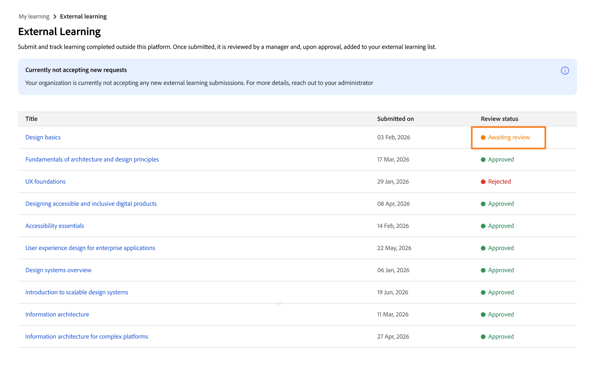

# 학습자로 외부 학습 제출

Adobe Learning Manager에서는 **외부 학습** 기능을 사용하여 워크숍, 인증 시험, 세미나 또는 온라인 과정과 같이 플랫폼 외부에서 완료한 교육을 기록할 수 있습니다. 각 제출물은 검토를 위해 관리자에게 전달됩니다. 승인이 완료되면 활동이 학습자 성적 증명서에 표시됩니다.

## 외부 학습 제출 프로세스의 작동 방식

외부 학습 제출은 다음 3단계 프로세스를 따릅니다.

1. 이수한 교육에 대한 세부 정보가 포함된 제출 양식을 작성하고 선택적으로 증명을 업로드합니다.

2. 관리자는 플랫폼 내 알림을 받고 제출물을 검토합니다.

3. 관리자는 요청을 승인하거나 거부합니다. 해당 결정에 대한 플랫폼 내 알림을 수신하게 됩니다.

승인된 제출은 **학습자 성적 증명서**&#x200B;에 완료된 외부 학습 활동으로 표시됩니다.

필요한 만큼 외부 학습 요청을 제출할 수 있습니다. 생성할 수 있는 제출 횟수에는 제한이 없습니다.

**탐색에서 외부 학습 찾기**

외부 학습은 기본 탐색의 **내 학습**&#x200B;에서 사용할 수 있습니다. **외부 학습**&#x200B;을 선택하여 제출 내역을 보고 새로운 제출을 만듭니다.

<!---->

**외부 학습** 옵션이 표시되지 않으면 관리자가 계정에 대해 기능을 활성화하지 않았을 수 있습니다. 도움이 필요하면 관리자에게 문의하십시오.

### 외부 학습 요청 제출

1. 왼쪽 탐색에서 **내 학습**&#x200B;을 선택합니다.

2. **외부 학습** 옵션을 선택합니다.

3. **외부 학습 추가**를 선택합니다.
   

4. 제출 양식을 입력하십시오.

   1. **제목:** 교육 이름을 입력하십시오. 이 필드는 필수입니다.

   2. **설명/참고:** 공급자의 이름 또는 학습 목표와 같이 관리자가 교육을 이해하는 데 도움이 되는 세부 사항을 추가합니다.

   3. **시작 날짜:** 교육 시작 날짜를 선택합니다.

   4. **종료 날짜:** 교육이 완료된 날짜를 선택합니다.

   5. **기간:** 교육에 사용한 총 시간(시간)을 입력합니다.

   6. **점수:** 교육에 평가가 포함된 경우 점수를 입력합니다.

   7. **첨부 파일:** 인증서, 대본 또는 기타 문서를 증거로 업로드합니다. 지원되는 파일 유형은 PDF, DOC, DOCX, PNG, JPEG 및 JPG입니다. 최대 파일 크기는 50MB입니다.
      

   8. 관리자가 구성한 추가 사용자 정의 필드를 입력합니다.

5. **제출**&#x200B;을 선택합니다.

관리자는 새 외부 학습 요청이 검토 대기 중이라는 앱 내 알림을 받습니다. 제출물이 **외부 학습** 목록에 **검토 대기 중** 상태로 표시됩니다.
<!---->

>[!NOTE]
>
>관리자가 제출을 승인하거나 거부할 때 플랫폼 내 알림을 수신합니다.

### 보류 중인 제출 편집

상태가 **승인 대기 중**&#x200B;인 동안 제출을 편집할 수 있습니다. 관리자가 승인 또는 거부하면 해당 제출을 더 이상 편집할 수 없습니다.

1. **외부 학습** 탭에서 업데이트할 제출 서류를 찾습니다.

2. 제출 서류를 선택하여 엽니다.

3. **편집**&#x200B;을 선택합니다.

4. 필요에 따라 필드를 업데이트합니다. 이 양식에는 관리자가 설정한 최신 필드 구성이 표시되며, 여기에는 원래 제출했을 때 표시되지 않은 필드가 포함될 수 있습니다.

5. **제출**&#x200B;을 선택합니다.

관리자는 새 알림을 받고 업데이트된 제출을 검토합니다.

**제출이 거부된 경우:** 거부된 제출은 편집할 수 없습니다. 다시 제출하려면 새 외부 학습 요청을 만들고 관리자가 검토 주석에 제공한 피드백을 참조합니다.

### 외부 학습 제출 상태

| **상태** | **의미** | **편집할 수 있습니까?** |
|-----------------|----------------------------------------------------------------------------------|---------------------------------------------------------|
| 검토 대기 중 | 제출이 관리자 검토 보류 중입니다. | 예. 제출 세부 정보 페이지에서 **편집**&#x200B;을 선택합니다. |
| 승인됨 | 관리자가 제출을 승인했습니다. 제출은 학습자 성적 증명서에 포함되어 있습니다. | 아니요. |
| 거부됨 | 관리자가 제출을 거부했습니다. 지침을 보려면 의견을 검토하십시오. | 아니요. 다시 제출할 새 외부 학습 요청을 만듭니다. |
