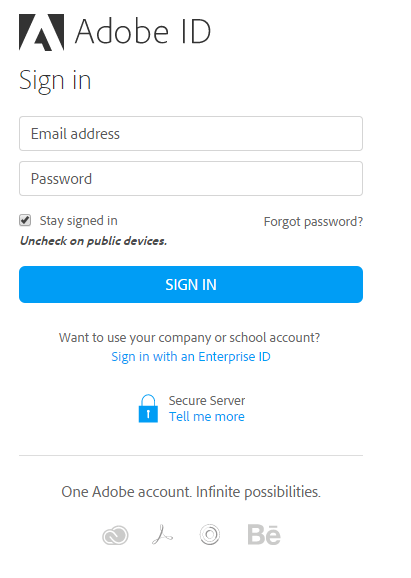

# 로그인

Learning Manager에 학습자로 로그인합니다.

Adobe Learning Manager을 처음 사용할 때 학습자는 계정을 만들어야 합니다. 다음 두 가지 방법 중 하나로 이 작업을 수행할 수 있습니다.

* 자체 등록: 시작 이메일에 제공된 URL을 사용하여 계정을 만듭니다.
* 관리자가 생성한 계정: 관리자는 사용자를 대신하여 계정을 만들 수 있습니다.

## 환영 전자 메일 URL을 사용하여 계정 생성

시작 이메일의 URL을 사용하여 계정을 만들려면 다음 단계를 따르십시오.

1. 책임자가 보낸 환영 전자 메일에 포함된 안전한 링크를 통해 Adobe Learning Manager를 실행합니다.

   로그인 화면이 나타납니다.

1. &#39;로그인&#39;을 클릭합니다.

   

   *사용자 이름 및 암호로 로그인*

1. Adobe ID와 암호를 입력하고 &#39;로그인&#39;을 클릭합니다.

   암호를 잊으셨다면, 암호를 잊으셨습니까?를 클릭합니다. Adobe ID 제작에 사용한 내 이메일 id를 링크 및 입력합니다.

<!--
   If you do not have an Adobe ID, [click here](../../../manage-account.md) to learn how to create an Adobe ID.
-->

1. 또는 Enterprise ID으로 로그인 링크를 클릭하여 Enterprise ID을 사용할 수도 있습니다.

>[!NOTE]
>
>처음 로그인하면 Adobe ID과 회사 계정이 연결됩니다. 추후 로그인 시 환영 메일에서 받은 계정 url(두번째 url)을 북마크로 설정할 수 있습니다.
