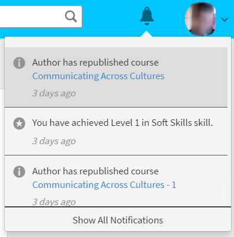

# 사용자 알림

<!--User notifications for Learners in Learning Manager.-->

알림 기능은 Adobe Learning Manager의 모든 사용자에게 적용됩니다. 그러나 각 사용자는 역할에 따라 다양한 시나리오에서 서로 다른 종류의 알림을 받습니다. 모든 경고 및 사용자에게 알림은 알림 팝업 대화 상자를 통해 표시됩니다.

## 액세스 알림 {#accessnotifications}

사용자는 창의 오른쪽 상단 모서리에 있는 알림 아이콘을 클릭하여 알림을 볼 수 있습니다.

학습자 역할에 대한 샘플 알림 창은 다음 스크린샷과 같이 표시됩니다.

*모든 알림 보기*

이 팝업 창에는 모든 알림의 강조 표시와 함께 발생 시간 및 스크롤 막대가 표시됩니다.

알림 아이콘 상단에 강조 표시된 수를 기반으로 최신 알림 수를 알 수 있습니다. 예를 들어 이전 로그인 후 최근 5개의 알림이 있는 경우, 알림 아이콘 상단에 숫자 5가 표시되는 것을 볼 수 있습니다. 이러한 숫자는 모든 최신 알림을 읽으면 사라집니다.

학습자는 알림 팝업 창에서 &#39;거부&#39;를 클릭하여 관리자가 할당한 강의를 거부할 수 있습니다.

## 모든 알림 표시 {#showallnotifications}

다음을 수행합니다. **[!UICONTROL 모든 알림 표시]** 알림 팝업 창의 하단에 있는 링크를 통해 별도의 페이지에서 모든 알림을 확인할 수 있습니다.

*별도의 페이지에서 모든 알림 보기*

**학습자를 위한 알림 유형**

학습자는 다음 이벤트가 트리거될 때마다 알림을 받습니다.

1. 학습자가 강의를 완료했습니다.
1. 학습자는 강의를 완료했으나 L1 피드백을 제공하지 않았습니다
1. 학습자가 배지를 획득했습니다
1. 책임자가 학습자를 강의 또는 학습 프로그램이나 인증에 등록했습니다
1. 관리자가 학습자를 강의에 지정했으며 학습자는 수락 또는 거절해야 합니다
1. 학습자에게 새로운 역량이 할당되었습니다
1. 학습자가 역량을 달성했습니다
1. 학습자가 학습 프로그램을 완료합니다.
1. 학습자 지명 수락
1. 학습자 지명 거부
1. 관리자가 승인한 강의의 경우, 관리자는 강의 등록 요청을 승인/거부합니다
1. 학습자 대기 목록이 지워집니다.
1. 학습자가 강의나 학습 프로그램 또는 인증에 자동으로 등록되었습니다.
1. 학습자가 인증을 완료합니다.
1. 관리자는 학습자가 업로드한 인증 완료 증명 문서를 승인/거부합니다
1. 특정 강의 인스턴스의 마감일이 다가오고 있는 경우. (책임자는 학습자에게 알림 메시지를 표시할 수 있는 날짜를 설정할 수 있습니다).

## 피드백 제공 {#providefeedback}

학습자는 피드백 옵션이 있는 강의를 완료한 후 L1 피드백을 제공할 수 있습니다. 피드백을 제공하려면 강의를 완료한 후 아래와 같은 피드백 링크를 클릭합니다.

*강의 피드백 제공*

>[!NOTE]
>
>학습자는 책임자가 특정 강의의 해당 옵션을 활성화했을 때만 강의 피드백 옵션을 이용할 수 있습니다.
